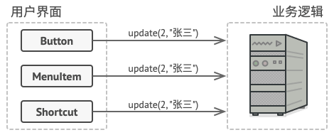
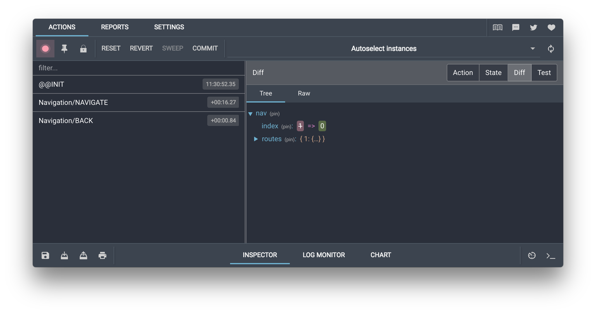
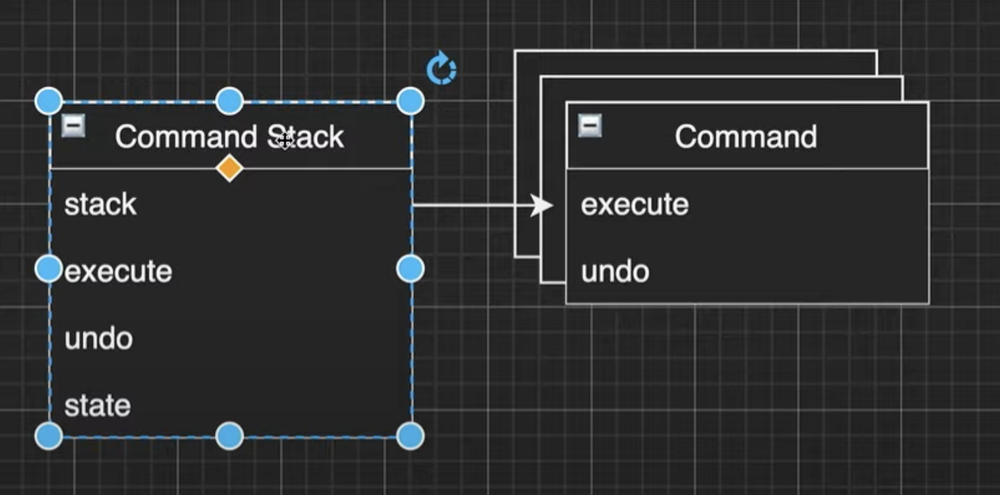

# Command. 命令模式

**亦称：** 动作、事务、`Action`、`Transaction`、`Command`模式。

**命令模式**是一种行为设计模式， 它可将请求转换为一个**包含与请求相关的所有信息的独立对象**。 该转换让你能根据不同的请求将方法参数化、 延迟请求执行或将其放入队列中， 且能实现可撤销操作。


## 场景模拟1

假如你正在开发一款新的文字编辑器， 当前的任务是创建一个包含多个按钮的工具栏， 并让每个按钮对应编辑器的不同操作。 你创建了一个非常简洁的 `按钮`类， 它不仅可用于生成工具栏上的按钮， 还可用于生成各种对话框的通用按钮。


尽管所有按钮看上去都很相似， 但它们可以完成不同的操作 （打开、 保存、 打印和应用等）。 你会在哪里放置这些按钮的点击处理代码呢？ 最简单的解决方案是在使用按钮的每个地方都创建大量的子类。 这些子类中包含按钮点击后必须执行的代码。


```ts
abstract class Button {
  onClick(e: EventTarget): void;
}

class SaveButton extends Button {
  onClick(e: EventTarget) { / do save / }
}
```

你很快就意识到这种方式有严重缺陷。就保存这一个功能而言，可能会在多个地方被调用。 例如用户可以点击工具栏上小小的 “保存” 按钮， 或者通过上下文菜单保存一些内容， 又或者直接使用键盘上的 `Ctrl+S` 。


为了实现这些功能你必须把赋值的逻辑代码粘贴到各个类实体中，这是令人无法接受的。

## 解决方案

优秀的软件设计通常会将关注点进行分离， 这往往会导致软件分层。举个例子： 一层负责用户图像界面； 另一层负责业务逻辑。

`GUI` 层负责在屏幕上渲染美观的图形， 捕获所有输入并显示用户和程序工作的结果。 当需要完成一些重要内容时，`GUI` 层则会将工作委派给业务逻辑底层。

这在代码中看上去就像这样： 一个 `GUI` 对象传递一些参数来调用一个业务逻辑对象。 这个过程通常被描述为一个对象发送请求给另一个对象。



命令模式建议 `GUI` 对象不直接提交这些请求。因为提交请求的细节可能是由多个业务逻辑接口组成的，会造成代码的冗余。你应该将请求的所有细节 （例如调用的对象、 方法名称和参数列表） 抽取出来组成**命令类**，该类中仅包含一个用于触发请求的方法。

命令对象负责连接不同的 GUI 和业务逻辑对象。 此后， GUI 对象无需了解业务逻辑对象是否获得了请求， 也无需了解其对请求进行处理的方式。 GUI 对象触发命令即可， 命令对象会自行处理所有细节工作。


最后， 命令成为了减少 `GUI` 和业务逻辑层之间耦合的中间层。 而这仅仅是命令模式所提供的一小部分好处！

## 场景模拟2

前面的命令模式只是解决了为组件和逻辑层之间构建了一个中间层，命令

想一想下面这个场景，大部分 `react` 开发人员必定都使用过 `redux-devtool` 这个调试工具，他能缓存我们的 `action` 序列，并且能快速定位到任意一次状态变化，并且能够在任意位置执行洗下一个(`do`)或者撤销这一个(`undo`)`action`，给状态树带来改变：

对于这种场景，命令的作用就不只是分离关注点了，我们还需要一个命令栈来对我们已经执行的命令进行记录，并且能执行撤销操作。

## 简单命令模式结构


**触发者 (`Invoker`)类：**负责对请求进行初始化， 其中必须包含一个成员变量来存储对于命令对象的引用。 发送者触发命令， 而不向接收者直接发送请求。 注意， 发送者并不负责创建命令对象： 它通常会通过构造函数从客户端处获得预先生成的命令。

**命令 `Command`：** 接口通常仅声明一个执行命令的方法。

**具体命令 `Concrete Commands：`** 会实现各种类型的请求。 具体命令自身并不完成工作， 而是会将调用委派给一个业务逻辑对象。**接收对象执行方法所需的参数和接受者可以声明为具体命令的成员变量。**

**接收者 `Receiver`：** 类包含部分业务逻辑。 几乎任何对象都可以作为接收者。 绝大部分命令只处理如何将请求传递到接收者的细节， 接收者自己会完成实际的工作。

**客户端 `Client`：** 会创建并配置具体命令对象。 客户端必须将包括接收者实体在内的所有请求参数传递给命令的构造函数。 此后， 生成的命令就可以与一个或多个发送者相关联了。

## 命令栈模式结构



其实我真正想讲的是这种命令栈的模式，这个模式中 `Command` 添加了 `undo` 方法用于撤销操作，`Invoker` 被 `command stack` 替换：

**命令栈 `Command Stack`：**命令栈的 `execute` 和 `undo` 方法分别用于执行和撤销命令，被执行/撤销的命令会被推入/弹出命令栈 `stack`，执行的结果会作用在 `state` 上面。

**命令 `Command`：** 接口扩展了一个 `undo` 方法。

**具体命令 `Concrete Commands：`** 会实现各种类型的请求。 具体命令自身并不完成工作， 而是会将调用委派给一个业务逻辑对象。

> [注意：]()这里命令实现者没有接收者和参数这个成员，其实这个成员是可以省略的，结构比较简单的时候可以直接在命令里调用接收者的方法。

## 总结

**1.如果你想要实现操作回滚功能， 可使用命令模式。**

 尽管有很多方法可以实现撤销和恢复功能， 但命令模式可能是其中最常用的一种。

为了能够回滚操作， 你需要实现已执行操作的历史记录功能。 命令历史记录是一种包含所有已执行命令对象及其相关程序状态备份的栈结构。

这种方法有两个缺点。 首先， 程序状态的保存功能并不容易实现， 因为部分状态可能是私有的。 你可以使用[备忘录](https://refactoringguru.cn/design-patterns/memento)模式来在一定程度上解决这个问题。

**2.如果你需要通过操作来参数化对象， 可使用命令模式。**

命令模式可将特定的方法调用转化为独立对象。 这一改变也带来了许多有趣的应用： 你可以将命令作为方法的参数进行传递、 将命令保存在其他对象中， 或者在运行时切换已连接的命令等。

举个例子： 你正在开发一个 `GUI` 组件 （例如上下文菜单）， 你希望用户能够配置菜单项， 并在点击菜单项时触发操作。

----

**优点**

+ **单一职责原则：**你可以解耦触发和执行操作的类。
+ **开闭原则：**你可以在不修改已有客户端代码的情况下在程序中创建新的命令。
+ 你可以实现撤销和恢复功能。
+ 你可以实现操作的延迟执行。
+ 你可以将一组简单命令组合成一个复杂命令。

**缺点**

+ 代码可能会变得更加复杂， 因为你在发送者和接收者之间增加了一个全新的层次。

## Mini Mode(Object factory)

> **[小贴士：]()**什么是 `Object Mode`？前面的章节我详细探讨了`javascript` 的编程风格，在 `javascript` 中我们可以直接创建对象，所以严格遵循基于类模式下面向对象设计模式会让原本灵活的代码变得很臃肿。
>
> 所以我提供了  `Mini Mode` 来实现符合 `javascript` 语法风格的设计模式。

**With class**

```ts
abstract class Command<State> {
    abstract execute(state: State): State;
    abstract undo(state: State): State;
}

class CommandStack<State> {
    private stack: Command<State>[] = [];
    constructor(private _state: State) {}
    get state() {
        return this._state;
    }

    execute(command: Command<State>) {
        this._state = command.execute(this._state);
        this.stack.push(command);
    }

    undo() {
        const command = this.stack.pop();
        if (command) {
            this._state = command.undo(this._state);
        }
    }
}

class AddOne extends Command<number> {
    execute(state: number) {
        return state + 1;
    }
    undo(state: number) {
        return state - 1;
    }
}

class SetValue extends Command<number> {
    private _originValue?: number;
    constructor(private value: number) {
        super();
    }
    execute(state: number) {
        this._originValue = state;
        return this.value;
    }

    undo(state: number) {
        return this._originValue!;
    }
}

```

**With Funciton**

```ts
type UndoCommand<State> = (state: State) => State;
type CommandFunction<State> = (state: State) => [State, UndoCommand<State>];

function createCommandStack<State>(state: State) {
    let stack: UndoCommand<State>[] = [];
    let _state = state;

    return {
        execute(command: CommandFunction<State>) {
            let [newState, undo] = command(_state);
            _state = newState;
            stack.push(undo);
            return newState;
        },
        undo() {
            let undo = stack.pop();
            if (undo) {
                _state = undo(_state);
            }
            return _state;
        },
    };
}

const addOne: CommandFunction<number> = (state: number) => {
    return [state + 1, (state) => state - 1];
};

const substractOne: CommandFunction<number> = (state: number) => {
    return [state - 1, (state) => state + 1];
};

const createSetValue = (value: number): CommandFunction<number> => {
    return (state) => [value, () => state];
};

const cStack = createCommandStack(0);
console.log(cStack.execute(addOne));
console.log(cStack.undo());
console.log(cStack.execute(substractOne));
console.log(cStack.undo());
console.log(cStack.execute(createSetValue(40)));
console.log(cStack.undo());
```

## Strict Mode

命令模式在 `TypeScript` 代码中很常见。 大部分情况下， 它被用于代替包含行为的参数化 `UI` 元素的回调函数， 此外还被用于对任务进行排序和记录操作历史记录等。

```ts
/**
 * The Command interface declares a method for executing a command.
 */
interface Command {
    execute(): void;
}

/**
 * Some commands can implement simple operations on their own.
 */
class SimpleCommand implements Command {
    private payload: string;

    constructor(payload: string) {
        this.payload = payload;
    }

    public execute(): void {
        console.log(`SimpleCommand: See, I can do simple things like printing (${this.payload})`);
    }
}

/**
 * However, some commands can delegate more complex operations to other objects,
 * called "receivers."
 */
class ComplexCommand implements Command {
    private receiver: Receiver;

    /**
     * Context data, required for launching the receiver's methods.
     */
    private a: string;

    private b: string;

    /**
     * Complex commands can accept one or several receiver objects along with
     * any context data via the constructor.
     */
    constructor(receiver: Receiver, a: string, b: string) {
        this.receiver = receiver;
        this.a = a;
        this.b = b;
    }

    /**
     * Commands can delegate to any methods of a receiver.
     */
    public execute(): void {
        console.log('ComplexCommand: Complex stuff should be done by a receiver object.');
        this.receiver.doSomething(this.a);
        this.receiver.doSomethingElse(this.b);
    }
}

/**
 * The Receiver classes contain some important business logic. They know how to
 * perform all kinds of operations, associated with carrying out a request. In
 * fact, any class may serve as a Receiver.
 */
class Receiver {
    public doSomething(a: string): void {
        console.log(`Receiver: Working on (${a}.)`);
    }

    public doSomethingElse(b: string): void {
        console.log(`Receiver: Also working on (${b}.)`);
    }
}

/**
 * The Invoker is associated with one or several commands. It sends a request to
 * the command.
 */
class Invoker {
    private onStart: Command;

    private onFinish: Command;

    /**
     * Initialize commands.
     */
    public setOnStart(command: Command): void {
        this.onStart = command;
    }

    public setOnFinish(command: Command): void {
        this.onFinish = command;
    }

    /**
     * The Invoker does not depend on concrete command or receiver classes. The
     * Invoker passes a request to a receiver indirectly, by executing a
     * command.
     */
    public doSomethingImportant(): void {
        console.log('Invoker: Does anybody want something done before I begin?');
        if (this.isCommand(this.onStart)) {
            this.onStart.execute();
        }

        console.log('Invoker: ...doing something really important...');

        console.log('Invoker: Does anybody want something done after I finish?');
        if (this.isCommand(this.onFinish)) {
            this.onFinish.execute();
        }
    }

    private isCommand(object): object is Command {
        return object.execute !== undefined;
    }
}
```

