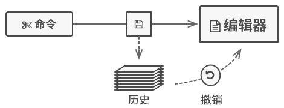

# Memento. 备忘录模式

**亦称：** 快照、`Snapshot`、`Memento`；

**备忘录模式**是一种行为设计模式， 允许在不暴露对象实现细节的情况下保存和恢复对象之前的状态。


## 场景模拟

假如你正在开发一款文字编辑器应用程序。 除了简单的文字编辑功能外， 编辑器中还要有设置文本格式和插入内嵌图片等功能。

后来， 你决定让用户能撤销施加在文本上的任何操作。你选择采用直接的方式来实现该功能： 程序在执行任何操作前会记录所有的对象状态， 并将其保存下来。 当用户此后需要撤销某个操作时， 程序将从历史记录中获取最近的快照， 然后使用它来恢复所有对象的状态。



让我们来思考一下这些状态快照。 首先， 到底该如何生成一个快照呢？ 很可能你会需要遍历对象的所有成员变量并将其数值复制保存。 但只有当对象对其内容没有严格访问权限限制的情况下， 你才能使用该方式。 **不过很遗憾， 绝大部分对象会使用私有成员变量来存储重要数据， 这样别人就无法轻易查看其中的内容**。


还有更多问题。 让我们来考虑编辑器 （`Editor`） 状态的实际 “快照”， 它需要包含哪些数据？ 至少必须包含实际的文本、 光标坐标和当前滚动条位置等。 你需要收集这些数据并将其放入特定容器中， 才能生成快照。

我们似乎走进了一条死胡同： 要么会暴露类的所有内部细节而使其过于脆弱； 要么会限制对其状态的访问权限而无法生成快照。 那么， 我们还有其他方式来实现 “撤销” 功能吗？

## 解决方案

我们刚才遇到的所有问题都是封装 “破损” 造成的。 一些对象试图超出其职责范围的工作。 由于在执行某些行为时需要获取数据， 所以它们侵入了其他对象的私有空间， 而不是让这些对象来完成实际的工作。

备忘录模式将创建状态快照 （`Snapshot`） 的工作委派给实际状态的拥有者原发器 （`Originator`） 对象。 这样其他对象就不再需要从 “外部” 复制编辑器状态了， 编辑器类拥有其状态的完全访问权， 因此可以自行生成快照。

模式建议将对象状态的副本存储在一个名为备忘录 （`Memento`） 的特殊对象中。 除了创建备忘录的对象外， 任何对象都不能访问备忘录的内容。 其他对象必须使用受限接口与备忘录进行交互， 它们可以获取快照的元数据 （创建时间和操作名称等）， 但不能获取快照中原始对象的状态。


## 备忘录模式结构

这种实现方式中，`Memento` 是原发器和 `Caretaker(MementoStack)` 之间的桥梁，`MementoStack` 通过调用原发器方法储存快照，通过传递 `Memento` 给原发器让原发器恢复状态。


**原发器 `Originator`：** 类可以生成自身状态的快照， 也可以在需要时通过快照恢复自身状态。

**备忘录 `Memento`：**  是原发器状态快照的值对象 (`value object`)。 通常做法是将备忘录设为不可变的， 并通过构造函数一次性传递数据。

**负责人 `Caretaker`|备忘录栈`MementoStack`：**仅知道 “何时” 和 “为何” **捕捉原发器的状态**， 以及何时**恢复状态**。

负责人通过**保存备忘录栈**来记录原发器的历史状态。当原发器需要回溯历史状态时，负责人弹出栈中最顶部的备忘录， 并将其传递给原发器的恢复 (`restoration`)方法。

## 总结

备忘录模式和命令模式都能实现状态回滚，两个设计模式都使用栈作为存储结构，只不过备忘录模式存储的是状态快照，通过快照重置来进行回滚。而命令模式存储的是命令与状态，通过撤销状态来进行回滚。

**1.当你需要创建对象状态快照来恢复其之前的状态时， 可以使用备忘录模式。**

备忘录模式允许你复制对象中的全部状态 （包括私有成员变量）， 并将其独立于对象进行保存。 尽管大部分人因为 “撤销” 这个用例才记得该模式， 但其实它在处理事务 （比如需要在出现错误时回滚一个操作） 的过程中也必不可少。

**2.当直接访问对象的成员变量、 获取器或设置器将导致封装被突破时， 可以使用该模式。**

 备忘录让对象自行负责创建其状态的快照。 任何其他对象都不能读取快照， 这有效地保障了数据的安全性。

----

**优点**

+ 你可以在不破坏对象封装情况的前提下创建对象状态快照。
+  你可以通过让负责人维护原发器状态历史记录来简化原发器代码。

**缺点**

+  如果客户端过于频繁地创建备忘录， 程序将消耗大量内存。
+  负责人必须完整跟踪原发器的生命周期， 这样才能销毁弃用的备忘录。
+  绝大部分动态编程语言 （例如 `PHP`、 `Python` 和 `JavaScript`） 不能确保备忘录中的状态不被修改。

## Mini Mode

来看看这个模式，基于备忘录的命令栈：

**Class type**

```ts
abstract class Command<State> {
    abstract execute(state: State): State;
}

export class CommandMementoStack<State> {
    private stack: string[] = [];
    constructor(state: State) {
        this.stack.push(JSON.stringify(state));
    }
    get state() {
        return JSON.parse(this.stack[this.stack.length - 1]);
    }

    execute(command: Command<State>) {
        let stateSnapshot = JSON.stringify(command.execute(this.state));
        this.stack.push(stateSnapshot);
    }

    undo() {
        if (this.stack.length > 1) {
            const stateSnapshot = this.stack.pop()!;
            return JSON.parse(stateSnapshot);
        }
    }
}

class AddOne extends Command<number> {
    execute(state: number) {
        return state + 1;
    }
}

class SetValue extends Command<number> {
    constructor(private value: number) {
        super();
    }
    execute(state: number) {
        return this.value;
    }
}
```

**Function type**

```ts
type CommandFunction<State> = (state: State) => State;

export function createMementoStack<State>(state: State) {
    let stack: string[] = [JSON.stringify(state)];

    return {
        execute(command: CommandFunction<State>) {
            let prevState = JSON.parse(stack[stack.length - 1]);
            let nextState = command(prevState);
            let stateSnapshot = JSON.stringify(nextState);
            stack.push(stateSnapshot);
            return nextState;
        },
        undo() {
            if (stack.length > 1) {
                stack.pop()!;
            }

            return JSON.parse(stack[stack.length - 1]);
        },
    };
}

const addOne: CommandFunction<number> = (state: number) => state + 1;
const substractOne: CommandFunction<number> = (state: number) => state - 1;
const createSetValue: (value: number) => CommandFunction<number> =
    (value: number) => () =>
        value;

let mementoStack = createMementoStack(0);
console.log(mementoStack.execute(addOne));
console.log(mementoStack.undo());
console.log(mementoStack.execute(substractOne));
console.log(mementoStack.undo());
console.log(mementoStack.execute(createSetValue(100)));
console.log(mementoStack.undo());
```

## Strict Mode

**Originator.ts**

```ts
class Originator {
    constructor(private state: string) {}

    /**
     * Saves the current state inside a memento.
     */
    public save(): Memento {
        return new ConcreteMemento(this.state);
    }

    /**
     * Restores the Originator's state from a memento object.
     */
    public restore(memento: Memento): void {
        this.state = memento.getState();
    }
}
```

**Memento.ts**

```ts
interface Memento {
    getState(): string;
    getDate(): string;
}

class ConcreteMemento implements Memento {
		private _date: string;
    constructor(private _state: string) {
        this.date = new Date().toISOString().slice(0, 19).replace('T', ' ');
    }

    public get state(): string {
        return this.state;
    }

    public get date(): string {
        return this.date;
    }
}
```

**MementoStack.ts**

```ts
class MementoStack {
    private mementos: Memento[] = [];

    constructor(public originator: Originator) {}

    public execute(): void {
        this.mementos.push(this.originator.save());
    }

    public undo(): void {
        if (!this.mementos.length) {
            return;
        }
        const memento = this.mementos.pop();
        this.originator.restore(memento);
    }

    public showHistory(): void {
        for (const memento of this.mementos) {
            console.log(memento.getDate(), memento.getDate());
        }
    }
```

