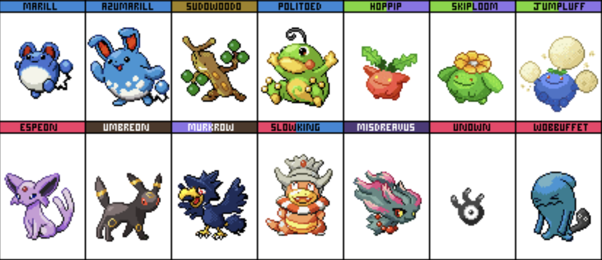
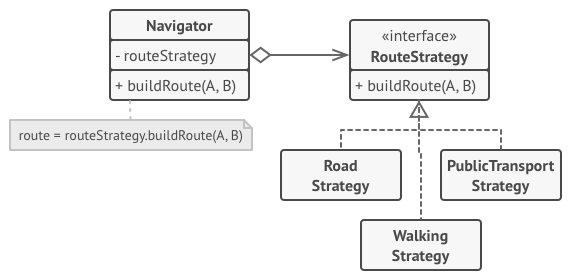
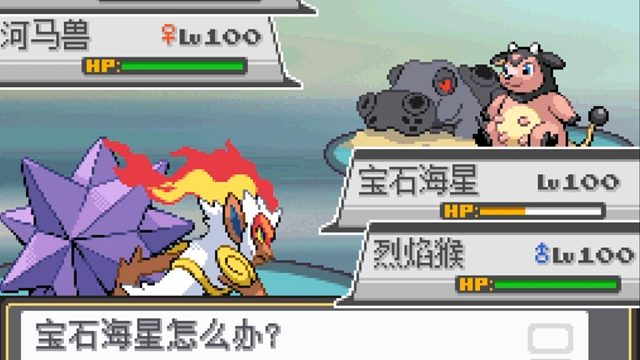

# Mini Mode Design Pattern

前面我们讲的设计模式以类为基础模块的，对于 `javascript` 这种以基于原型(对象)编程的语言来说，这种庞大的模式结构会让代码看起来臃肿，在 `javascript` 我们倾向于闭包来实现大部分数据结构与逻辑，通过原型组合对象等等。

接下来就让我们看看如何在编程中以最小结构的形式来实现前面的设计模式。

## Pokemon DB

为了学习我们的最小化设计模式，我们引入这样的场景，你是宝可梦世界里的大木博士，现在正在忙碌于构建一个数据库应用给宝可梦图鉴提供支持，同时你还是狂热的 `Typescript` 爱好者，理所当然的你决定使用 `typescript` 进行开发：



首先你设计了数据库的存储结构，大概是这样的，通过字典映射到每条 `Pokenmon` 记录：

```ts
interface Pokemon {
    id: string;
  	name: string;
    attack: number;
    defense: number;
}

type Db = Record<string, Pokemon>
```

最开始你做了一个内存数据库，没有持久化功能呢，通过闭包形成数据缓存，并且对外提供了对数据库的查询与修改功能：

```ts
function createInMemoryPokemonDatebase() {
    let pokemons: Record<string, Pokemon> = {};

    return {
        set(record: Pokemon) {
            pokemons[record.id] = record;
        },
        get(id: string): Pokemon {
            return pokemons[id];
        },
    }
}
```

## Mini Visistor Mode

首先宝可梦图鉴需要很多个列表，通过不同的方式显示宝可梦数据，比如下面几种结构：

| id   | name | attack |
| ---- | ---- | ------ |
| 001  | pika | 100    |

| id   | name | defense |
| ---- | ---- | ------- |
| 001  | pika | 100     |

于是你需要数据库提供一个遍历访问机制，于是你很自然而然的想到了访问者模式，因为数据库里只有一种简单的对象存储结构，所以你可以使用一个函数来代替访问者类，同时也不需要双分派这一技巧：

```ts
function createInMemoryPokemonDatebase() {
    let pokemons: Record<string, Pokemon> = {};

    return {
      visit(visitor: (item: Pokemon) => void): void {
        Object.values(pokemons).forEach((item) => visitor(item));
      },
    }
}

```

## Mini Strategy Mode

策略模式让你定义一系列算法， 并将每种算法分别放入独立的类中， 以使算法的对象能够相互替换。



而在最小化结构里面，所谓的算法可能就是一个函数，所以我们不需要维护特定的成员变量以缓存策略，只需要将算法函数作为参数传递到使用算法的业务函数就能满足我们的需求。

使用策略模式是因为你遇到了下面这个需求，我们要为数据库提供一个检索当前场景最优的宝可梦的功能(加入宝可梦图鉴的对战系统)，举个例子比如敌人进行攻击的时候我们数据库帮我们筛出防御力最高的宝可梦，而对敌人进行攻击的时候自然要筛选出攻击力最高的一只。



于是筛选的策略就是我们要传递的算法函数，我们通过它来处理数值找到当前场景最优的一只：

```ts
function createInMemoryPokemonDatebase() {
    let pokemons: Record<string, Pokemon> = {};

    return {
        best(scoreStrategy: (item: Pokemon) => number): Pokemon | undefined {
            const found: {
                max: number;
                item: Pokemon | undefined;
            } = {
                max: -1,
                item: undefined,
            };

            Object.values(pokemons).reduce((f, c) => {
                const score = scoreStrategy(c);

                if (score > f.max) {
                    f.max = score;
                    f.item = c;
                }
                return f;
            }, found);

            return found.item;
        },
    };
}
```

使用的代码也很简单：

```ts
let {best} = createInMemoryPokemonDatebase();
best((pokemon: Pokemon) => pokemon.attack);
best((pokemon: Pokemon) => pokemon.defence);
best((pokemon: Pokemon) => pokemon.defence + pokemon.attack);
```

## Mini Observer Mode

你遇到的下一个需求是关于宝可梦进化的，宝可梦进化的过程就类似于对一条数据库记录进行更改，这本身没什么，不过宝可梦图鉴需要一个进化前后属性值对比的功能，需要每次宝可梦记录产生变动的时候都触发一个对比动画，这就相当于需要数据库提供一个钩子，在每次数据变动的时候执行：


理所当然的我们可以使用观察者模式，观察数据库的改变并且触发回调。首先我们将观察者的代码抽离出来进行解耦：

```ts
export interface Observer<E> {
    publish(e: E): void;
    subscribe(listener: Listener<E>): () => void;
}

export type Listener<EventType> = (e: EventType) => void;
export default function createObserver<EventType>(): Observer<EventType> {
    let listeners: Listener<EventType>[] = [];
    return {
        publish(e: EventType) {
            for (let listener of listeners) {
                listener(e);
            }
        },
        subscribe(listener: Listener<EventType>): () => void {
            listeners.push(listener);
            return () => listeners.filter((ls) => ls === listener);
        },
    };
}
```

之后我们将观察者嵌入到我们的数据库应用里，通过闭包缓存两个观察者实例，分别为数据更新前的回调监听队列以及数据更新后的监听队列。提供两个添加回调的接口，并且在修改数据库数据前后添加两个触发器：

```ts
function createInMemoryPokemonDatebase(): DataBase<Pokemon> {
    const pokemons: Record<string, Pokemon> = {};
    const preUpdateObserver: Observer<BeforeUpdateEvent<Pokemon>> =
            createObserver(),
          postUpdateObserver: Observer<AfterUpdateEvent<Pokemon>> =
            createObserver();

    return {
        set(record: Pokemon): void {
            preUpdateObserver.publish({
                oldValue: pokemons[record.id],
                newValue: record,
            });
            pokemons[record.id] = record;
            postUpdateObserver.publish({
                value: record,
            });
        },
        get(id: string): Pokemon {
            return pokemons[id];
        },
        onBeforeUpdate(
            listener: Listener<BeforeUpdateEvent<Pokemon>>
        ): () => void {
            return preUpdateObserver.subscribe(listener);
        },

        onAfterUpdate(
            listener: Listener<AfterUpdateEvent<Pokemon>>
        ): () => void {
            return postUpdateObserver.subscribe(listener);
        },
    };
}
```

## Mini Observer Mode

很快你又接到了新的需求，用户希望能从别的平台导入宝可梦列表，进行快速的配置，他们提供的数据是这样的：

```ts
[
    ["0001", "pika", 100, 100],
    ["0002", "fire dragon", 120, 80],
    ["0003", "water turtle", 70, 130]
]
```

由于你内部的数据存储格式是 `json`，而用户提供的是数组，于是你就想到了使用适配器模式来兼容用户提供的数据，并且能将数据适配的代码与业务解耦：

为了实现这种模式，你首先给适配器提供了接口：

```ts
export interface RecordHandler<T> {
    addRecord(record: T): void;
}

export function loader<T>(path: string, handler: RecordHandler<T>) {
    const data: T[] = JSON.parse(fs.readFileSync(path).toString());
    data.forEach((record) => handler.addRecord(record));
}
```

根据接口你很快的实现了数据库适配器：

```ts
export default class PokemonDBAdapter implements RecordHandler<PokemonTuple> {
    constructor(private adaptee: DataBase<Pokemon>) {}
    addRecord(record: PokemonTuple): void {
        this.adaptee.set(new Pokemon(...record));
    }
}
```

## Mini Simple Factory Mode

后来你考虑到宝可梦图鉴不可能是一直处于开机状态，你需要为你的数据提供持久化服务，于是你实现了另外两种数据库，分别使用 `AOF` 和 `RDB` 来实现数据持久化(`presist`)。

然后你就想到了通过简单工厂模式来让使用者不知道数据库内部的细节，就可以创建数据库实例，代码如下：

```ts
type Persistence = 'none' | 'aof' | 'rdb';

function pokemonDatabaseFactory(persistence: Persistence): DataBase<Pokemon> {
    switch (persistence) {
        case 'aof':
        		return createAOFPokemonDatebase();
        case 'rdb':
        		return createRDBPokemonDatebase();
        default:
            return createInMemoryPokemonDatebase();
    }
    function createAOFPokemonDatebase(): DataBase<Pokemon> { / 具体实现省略 / }
    function createRDBPokemonDatebase(): DataBase<Pokemon> { / 具体实现省略 / }
    function createInMemoryPokemonDatebase(): DataBase<Pokemon> { / 具体实现省略 / }
}
```

其实三种创建数据的代码应该从这个函数里抽离出来，因为这样违背了单一职责原则，增加了耦合度。

## Mini Singleton Mode

既然是数据库应用，那全局必然只能有一个数据库实例，于是乎你又为你的数据库实现了一个单例模式，不管调用多少次，都只返回一个数据库实例。

实现的方式很简单，`IIFE `+ `闭包` 缓存全局唯一的数据库实例：

```ts
const createPokemonDatebaseOnce = (() => {
    let instance: DataBase<Pokemon>;
    return () => {
        if (!instance) {
            instance = pokemonDatabaseFactory('none');
        }

        return instance;
    };
})();
```

