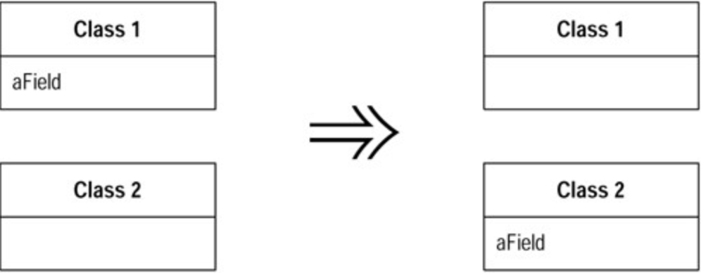

# Move Field (搬移值域)

你的程序中，某个`field`（值域〕被其所驻`class`之外的另一个`class`更多地用到。

在`target class` 建立一个`new field`，修改`source field`的所有用户，令它们改用此`new field`。

## 动机 (Motivation)

在`classes`之间移动状态（`states`）和行为，是重构过程中必不可少的措施。随着系统发展，你会发现自己需要新的`class`，并需要将原本的工作责任拖到新的`class`中。这个星期中合理而正确的设计决策，到了下个星期可能不再正确。这没问题；如果你从来没遇到这种情况，那才有问题。

如果我发现，对于一个`field`（值域），在其所驻`class`之外的另一个`class`中有更多函数使用了它，我就会考虑搬移这个`field`。上述所谓「使用」可能是通过设值/取值（`setting/getting`）函数间接进行。我也可能移动该`field`的用户（某函数），这取决于是否需要保持接口不受变化。如果这些函数看上去很适合待在原地，我就选择搬移`field`。

使用`Extract Class` 时，我也可能需要搬移`field`。此时我会先搬移`field`，然后再搬移函数。

