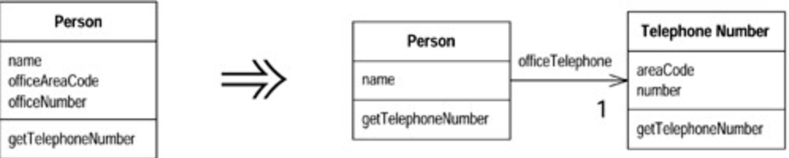

# Extract Class (提炼类)

某个`class`做了应该由两个`classes`做的事。

建立一个新`class`，将相关的值域和函数从旧`class`搬移到新`class`。



## 动机 (Motivation)

你也许听过类似这样的教诲：一个`class`应该是一个清楚的抽象（`abstract`），处理一些明确的责任。但是在实际工作中，`class`会不断成长扩展。你会在这儿加入一些功能，在那儿加入一些数据。给某个`class`添加一项新责任时，你会觉得不值得为这项责任分离出一个单独的`class`。于是，随着责任不断増加，这个`class`会变得过份复杂。很快，你的`class`就会变成一团乱麻。

这样的`class`往往含有大量函数和数据。这样的`class`往往太大而不易理解。此时你需要考虑哪些部分可以分离出去，并将它们分离到一个单独的`class`中。如果某些数据和某些函数总是一起出现，如果某些数据经常同时变化甚至彼此相依，这就表示你应该将它们分离出去。一个有用的测试就是问你自己，如果你搬移了某些值域和函数，会发生什么事？其他值域和函数是否因此变得无意义？

另一个往往在开发后期出现的信号是`class`的「`subtyped`方式」。如果你发现`subtyping`只影响`class`的部分特性，或如果你发现某些特性「需要以此方式`subtyped`」，某些特性「需要以彼方式`subtyped`」，这就意味你需要分解原来的`class`。

## 范例 (Examples)

让我们从一个简单的`Person class`开始：

```java
class Person...
   public String getName() {
       return _name;
   }
   public String getTelephoneNumber() {
       return ("(" + _officeAreaCode + ") " + _officeNumber);
   }
   String getOfficeAreaCode() {
       return _officeAreaCode;
   }
   void setOfficeAreaCode(String arg) {
       _officeAreaCode = arg;
   }
   String getOfficeNumber() {
       return _officeNumber;
   }
   void setOfficeNumber(String arg) {
       _officeNumber = arg;
   }
   private String _name;
   private String _officeAreaCode;
   private String _officeNumber;
```

在这个例子中，我可以将「与电话号码相关」的行为分离到一个独立`class`中。首 先我耍定义一个`TelephoneNumber class`来表示「电话号码」这个概念：

```java
class TelephoneNumber...
   public String getTelephoneNumber() {
       return ("(" + _areaCode + ") " + _number);
   }
   String getAreaCode() {
       return _areaCode;
   }
   void setAreaCode(String arg) {
       _areaCode = arg;
   }
   String getNumber() {
       return _number;
   }
   void setNumber(String arg) {
       _number = arg;
   }
   private String _number;
   private String _areaCode;
```

然后，我要建立从`Person`到`TelephoneNumber`的连接：

```java
class Person...
   public String getName() {
       return _name;
   }
   public String getTelephoneNumber(){
       return _officeTelephone.getTelephoneNumber();
   }
   TelephoneNumber getOfficeTelephone() {
       return _officeTelephone;
   }
   private String _name;
   private TelephoneNumber _officeTelephone = new TelephoneNumber();
```

下一步要做的决定是：要不要对客户揭示这个新口`class`？我可以将`Person`中「与电 话号码相关」的函数委托（`delegating`）至`TelephoneNumber`，从而完全隐藏这个新`class`；也可以直接将它对用户曝光。我还可以将它暴露给部分用户（位于同一个`package`中的用户），而不暴露给其他用户。

如果我选择暴露新`class`，我就需要考虑别名（`aliasing`）带来的危险。如果我暴露了`TelephoneNumber` ，而有个用户修改了对象中的_`areaCode`值域值，我又怎么能知道呢？而且，做出修改的可能不是直接用户，而是用户的用户的用户。