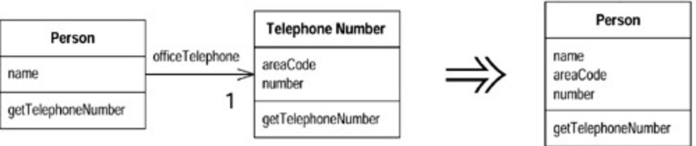

# Inline Class (将类内联化)

你的某个`class`没有做太多事情（没有承担足够责任）。

将`class`的所有特性搬移到另一个`class`中，然后移除原`class`。



## 动机 (Motivation)

`Inline Class`正好与`Extract Class` 相反。如果一个`class`不再承担足够责任、不再有单独存在的理由〔这通常是因为此前的重构动作移走了这个`class`的责任），我就会挑选这一「萎缩`class`」的最频繁用户（也是个`class`），以`Inline Class`手法将「妻缩`class`」塞进去。

## 作法 (Mechanics)

1. 在`absorbing class`（合并端的那个`class`）身上声明`source class`的`public`协议， 并将其中所有函数委托（`delegate`）至`source class`。
2. 如果「以一个独立接口表示`source class`函数」更合适的话，就应该在`inlining`之前先使用`Extract Interface`。
3. 修改所有`source class`引用点，改而引用`absorbing class`。
4. 将`source class`声明为`private`，以斩断`package`之外的所有引用可能。 同时并修改``source class``的名称，这便可使编译器帮助你捕捉到所有对于``source class``的"``dangling references`` "（虚悬引用点）。
5. 编译，测试。
6. 运用``Move Method`` 和 ``Move Field`` ，将``source class``的特性全部搬移至``absorbing class``。
7. 为``source class``举行一个简单的丧礼。

## 范例 (Examples)

先前（上个重构项〉我从`TelephoneNumber`「提炼出另一个`class`，现在我要将它`inlining`塞回到`Person`去。一开始这两个`classes`是分离的：

```java
 class Person...
   public String getName() {
       return _name;
   }
   public String getTelephoneNumber(){
       return _officeTelephone.getTelephoneNumber();
   }
   TelephoneNumber getOfficeTelephone() {
       return _officeTelephone;
   }
   private String _name;
   private TelephoneNumber _officeTelephone = new TelephoneNumber();
 class TelephoneNumber...
	 public String getTelephoneNumber() {
       return ("(" + _areaCode + ") " + _number);
   }
   String getAreaCode() {
       return _areaCode;
   }
   void setAreaCode(String arg) {
       _areaCode = arg;
   }
   String getNumber() {
       return _number;
   }
   void setNumber(String arg) {
       _number = arg;
   }
   private String _number;
   private String _areaCode;
```

首先我在`Person`中声明`TelephoneNumber`「的所有「可见」（`public`）函数：

```java
“class Person...
   String getAreaCode() {
       return _officeTelephone.getAreaCode();        //译注：请注意其变化
   }
   void setAreaCode(String arg) {
       _officeTelephone.setAreaCode(arg);                //译注：请注意其变化
   }
   String getNumber() {
       return _officeTelephone.getNumber();        //译注：请注意其变化
   }
   void setNumber(String arg) {
       _officeTelephone.setNumber(arg);                //译注：请注意其变化
   }
```

现在，我要找出`TelephoneNumber`的所有用户，让它们转而使用`Person`接口。于是下列代码：

```java
       Person martin = new Person();
       martin.getOfficeTelephone().setAreaCode ("781");
```

就变成了：

```java
Person martin = new Person();
martin.setAreaCode ("781");
```

现在，我可以持续使用`Move Method` 和 `Move Field` ，直到`TelephoneNumber`不复存在。