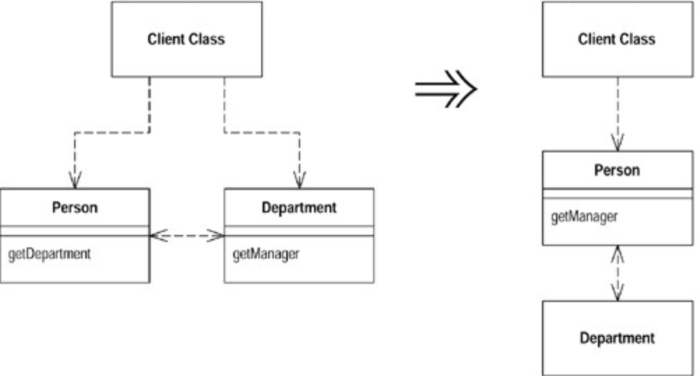
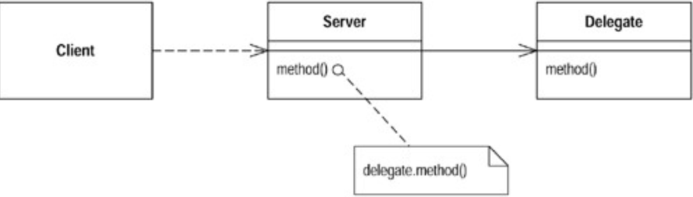

# Hide Delegate (用委托函数隐藏「委托关系」)

看到这里我一开始是有些懵逼的，这里的委托关系指的是 `server class` 引用 `delegate class` 这个组合行为，算是属性上的一种委托关系。

客户直接调用其 `server class instance`（服务实例）的 `delegate class` 上的方法。

```ts
 manager = john.getDepartment().getManager();
// ======>
 manager = john.getManager();
```

在 `server class` 建立客户所需的所有函数，用以隐藏委托关系 (`delegation`)，注意这样仍然是一种委托的模式，只是通过委托函数对客户端隐藏了委托关系的存在，让客户端知道的更少。



## 动机 (Motivation)

任何学过对象技术的人都知道：虽然`Java`允许你将值域声明为`public`，但你还是应该隐藏对象的值域。

如果某个客户调用了「建立于`server object` (服务对象）的某个值域基础之上」的函数，那么客户就必须知晓这一委托对象（`delegate object`。译注：即`server object`的那个特殊值域）。万一委托关系发生变化，客户也得相应变化。你可以在`server` 端放置一个简单的委托函数（`delegating method`），将委托关系隐藏起来，从而去除这种依存性。这么一来即便将来发生委托关系上的变化，变化将被限制在`server`中，不会波及客户。



## 作法 (Mechanics)

1. 对于每一个委托关系中的函数，在`server`端建立一个简单的委托函数（`delegating method`）。
2. 调整客户，令它只调用`server` 提供的函数（译注：不得跳过径自调用下层）。
3. 如果`client` (客户〕和`server`不在同一个`package`，考虑修改委托函数 （`delegate method`）的访问权限，让`client`得以在`package`之外调用它。
4. 每次调整后，编译并测试。
5. 如果将来不再有任何客户需要取用的`Delegate` (受托类)，便可移除`server`中的相关访问函数（`accessor for the delegate`）。
6. 编译，测试。

## 范例 (Examples)

本例从两个`classes`开始，代表「人」的`Person`和代表「部门」的`Department`：

```ts
class Person {
   Department _department;
   public Department getDepartment() {
       return _department;
   }
   public void setDepartment(Department arg) {
       _department = arg;
   }
 }
 class Department {
   private String _chargeCode;
   private Person _manager;
   public Department (Person manager) {
       _manager = manager;
   }
   public Person getManager() {
       return _manager;
   }
```

如果客户希望知道某人的经理是谁，他必须先取得`Department`对象：

```ts
manager = john.getDepartment().getManager();
```

这样的编码就是对客户揭露了`Department`的工作原理，于是客户知道：`Department`用以追踪「经理」这条信息。如果对客户隐藏`Department`，可以减少耦合（`coupling`）。 为了这一目的，我在`Person`中建立一个简单的委托函数：

```ts
public Person getManager() {
  return _department.getManager();
}
```

现在，我得修改 `Person` 的所有客户，让它们改用新函数：

```java
manager = john.getManager();
```

只要完成了对`Department`所有函数的委托关系，并相应修改了`Person`的所有客 户，我就可以移除`Person`中的访问函数`getDepartment()`了。
