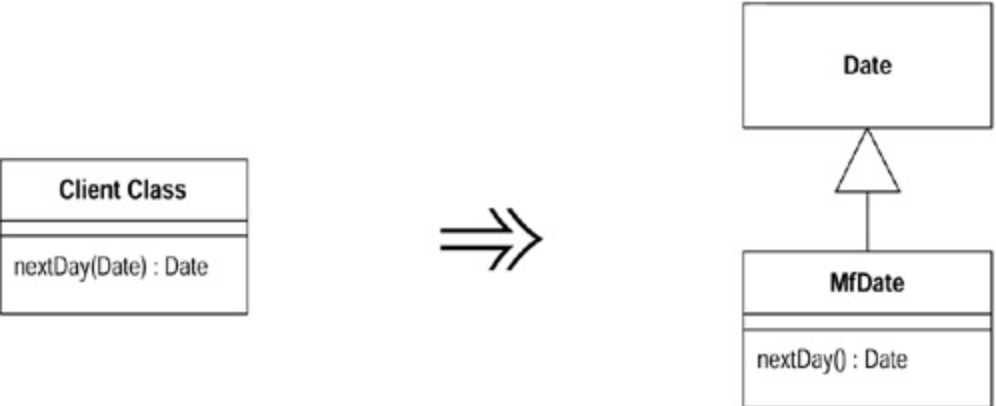

# Introduce Local Extension (引入本地扩展)

你所使用的`server class`需要一些额外函数，但你无法修改这个`class`。

建立一个新`class`，使它包含这些额外函数。让这个扩展品成为`source class`的`subclass` （子类〕或`wrapper`（外覆类）。



## 动机 (Motivation)

很遗憾，`classes`的作者无法预知未来，他们常常没能为你预先准备一些有用的函数。如果你可以修改源码，最好的办法就是直接加入自己需要的函数。但你经常无法修改源码。如果只需要一两个函数，你可以使用`Introduce Foreign Method`。 但如果你需要的额外函数超过两个，外加函数（`foreign methods`）就很难控制住它 们了。所以，你需要将这些函数组织在一起，放到一个恰当地方去。要达到这一目 的，标准对象技术`subclassing`和`wrapping`是显而易见的办法。这种情况下我把 `subclass` 或`wrapper`称为`local extention`（本地扩展〕。

所谓`local extention`是一个独立的`class`，但也是其`extended class`的`subtype`（译注： 这里的`subtype`不同于`subclass`；它和`extended class`并不一定存在严格的继承关系，只要能够提供`extended class`的所有特性即可）。这意味它提供`original class`的一切特性，同时并额外添加新特性。在任何使用`original class`的地方，你都可以使用`local extention`取而代之。

使用`local extention`（本地扩展）使你得以坚持「函数和数据应该被包装在形式良好 的单元内」这一原则。如果你一直把本该放在`extended class` 中的代码零散放置于其他`classes`中，最终只会让其他这些`classes`变得过分复杂，并使得其中函数难以被复用。

在`subclass`和`wrapper`之间做选择时，我通常首选`subclass`，因为这样的工作量比较少。制作`subclass`的最大障碍在于，它必须在对象创建期（`object-createion time`）实施。如果我可以接管对象创建过程，那当然没问题；但如果你想在对象创建之后再使用`local extention` ；就有问题了。此外，"`subclassing`"还迫使我必须产生一个`subclass`对象，这种情况下如果有其他对象引用了旧对象，我们就同时有两个对象保存了原数据！如果原数据是不可修改的（`immutable`），那也没问题，我可以放心进行拷贝；但如果原数据允许被修改，问题就来了，因为这时候闹了双包，一个修改动作无法同时改变两份拷贝。这时候我就必须改用`wrapper`。但使用`wrapper`时， 对`local extention`的修改会波及原物（`original`），反之亦然。

## 范例 (Examples)

我将以`Java 1.0.1`的`Date class`为例。`Java 1.1`已经提供了我想要的功能，但是在它到来之前的那段日子，很多时候我需要扩展`Java 1.0.1`的`Date class`。

第一件待决事项就是使用`subclass`或`wrapper`。`subclassing` 是比较显而易见的办法：

```java
Class mfDate extends Date {
   public nextDay()...
   public dayOfYear()...
```

`wrapper`则需要用上委托（`delegation`）：

```java
class mfDate {
   private Date _original;
```

