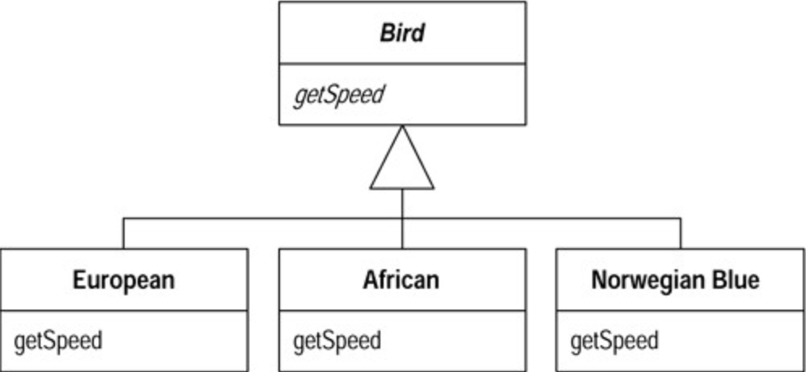

# Replace Conditional with Polymorphism (以多态取代条件式)

你手上有个条件式，它根据对象型别的不同而选择不同的行为。

将这个条件式的每个分支放进一个``subclass`` 内的覆写函数中，然后将原始函数声明为抽象函数（``abstract method``）。条件式则被转移到``subclass`` 的构造代码中或者在客户端初始化的时候手动传入。

```java
double getSpeed() {
  switch (_type) {
    case EUROPEAN:
      return getBaseSpeed();
    case AFRICAN:
      return getBaseSpeed() - getLoadFactor() * _numberOfCoconuts;
    case NORWEGIAN_BLUE:
      return (_isNailed) ? 0 : getBaseSpeed(_voltage);
  }
  throw new RuntimeException ("Should be unreachable");
}
```

更改后的结构：



## 动机 (Motivation)

在面向对象术语中，听上去最高贵的词非「多态」莫属。多态（`polymorphism`）最根本的好处就是：如果你需要根据对象的不同型别而采取不同的行为，多态使你不必编写明显的条件式（`explicit conditional` ）。

正因为有了多态，所以你会发现：「针对`type code`（型别码）而写的`switch` 语句」 以及「针对`type string` （型别名称字符串）而写的`if-then-else` 语句」在面向对象程序中很少出现。

多态（`polymorphism`）能够给你带来很多好处。如果同一组条件式在程序许多地点出现，那么使用多态的收益是最大的。使用条件式时，如果你想添加一种新型别，就必须查找并更新所有条件式。但如果改用多态，只需建立一个新的`subclass` ，并在其中提供适当的函数就行了。`class` 用户不需要了解这个`subclass` ，这就大大降低了系统各部分之间的相依程度，使系统升级更加容易。

## 作法 (Mechanics)

使用`Replace Conditional with Polymorphism`之前，你首先必须有一个继承结构。你可能已经通过先前的重构得到了这一结构。如果还没有，现在就需要建立它。

要建立继承结构，你有两种选择： `Replace Type Code with Subclasses` 和 `Replace Type Code with State/Strategy`。前一种作法比较简单，因此你应该尽可能使用它。但如果你需要在对象创建好之后修改`type code`；就不能使用`subclassing` 作法，只能使用`State/Strategy` 模式。此，如果由于其他原因你要重构的`class` 已经有了`subclass` ，那么也得使用`State/Strategy` 。记住，如果若干`switch` 语句针对的是同一个`type code`；你只需针对这个`type code` 建立一个继承结构就行了。

1. 如果要处理的条件式是一个更大函数中的一部分，首先对条件式进行分析，然后使用`Extract Method` 将它提炼到一个独立函数去。
2. 使用`Move Method` 将条件式放置到继承结构的顶端。
3. 任选一个`subclass` ，在其中建立一个函数，使之覆写`superclass` 中容纳条件式的那个函数。将「与`subclass` 相关的条件式分支」拷贝到新建函数中，并对它进行适当调整。
4. 为了顺利进行这一步骤，你可能需要将`superclass` 中的某些`private` 值域声明为`protected` 。
5. 在`superclass` 中删掉条件式内被拷贝出去的分支。
6. 针对条件式的每个分支，重复上述过程，直到所有分支都被移到`subclass` 内的函数为止。
7. 将`superclass` 之中容纳条件式的函数声明为抽象函数（`abstract method`）。

## 例子 (Example)

复写后的结构图：


**Employee.ts**

```ts
class Employee {
    constructor(private _type: EmployeeType, private _salery: number) {}
    payAmount() {
        return this._type.payAmount(this);
    }
    getType() {
        return this._type.getTypeCode();
    }
    getMonthlySalary(): number {
        return this._salery;
    }
    getCommission(): number {
        return this._salery * 0.2;
    }
    getBonus(): number {
        return this._salery * 0.5;
    }
}
```

**EmployeeType.ts**

```ts
abstract class EmployeeType {
    public static readonly ENGINEER = 0b001;
    public static readonly SALESMAN = 0b010;
    public static readonly MANAGER = 0b100;
    abstract getTypeCode(): number;
    abstract payAmount(emp: Employee): number;
}

class Engineer extends EmployeeType {
    getTypeCode() {
        return EmployeeType.ENGINEER;
    }
    payAmount(emp: Employee) {
        return emp.getMonthlySalary();
    }
}

class SaleMan extends EmployeeType {
    getTypeCode() {
        return EmployeeType.ENGINEER;
    }
    payAmount(emp: Employee) {
        return emp.getMonthlySalary() + emp.getCommission();
    }
}

class Manager extends EmployeeType {
    getTypeCode() {
        return EmployeeType.ENGINEER;
    }
    payAmount(emp: Employee) {
        return emp.getMonthlySalary() + emp.getBonus();
    }
}
```

