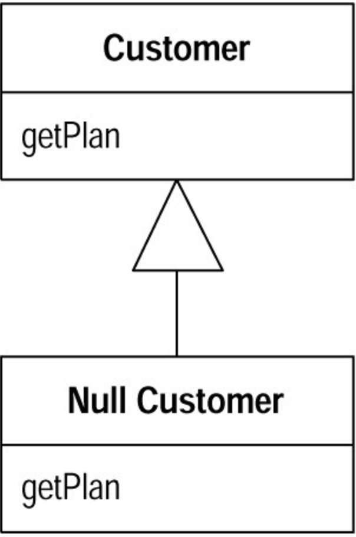

# Introduce Null Object (引入Null 对象)

你需要再三检查「某物是否为`null value`」。

将`null value` （无效值）替换为`null object`（无效物）。

```ts
if (customer !== null) plan = customer.getPlan();
```

改写为：



## 动机 (Motivation)

多态（`polymorphism` ）的最根本好处在于：你不必再向对象询问「你是什么型别」 而后根据得到的答案调用对象的某个行为——你只管调用该行为就是了，其他的一切多态机制会为你安排妥当。当你的某个值域内容是`null value` 时，多态可扮演另一个较不直观（亦较不为人所知）的用途。让我们先听听`Ron Jeffries` 的故事。

我们第一次使用`Null Object` 模式，是因为`Rih Garzaniti` 发现，系统在对对象发送一个消息之前，总要检査对象是否存在，这样的检査出现很多次。我们可能会向一个对象索求它所相关的`Person` 对象，然后再问那个对象是否为`null` 。如果对象的确存在，我们才能调用它的`rate()` 函数以查询这个人的薪资级别。我们在好些地方都是这样做的， 造成的重复代码让我们很烦心。

所以.我们编写了一个`MissingPerson class`，让它返回 '`0`' 薪资等级（我们把`null objects` 称为`missing object`（虚构对象）。很快地`MissingPerson` 就有了很多函数，`rate()` 自然是其中之一。如今我们的系统有超过`80`个`null object classes`。

我们常常在显示信息的时候使用`null object`。例如我们想要显示一个`Person` 对象信息，它大约有`20`个`instance` 变量。如果这些变量可被设为`null`，那么打印一个`Person` 对象的工作将非常复杂。所以我们不让`instance` 变量被设为`null` ，而是插入各式各样的`null objects` ——它们都知道如何正常（正确地）显示自己。这样，我们就可以摆脱大量代码。

`null object` 的另一个用途是表现出「虚构的箱仓」（`missing bin`）。所谓「箱仓]，这里是指群集（`collection`），用来保存某些薪资值，并常常谣要对各个薪资值进行加和或遍历。如果某个箱仓不存在，我们就给出一个虚构的箱仓对象，其行为和一个空箱仓（`empty bin`）一样；这个虚构箱仓知道自己其实不带任何数据，总值为`0`。通过这种作法，我们就不必为上千位员工每人产生数十来个空箱（`empty bins`）对象了。

使用`null objects` 有个非常有趣的性质：好事绝对不会因为`null objects` 而「被破坏」。由于`null objects` 对所有外界请求的响应，都像`real objects` 的响应一样，所以系统行为总是正常的。但这并非总是好事，有吋会造成问题的侦测和查找上的困难，因为从来没有任何东西被破坏。当然，只要认真检查一下，你就会发现`null objects` 有时[…]”

请记住：`null objects` 一定是常量，它们的任何成分都不会发生变化。因此我们可以使用`Singleton` 模式[`Gang of Four`]来实现它们。例如不管任何时候，只要你索求一个`MissingPerson` 对象，你得到的一定是`MissingPerson` 的惟一实体。

## 范例 (Example)

—家公用事业公司的系统以`Site` 表示线下客户服务点。任何服务点都有一个对应的顾客，当然也可能没有：

```ts
class Site {
    constructor(private _customer: Customer | null) {}
    get customer() {
        return this._customer;
    }
}
```

`Customer` 有很多特性，我们只看其中两项：

```ts
class Customer {
    constructor(private _name: string, private _services: string[]) {}
    get name() {
        return this._name;
    }
    get services() {
        return this._services;
    }
}
```

上面的各种取值函数(`getter`)允许客户取得各种数据。但有时候一个服务点的顾客走了，新顾客还没来，此时这个地点就没有顾客。由于这种情况有可能发生，所以我们必须保证`Customer` 的所有用户都能够处理「`Customer` 对象等于`null`」的情况。下面是一些示例片段：

```ts

function serve(site: Site) {
    let customer = site.customer;
    let customerName;
    if (!customer) customerName = 'occupant';
    else customerName = customer.name;
    
		customer && customer.services.forEach((service) => {
        console.log(customerName + 'is on serve' + service);
    });
}
```

这个系统中可能使用许多`Site` 和`Customer` ，它们都必须检查`Customer` 对象是否等于`null` ，而这样的检查完全是重复的。看来是使用`null object` 的时候了。

首先新建一个`NullCustomer` ，他继承与 `Customer`，所有的属性都被设置为默认值，最后我们在模块里暴露他的单例：

```ts
class NullCustomer extends Customer {
    constructor() {
        super('', []);
    }
    get name() {
        return 'occupant';
    }
    get services() {
        return [];
    }
}


export default new NullCustomer();
```

因为这个 `NullCustomer` 继承与 `Customer` 所以我们要写一个 `constructor` 来调用 `super`，如果你觉得这样不够性感，你可以给 `NullCustomer` 和 `Customer` 提取一个公共的接口并且由二者实现。这里就不做演示了。

接下来的部分稍微有点麻烦。对于所有「返回`null`」的地方，我都要将它改为「返回`null object`」，此外我还要把`foo==null`这样的检查替换成`foo.isNull()`。我发现下列办法很有用：查找所有『索求`Customer` 对象」的地方，将它们都加以修改, 使它们不能返回`null` ，改而返回一个`NullCustomer` 对象。

```ts
import nullCustomer from '~/NullCustomer'
class Site {
    constructor(private _customer: Customer | null) {}
    get customer() {
        if (!this._customer) return nullCustomer;
        return this._customer;
    }
}
```

最后我们的 `serve` 函数就变成了这个样子：

```ts
function serve(site: Site) {
    let customer = site.customer;
    let customerName = customer.name;
    customer.services.forEach((service) => {
        console.log(customerName + 'is on serve' + service);
    });
}
```

使用本项重构时，你可以有数种不同的`null objects` ，例如你可以说「没有顾客」（新建的房子和暂时没人住的房子）和「不知名顾客」（有人住，但我们不知道是谁） 这两种情况是不同的。果真如此，你可以针对不同的情况建立不同的`null class`。有时候`null objects` 也可以携带数据，例如不知名顾客的使用记录等等，于是我们可以在查出顾客姓名之后将帐单寄给他。

本质上来说，这是一个比``Null Object`` 模式更大的模式：``Special Case`` 模式。所谓``special case class``（特例类）是某个``class`` 的特殊情况，有着特殊的行为。因此表示「不知名顾客」的``UnknowCustomer`` 和表示「没有顾客」的``NoCustomer`` 都是``Customer`` 的特例。你经常可以在表示数量的``classes`` 中看到这样的「特例类」，例如``Java`` 浮点数有「正无穷大」、「负无穷大」和「非数量」（``NaN``）等特例。``special case class``（特例类）的价值是：它们可以降低你的「错误处理」开销。例如浮点运算决不会抛出异常。如果你对`NaN`做浮点运算，结果也会是个`NaN`。这和「`null object` 的访问函数通常返回另一个`null object` 」是一样的道理。