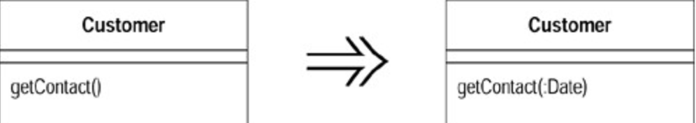

# Add Parameter (添加参数)

某个函数需要从调用端得到更多信息。

为此函数添加一个对象参数，让该对象带进函数所需信息。

## 动机 (Motivation)

`Add Parameter` 是一个很常用的重构手法，我几乎可以肯定已经用过它了。使用这项重构的动机很简单：你必须修改一个函数，而修改后的函数需要一些过去没有的信息，因此你需要给该函数添加一个参数。

实际上我比较需要说明的是：不使用本重构的时机。除了添加参数外，你常常还有其他选择。只要可能，其他选择都比本项「添加参数」要好，因为它们不会增加参数列的长度。过长的参数列是不好的味道。

我并非要你绝对不要添加参数。事实上我自己经常添加参数，但是在添加参数之前你有必要了解其他选择。

> `Add Parameter` 的技巧和 `rename method` 一致。

