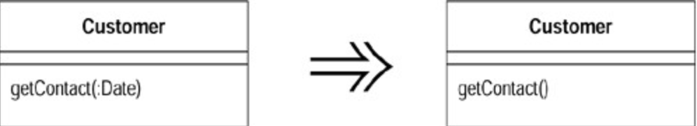

# Remove Parameter (移除参数)

函数本体（`method body`）不再需要某个参数。将该参数去除。

## 动机 (Motivation)

程序员可能经常添加参数，却往往不愿意去掉它们。他们打的如意算盘是，无论如 何，多余的参数不会引起任何问题，而且以后还可能用上它。

这也是恶魔的诱惑，一定要把它从脑子里赶出去！参数指出函数所需信息，不同的参数值代表不同的意义。函数调用者必须为每一个参数操心该传什么东西进去。如果你不去掉多余参数，你就是让你的每一位用户多费一份心。这是很不划算的，尤其「去除参数」是非常简单的一项重构。

但是，对于多态函数（`polymorphic method`），情况有所不同。这种情况下，可能多态函数的另一份（或多份）实现码会使用这个参数，此时你就不能去除它。你可以添加一个独立函数，在这些情况下使用，不过你应该先检查调用者如何使用这个函数，以决定是否值得这么做。

> `Remove Parameter` 的作法和`Rename Method` 、`Add Parameter` 非常相似。

