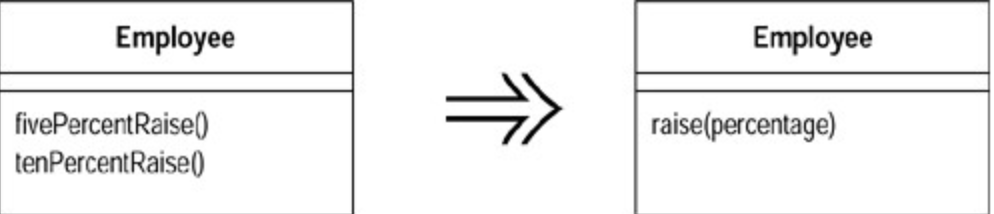

# Parameterize Method (令函数携带参数)

若干函数做了类似的工作，但在函数本体中却包含了不同的值。

建立单一函数，以参数表达那些不同的值。



## 动机 (Motivation)

你可能会发现这样的两个函数：它们做着类似的工作，但因少数几个值致使动作略有不同。这种情况下，你可以将这些各自分离的函数替换为一个统一函数，并通过参数来处理那些变化情况，用以简化问题。这样的修改可以去除重复的代码，并提高灵活性，因为你可以用这个参数处理其他（更多种）变化情况。

> [注意:]() 这个问题的重点是要合并的参数做的事情本质是相同的，而不是通过参数选项将负责任务本来就不同的函数合并。

## 作法 (Mechanics)

1. 新建一个带有参数的函数，使它可以替换先前所有的重复性函数(`repetitive methods`)。
2. 编译。
3. 将「对旧函数的调用动作」替换为「对新函数的调用动作」。

也许你会发现，你无法用这种办法处理整个函数，但可以处理函数中的一部分代码。 这种情况下，你应该首先将这部分代码提炼到一个独立函数中，然后再对那个提炼所得的函数使用`Parameterize Method`。

## 范例 (Example)

下面是一个最简单的例子：

```java
 class Employee {
   void tenPercentRaise () {
       salary *= 1.1;
 }
   void fivePercentRaise () {
       salary *= 1.05;
 }
```

这段代码可以替换如下：

```java
 void raise (double factor) {
   salary *= (1 + factor);
 }
```

