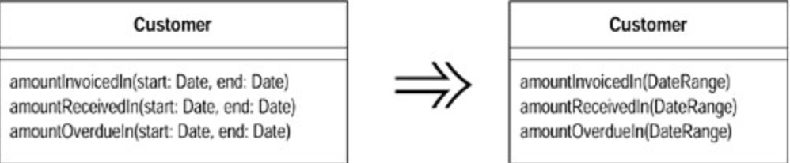

# Introduce Parameter Object (引入参数对象)

某些参数总是很自然地同时出现。

以一个对象取代这些参数。

## 动机 (Motivation)

你常会看到特定的一组参数总是一起被传递。可能有好几个函数都使用这一组参数，这些函数可能隶属同一个`class`，也可能隶属不同的`classes` 。这样一组参数就是所谓的`Date Clump` （数据泥团）」，我们可以运用一个对象包装所有这些数据，再以该对象取代它们。哪怕只是为了把这些数据组织在一起，这样做也是值得的。本项重构的价值在于「缩短了参数列的长度」，而你知道，过长的参数列总是难以理解的。此外，新对象所定义的访问函数（`accessors`）还可以使代码更具一致性，这又进一步降低了代码的理解难度和修改难度。

本项重构还可以带给你更多好处。当你把这些参数组织到一起之后，往往很快可以发现一些「可被移至新建`class`」的行为。通常，原本使用那些参数的函数对那些参数会有一些共通措施，如果将这些共通行为移到新对象中，你可以减少很多重复代码。

## 作法 (Mechanics)

1. 针对要重构函数的所有参数构建一个接口，将参数整合为一个对象。如果你觉得你合并的参数可以组织为一个类结构，那就抽离成为一个类结构。

