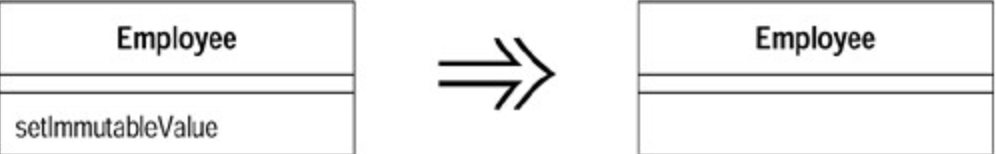

# Remove Setting Method (移除设置函数)

你的 `class` 中的某个值域，应该在对象初创时被设值，然后就不再改变。

去掉该值域的所有设值函数（`setter`）。

## 动机 (Motivation)

如果你为某个值域提供了设值函数（`setter`），这就暗示这个值域值可以被改变。如果你不希望在对象初创之后此值域还有机会被改变，那就不要为它提供设值函数 （同时并将该值域设为`final` ）。这样你的意图会更加清晰，并且往往可以排除其值被修改的可能性——这种可能性往往是非常大的。

如果你保留了间接访问变量的方法，就可能经常有程序员盲目使用它们[`Beck`]。这些人甚至会在构造函数中使用设值函数！我猜想他们或许是为了代码的一致性，但却忽视了设值函数往后可能带来的混淆。

