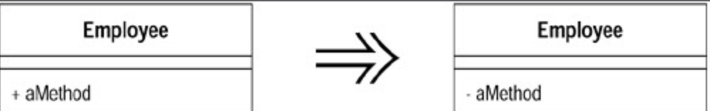

# Hide Method (隐藏某个函数)

有一个函数，从来没有被其他任何`class` 用到。将这个函数修改为 `private`。

## 动机 (Motivation)

重构往往促使你修改「函数的可见度」（ `visibility of methods`）。提高函数可见度的情况很容易想像：另一个`class` 需要用到某个函数，因此你必须提高该函数的可见度。但是要指出一个函数的可见度是否过高，就稍微困难一些。

## 作法 (Mechanics)

经常检查有没有可能降低某个函数的可见度（使它更私有化）。

