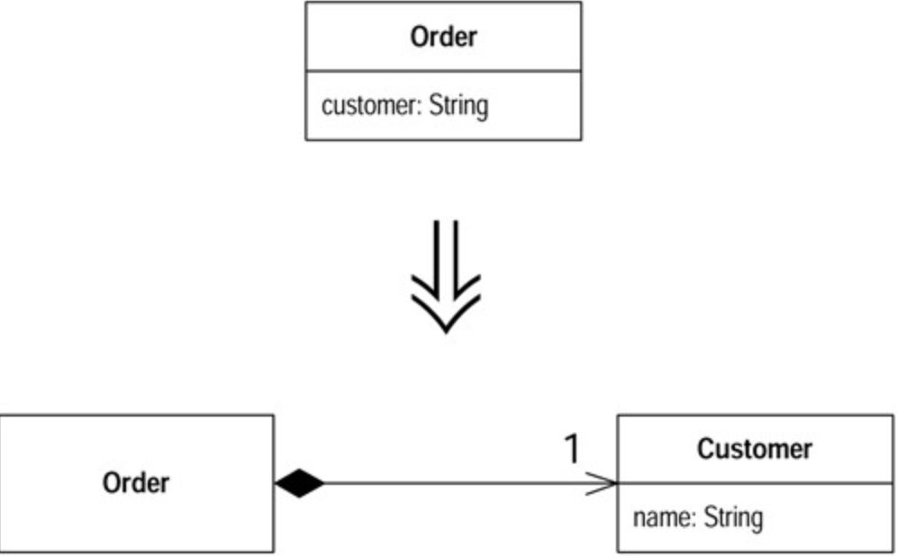

# Replace Data Value with Object (以对象取代数据值)

你有一笔数据项（`data item`），需要额外的数据和行为。

将这笔数据项变成一个对象。

## 动机 (Motivation)

开发初期，你往往决定以简单的数据项（`data item`）表示简单的行为。但是，随着开发的进行，你可能会发现，这些简单数据项不再那么简单了。比如说，一开始你可能会用一个字符串来表示「电话号码」概念，但是随后你就会发现，电话号码需要「格式化」、「抽取区号」之类的特殊行为。如果这样的数据项只有一二个，你还可以把相关函数放进数据项所属的对象里头；但是`Duplication Code`臭味和`Feature Envy`臭味很快就会从代码中散发出来。当这些臭味开始出现，你就应该将数据值（`data value`）变成对象（`object`）。

