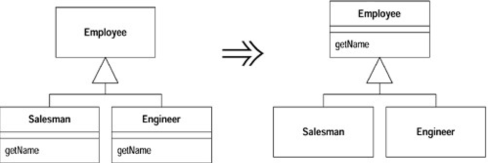

# Pull Up Method (函数上移)

有些函数，在各个`subclass` 中产生完全相同的结果。

将该函数移至`superclass`。

## 动机 (Motivation)

避免「行为重复」是很重要的。尽管「重复的两个函数」也可以各自工作得很好， 但「重复」自身会成为错误的滋生地，此外别无价值。无论何时，只要系统之内出现重复，你就会面临「修改其中一个却未能修改另一个」的风险。通常，找出重复也有一定困难。

如果某个函数在各`subclass` 中的函数体都相同（它们很可能是通过「拷贝-粘贴」得到的），这就是最显而易见的`Pull Up Method` 适用场合。当然，情况并不总是如此明显。你也可以只管放心地重构，再看看测试程序会不会发牢骚，但这就需要对你的测试有充分的信心。我发现，观察这些可疑（可能重复的〕函数之间的差异往往大有收获：它们经常会向我展示那些我忘记测试的行为。

`Pull Up Method` 常常紧随其他重构而被使用。也许你能找出若干个「身处不 同`subclasses` 内的函数」而它们又可以「通过某种形式的参数调整」而后成为相同函数。这时候，最简单的办法就是首先分别调整这些函数的参数，然后再将它们概括（`generalize`）到`superclass`中。当然，如果你自信足够，也可以一次同时完成这两个步骤。

有一种特殊情况也需要使用`Pull Up Method` ： `subclass` 的函数覆写（`overrides`） 了`superclass` 的函数，但却仍然做相同的工作。

`Pull Up Method` 过程中最麻烦的一点就是：被提升的函数可能会引用「只出现于`subclass` 而不出现于`superclass`」的特性。如果被引用的是个函数，你可以将该函数也一同提升到`superclass`，或者在`superclass` 中建立一个抽象函数。在此过程中，你可能需要修改某个函数的签名式（`signature`），或建立一个委托函数（`delegating method`）。

如果两个函数相似但不相同，你或许可以先以`Form Template Method` 构造出相同的函数，然后再提升它们。