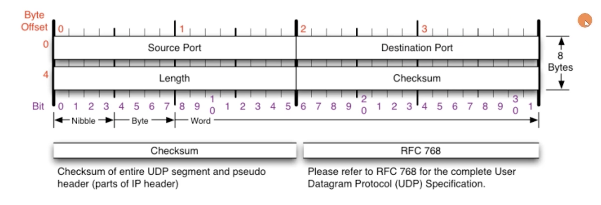
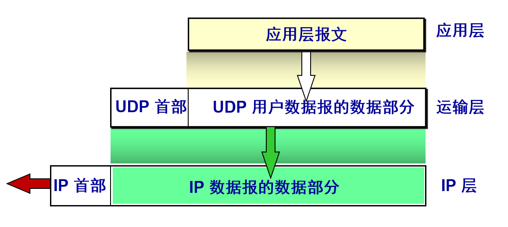
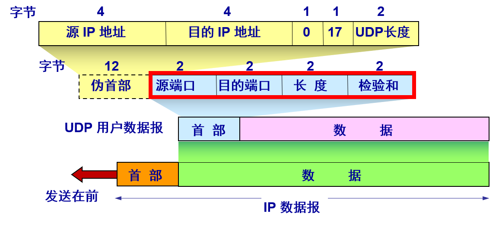
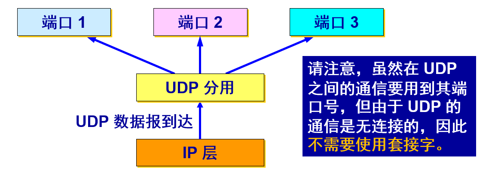
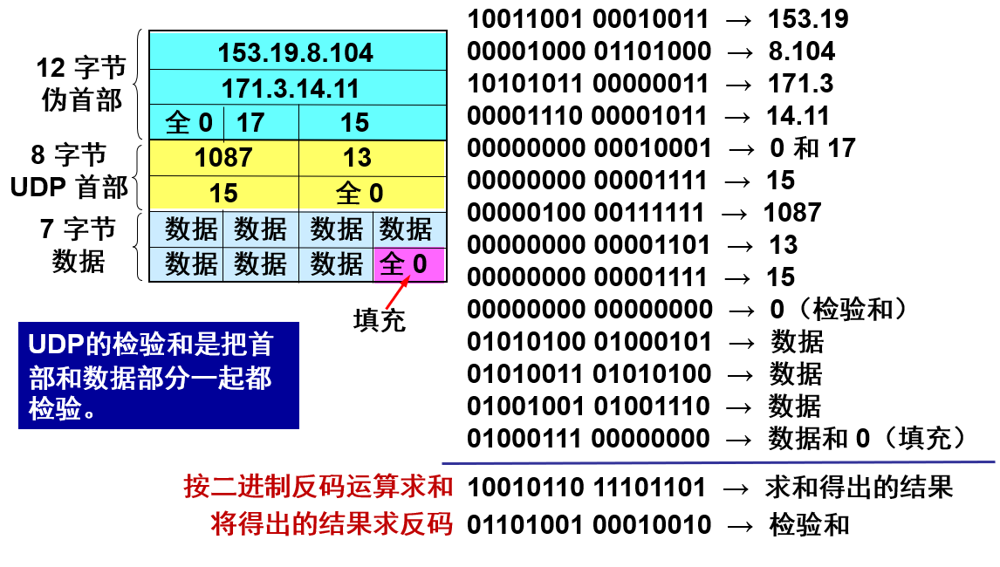

## `UDP`概述

------

`UDP` 只在 `IP` 的数据报服务之上增加了很少一点的功能：

- 复用和分用的功能
- 差错检测的功能

虽然 `UDP` 用户数据报只能提供不可靠的交付，但 `UDP` 在某些方面有其特殊的优点。

`DNS` 是一个通常使用 `UDP` 的应用层协议的例子。当一台主机中的 `DNS` 应用程序想要进行一次查询时，它构造了一个 `DNS` 查询报文并将其交给 `UDP`，主机端的`UDP`为此报文添加`1`首部字段，然后将形成的报文段交给网络层。网络层将此`UDP`报文段封装迸一个数据报，然后将其发送给一个 `DNS` 服务器。在查询主机中的`DNS`应用程序则等待对该查询的响应。如果它没有收到响应，则要么试罔向另一个 `DNS` 服务器发送该查询，要么通知调用的应用程序它不能获得响应。

#### 特点：

- `UDP` 是无连接的，发送数据之前不需要建立连接，因此减少了开销和发送数据之前的时延。
- `UDP` 使用尽最大努力交付，即不保证可靠交付，因此主机不需要维持复杂的连接状态表。
- `UDP` 是面向报文的。UDP 对应用层交下来的报文，既不合并，也不拆分，而是保留这些报文的边界。`UDP` 一次交付一个完整的报文。
- `UDP` 没有拥塞控制，因此网络出现的拥塞不会使源主机的发送速率降低。这对某些实时应用是很重要的。很适合多媒体通信的要求。 
- `UDP` 支持一对一、一对多、多对一和多对多的交互通信。
- `UDP` 的首部开销小，只有 `8` 个字节，比 `TCP` 的 `20` 个字节的首部要短。

## `UCP`报文

-----

**发送方** `UDP` 对应用程序交下来的报文，在添加首部后就向下交付 `IP` 层。`UDP` 对应用层交下来的报文，既不合并，也不拆分，而是保留这些报文的边界，应用层交给 `UDP` 多长的报文，`UDP` 就照样发送，即一次发送一个报文。

**接收方** `UDP` 对 `IP` 层交上来的 `UDP` 用户数据报，在去除首部后就原封不动地交付上层的应用进程，一次交付一个完整的报文。

所以，应用程序必须选择合适大小的报文：

- 若报文太长，`UDP` 把它交给 `IP` 层后，`IP` 层在传送时可能要进行分片，这会降低 `IP` 层的效率。
- 若报文太短，`UDP` 把它交给 `IP` 层后，会使 `IP` 数据报的首部的相对长度太大，这也降低了 `IP` 层的效率。

#### 报文格式

`UDP` 真正的首部只有 `4` 个字段，每个字段由两个字节组成。通过端口号可以使目的主机将应用数据交给运行在目的端系统中的相应进程`(即执行分解功能)`。长度字段指示了在 `UDP` 报文段中的字节数`(首部加数据)`。首部固定 `8` 个字节，我们可以算出来数据段的大小。接收方使用检验和来检查在该报文段中是否出现了差错。

在`UDP`伪首部中，包含`32`位源`IP`地址，`32`位目的`IP`地址，`8`位协议，`16`位`UDP`长度。通过伪首部的校验，`UDP`可以确定该数据报是不是发给本机的，通过首部协议字段，`UDP`可以确认有没有误传。

伪首部并非 `TCP&UDP` 数据报中实际的有效成分。伪首部是一个虚拟的数据结构，其中的信息是从数据报所在 `IP` 分组头的分组头中提取的，既不向下传送也不向上递交，而仅仅是为计算校验和。这样的校验和，既校验了 `TCP&UDP` 用户数据的源端口号和目的端口号以及 `TCP&UDP` 用户数据报的数据部分，又检验了 `IP` 数据报的源 `IP` 地址和目的地址。伪报头保证 `TCP&UDP`数据单元到达正确的目的地址。因此，伪报头中包含 `IP` 地址并且作为计算校验和需要考虑的一部分。最终目的端根据伪报头和数据单元计算校验和以验证通信数据在传输过程中没有改变而且到达了正确的目的地址。

#### 基于端口的多路复用

当运输层从 ``IP`` 层收到 ``UDP`` 数据报时，就根据首部中的目的端口，把 ``UDP`` 数据报通过相应的端口，上交最后的终点——应用进程。

#### 伪首部与校验和

伪首部，更确切的说是校验和包含的—个`96`位的伪首标，是个理论上的值，只是理论上它位于`TCP&UDP`首标的前面。这个伪首标包含了源地址、目的地址、协议和`TCP&UDP`长度等字段，这使得`TCP&UDP`能够防止出现路由选择错误的数据段。这些信息由网际协议`(IP)`承载，通过`TCP&UDP`网络接口，在`IP`上运行的`TCP&UDP`调用参数或者结果中传递。

在计算检验和时，临时把“伪首部”和 `UDP` 用户数据报连接在一起。伪首部仅仅是为了计算检验和。

