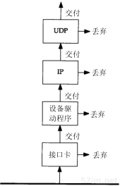
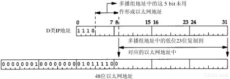

## udp 广播和多播

--------

在 `ip` 协议中我们提到有三种IP地址：单播地址、广播地址和多播地址。其中广播和多播仅应用于`UDP`，它们对需将报文同时传往多个接收者的应用来说十分重要。`TCP`是一个面向连接的协议，它意味着分别运行于两主机（由`IP`地址确定）内的两进程（由端口号确定）间存在一条连接。

考虑包含多个主机的共享信道网络如以太网。每个以太网帧包含源主机和目的主机的以太网地址（`48bit`）。通常每个以太网帧仅发往单个目的主机，目的地址指明单个接收接口，因而称为单播`(unicast)`。在这种方式下，任意两个主机的通信不会干扰网内其他主机（可能引起争夺共享信道的情况除外）。

然而，有时一个主机要向网上的所有其他主机发送帧，这就是广播。通过`ARP`和`RARP`可以看到这一过程。多播`(multicast)`处于单播和广播之间：帧仅传送给属于多播组的多个主机。

#### 广播/多播原理

`udp` 的广播和多播，实际上是用的是 `ip` 层和链路层的广播和组播，`udp` 本身只是提供了端口号的分用，当某一个主机进行广播或者多播的时候，他会使用广播或者组播的 `ip` 地址，然后更改 `mac` 地址为组播或者多播地址。对于组播可能会在本地网卡中注册服务。之后封装好的链路层帧就被传递出去，至于广播是怎样传送的？路由器及主机又如何处理广播？很遗憾，这是难以回答的问题，因为它依赖于广播的类型、应用的类型、TCP/IP实现方法以及有关路由器的配置。

为了弄清广播和多播，需要了解主机对由信道传送过来帧的过滤过程。下图说明了这一过程。



首先，网卡查看由信道传送过来的帧，确定是否接收该帧，若接收后就将它传往设备驱动程序。通常**网卡仅接收那些目的地址为网卡物理地址或广播地址的帧**。另外，多数接口均被设置为混合模式，这种模式能接收每个帧的一个复制。

对于以太网，当地址中**最高字节的最低位**设置为`1`时表示该地址是一个多播地址，用十六进制可表示为`01`:`00`:`00`:`00`:`00`:`00`（以太网广播地址`ff`:`ff`:`ff`:`ff`:`ff`:`ff`可看作是以太网多播地址的特例）。

> `IEEE` 规定地址字段的第一字节的最低位为 `I/G` 位。`I/G` 表示 `Individual / Group`。
>
> + 当 `I/G`位 `= 0` 时，地址字段表示一个单站地址。
> + 当 `I/G`位 `= 1` 时，表示组地址，用来进行多播。此时，`IEEE` 只分配地址字段前三个字节中的 `23` 位。
> + 所有 `48` 位都为 `1` 时，为广播地址。只能作为目的地址使用。

如果网卡收到一个帧，这个帧将被传送给设备驱动程序（如果帧检验和错，网卡将丢弃该帧）。设备驱动程序将进行另外的帧过滤。首先，帧类型中必须指定要使用的协议（`IP`、`ARP`等等）。其次，进行多播过滤来检测该主机是否属于多播地址说明的多播组。

设备驱动程序随后将数据帧传送给下一层，比如，当帧类型指定为`IP`数据报时，就传往`IP`层。`IP`根据`IP`地址中的源地址和目的地址进行更多的过滤检测。如果正常，就将数据报传送给下一层（如`TCP`或`UDP`）。

每次`UDP`收到由`IP`传送来的数据报，就根据目的端口号，有时还有源端口号进行数据报过滤。如果当前没有进程使用该目的端口号，就丢弃该数据报并产生一个`ICMP`不可达报文（`TCP`根据它的端口号作相似的过滤）。如果`UDP`数据报存在检验和错，将被丢弃。

## 广播

------

在了解广播之前我们来回顾一下广播 `ip` 地址，

广播地址 `(Broadcast Address)` 是专门用于同时向同一网络内（**通常指同一子网**）所有工作站进行发送的一个地址。在使用 `TCP/IP` 协议的网络中，主机标识段 `host ID`（**简称主机 ID**） 为全 `1` 的 `IP` 地址为广播地址，广播的分组传送给同一个子网的所有计算机。


广播在 `mac` 层使用的就是链路层广播，`mac` 地址 `ff`:`ff`:`ff`:`ff`:`ff`:`ff`，从我们抓到的 `mac` 帧就可已看出来：

```udp
Ethernet II, Src: RealtekS_68:1a:0f (00:e0:4c:68:1a:0f), Dst: Broadcast (ff:ff:ff:ff:ff:ff)
    Destination: Broadcast (ff:ff:ff:ff:ff:ff)
        Address: Broadcast (ff:ff:ff:ff:ff:ff)
        .... ..1. .... .... .... .... = LG bit: Locally administered address (this is NOT the factory default)
        .... ...1 .... .... .... .... = IG bit: Group address (multicast/broadcast)
    Source: RealtekS_68:1a:0f (00:e0:4c:68:1a:0f)
        Address: RealtekS_68:1a:0f (00:e0:4c:68:1a:0f)
        .... ..0. .... .... .... .... = LG bit: Globally unique address (factory default)
        .... ...0 .... .... .... .... = IG bit: Individual address (unicast)
    Type: IPv4 (0x0800)
Internet Protocol Version 4, Src: 10.99.19.202, Dst: 10.99.19.255
User Datagram Protocol, Src Port: 53839, Dst Port: 10001
    Source Port: 53839
    Destination Port: 10001
```

>  例如: 对于 `10.1.1.0 (255.255.255.0)` 网段，其广播地址为 `10.1.1.255` ，当发出一个目的地址为 `10.1.1.255` 的数据包时，它将被分发给该网段上的所有计算机。

#### 四种 IP 广播地址

**受限的广播地址：**

*受限的广播地址是255.255.255.255*：该地址用于主机配置过程中 `IP` 数据包的目的地址，此时，主机可能还不知道它所在网络的网络掩码，甚至连它的 `IP` 地址也不知道。在任何情况下，路由器都不转发目的地址为受限的广播地址的数据报，这样的数据报仅出现在本地网络中。

**指向网络的广播：**

*指向网络的广播地址是主机号为全1的地址*：`A` 类网络广播地址为 `netid.255.255.255`，其中 `netid` 为 `A` 类网络的网络号。一个路由器可以设置是否转发这个广播地址的数据。

一个路由器必须转发指向网络的广播，但它也必须有一个不进行转发的选择。

> 这里的网络一般指未划分子网的网络

**指向子网的广播**

*指向子网的广播地址为主机号为全1且有特定子网号的地址*：作为子网直接广播地址的 `IP` 地址需要了解子网的掩码。

例如，如果路由器收到发往 `128.1.2.255` 的数据报，当 `B` 类网络 `128.1` 的子网掩码为 `255.255.255.0` 时，该地址就是指向子网的广播地址；但如果该子网的掩码为 `255.255.254.0`，该地址就不是指向子网的广播地址 (此时应该是 `128.1.1.255`)。

**指向所有子网的广播**

*指向所有子网的广播地址为子网号和主机号为全1的地址*：指向所有子网的广播也需要了解目的网络的子网掩码，以便与指向网络的广播地址区分开。指向所有子网的广播地址的**子网号及主机号为全1**。例如，如果 `B` 类目的子网掩码为 `255.255.255.0`，那么`IP` 地址`128.1.255.255` 是一个指向所有子网的广播地址。然而，如果网络没有划分子网，这就是一个指向网络的广播。**[这一类型的地址现在已经基本不使用了，而由D类组播地址所取代]()。** 

## 多播

-------

`IP` 多播提供两类服务：


向多个目的地址传送数据。有许多向多个接收者传送信息的应用：例如交互式会议系统和向多个接收者分发邮件或新闻。如果不采用多播，目前这些应用大多采用`TCP`来完成（向每个目的地址传送一个单独的数据复制）。然而，即使使用多播，某些应用可能继续采用`TCP`来保证它的可靠性。

客户对服务器的请求。例如，无盘工作站需要确定启动引导服务器。目前，这项服务是通过广播来提供的，但是使用多播可降低不提供这项服务主机的负担。

#### 多播组地址

多播使用的就是 `ip` 的组播地址，下图显示了 `D` 类 `IP` 地址的格式，


不像其他三类`IP`地址（`A`、`B`和`C`），分配的`28 bit`均用作多播组号而不再表示其他。

多播组地址包括为`111 0`的最高`4bit`和多播组号。它们通常可表示为点分十进制数，范围从`224.0.0.0`到`239.255.255.255`。

能够接收发往一个特定多播组地址数据的主机集合称为主机组`(host group)`。一个主机组可跨越多个网络。主机组中成员可随时加入或离开主机组。主机组中对主机的数量没有限制，同时不属于某一主机组的主机可以向该组发送信息。

一些多播组地址被`IANA`确定为知名地址。它们也被当作永久主机组，这和`TCP`及`UDP`中的熟知端口相似。同样，这些知名多播地址在`RFC`最新分配数字中列出。注意这些多播地址所代表的组是永久组，而它们的组成员却不是永久的。

+ 224.0.0.0～224.0.0.255为预留的组播地址（永久组地址），地址224.0.0.0保留不做分配，其它地址供路由协议使用；
  + `224.0.0.0` 基准地址（保留）
  + `224.0.0.1` 所有主机的地址 （包括所有路由器地址）
  + `224.0.0.2` 所有组播路由器的地址
  + `224.0.0.3` 不分配
  + `224.0.0.4 dvmrp`路由器
  + `224.0.0.5` 所有`ospf`路由器
  + ``224.0.0.7 st`路由器
  + `224.0.0.8 st`主机
  + `224.0.0.9 rip-2`路由器
  + `224.0.0.10 Eigrp`路由器
  + `224.0.0.11` 活动代理
  + `224.0.0.12 dhcp` 服务器/中继代理
  + `224.0.0.13` 所有`pim`路由器
  + `224.0.0.14 rsvp`封装
+ 224.0.1.0～224.0.1.255是公用组播地址，Internetwork Control Block；
+ 224.0.2.0～238.255.255.255为用户可用的组播地址（临时组地址），全网范围内有效；
+ 239.0.0.0～239.255.255.255为本地管理组播地址，仅在特定的本地范围内有效。

#### 多播的以太网地址

`IANA`拥有一个以太网地址块，其高`24 bit`为`00`:`00`:`5e`（十六进制表示），这意味着该地址块所拥有的地址范围从`00`:`00`:`5e`:`00`:`00`:`00`到`00`:`00`:`5e`:`ff`:`ff`:`ff`。`IANA`将其中的一半分配为多播地址。为了指明一个多播地址，任何一个以太网地址的首字节必须是`01`，这意味着与`IP`多播相对应的以太网地址范围从`01`:`00`:`5e`:`00`:`00`:`00`到`01`:`00`:`5e`:`7f`:`ff`:`ff`。

这种地址分配将使以太网多播地址中的`23bit`与`IP`多播组号对应起来，通过将多播组号中的低位`23bit`映射到以太网地址中的低位`23bit`实现，这个过程如图所示。



由于多播组号中的最高`5bit`在映射过程中被忽略，因此每个以太网多播地址对应的`ip`多播组是不唯一的。`32`个不同的多播组号被映射为一个以太网地址。例如，多播地址`224.128.64.32`（十六进制`e0.80.40.20`）和`224.0.64.32`（十六进制`e0.00.40.20`）都映射为同一以太网地址`01`:`00`:`5e`:`00`:`40`:`20`。

既然地址映射是不唯一的，那么设备驱动程序或`IP`层就必须对数据报进行过滤。因为网卡可能接收到主机不想接收的多播数据帧。另外，如果网卡不提供足够的多播数据帧过滤功能，设备驱动程序就必须接收所有多播数据帧，然后对它们进行过滤。

单个物理网络的多播是简单的。多播进程将目的`IP`地址指明为多播地址，设备驱动程序将它转换为相应的以太网地址，然后把数据发送出去。这些接收进程必须通知它们的`IP`层，它们想接收的发往给定多播地址的数据报，并且设备驱动程序必须能够接收这些多播帧。这个过程就是“加入一个多播组”。当一个主机收到多播数据报时，它必须向属于那个多播组的每个进程均传送一个复制。这和单个进程收到单播`UDP`数据报的`UDP`不同。使用多播，一个主机上可能存在多个属于同一多播组的进程。

当把多播扩展到单个物理网络以外需要通过路由器转发多播数据时，复杂性就增加了。需要有一个协议让多播路由器了解确定网络中属于确定多播组的任何一个主机。这个协议就是`Internet`组管理协议（`IGMP`）。

