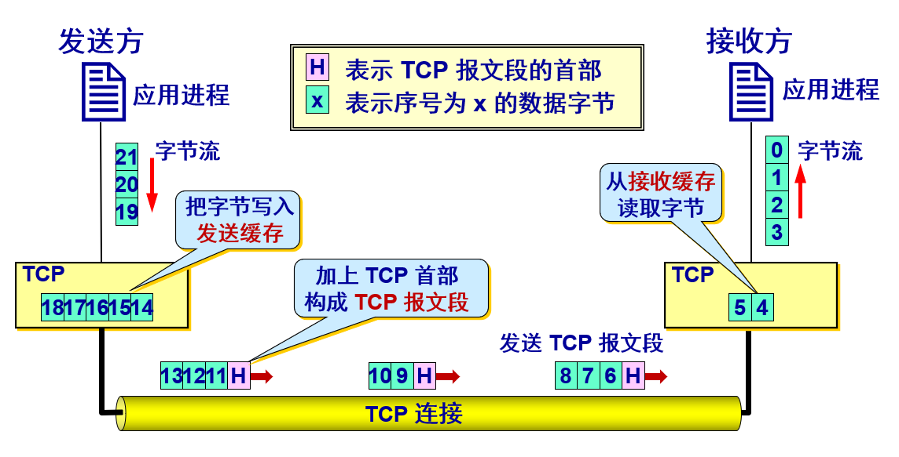
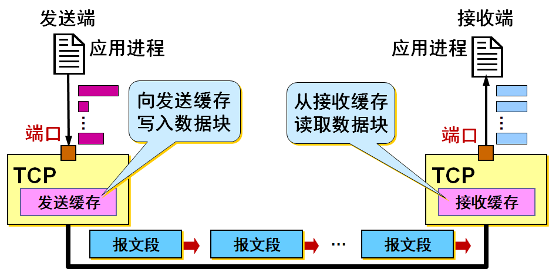
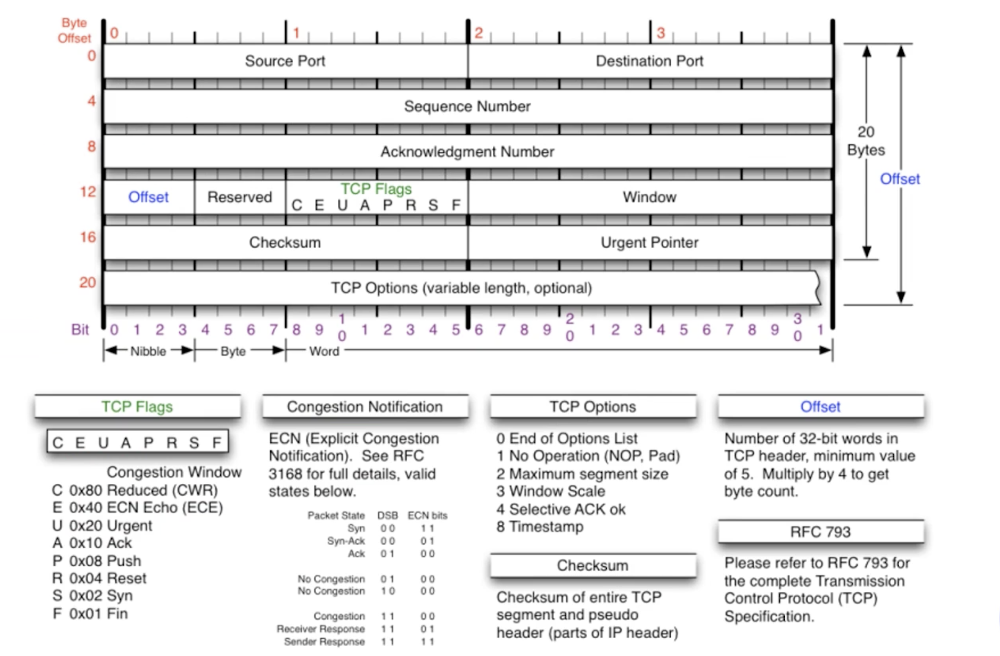

## TCP

-----

`TCP` 提供一种面向连接的、可靠的字节流服务。

- `TCP` 是面向连接的运输层协议，每一条 `TCP` 连接只能有两个端点 `endpoint`，每一条 `TCP` 连接只能是点对点。 
- `TCP` 提供可靠交付的服务，提供全双工通信。
- `TCP` 中的流 `stream` 指的是流入或流出进程的字节序列。
  - **面向字节流**的含义是：虽然应用程序和 `TCP` 的交互是一次一个数据块，但 `TCP` 把应用程序交下来的数据看成仅仅是一连串无结构的字节流。

#### 面向字节流

`TCP` 不保证接收方应用程序所收到的数据块和发送方应用程序所发出的数据块具有对应大小的关系，但接收方应用程序收到的字节流必须和发送方应用程序发出的字节流完全一样。



`TCP` 不关心应用进程一次把多长的报文发送到 `TCP` 缓存，`TCP` 对连续的字节流进行分段，形成 `TCP` 报文段。



#### 注意

`TCP` 连接是一条虚连接而不是一条真正的物理连接，对应用进程一次把多长的报文发送到`TCP` 的缓存中是不关心的。

`TCP` 根据对方给出的窗口值和当前网络拥塞的程度来决定一个报文段应包含多少个字节（`UDP` 发送的报文长度由应用进程给出），可把太长的数据块划分短一些再传送，也可等待积累有足够多的字节后再构成报文段发送出去。 

## TCP 连接

------

`TCP` 把连接作为最基本的抽象，每一条 `TCP` 连接有两个端点，连接的端点不是主机，不是主机的`IP` 地址，不是应用进程，也不是运输层的协议端口。`TCP` 连接的端点叫做套接字 `(socket)` 或插口。

> 端口号拼接到 `(contatenated with) IP` 地址即构成了套接字。  

```go
socket = (IP : PORT)               
```

每一条 TCP 连接唯一地被通信两端的两个端点（即两个套接字）所确定。即：

```go
TCP Connection ::= {socket1, socket2} = {(IP1: port1)，(IP2: port2)}
```

## TCP 报文段

-----

`TCP` 虽然是面向字节流的，但 `TCP` 传送的数据单元却是报文段。一个 `TCP` 报文段分为首部和数据两部分，而 `TCP` 的全部功能都体现在它首部中各字段的作用：

首部的前 `20` 个字节是固定的，后面有 `4n` 字节是根据需要而增加的选项 (`n` 是整数)。因此 `TCP` 首部的最小长度是 `20` 字节。



**源端口和目的端口字段**——各占 2 字节。端口是运输层与应用层的服务接口。运输层的复用和分用功能都要通过端口才能实现。  

------

**序号字段**——占 4 字节。TCP 连接中传送的数据流中的每一个字节都编上一个序号。序号字段的值则指的是本报文段所发送的数据的第一个字节的序号。 

**确认号字段**——占 4 字节，是期望收到对方的下一个报文段的数据的第一个字节的序号。 

------

**数据偏移（即首部长度）**——占 4 位，它指出 TCP 报文段的数据起始处距离 TCP 报文段的起始处有多远。“数据偏移”的单位是 32 位字（以 4 字节为计算单位）。  

**保留字段**——占 6 位，保留为今后使用，但目前应置为 0。

**紧急 URG** —— 当 URG = 1 时，表明紧急指针字段有效。它告诉系统此报文段中有紧急数据，应尽快传送(相当于高优先级的数据)。  

**确认 ACK** —— 只有当 ACK = 1 时确认号字段才有效。当 ACK = 0 时，确认号无效。 

**推送 PSH (PuSH)** —— 接收 TCP 收到 PSH = 1 的报文段，就尽快地交付接收应用进程，而不再等到整个缓存都填满了后再向上交付。  

**复位 RST (ReSeT)** —— 当 RST = 1 时，表明 TCP 连接中出现严重差错（如由于主机崩溃或其他原因），必须释放连接，然后再重新建立运输连接。 

**同步 SYN** —— 同步 SYN = 1 表示这是一个连接请求或连接接受报文。 

**终止 FIN (FINish)** —— 用来释放一个连接。FIN  1 表明此报文段的发送端的数据已发送完毕，并要求释放运输连接。 

**窗口字段** —— 占 2 字节，用来让对方设置发送窗口的依据，单位为字节。

****

**检验和** —— 占 2 字节。检验和字段检验的范围包括首部和数据这两部分。在计算检验和时，*要在 TCP 报文段的前面加上 12 字节的伪首部*。

**紧急指针字段** —— 占 16 位，指出在本报文段中紧急数据共有多少个字节（紧急数据放在本报文段数据的最前面）。  

------

**选项字段** —— 长度可变。TCP 最初只规定了一种选项，即最大报文段长度 MSS。MSS 告诉对方 TCP：“我的缓存所能接收的报文段的数据字段的最大长度是 MSS 个字节。” 

> **MSS (Maximum Segment Size)**是 TCP 报文段中的数据字段的最大长度，数据字段加上 TCP 首部才等于整个的 TCP 报文段。所以，MSS是“TCP 报文段长度减去 TCP 首部长度”。
>
> **为什么要规定 MSS ？**
>
> 若选择较小的 MSS 长度，网络的利用率就降低，当 TCP 报文段只含有 1 字节的数据时，在 IP 层传输的数据报的开销至少有 40 字节(包括 TCP 报文段的首部和 IP 数据报的首部)。这样，对网络的利用率就不会超过 1/41。到了数据链路层还要加上一些开销。
>
> 若 TCP 报文段非常长，那么在 IP 层传输时就有可能要分解成多个短数据报片。在终点要把收到的各个短数据报片装配成原来的 TCP 报文段。当传输出错时还要进行重传。这些也都会使开销增大。
>
> 因此，MSS 应尽可能大些，只要在 IP 层传输时不需要再分片就行。但是由于 IP 数据报所经历的路径是动态变化的，因此在这条路径上确定的不需要分片的 MSS，如果改走另一条路径就可能需要进行分片。
>
> 因此最佳的 MSS 是很难确定的。

**其他选项：**

**窗口扩大选项** ——占 3 字节，其中有一个字节表示移位值 S。新的窗口值等于 TCP 首部中的窗口位数增大到 (16 + S)，相当于把窗口值向左移动 S 位后获得实际的窗口大小。

**时间戳选项**——占 10 字节，其中最主要的字段时间戳值字段（4 字节）和时间戳回送回答字段（4 字节）。

------

**填充字段** —— 这是为了使整个首部长度是 4 字节的整数倍。

## MSS

---------

`TCP`可从缓存中取出并放人报文段中的数据数量受限于最大报文段长度`(MaximumSegmenlSize,MSS)`。`MSS`通常根据最初确定的由本地发送主机发送的最大链路层帧长度(即所谓的`最大传输单元(MaximumTransmissionUnit,MTU)`)来设置。设置该`MSS`要保证一个`TCP报文段`(当封装在一个`IP`数据报中)加上`TCP/IP`首部长度(通常40字节)将适合单个链路层帧。以太网和PPP链路层协议都具有`1500字节`的`MTU`，因此`MSS`的典型值为`1460`字节。