## TCP 可靠传输的实现

--------

上一篇我们介绍了滑动窗口和连续确认协议，`tcp` 可靠传输的基础就是这两个协议，当然 `tcp` 的可靠传输的实现更为复杂，下面具体介绍：

## 发送/接收缓存

------

`tcp` 缓存用来存放 `tcp` 连接发送和接收的数据，缓存中的数据是`tcp`报文段中的数据部分，当有数据要发送时，从发送缓存中取出并且封装发送，当有数据被接收的时候通过报文段的序号找到对应的数据窗口位置进行接收 (拼接)。

**发送缓存：**

发送方的应用进程把字节流写入 `TCP` 的发送缓存，发送缓存用来暂时存放：发送应用程序传送给发送方 `TCP` 准备发送的数据；`TCP` 已发送出但尚未收到确认的数据。

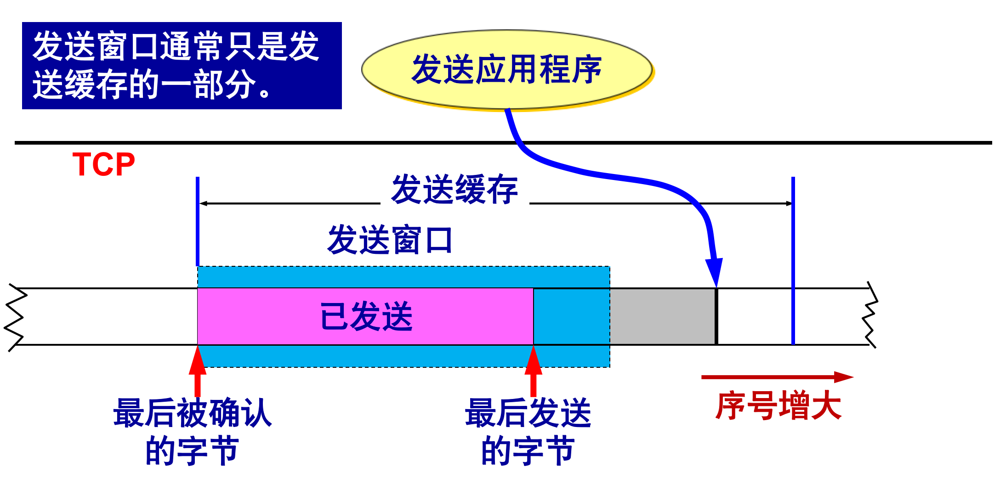

**接收缓存：**

接收方的应用进程从 `TCP` 的接收缓存中读取字节流，接收缓存用来暂时存放：按序到达的、但尚未被接收应用程序读取的数据；不按序到达的数据。 

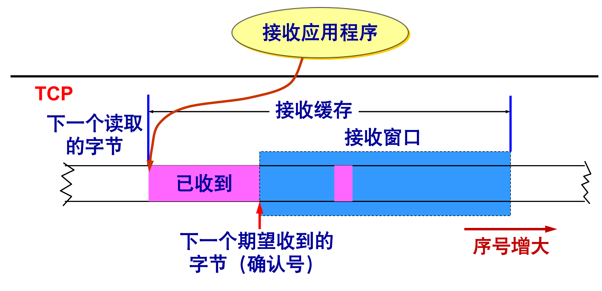

**注意：**

+ `A` 的发送窗口并不总是和 `B` 的接收窗口一样大（因为有一定的时间滞后）。
+ `TCP` 标准没有规定对不按序到达的数据应如何处理。通常是先临时存放在接收窗口中，等到字节流中所缺少的字节收到后，再按序交付上层的应用进程。
+ `TCP` 要求接收方必须有累积确认的功能，这样可以减小传输开销。  
+ 接收方可以在合适的时候发送确认，也可以在自己有数据要发送时把确认信息顺便捎带上。

#### 以字节为单位的滑动窗口

`TCP` 的滑动窗口是以字节为单位的。这里我们不介绍窗口大小的控制，这是流量控制中的内容，我们尽通过一个例子来介绍窗口的细节：

现假定 `A` （`A` 尚未构造自己的窗口）收到了 `B` 发来的确认报文段，其中窗口是 `20` 字节，而确认号是 `31`（这表明 `B` 期望收到的下一个序号是 `31`，而序号 `30` 为止的数据已经收到了），根据这两个数据，`A` 就构造出自己的发送窗口，

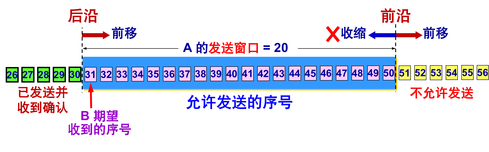

发送窗口表示：在没有收到 `B` 的确认的情况下，`A` 可以连续把窗口内的数据都发送出去，发送窗口里面的序号表示允许发送的序号，显然，窗口越大，发送方就可以在收到对方确认之前连续发送更多的数据，因而可能获得更高的传输效率。

之后 `A` 又发送了 `11` 个字节的数据：

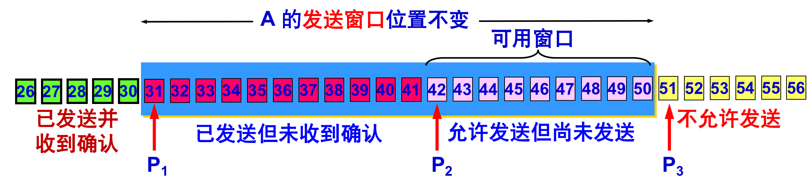

> **小贴士**
>
> + `P3 – P1 = ` A 的发送窗口（又称为通知窗口）
> + `P2 – P1 =` 已发送但尚未收到确认的字节数
> + `P3 – P2 =` 允许发送但尚未发送的字节数（又称为可用窗口）

之后`B` 累计接受到了 `31`、`32`、`33` 于是发送确认号 `34`，之后 `A` 接收到了新的确认号`34`：

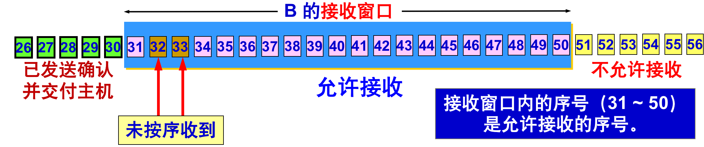

此时 `A` 再次移动他的发送窗口：

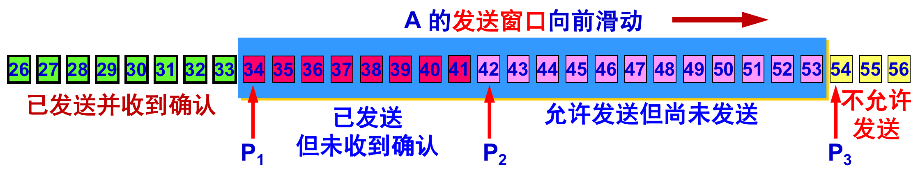

之后 `B` 又陆续接收到了 `37`，`38`，`39`，`B` 会先将他们缓存下来：

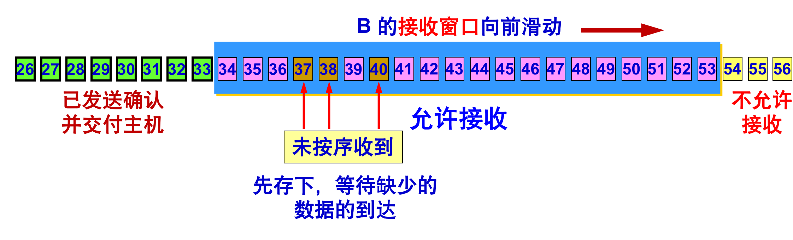

如果 `A` 的发送窗口内的序号都已用完，但还没有再收到确认，必须停止发送。 

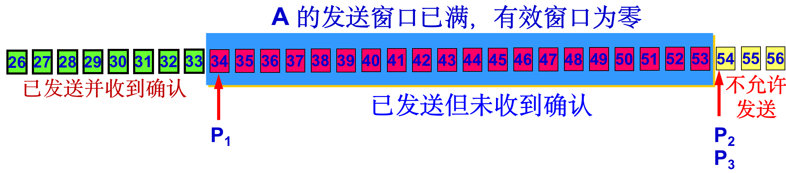

## 超时重传时间的选择

-----

重传机制是 `TCP` 中最重要和最复杂的问题之一，`TCP` 每发送一个报文段，就对这个报文段设置一次计时器。只要计时器设置的重传时间到但还没有收到确认，就要重传这一报文段。

由于 `TCP` 的下层是一个互联网环境，`IP` 数据报所选择的路由变化很大。因而运输层的往返时间 `(RTT)` 的方差也很大。

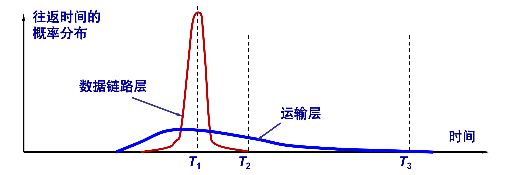

如果把超时重传时间设置得太短，就会引起很多报文段的不必要的重传，使网络负荷增大。但若把超时重传时间设置得过长，则又使网络的空闲时间增大，降低了传输效率。`TCP` 采用了一种自适应算法，它记录一个报文段发出的时间，以及收到相应的确认的时间。这两个时间之差就是报文段的往返时间 `RTT`。

#### 加权平均往返时间 **RTTS**：

`TCP` 保留了 `RTT` 的一个加权平均往返时间 `RTTS`（这又称为平滑的往返时间），第一次测量到 `RTT` 样本时，`RTTS` 值就取为所测量到的 `RTT` 样本值。以后每测量到一个新的 `RTT` 样本，就按下式重新计算一次 `RTTS`：

> 式中`0 < a < 1`。若 `a` 很接近于零，表示 `RTT` 值更新较慢。若选择 `a` 接近于` 1`，则表示` RTT` 值更新较快，`RFC 2988` 推荐的` a` 值为 `1/8`，即 `0.125`。

#### 往返时间的偏差加权平均值 **RTTD**：

`RFC 2988` 建议这样计算 `RTTD`。第一次测量时，`RTTD` 值取为测量到的 `RTT` 样本值的一半。在以后的测量中，则使用下式计算加权平均的 `RTTD`：

> `ß` 是个小于 `1` 的系数，其推荐值是` 1/4`，即 `0.25`。

#### 超时重传时间 **RTO**：

`RTO (Retransmission Time-Out)` 应略大于上面得出的加权平均往返时间 `RTTS`，`RFC 2988` 建议使用下式计算 `RTO`：

#### 往返时间测量 **Karn**：

往返时间 `RTT` 的测量相当复杂 ，某报文段 `1` 没有收到确认。重传该报文段后，收到了确认报文段 `ACK`，如何判定此确认报文段是对原来的报文段的确认，还是对重传的报文段的确认？  

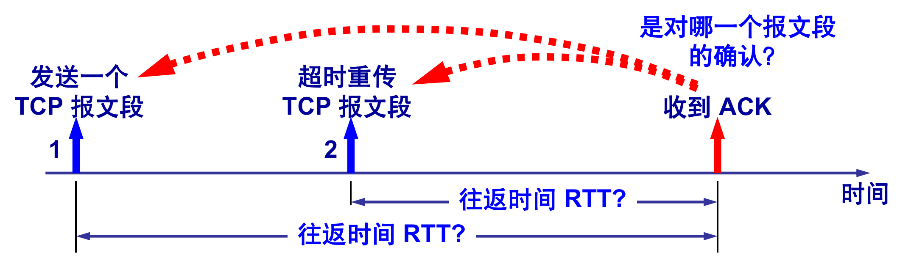

**Karn算法**

对于这种情况一开始 `Karn`算法选择在计算平均往返时间 `RTT` 时，只要报文段重传了，就不采用其往返时间样本，这样得出的加权平均平均往返时间 `RTTS` 和超时重传时间 `RTO` 就较准确。但是，这又引起新的问题。当报文段的时延突然增大了很多时，在原来得出的重传时间内，不会收到确认报文段。于是就重传报文段，根据 `Karn` 算法，不考虑重传的报文段的往返时间样本。这样，超时重传时间就无法更新。

于是 `Karn` 进行了修正：报文段每重传一次，就把 `RTO` 增大一些，当不再发生报文段的重传时，才根据报文段的往返时延更新平均往返时延 `RTT` 和超时重传时间 `RTO` 的数值。

> 系数` µ `的典型值是 `2 `。

## 超时重传

-----

在我们前面研发可靠数据传输技术时，曾假定每一个已发送但未被确认的报文段都与一个定时器相关联，这在概念上是最简单的。虽然这在理论上很好，但定时器的管理却需要相当大的开销。因此，`TCP` 协议遵循了这种单一定时器。

我们先给出一个 `TCP` 发送方的高度简化的描述，该发送方只超时来恢复报文段的丢失;然后再给出一个更全面的描述，该描述中除了使用超时机制外，还使用冗余确认技术，不过冗余确认属于拥塞控制的内容。

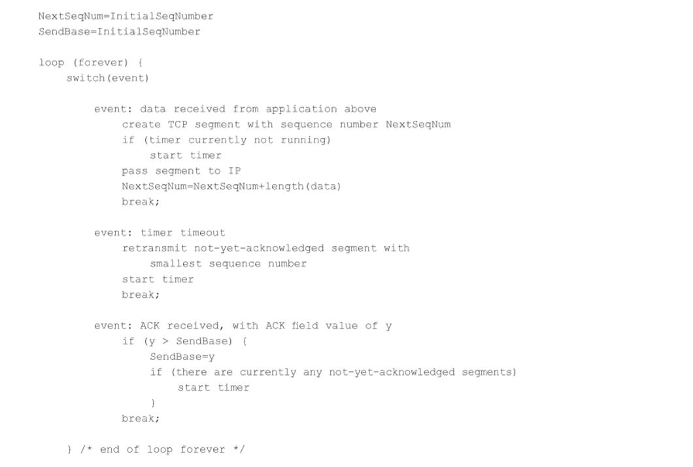

以上是 `tcp` 协议发送端（单向）的伪代码：

1.  首先从上层接受数据之后我们检测数据是否超出窗体限制，若是没有则使 `nextSequence` 序号+数据的长度，如果说没有定时器启动就启动定时器。
2.  之后每一次定时器超时，我们都重新传输最小序号报文段。
3.  最后当接受到确认的 `Ack` 序号为 `y` 之后，说明 `y` 之前的报文段都已被确认，将 `sendBase` 改为 `y` (`y` 需要大于未确认的最小序号)。

第一张图没有什么好说的，只要超过定时器时间限制，就会重新传输第一序号的报文段。

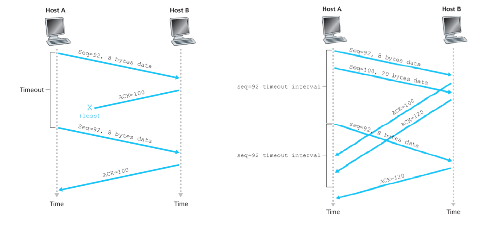

而在第二张图中，第一序号和第二序号超时到达，其间触发了一次第一序号的重传，重传的确认报文到达之后，其实什么也不会发生，由上面伪代码的`if y > SendBase`可以看出。

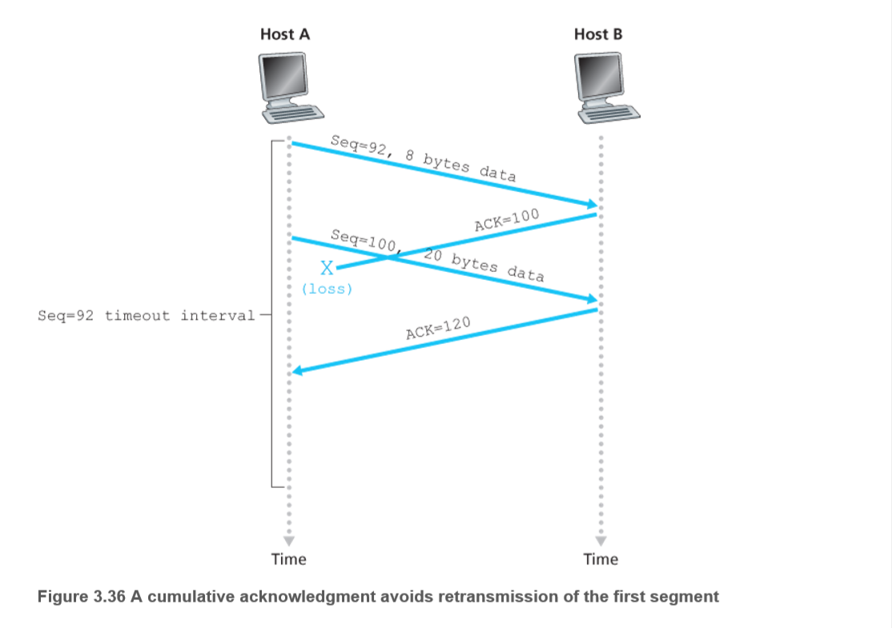

在第三种也是最后一种情况中，假设主机`A`与在第二种情况中完全一样，发送两个报文段。第一个报文段的确认报立在网络丢失，但在超时事件发生之前主机`A`收到一个确认号为`120`的确认报文。主机`A`因而知道主机`B`已经收到了序号为`119`及之前的所有字节;所以主机`A`不会重传这两个报文段中的任何一个。

#### 选择确认

问题：若收到的报文段无差错，只是未按序号，中间还缺少一些序号的数据，那么能否设法只传送缺少的数据而不重传已经正确到达接收方的数据？

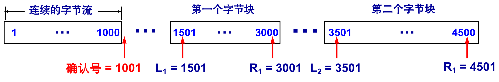

> `TCP` 的接收方在接收对方发送过来的数据字节流的序号不连续，结果就形成了一些不连续的字节块。

**选择确认·SACK**

接收方收到了和前面的字节流不连续的两个字节块，如果这些字节的序号都在接收窗口之内，那么接收方就先收下这些数据，但要把这些信息准确地告诉发送方，使发送方不要再重复发送这些已收到的数据，这就叫选择确认。

如果要使用选择确认，那么在建立 `TCP` 连接时，就要在 `TCP` 首部的选项中加上“允许 `SACK`”的选项，而双方必须都事先商定好。

如果使用选择确认，那么原来首部中的“确认号字段”的用法仍然不变。只是以后在 TCP 报文段的首部中都增加了 SACK 选项，以便**报告收到的不连续的字节块的边界**，由于首部选项的长度最多只有 `40` 字节，而指明一个边界就要用掉 `4` 字节，因此在**选项**中最多只能指明 `4` 个字节块的边界信息。