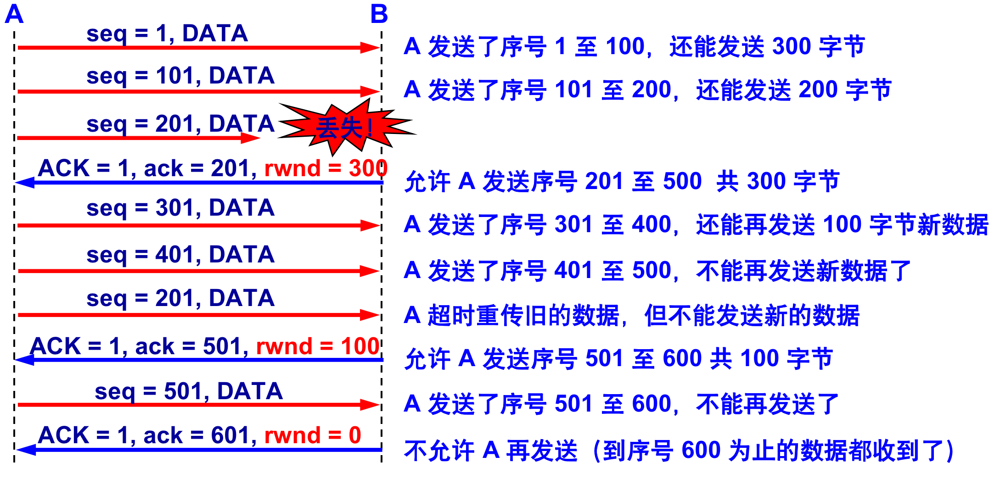
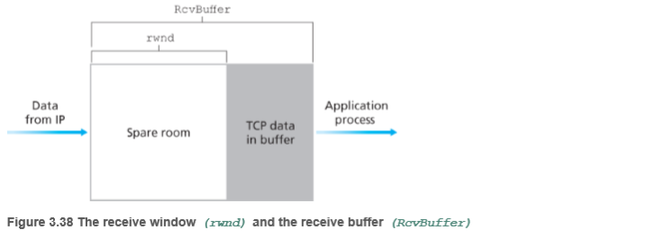

## TCP流量控制

-------

前面讲过，一条`TCP`连接每一侧主机都为该连接设置了接收缓存。主与该`TCP`连接收到正确、按序的字节后，它就将数据放入接收缓存。相关联的应用进程会从该缓存中读取取数据，但不必是数据刚一到达就立即读取。事实上，接收方应用也许正忙于其他任务，甚至要过很长时间后才去读取该数据。如果某应用程序读取数据时相对缓慢，而发送方发送得太多、太快，发送的数据就会很容易地使眩连接的接收缓存溢出。

`TCP`为它的应用程序提供了流量控制服务`(flow control service)`以消除发送方使接收方缓存溢出的可能性。即发送方的发送速率与接收方应用程序的读取速率相匹配。

## 公告窗口

-------

`TCP`通过让发送方维护一个称为接收窗口 `receivewindow` 的**变量**来提供流量控制。通俗地说，接收窗口用于给发送方一个指示一一该接收方还有多少可用的缓存空间。

假设主机`A`通过一条`TCP`连接向主机`B`发送一个大文件主机`B`为该连接分配了一个接收缓存，并用`RcvBuffer`来表示其大小。主机`B`上的应用进程不时地从该缓存中读取数据。我们定义以下变量:

- `LastByteRead`: 主机 `B` 上的应用进程从缓存读出的数据流的最后一个字节的编号。
- `LastByteRcvd`: 从网络中到达的并且已放人主机 `B` 接收缓存巾的数据流的最后一个字节的编号。

由于 `TCP` 不允许已分配的缓存溢出，下式必须成立:
$$
LasLByteRcvd-LastByteRead<RcvBuffer
$$
接收窗口用 `rwnd` 表示，根据缓存可用空间的数量来设置:
$$
rwnd=RcvBuffer-[LastByteRcvd-LastßyteRead]
$$
由于该空间是随着时间变化的，所以 `rwnd` 是动态的。

主机 `A` 轮流跟踪两个变量，`LastByteSent` 和 `LastByteAcked`，这两个变量的意义很明显。注意到这两个变量之间的差 `LastByteSent-LastByteAcked` 满足：
$$
LastByteSent - LastByteAcked < rwnd
$$
对于这个方案还存在一个小小的技术问题。为了理解这一点，假设主机`B`的接收缓存已经存满，使得`rwnd=0`。在将`rwnd=0`公告给主机`A`之后，还要假设主机`B`没有任何数据要发给主机`A`。此时，考虑会发生什么情况。因为主机`B`上的应用进程将缓存清空，`TCP`并不向主机`A`发送带有`rwnd`新值的新报文段;

事实上，`TCP`仅当在它有数据或有确认要发时才会发送报文段给主机`A`。这样，主机`A`不可能知道主机`B`的接收缓存已经有新的空间了，即主机`A`被阻塞而不能再发送数据`!`为了解决这个问题，`TCP`规范中要求:当主机`B`的接收窗口为`0`时，主机`A`继续发送只有一个字节数据的报文段。这些报文段将会被接收方确认。最终缓存将开始清空，并且确认报文里将包含一个非`0`的`nvnd`值。 

#### 死锁和计时器

`B` 向 `A` 发送了零窗口的报文段后不久，`B` 的接收缓存又有了一些存储空间。于是 `B` 向 `A` 发送了 `rwnd = 400` 的报文段，但这个报文段在传送过程中丢失了。`A` 一直等待收到 `B` 发送的非零窗口的通知，而 `B` 也一直等待 `A` 发送的数据。

如果没有其他措施，这种互相等待的死锁局面将一直延续，为了解决问题，TCP 每一个连接设有一个持续计时器 `(persistence timer)`，只要 TCP 连接的一方收到对方的零窗口通知，就启动持续计时器，若持续计时器设置的时间到期，就发送一个零窗口探测报文段（仅携带 `1` 字节的数据），而对方就在确认这个探测报文段时给出了现在的窗口值。

若窗口仍然是零，则收到这个报文段的一方就重新设置持续计时器，若窗口不是零，则死锁的僵局就可以打破了。 

## 报文发送时机

-------

可以用不同的机制来控制 `TCP` 报文段的发送时机：

- 第一种机制是 `TCP` 维持一个变量，它等于最大报文段长度 `MSS`。只要缓存中存放的数据达到 `MSS` 字节时，就组装成一个 `TCP` 报文段发送出去。
- 第二种机制是由发送方的应用进程指明要求发送报文段，即 `TCP` 支持的推送 `(push)` 操作 `PSH` 字段。
- 第三种机制是发送方的一个计时器期限到了，这时就把当前已有的缓存数据装入报文段（但长度不能超过 `MSS`）发送出去。

#### MSS

`TCP`可从缓存中取出并放人报文段中的数据数量受限于最大报文段长度`(MaximumSegmenlSize,MSS)`。`MSS`通常根据最初确定的由本地发送主机发送的最大链路层帧长度(即所谓的最大传输单元 `MTU`)来设置。设置该`MSS`要保证一个`TCP报文段`(当封装在一个`IP`数据报中)加上`TCP/IP`首部长度(通常40字节)将适合单个链路层帧。以太网和PPP链路层协议都具有`1500字节`的`MTU`，因此`MSS`的典型值为`1460`字节。

#### PUSH

发送方使用该标志通知接收方将所收到的数据全部提交给接收进程。这里的数据包括与`PUSH`一起传送的数据以及接收方`TCP`已经为接收进程收到的其他数据。

在最初的`TCP`规范中，一般假定编程接口允许发送进程告诉它的`TCP`何时设置`PUSH`标志。例如，在一个交互程序中，当客户发送一个命令给服务器时，它设置`PUSH`标志并停下来等待服务器的响应。通过允许客户应用程序通知其`TCP`设置`PUSH`标志，客户进程通知`TCP`在向服务器发送一个报文段时不要因等待额外数据而使已提交数据在缓存中滞留。类似地，当服务器的`TCP`接收到一个设置了`PUSH`标志的报文段时，它需要立即将这些数据递交给服务器进程而不能等待判断是否还会有额外的数据到达。

然而，目前大多数的`API`没有向应用程序提供通知其`TCP`设置`PUSH`标志的方法。的确，许多实现程序认为`PUSH`标志已经过时，一个好的`TCP`实现能够自行决定何时设置这个标志。

如果待发送数据将清空发送缓存，则大多数的源于伯克利的实现能够自动设置`PUSH`标志。这意味着我们能够观察到每个应用程序写的数据均被设置了`PUSH`标志，因为数据在写的时候就立即被发送。

## 糊涂窗口综合征

-------

糊涂窗口综合症（`Silly window syndrome`），亦称愚蠢窗口综合症、愚笨窗口综合症，是`TCP`流量控制实现不良导致的一种计算机网络问题。当发送程序缓慢地生产数据，接收程序缓慢地消耗数据，或者两者同时存在时，滑动窗口运作会出现严重问题。

如果一个服务器无法处理所有传入的数据而存在此问题，它会要求客户端减少一次发送的数据量（`TCP`网络数据包的滑动窗口）。如果服务器仍然无法处理所有传入的数据，**窗口会随此问题越来越小，有时甚至将使传输数据小于数据包头，使数据传输变得极为低效。这个问题的名字取自窗口缩小到“愚蠢”的值**。

该现象可发生在两端中的任何一端：接收方可以通告一个小的窗口（而不是一直等到有大的窗口时才通告），而发送方也可以发送少量的数据（而不是等待其他的数据以便发送一个大的报文段）。可以在任何一端采取措施避免出现糊涂窗口综合症的现象。

- **接收方** 不通告小窗口。通常的算法是接收方不通告一个窗口，除非窗口可以增加一个报文段大小（也就是将要接收的 `MSS`）或者可以增加接收方缓存空间的一半，不论实际有多少。
- **发送方** 避免出现糊涂窗口综合症的措施是只有以下条件之一满足时才发送数据：
  + 可以发送一个满长度的报文段；
  + 可以发送至少是接收方通告窗口大小一半的报文段；
  + 可以发送任何数据并且不希望接收 `ACK`（也就是说，我们没有还未被确认的数据）或者该连接上不能使用 `Nagle` 算法。

#### 发送方糊涂窗口综合症

在一个`Rlogin`连接上客户一般每次发送一个字节到服务器，这就产生了一些`41`字节长的分组：`20`字节的`IP`首部、`20`字节的`TCP`首部和`1`个字节的数据。在局域网上，这些小分组（被称为微小分组（`tinygram`））通常不会引起麻烦，因为局域网一般不会出现拥塞。但在广域网上，这些小分组则会增加拥塞出现的可能。

发送方 `TCP` 每次接收到一字节的数据后就发送，这样，发送一个字节需要形成 `41` 字节长的 `IP` 数据报。若接收方确认，并回送这一字节，就需传送总长度为 `162` 字节共 `4` 个报文段。效率很低。

一种简单和好的方法就是采用`RFC 896` [`Nagle 1984`]中所建议的`Nagle`算法。

**解决方案：Nagle算法**

`Nagle`算法的做法是：将要发送的小包合并，并延缓发送。延缓后的发送策略是，收到前一个发送出去的包的`ACK`确认包，或者一定时间后，收集了足够数量的小数据包。

该算法要求一个`TCP`连接上最多只能有一个未被确认的未完成的小分组，在该分组的确认到达之前不能发送其他的小分组。相反，`TCP`收集这些少量的分组，并在确认到来时以一个分组的方式发出去。该算法的优越之处在于它是自适应的：确认到达得越快，数据也就发送得越快。

`Nagle`算法的目的是减少发送小包的数量，从而减小带宽，并提高网络吞吐量，付出的代价是有时会增加服务的延时。（译者`yoko`注：补充解释一下为什么减少小包的数量可以减小带宽。因为每个`TCP`包，除了包体中包含的应用层数据外，外层还要套上`TCP`包头和`IP`包头。由于应用层要发送的业务数据量是固定的，所以包数量越多，包头占用的带宽也越多）

若发送应用进程把要发送的数据逐个字节地送到 `TCP` 的发送缓存，则发送方就把第一个数据字节先发送出去，把后面到达的数据字节都缓存起来，当发送方收到对第一个数据字符的确认后，再把发送缓存中的所有数据组装成一个报文段发送出去，同时继续对随后到达的数据进行缓存。

只有在收到对前一个报文段的确认后才继续发送下一个报文段，或**者当到达的数据已达到发送窗口大小的一半或已达到报文段的最大长度时**，就立即发送一个报文段。

有时我们也需要关闭`Nagle`算法。一个典型的例子是`X`窗口系统服务器：小消息（鼠标移动）必须无时延地发送，以便为进行某种操作的交互用户提供实时的反馈。

#### 接收方糊涂窗口综合症

当接收方的 `TCP` 缓冲区已满，接收方会向发送方发送窗口大小为 `0` 的报文。若此时接收方的应用进程以交互方式每次只读取一个字节，于是接收方又发送窗口大小为一个字节的更新报文，发送方应邀发送一个字节的数据（发送的 `IP` 数据报是 `41` 字节长），于是接收窗口又满了，如此循环往复。

**解决方案：等待**

让接收方等待一段时间，使得或者接收缓存已有足够空间容纳一个最长的报文段，或者等到接收缓存已有一半空闲的空间。只要出现这两种情况之一，接收方就发出确认报文，并向发送方通知当前的窗口大小。

