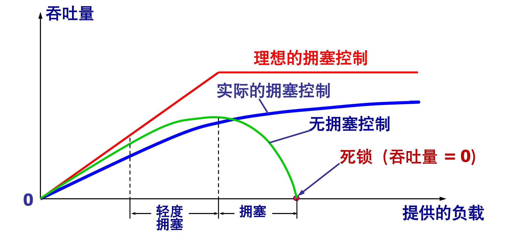
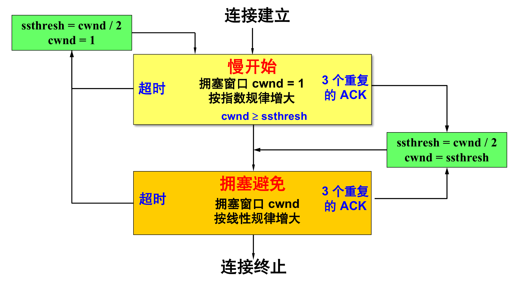
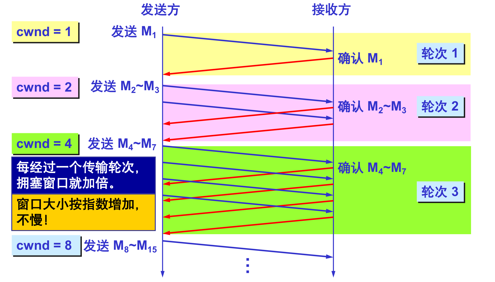
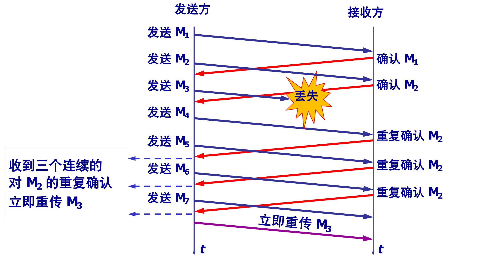
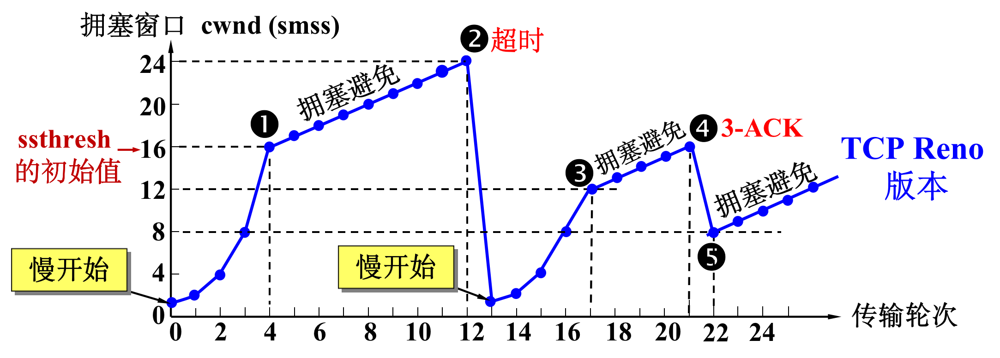
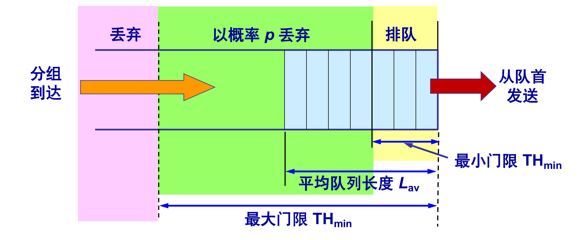
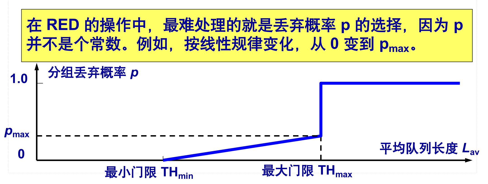

## 拥塞

------

某段时间，对网络中某资源的需求超过了该资源所能提供的可用部分，网络性能就要变坏，这种现象称为拥塞 `(congestion)`，若网络中有许多资源同时产生拥塞，网络的性能就要明显变坏，整个网络的吞吐量将随输入负荷的增大而下降。

增大缓存，但未提高输出链路的容量和处理机的速度，排队等待时间将会大大增加，引起大量超时重传，解决不了网络拥塞；

而如果一个路由器没有足够的缓存空间，它就会丢弃一些新到的分组，但当分组被丢弃时，发送这一分组的源点就会重传这一分组，甚至可能还要重传多次。这样会引起更多的分组流入网络和被网络中的路由器丢弃，可见拥塞引起的重传并不会缓解网络的拥塞，反而会加剧网络的拥塞。

> 和流量控制不同的是，拥塞控制是防止过多的数据注入到网络中，使网络中的路由器或链路不致过载，是一个全局性的过程，涉及到所有的主机、所有的路由器，以及与降低网络传输性能有关的所有因素。

#### 拥塞判断

拥塞的判断一般有以下两种标准，处理的方式也各有不同。

**1.重传定时器超时：**

现在通信线路的传输质量一般都很好，因传输出差错而丢弃分组的概率是很小的（远小于 `1%` ）。只要出现了超时，就可以猜想网络可能出现了拥塞。

**2.收到三个相同（重复）的 ACK：**

个别报文段会在网络中丢失，预示可能会出现拥塞（实际未发生拥塞），因此可以尽快采取控制措施，避免拥塞。

## TCP 拥塞控制方法

------

`TCP` 采用基于窗口的方法进行拥塞控制，该方法属于闭环控制方法。

`TCP` 发送方维持一个拥塞窗口 `CWND (Congestion Window) `拥塞窗口的大小取决于网络的拥塞程度，并且动态地在变化，发送端利用拥塞窗口根据网络的拥塞情况调整发送的数据量。

所以，发送窗口大小不仅取决于接收方公告的接收窗口，还取决于网络的拥塞状况，所以真正的发送窗口值为：

只要网络没有出现拥塞，拥塞窗口就可以再增大一些，以便把更多的分组发送出去，这样就可以提高网络的利用率，但只要网络出现拥塞或有可能出现拥塞，就必须把拥塞窗口减小一些，以减少注入到网络中的分组数，以便缓解网络出现的拥塞。

#### TCP拥塞控制算法：

我们知道了发送窗口的计算公式，那么拥塞窗口如何计算，`TCP` 拥塞窗口的计算有四种算法共同作用：

**慢开始 (slow-start)：**

慢开始用来确定网络的负载能力，其算法的思路是`由小到大逐渐增大拥塞窗口数值`，初始拥塞窗口 `cwnd` 设置，在刚开始发送报文段时，先把初始拥塞窗口 `cwnd` 设置为不超过`2至4个发送方的最大报文段 SMSS (Sender Maximum Segment Size) ` 数值。

在每收到一个对新的报文段的确认后，可以把拥塞窗口增加最多一个 `SMSS` 的数值，其中 `N` 是原先未被确认的、但现在被刚收到的确认报文段所确认的字节数，当 `N < SMSS` 时，拥塞窗口每次的增加量要小于 `SMSS`。

使用慢开始算法后，每经过一个`传输轮次 (transmission round)`，拥塞窗口` cwnd` 就加倍，一个传输轮次所经历的时间其实就是往返时间 `RTT`。对于一个传输轮次更精确的描述为：把拥塞窗口` cwnd `所允许发送的报文段都连续发送出去，并收到了对已发送的最后一个字节的确认。

为了防止拥塞窗口`cwnd` 增长过大引起网络拥塞，慢启动中`cwnd`有一个慢开始门限 `ssthresh`（状态变量）：

1. 当 `cwnd < ssthresh` 时，使用慢开始算法。
2. 当 `cwnd > ssthresh` 时，停止使用慢开始算法而改用拥塞避免算法。
3. 当 `cwnd = ssthresh `时，既可使用慢开始算法，也可使用拥塞避免算法。

**拥塞避免 (congestion avoidance)：**

拥塞避免不同于慢启动的指数级别增长，而是让拥塞窗口` cwnd` 缓慢地增大，即每经过一个往返时间 `RTT` 就把发送方的拥塞窗口 `cwnd` 加 1，而不是加倍，使拥塞窗口 `cwnd `按线性规律缓慢增长。

无论在慢开始阶段还是在拥塞避免阶段，只要发送方判断网络出现拥塞（重传定时器超时），就执行以下步骤：

1. `ssthresh = max(cwnd/2，2)`
2. `cwnd = 1`
3. 执行慢开始算法

这样做的目的就是要迅速减少主机发送到网络中的分组数，使得发生拥塞的路由器有足够时间把队列中积压的分组处理完毕。 

**快重传算法：**

采用快重传`FR (Fast Retransmission) `算法可以让发送方尽早知道发生了个别报文段的丢失，算法首先要求接收方不要累计确认，而是要立即发送确认，即使收到了失序的报文段也要立即发出对**已收到的报文段**的重复确认。

发送方只要一连收到三个重复确认，就知道接收方确实没有收到报文段，因而应当立即进行重传，这样就不会出现超时，发送方也不就会误认为出现了网络拥塞，使用快重传可以使整个网络的吞吐量提高约 `20%`。 

**快恢复算法：**

当发送端收到连续三个重复的确认时，由于发送方现在认为网络很可能没有发生拥塞，因此现在不执行慢开始算法，而是执行快恢复算法 `FR (Fast Recovery) `算法：

1. 慢开始门限 `ssthresh = 当前拥塞窗口 cwnd / 2` ；
2. 新拥塞窗口 `cwnd = 慢开始门限 ssthresh` ；
3. 开始执行拥塞避免算法，使拥塞窗口缓慢地线性增大。

------

当 TCP 连接进行初始化时，将拥塞窗口置为 1，图中的窗口单位不使用字节而使用报文段，慢开始门限的初始值设置为 16 个报文段，即 `ssthresh = 16`，我们假定接收端窗口足够大，因此现在发送窗口的数值等于拥塞窗口的数值。

发送方每收到一个对新报文段的确认 ACK，就把拥塞窗口值加 1，然后开始下一轮的传输（请注意，横坐标是传输轮次，不是时间）。因此拥塞窗口 cwnd 随着传输轮次按指数规律增长。

当拥塞窗口` cwnd` 增长到慢开始门限值 `ssthresh` 时（图中的点 ①，此时拥塞窗口`cwnd = 16`），就改为执行拥塞避免算法，拥塞窗口按线性规律增长。

当拥塞窗口 `cwnd = 24` 时，网络出现了超时（图中的点②），发送方判断为网络拥塞。于是调整门限值 `ssthresh = cwnd / 2 = 12`，同时设置拥塞窗口 `cwnd = 1`，重新进入慢开始阶段。

按照慢开始算法，发送方每收到一个对新报文段的确认ACK，就把拥塞窗口值加1，当拥塞窗口`cwnd = ssthresh = 12`时（图中的点③，这是新的`ssthresh`值），改为执行拥塞避免算法，拥塞窗口按线性规律增大。

当拥塞窗口`cwnd = 16`时（图中的点④），出现了一个新的情况，就是发送方一连收到 3 个对同一个报文段的重复确认（图中记为3-ACK），发送方知道现在只是丢失了个别的报文段。于是不启动慢开始，而是执行快恢复算法。这时，发送方调整门限值`ssthresh = cwnd / 2 = 8`，同时设置拥塞窗口`cwnd = ssthresh = 8`（见图中的点⑤），并开始执行拥塞避免算法。

## 网络层与拥塞控制

-------

`TCP` 拥塞控制还和网络层采取的策略有密切联系，网络层的策略对 `TCP` 拥塞控制影响最大的就是路由器的分组丢弃策略。

#### 网络层对拥塞控制的影响：

**FIFO 处理规则：**

路由器的队列通常都是按照`FIFO (First In First Out) `的规则处理到来的分组。当队列已满时，以后再到达的所有分组（如果能够继续排队，这些分组都将排在队列的尾部）将都被丢弃。这就叫做`尾部丢弃策略 (tail-drop policy)`。

路由器的尾部丢弃往往会导致一连串分组的丢失，这就使发送方出现超时重传，使 TCP 进入拥塞控制的慢开始状态，结果使 TCP 连接的发送方突然把数据的发送速率降低到很小的数值。

**全局同步：**

更为严重的是，在网络中通常有很多的 `TCP` 连接，这些连接中的报文段通常是复用在网络层的 `IP` 数据报中传送的，在这种情况下，若发生了路由器中的尾部丢弃，就可能会同时影响到很多条 `TCP` 连接，结果使这许多 `TCP` 连接在同一时间突然都进入到慢开始状态。这在 `TCP` 的术语中称为全局同步 `(global syncronization)`。

全局同步使得全网的通信量突然下降了很多，而在网络恢复正常后，其通信量又突然增大很多。

#### 主动队列管理AQM：

`1998`年提出了主动队列管理 `AQM (Active Queue Management)`，所谓“主动”就是不要等到路由器的队列长度已经达到最大值时才不得不丢弃后面到达的分组。这样就太被动了。应当在队列长度达到某个值得警惕的数值时（即当网络拥塞有了某些拥塞征兆时），就主动丢弃到达的分组。

`AQM` 可以有不同实现方法，其中曾流行多年的就是随机早期检测 `RED (Random Early Detection)`。

**随机早期检测 RED (Random Early Detection)**

使路由器的队列维持两个参数：队列长度最小门限 `THmin` 和最大门限 `Thmax`，对每一个到达的分组都先计算平均队列长度 `LAV`：

1. 若平均队列长度小于最小门限 THmin，则将新到达的分组放入队列进行排队。
2. 若平均队列长度超过最大门限 THmax，则将新到达的分组丢弃。
3. 若平均队列长度在最小门限 THmin 和最大门限THmax 之间，则按照某一概率 p 将新到达的分组丢弃。

丢弃概率 `p` 与 `THmin` 和 `Thmax` 的关系：

1. 当 `LAV <` `Thmin` 时，丢弃概率 `p = 0`；
2. 当 `LAV >` `Thmax` 时，丢弃概率 `p = 1`
3. 当 `THmin <` `LAV <` `THmax`时，`0 <` `p <` `1` 。

多年的实践证明，`RED` 的使用效果并不太理想，`2015`年公布的 `RFC 7567` 已经再推荐使用 `RED`，现在已经有几种不同的算法来代替旧的 `RED`，但都还在实验阶段。

