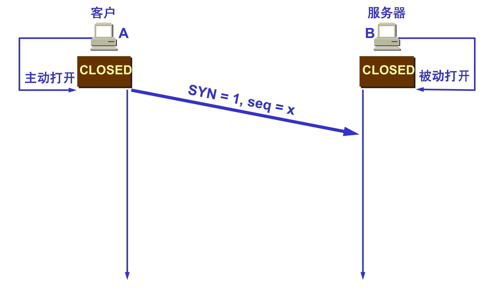
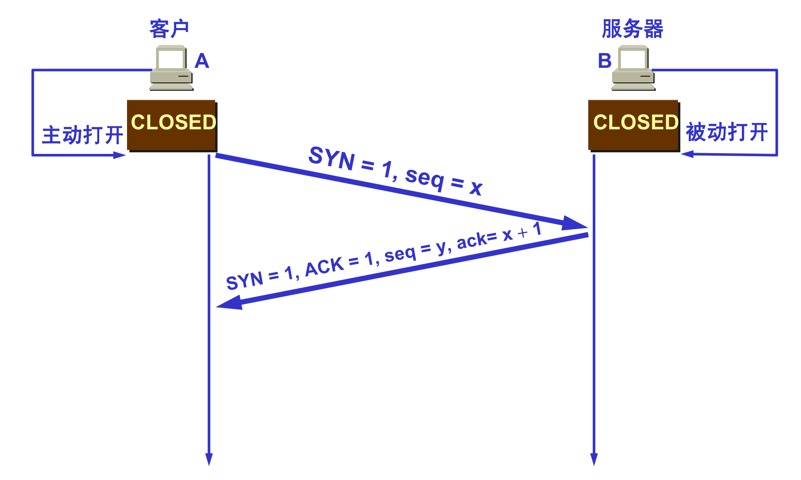
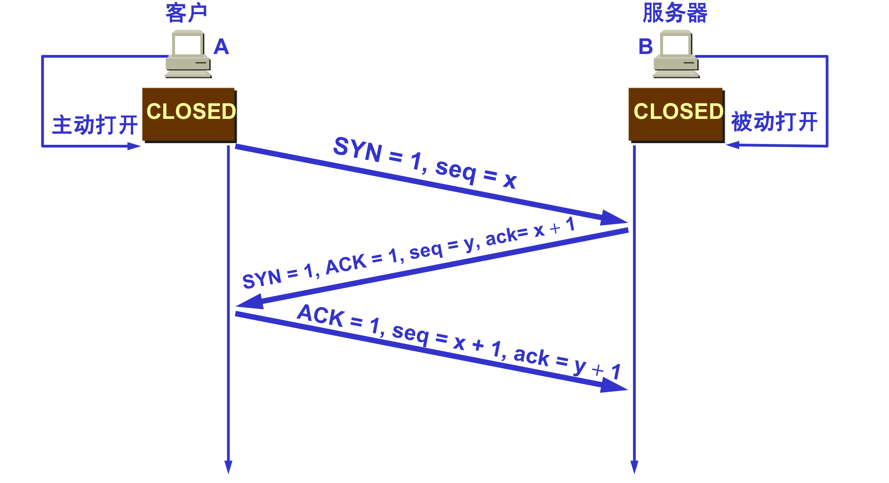
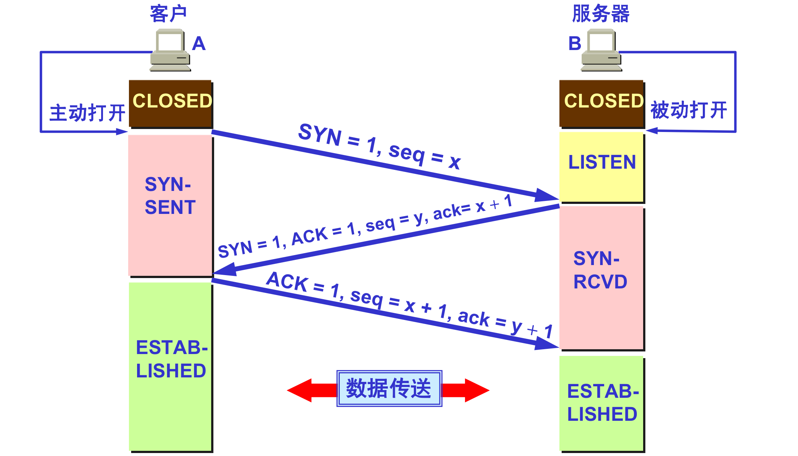
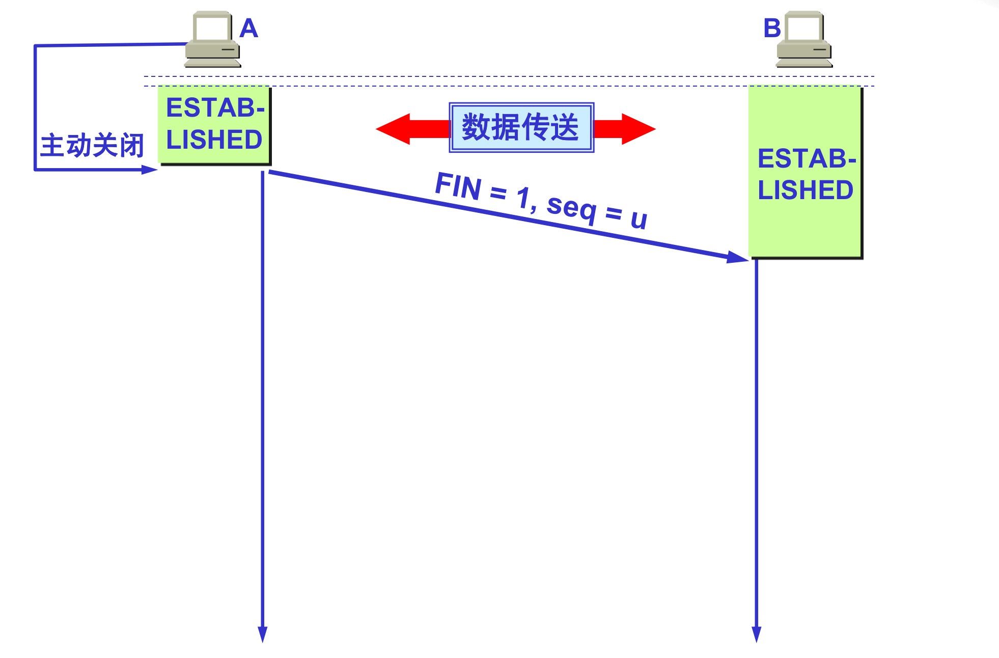
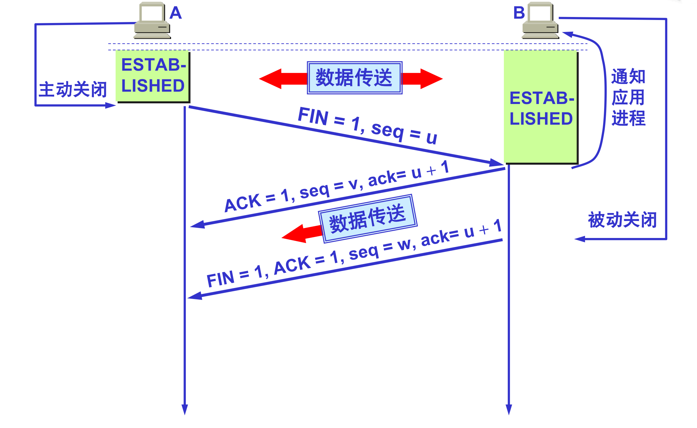
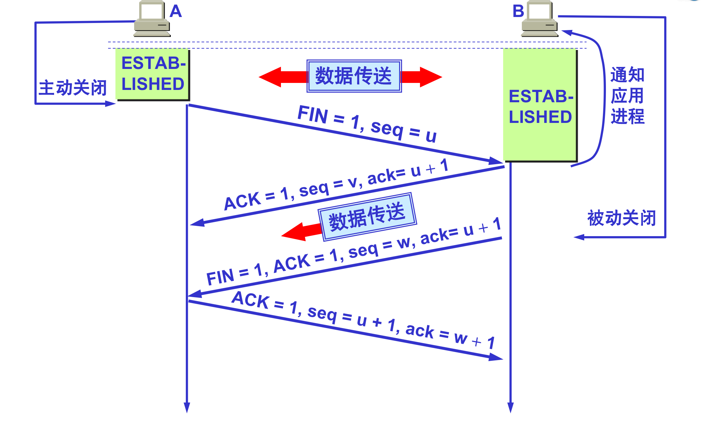
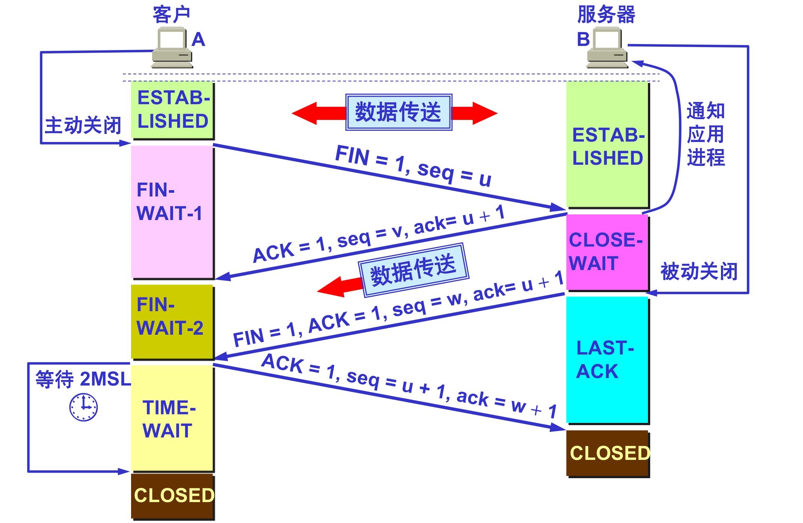
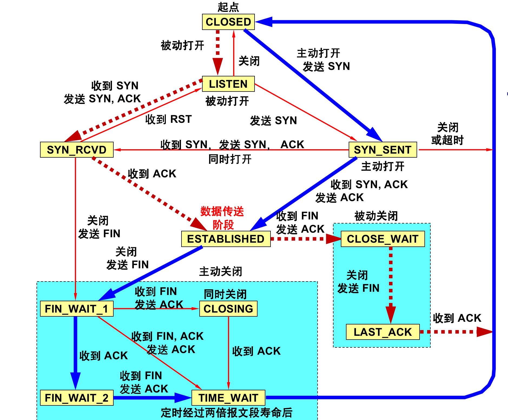

## TCP连接管理

------

TCP 是面向连接的协议，运输连接有三个阶段：`连接建立`、`数据传送`、`连接释放`，运输连接的管理就是使运输连接的建立和释放都能正常地进行。

#### 连接建立

要使每一方能够确知对方的存在，要允许双方协商一些参数（如最大窗口值、是否使用窗口扩大选项和时间戳选项以及服务质量等），能够对运输实体资源（如缓存大小、连接表中的项目等）进行分配。

`TCP` 建立连接的过程叫做握手，握手需要在客户和服务器之间交换三个 `TCP` 报文段。称之为三报文握手，采用三报文握手主要是为了防止已失效的连接请求报文段突然又传送到了，因而产生错误。

**三次握手：**

`SYN` 同步序列编号（`Synchronize Sequence Numbers`）

`ACK` 确认字符 (`Acknowledge character`）

客户端的`TCP`首先向服务器端的TCP发送一个特殊的`TCP`报文段。该报文段中不包含应用层数据。但是在报文段的首部中的一个标志位 `SYN` 被置为 `1`，客户会随机地选择一个初始序号`(client_isn)`，并将此编号放置于该起始的`SYN`报文段的序号字段中。

服务器会从该数据报中提取出`TCPSYN`报文段，为该`TCP`连接分配`TCP`缓存和变量，并向该客户`TCP`发送允许连接的报文段。这个允许连接的报文段也不包含应用层数据。首先，`SYN` 比特被置为 `1`，该` TCP` 报文段首部的确认号字段被置为 `client_ isn + 1 `。最后，服务器选择自己的初始序号` (server_isn)`，并将其放置到 `TCP` 报文段首部的序号宇段中。

 

在收到 `SYNACK` 报文段后，客户也要给该连接分配缓存和变量。客户主机则向服务器发送最后一个报文段对服务器的允许连接的报文段进行了确认(该客户通过将值 `server_isn + 1` 放置到`TCP`报文段首部的`ack`字段)。 因为连接已经建立了，所以该 `SYN`比特被置为 `0`，三次握手的第三个阶段可以在报文段负载中携带客户到服务器的数据。

采用三报文握手建立 `TCP` 连接的各状态 ：

#### 连接释放

`TCP` 连接释放过程比较复杂，数据传输结束后，通信的双方都可释放连接，`TCP` 连接释放过程是四报文握手。

`FIN` 结束序列编号 `FINISH Sequence number`

**四次挥手：**

数据传输结束后，通信的双方都可释放连接，现在 `A` 的应用进程先向其 `TCP` 发出连接释放报文段，并停止再发送数据，主动关闭 `TCP `连接，`A` 把连接释放报文段首部的 `FIN = 1`，其序号 `seq = u`，等待 B 的确认。

`B`发出确认，确认号 `ack = u + 1`，而这个报文段自己的序号 `seq = v`，TCP 服务器进程通知高层应用进程。从 A 到 B 这个方向的连接就释放了，`TCP` 连接处于半关闭状态。`B `若发送数据，`A `仍要接收，若 `B` 已经没有要向 `A` 发送的数据，其应用进程就通知 `TCP` 释放连接。 

`A` 收到连接释放报文段后，必须发出确认，确认报文段中 `ACK = 1`，确认号 `ack = w + 1`，自己的序号 `seq = u + 1`。 

`TCP` 连接必须经过时间 `2MSL` 后才真正释放掉，以下是`TCP`连接释放的状态图：

之所以等待`2MSL`是为了保证 `A` 发送的最后一个 `ACK` 报文段能够到达 `B`，并且防止 “已失效的连接请求报文段”出现在本连接中。`A` 在发送完最后一个 `ACK` 报文段后，再经过时间 `2MSL`，就可以使本连接持续的时间内所产生的所有报文段，都从网络中消失。这样就可以使下一个新的连接中不会出现这种旧的连接请求报文段。

**状态变迁图**

