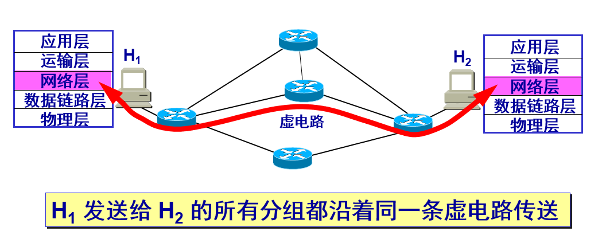
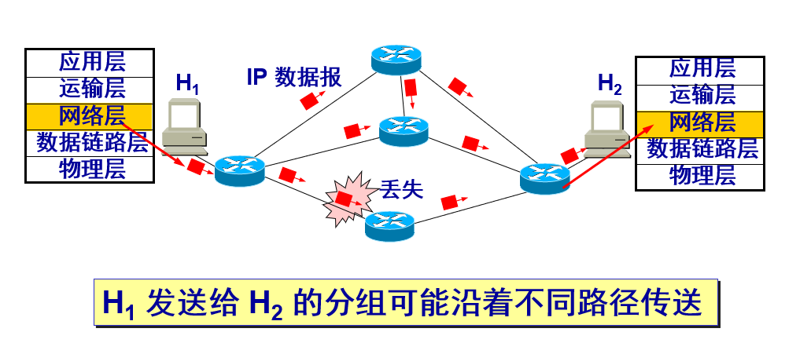
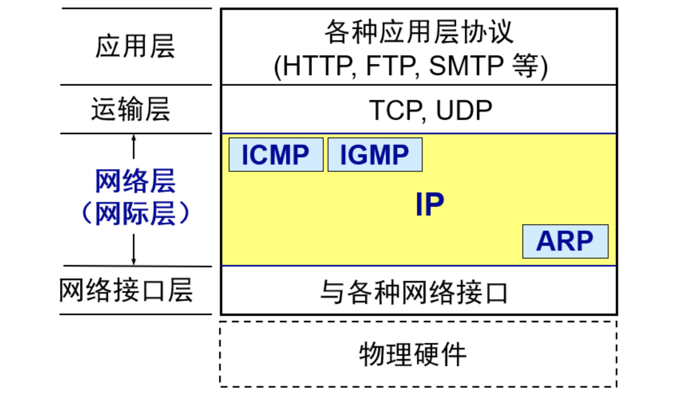
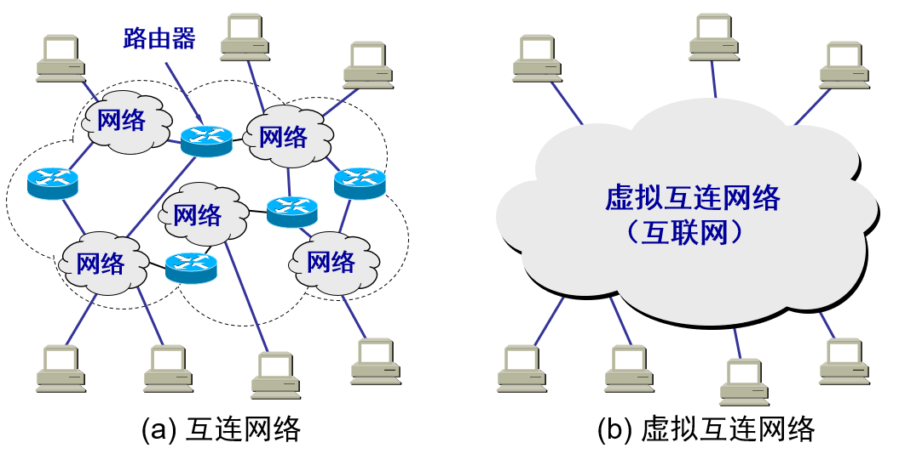
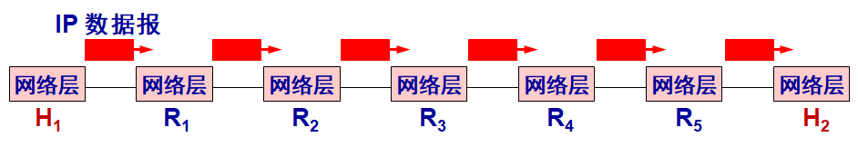

## 概述

------

在计算机网络领域，网络层应该向运输层提供怎样的服务 (面向连接还是无连接) 曾引起了长期的争论。争论焦点的实质就是：在计算机通信中，可靠交付应当由谁来负责？是网络还是端系统？ 

#### 虚电路

第一种观点认为，应借助于电信网的成功经验，让网络负责可靠交付，计算机网络应模仿电信网络，使用面向连接的通信方式。通信之前先建立虚电路 `(Virtual Circuit)`，以保证双方通信所需的一切网络资源。 如果再使用可靠传输的网络协议，就可使所发送的分组无差错按序到达终点，不丢失、不重复。

虚电路表示这只是一条逻辑上的连接，分组都沿着这条逻辑连接按照存储转发方式传送，而并不是真正建立了一条物理连接。请注意，电路交换的电话通信是先建立了一条真正的连接。因此分组交换的虚连接和电路交换的连接只是类似，但并不完全一样。 

#### 数据报服务

互联网的先驱者提出了一种崭新的网络设计思路。

**网络层向上只提供简单灵活的、无连接的、尽最大努力交付的数据报服务。**网络在发送分组时不需要先建立连接。每一个分组 (`IP` 数据报) 独立发送，与其前后的分组无关，不进行编号。
网络层不提供服务质量的承诺。即所传送的分组可能出错、丢失、重复和失序（不按序到达终点），当然也不保证分组传送的时限。

由于传输网络不提供端到端的可靠传输服务，这就使网络中的路由器可以做得比较简单，而且价格低廉（与电信网的交换机相比较）。如果主机（即端系统）中的进程之间的通信需要是可靠的，那么就由网络的主机中的运输层负责可靠交付（包括差错处理、流量控制等）。采用这种设计思路的好处是：网络的造价大大降低，运行方式灵活，能够适应多种应用。互连网能够发展到今日的规模，充分证明了当初采用这种设计思路的正确性。 

| **对比的方面**             | **虚电路服务**                                 | **数据报服务**                                     |
| -------------------------- | ---------------------------------------------- | -------------------------------------------------- |
| 思路                       | 可靠通信应当由网络来保证                       | 可靠通信应当由用户主机来保证                       |
| 连接的建立                 | 必须有                                         | 不需要                                             |
| 终点地址                   | 仅在连接建立阶段使用，每个分组使用短的虚电路号 | 每个分组都有终点的完整地址                         |
| 分组的转发                 | 属于同一条虚电路的分组均按照同一路由进行转发   | 每个分组独立选择路由进行转发                       |
| 当结点出故障时             | 所有通过出故障的结点的虚电路均不能工作         | 出故障的结点可能会丢失分组，一些路由可能会发生变化 |
| 分组的顺序                 | 总是按发送顺序到达终点                         | 到达终点时不一定按发送顺序                         |
| 端到端的差错处理和流量控制 | 可以由网络负责，也可以由用户主机负责           | 由用户主机负责                                     |

## 网际协议 IP

--------

网际协议 `IP` 是 `TCP/IP` 体系中两个最主要的协议之一。

与 `IP` 协议配套使用的还有三个协议：

- 地址解析协议 `ARP`：`(Address Resolution Protocol)`

- 网际控制报文协议 `ICMP`：`(Internet Control Message Protocol)`

- 网际组管理协议 `IGMP`：`(Internet Group Management Protocol)`

## 虚拟网络互联

------

所谓虚拟互连网络也就是逻辑互连网络，它的意思就是互连起来的各种物理网络的异构性本来是客观存在的，但是我们利用 `IP` 协议就可以使这些性能各异的网络从用户看起来好像是一个统一的网络。使用 `IP` 协议的虚拟互连网络可简称为 `IP` 网。

使用虚拟互连网络的好处是：当互联网上的主机进行通信时，就好像在一个网络上通信一样，而看不见互连的各具体的网络异构细节。如果在这种覆盖全球的 `IP` 网的上层使用 `TCP` 协议，那么就是现在的互联网 `(Internet)`。

将网络互相连接起来要使用一些中间设备。 中间设备又称为中间系统或中继 `(relay)`系统。有以下五种不同的中间设备：

+ 物理层中继系统：转发器 `(repeater)`。
+ 数据链路层中继系统：网桥 或 桥接器 `(bridge)`。
+ 网络层中继系统：路由器 `(router)`。
+ 网桥和路由器的混合物：桥路器 `(brouter)`。
+ 网络层以上的中继系统：网关 `(gateway)`。 

网络互连都是指用路由器进行网络互连和路由选择。

