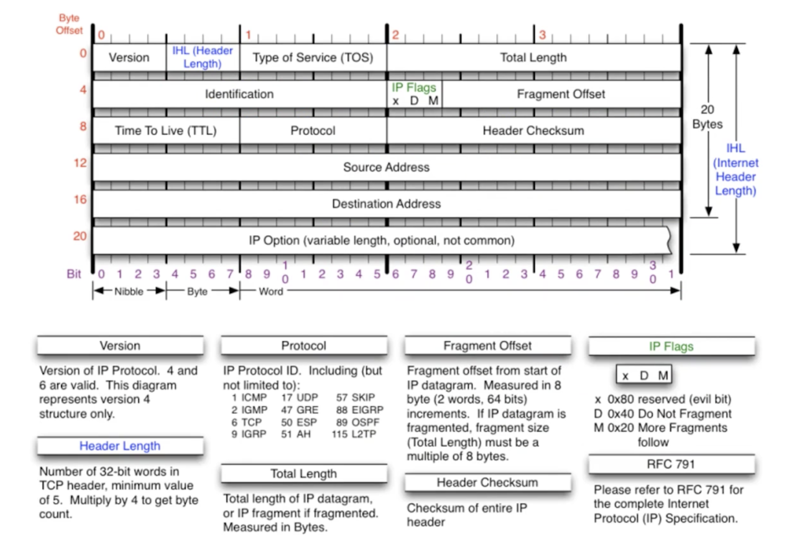
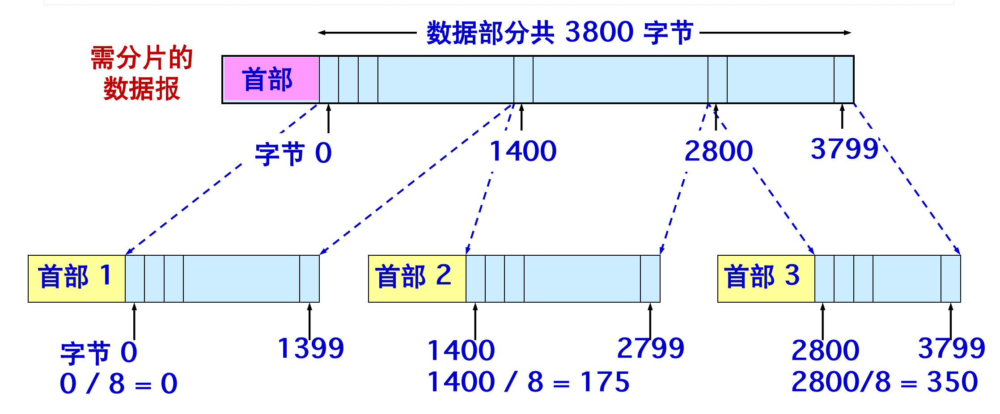
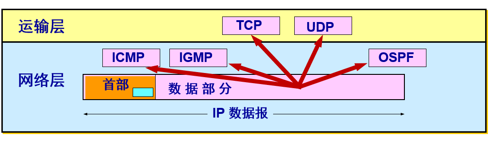
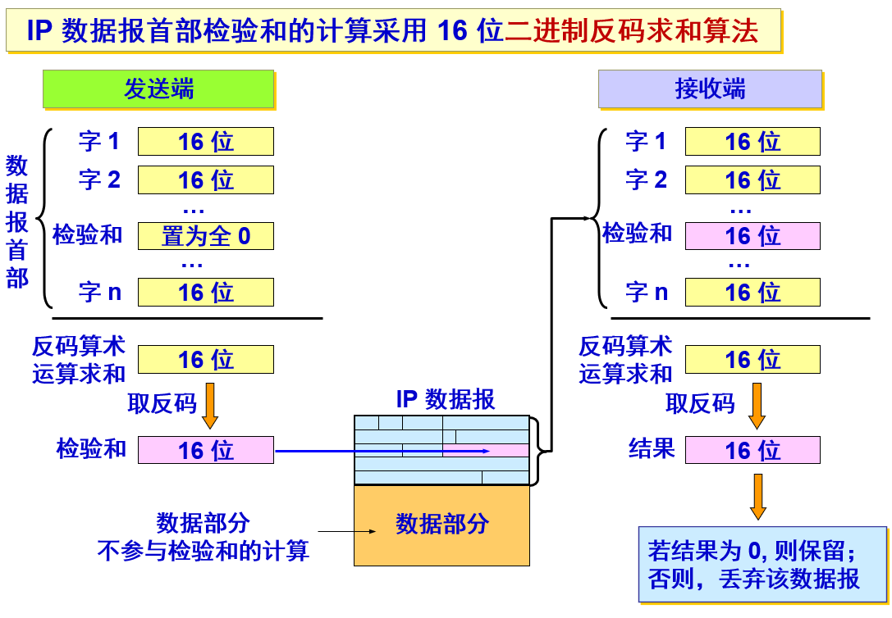

## `IP` 数据报

------

一个 `IP` 数据报由首部和数据两部分组成。首部的前一部分是固定长度，共 `20` 字节，是所有 `IP` 数据报必须具有的。在首部的固定部分的后面是一些可选字段，其长度是可变的。 



### 固定部分

**版本——占 4 位：** 指 IP 协议的版本，目前的 IP 协议版本号为 4 (即 IPv4)。

**首部长度——占 4 位：** 可表示的最大数值是 15 个单位(一个单位为 4 字节)，因此 IP 的首部长度的最大值是 60 字节。一般的数据都是20个字节的首部长度，因为没有可变部分。

**区分服务——占 8 位：** 用来获得更好的服务。在旧标准中叫做服务类型，但实际上一直未被使用过。1998 年这个字段改名为区分服务。只有在使用区分服务（DiffServ）时，这个字段才起作用。在一般的情况下都不使用这个字段 

**总长度——占 16 位：** 指首部和数据之和的长度，单位为字节，因此数据报的最大长度为 65535 字节。总长度必须不超过最大传送单元 MTU。（通过总长度和首部长度就可以计算出数据部分长度，以及可选字段长度）同时数据报长度一般不超过1500个字节这也是MSS一般的最大值。

-----

**标识(identification) ——占 16 位：**它是一个计数器，用来产生 IP 数据报的标识。 

**标志(flag) ——占 3 位：**目前只有后两位有意义。

- 标志字段的最低位是 `MF (More Fragment)`。MF=1 表示后面还有分片。MF=0 表示最后一个分片。
- 标志字段中间的一位是 `DF (Don't Fragment)` 。只有当 DF = 0 时才允许分片。 

**片偏移——占 13 位：** 指出较长的分组在分片后某片在原分组中的相对位置。片偏移以 `8` 个字节为偏移单位。

#### ip分片

一数据报的总长度为 `3820` 字节，其数据部分的长度为 `3800` 字节（固定首部），需要分片为长度不超过 `1420` 字节的数据报片，如何进行 `ip` 分片？

因固定首部长度为 `20` 字节，因此每个数据报片的数据部分长度不能超过 `1400` 字节，于是分为 `3` 个数据报片，其数据部分的长度分别为 `1400`、`1400` 和 `1000` 字节。



|                | **总长度** | **标识**  | **MF** | **DF** | **片偏移** |
| -------------- | ---------- | --------- | ------ | ------ | ---------- |
| **原始数据报** | **3820**   | **12345** | **0**  | **0**  | **0**      |
| **数据报片**1  | **1420**   | **12345** | **1**  | **0**  | **0**      |
| **数据报片**2  | **1420**   | **12345** | **1**  | **0**  | **175**    |
| **数据报片**3  | **1020**   | **12345** | **0**  | **0**  | **350**    |

> 原始数据报首部被复制为各数据报片的首部，但必须修改有关字段的值。

------

**生存时间——占8 位：**b记为 TTL (Time To Live)，指示数据报在网络中可通过的路由器数的最大值。当TLL为0的时候该数据报将被丢弃。

**协议——占8 位：** 指出此数据报携带的数据使用何种协议，以便目的主机的 IP 层将数据部分上交给那个处理过程，6一般表示tcp，17表示udp，协议号是ip协议和上层协议的桥梁。协议字段指出应将数据部分交给哪一个进程



**首部检验和——占16 位：** 只检验数据报的首部，不检验数据部分。不采用 CRC 检验码而采用简单的计算方法。 



#### 二进制反码求和

二进制反码求和的规则就是：`0`和`0`相加是`0`，但要产生一个进位`1`，`0`和`1`相加是`1`，`1`和`1`相加是`0`。

```go
(0)反 + (0)反 = 1 + 1 = 10
```

首先是发送端每个 `16` 位字进行二进制加法，最后得出的和取反码做为校验和，这个时候校验和 + 所有的字都取反码再求和，得到的值必然全为 `1`:

```go
1100 ， 1010 ， 0000
1100 ， 1010 ， 1000 
0011 ， 0101 ， 0111
```

-------

**源地址和目的地址都——各占 4 字节** 就 ip 地址嘛。

### 可变部分

`IP` 首部的可变部分就是一个选项字段，用来支持排错、测量以及安全等措施，内容很丰富。选项字段的长度可变，从 `1` 个字节到 `40` 个字节不等，取决于所选择的项目。增加首部的可变部分是为了增加 `IP` 数据报的功能，但这同时也使得 `IP` 数据报的首部长度成为可变的。这就增加了每一个路由器处理数据报的开销。实际上这些选项很少被使用。