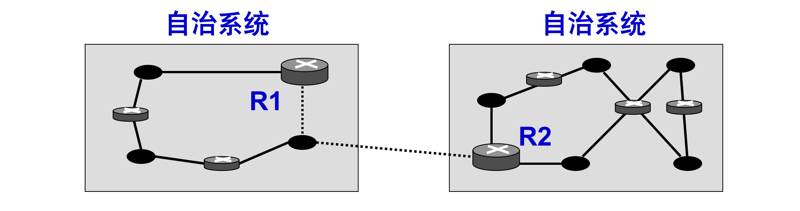
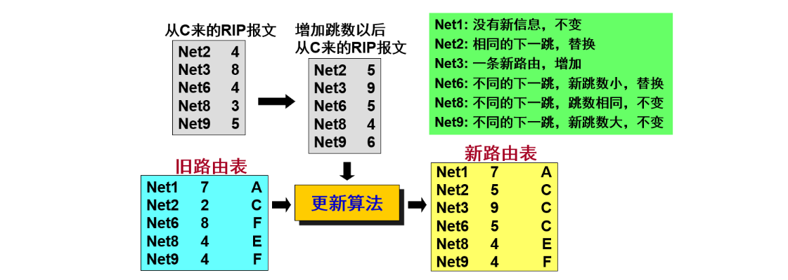
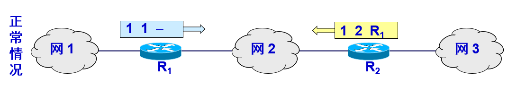
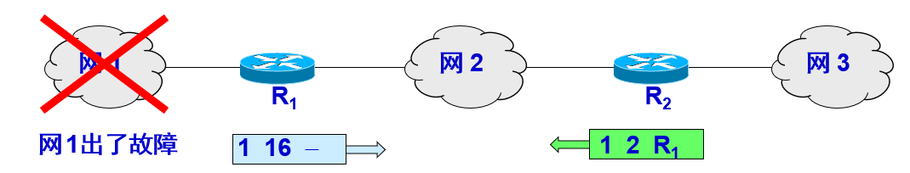
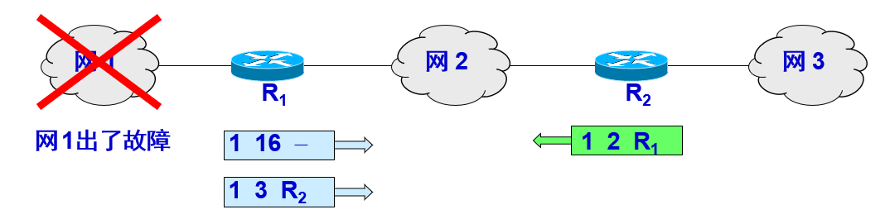
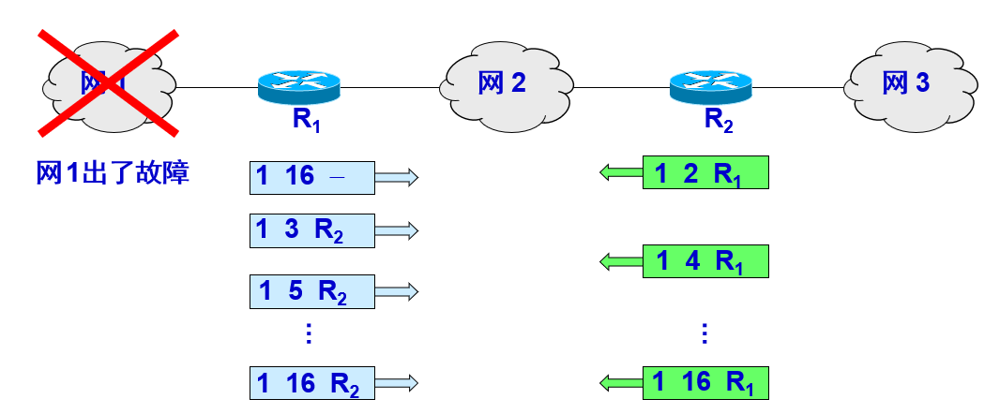
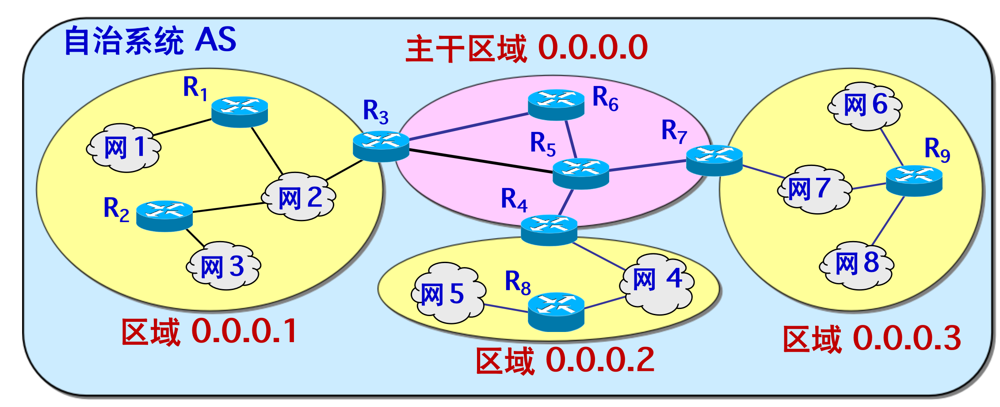
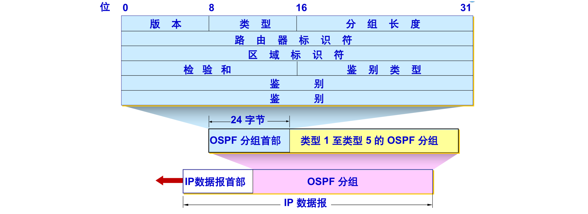
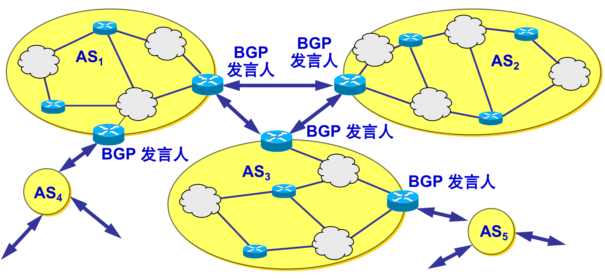
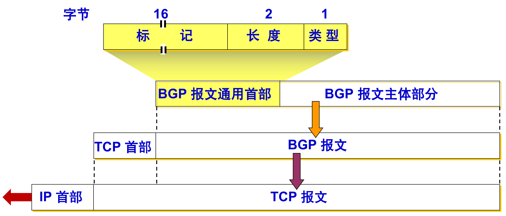

## 路由选择概述

------

不存在一种绝对的最佳路由算法，所谓“最佳”只能是相对于某一种特定要求下得出的较为合理的选择而已。实际的路由选择算法，应尽可能接近于理想的算法。 路由选择是个非常复杂的问题，它是网络中的所有结点共同协调工作的结果，路由选择的环境往往是不断变化的，而这种变化有时无法事先知道。  

**静态路由选择策略**——即非自适应路由选择，其特点是简单和开销较小，但不能及时适应网络状态的变化。 

**动态路由选择策略**——即自适应路由选择，其特点是能较好地适应网络状态的变化，但实现起来较为复杂，开销也比较大。  

互联网采用分层次的路由选择协议。这是因为：

1. 互联网的规模非常大。如果让所有的路由器知道所有的网络应怎样到达，则这种路由表将非常大，处理起来也太花时间。而所有这些路由器之间交换路由信息所需的带宽就会使互联网的通信链路饱和。
2. 许多单位不愿意外界了解自己单位网络的布局细节和本部门所采用的路由选择协议（这属于本部门内部的事情），但同时还希望连接到互联网上

#### 自治系统 AS

在单一的技术管理下的一组路由器，而这些路由器使用一种 AS 内部的路由选择协议和共同的度量以确定分组在该 AS 内的路由，同时还使用一种 AS 之间的路由选择协议用以确定分组在 AS之间的路由。

现在对自治系统 AS 的定义是强调下面的事实：尽管一个 AS 使用了多种内部路由选择协议和度量，但重要的是**一个 AS 对其他 AS 表现出的是一个单一的和一致的路由选择策略**。

#### 互联网的路由选择协议

互联网有两大类路由选择协议 ：

**内部网关协议 IGP (Interior Gateway Protocol)：** 

在一个自治系统内部使用的路由选择协议，目前这类路由选择协议使用得最多，如 RIP 和 OSPF 协议。

**外部网关协议 EGP (External Gateway Protocol)：** 

若源站和目的站处在不同的自治系统中，当数据报传到一个自治系统的边界时，就需要使用一种协议将路由选择信息传递到另一个自治系统中。这样的协议就是外部网关协议 EGP，在外部网关协议中目前使用最多的是 BGP-4。  

> 自治系统之间的路由选择也叫做域间路由选择 (interdomain routing)，在自治系统内部的路由选择叫做域内路由选择 (intradomain routing) 。

## 内部网关协议 RIP

------

路由信息协议 RIP (Routing Information Protocol) 是内部网关协议 IGP 中最先得到广泛使用的协议。RIP 是一种分布式的、基于距离向量的路由选择协议。RIP 协议要求网络中的每一个路由器都要维护从它自己到其他每一个目的网络的距离记录，这里的“距离”实际上指的是“最短距离”。 

> **注：**从一个路由器到直接连接的网络的距离定义为 1。从一个路由器到非直接连接的网络的距离定义为所经过的路由器数加 1。RIP 协议中的“距离”也称为“跳数”`(hop count)`，因为每经过一个路由器，跳数就加 1，

RIP 认为一个好的路由就是它通过的路由器的数目少，即“距离短”，RIP 不能在两个网络之间同时使用多条路由，它选择一个具有最少路由器的路由（即最短路由），哪怕还存在另一条高速(低时延)但路由器较多的路由。   

RIP 允许一条路径最多只能包含 15 个路由器。“距离”的最大值为 16 时即相当于不可达。可见 RIP 只适用于小型互联网。

**特点**:

仅和相邻路由器交换信息，交换的信息是当前本路由器所知道的全部信息，即自己的路由表。

 按固定的时间间隔交换路由信息，例如，每隔 30 秒/当网络拓扑发生变化时，路由器也及时向相邻路由器通告拓扑变化后的路由信息。

#### RIP协议的工作流程

**初始化：**

路由器在刚刚开始工作时，只知道到直接连接的网络的距离（此距离定义为 1）。它的路由表是空的，以后，每一个路由器也只和数目非常有限的相邻路由器交换并更新路由信息。

经过若干次更新后，所有的路由器最终都会知道到达本自治系统中任何一个网络的最短距离和下一跳路由器的地址。

> RIP 协议的收敛 (convergence) 过程较快，即在自治系统中所有的结点都得到正确的路由选择信息的过程。 

**距离向量算法：**

1. 路由器收到相邻路由器（其地址为 X）的一个 RIP 报文：

2. 先修改此 **RIP 报文中**的所有项目：把“下一跳”字段中的地址都改为 X，并把所有的“距离”字段的值加 1。

3. 对修改后的 RIP 报文中的每一个项目，重复以下步骤：
   1. 若项目中的目的网络不在路由表中，则把该项目加到路由表中。
   2. 若下一跳字段给出的路由器地址是同样的，则把收到的项目替换原路由表中的项目。
   3. 若收到项目中的距离小于路由表中的距离，则进行更新，
   
   4. 否则，什么也不做。

1. 若 3 分钟还没有收到相邻路由器的更新路由表，则把此相邻路由器记为不可达路由器，即将距离置为 16（表示不可达）。

**总结：**

RIP 协议让互联网中的所有路由器都和自己的相邻路由器不断交换路由信息，并不断更新其路由表，使得从每一个路由器到每一个目的网络的路由都是最短的（即跳数最少）。

虽然所有的路由器最终都拥有了整个自治系统的全局路由信息，但由于每一个路由器的位置不同，它们的路由表当然也应当是不同的。  

**例题：**

已知路由器 R6 有所示的路由表。现在收到相邻路由器 R4 发来的路由更新信息。试更新路由器 R6 的路由表。

**路由器 R6 的路由表**

| **目的网络** | **距离** | **下一跳路由器** |
| ------------ | -------- | ---------------- |
| **Net2**     | **3**    | **R**4           |
| **Net3**     | **4**    | **R**5           |
| **…**        | **…**    | **…**            |

**R4 发来的路由更新信息：**

| **目的网络** | **距离** | **下一跳路由器** |
| ------------ | -------- | ---------------- |
| **Net1**     | **3**    | R1               |
| **Net2**     | **4**    | R2               |
| **Net3**     | **1**    | **直接交付**     |

**根据RIP协议处理R4发来的路由表**

| **目的网络** | **距离** | **下一跳路由器** |
| ------------ | -------- | ---------------- |
| **Net1**     | **4**    | **R**4           |
| **Net2**     | **5**    | **R**4           |
| **Net3**     | **2**    | **R**4           |

**路由器 R6 更新后的路由表**

| **目的网络** | **距离** | **下一跳路由器** |
| ------------ | -------- | ---------------- |
| **Net1**     | **4**    | **R**4           |
| **Net2**     | **5**    | **R**4           |
| **Net3**     | **2**    | **R**4           |
| **…**        | **…**    | **…**            |

#### RIP2 报文

RIP2协议基于UDP传递报文，报文由首部和路由部分组成。

RIP2 报文中的路由部分由若干个路由信息组成，每个路由信息需要用 20 个字节：

- 地址族标识符（又称为地址类别）字段用来标志所使用的地址协议。
- 路由标记填入自治系统的号码，这是考虑使 RIP 有可能收到本自治系统以外的路由选择信息。
- 再后面指出某个网络地址、该网络的子网掩码、下一跳路由器地址以及到此网络的距离。 

一个 RIP 报文最多可包括 25 个路由，因而 RIP 报文的最大长度是 4  * 20 * 25 = 504 字节。如超过，必须再用一个 RIP 报文来传送。

> **注意：**RIP2 具有简单的鉴别功能，若使用鉴别功能，则将原来写入第一个路由信息（20 个字节）的位置用作鉴别，在鉴别数据之后才写入路由信息，但这时最多只能再放入 24 个路由信息。

#### RIP 协议特点：

**好消息传播得快，坏消息传播得慢**。

RIP 存在的一个问题：当网络出现故障时，要经过比较长的时间 (例如数分钟) 才能将此信息传送到所有的路由器。

**举个例子：**

R1 说：“我到网 1 的距离是 1，是直接交付。”

R2 说：“我到网 1 的距离是 2，是经过 R1。”

R1 说：“我到网 1 的距离是 16 （表示无法到达），是直接交付。”、

但 R2 在收到 R1 的更新报文之前，还发送原来的报文，因为这时  R2 并不知道  R1 出了故障。

R1 收到 R2 的更新报文后，误认为可经过 R2 到达网 1，于是更新自己的路由表，说：“我到网 1 的距离是 3，下一跳经过 R2”。然后将此更新信息发送给 R2。

这样不断更新下去，直到 R1 和 R2 到网 1 的距离都增大到 16 时，R1 和 R2 才知道网 1 是不可达的。 

这就是好消息传播得快，而坏消息传播得慢。网络出故障的传播时间往往需要较长的时间(例如数分钟)。这是 RIP 的一个主要缺点。 

### RIP协议的优缺点

**优点：**

实现简单，开销较小。

**缺点：**

1. RIP 限制了网络的规模，它能使用的最大距离为 15（16 表示不可达）。
2. 路由器之间交换的路由信息是路由器中的完整路由表，因而随着网络规模的扩大，开销也就增加。 
3. “坏消息传播得慢”，使更新过程的收敛时间过长。

## 内部网关协议 `OSPF`

-------

开放最短路径优先 OSPF (Open Shortest Path First)是为克服 RIP 的缺点在 1989 年开发出来的，OSPF 的原理很简单，但实现起来却较复杂。

- “开放”表明 OSPF 协议不是受某一家厂商控制，而是公开发表的。
- “最短路径优先”是因为使用了 Dijkstra 提出的最短路径算法 SPF，采用分布式的链路状态协议 (link state protocol)。 

使用 OSPF 协议要向本自治系统中所有路由器发送信息，这里使用的方法是洪泛法，发送的信息就是与本路由器相邻的所有路由器的链路状态，但这只是路由器所知道的部分信息，**并且只有当链路状态发生变化时，路由器才用洪泛法向所有路由器发送此信息**。

由于各路由器之间频繁地交换链路状态信息，因此所有的路由器最终都能建立一个链路状态数据库，这个数据库实际上就是全网的拓扑结构图，它在全网范围内是一致的（这称为链路状态数据库的同步）。

> OSPF 的更新过程收敛得快是其重要优点。

#### 区域划分

为了使 OSPF 能够用于规模很大的网络，OSPF 将一个自治系统再划分为若干个更小的范围，叫做区域，每一个区域都有一个 32 位的区域标识符（用点分十进制表示），区域也不能太大，在一个区域内的路由器最好不超过 200 个。  

划分区域的好处就是将利用洪泛法交换链路状态信息的范围局限于每一个区域而不是整个的自治系统，这就减少了整个网络上的通信量，在一个区域内部的路由器只知道本区域的完整网络拓扑，而不知道其他区域的网络拓扑的情况。

OSPF 使用层次结构的区域划分。在上层的区域叫做主干区域 (backbone area)，主干区域的标识符规定为0.0.0.0。主干区域的作用是用来连通其他在下层的区域。

#### OSPF 分组

OSPF 不用 UDP 而是直接用 IP 数据报传送，其构成的数据报很短。这样做可减少路由信息的通信量：

**类型1：**问候 (Hello) 分组。

**类型2：**数据库描述 (Database Description) 分组。

**类型3：**链路状态请求 (Link State Request) 分组。

**类型4：**链路状态更新 (Link State Update) 分组，用洪泛法对全网更新链路状态。

**类型5：**链路状态确认 (Link State Acknowledgment)分组。 

#### OSPF 的基本操作

OSPF 还规定每隔一段时间，如 30 分钟，要刷新一次数据库中的链路状态。

#### 总结

由于一个路由器的链路状态只涉及到与相邻路由器的连通状态，因而与整个互联网的规模并无直接关系。因此当互联网规模很大时，OSPF  协议要比距离向量协议 RIP 好得多。 

OSPF 没有“坏消息传播得慢”的问题，据统计，其响应网络变化的时间小于 100 ms。 

## 外部网关协议 BGP

------

BGP 是不同自治系统的路由器之间交换路由信息的协议，BGP 较新版本是 2006 年 1 月发表的 BGP-4（BGP 第 4 个版本），即 RFC 4271 ~ 4278，可以将 BGP-4 简写为 BGP。 

互联网的规模太大，使得自治系统之间路由选择非常困难。对于自治系统之间的路由选择，要寻找最佳路由是很不现实的。因此，边界网关协议 BGP 只能是力求寻找一条能够到达目的网络且比较好的路由（不能兜圈子），而并非要寻找一条最佳路由。

#### BGP 发言人

每一个自治系统的管理员要选择至少一个路由器作为该自治系统的“ BGP 发言人” (BGP speaker) ，一般说来，两个 BGP 发言人都是通过一个共享网络连接在一起的，而 BGP 发言人往往就是 BGP 边界路由器，但也可以不是 BGP 边界路由器。 

一个 BGP 发言人与其他自治系统中的 BGP 发言人要交换路由信息，就要先建立 TCP 连接，然后在此连接上交换 BGP 报文以建立 BGP 会话(session)，利用 BGP 会话交换路由信息，使用 TCP 连接能提供可靠的服务，也简化了路由选择协议。

> 使用 TCP 连接交换路由信息的两个 BGP 发言人，彼此成为对方的邻站(neighbor)或对等站(peer) 。

BGP 所交换的网络可达性的信息就是要到达某个网络所要经过的一系列 AS，当 BGP 发言人互相交换了网络可达性的信息后，各 BGP 发言人就根据所采用的策略从收到的路由信息中找出到达各 AS 的较好路由。 

#### BGP 报文

**打开 (OPEN) 报文：**用来与相邻的另一个BGP发言人建立关系。

**更新 (UPDATE) 报文：**用来发送某一路由的信息，以及列出要撤消的多条路由。

**保活 (KEEPALIVE) 报文：**用来确认打开报文和周期性地证实邻站关系。

**通知 (NOTIFICATION) 报文：**用来发送检测到的差错。

#### 特点

BGP 协议交换路由信息的结点数量级是自治系统数的量级，这要比这些自治系统中的网络数少很多，每一个自治系统中 BGP 发言人（或边界路由器）的数目是很少的。这样就使得自治系统之间的路由选择不致过分复杂。  

在 BGP 刚刚运行时，BGP 的邻站是交换整个的 BGP 路由表。但以后只需要在发生变化时更新有变化的部分。这样做对节省网络带宽和减少路由器的处理开销都有好处。 

BGP 支持 CIDR，因此 BGP 的路由表也就应当包括目的网络前缀、下一跳路由器，以及到达该目的网络所要经过的各个自治系统序列。

