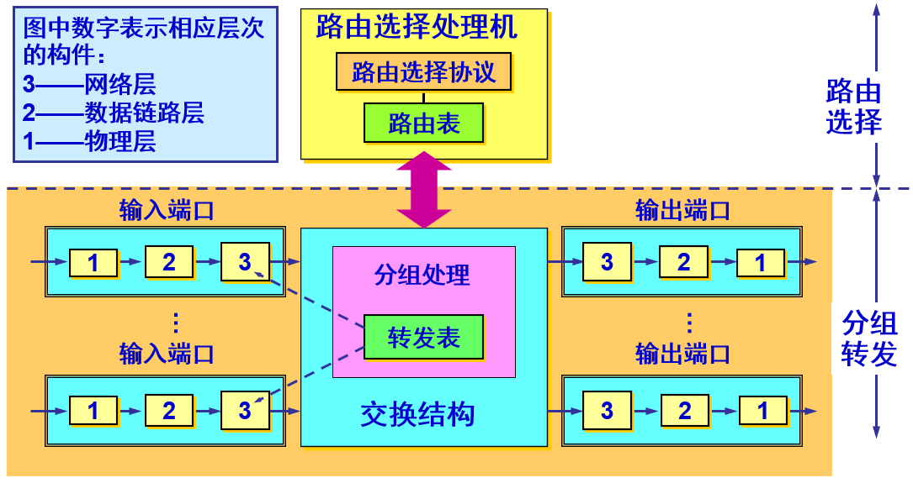
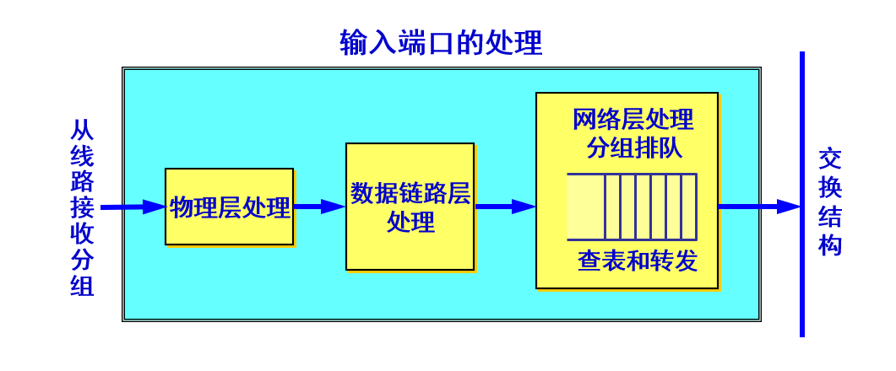
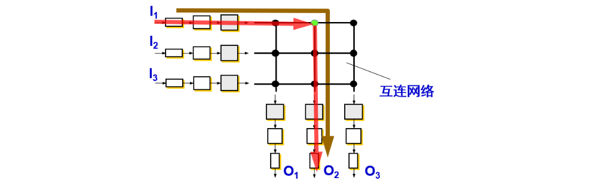

## 概述

------

路由器是一种典型的网络层设备，是互联网中的关键设备。路由器的主要作用是：连通不同的网络。选择信息传送的线路。选择通畅快捷的近路，能大大提高通信速度，减轻网络系统通信负荷，节约网络系统资源，提高网络系统畅通率，从而让网络系统发挥出更大的效益来。

路由器是一种具有多个输入端口和多个输出端口的专用计算机，其任务是转发分组。也就是说，将路由器某个输入端口收到的分组，按照分组要去的目的地（即目的网络），把该分组从路由器的某个合适的输出端口转发给下一跳路由器。下一跳路由器也按照这种方法处理分组，直到该分组到达终点为止。 路由器的转发分组正是网络层的主要工作。

## 路由器的结构

-------

整个的路由器结构可划分为两大部分：`路由选择部分`、`分组转发部分`

### **路由选择部分：**

也叫做控制部分，其核心构件是路由选择处理机。路由选择处理机的任务是根据所选定的路由选择协议构造出路由表，同时经常或定期地和相邻路由器交换路由信息而不断地更新和维护路由表。

### **分组转发部分：**

- `交换结构 (switching fabric)`：又称为交换组织，其作用是根据`转发表 (forwarding table) `对分组进行处理。

- 一组输入端口

- 一组输出端口

#### **输入输出端口**

路由器的输入端口里面装有物理层、数据链路层和网络层的处理模块，数据链路层剥去帧首部和尾部后，将分组送到网络层的队列中排队等待处理。这会产生一定的时延，输入端口中的查找和转发功能在路由器的交换功能中是最重要的。

输出端口里面装有物理层、数据链路层和网络层的处理模块，输出端口从交换结构接收分组，然后把它们发送到路由器外面的线路上。在网络层的处理模块中设有一个缓冲区（队列）。当交换结构传送过来的分组的速率超过输出链路的发送速率时，来不及发送的分组就必须暂时存放在这个队列中。

数据链路层处理模块将分组加上链路层的首部和尾部，交给物理层后发送到外部线路。 

若路由器处理分组的速率赶不上分组进入队列的速率，则队列的存储空间最终必定减少到零，这就使后面再进入队列的分组由于没有存储空间而只能被丢弃，路由器中的输入或输出队列产生溢出是造成分组丢失的重要原因。

#### **交换结构**

交换结构是路由器的关键构件，正是这个交换结构把分组从一个输入端口转移到某个合适的输出端口。
实现交换有多种方法。常用交换方法有三种：`存储器`、`总线`、`纵横交换结构`。

**通过存储器**

当路由器的某个输入端口收到一个分组时，就用中断方式通知路由选择处理机。然后分组就从输入端口复制到存储器中，路由器处理机从分组首部提取目的地址，查找路由表，再将分组复制到合适的输出端口的缓存中。

若存储器的带宽（读或写）为每秒 M 个分组，那么路由器的交换速率（即分组从输入端口传送到输出端口的速率）一定小于 M/2。

**通过总线**

数据报从输入端口通过共享的总线直接传送到合适的输出端口，而不需要路由选择处理机的干预。

因为每一个要转发的分组都要通过这一条总线，因此路由器的转发带宽就受总线速率的限制，现代的技术已经可以将总线的带宽提高到每秒吉比特的速率，因此许多的路由器产品都采用这种通过总线的交换方式。

**通过纵横交换结构 (crossbar switch fabric)**

这种交换结构常称为`互连网络 (interconnection network)`。

它有 2N 条总线，可以使 N 个输入端口和 N 个输出端口相连接，当输入端口收到一个分组时，就将它发送到与该输入端口相连的水平总线上，若通向所要转发的输出端口的垂直总线是空闲的，则在这个结点将垂直总线与水平总线接通，然后将该分组转发到这个输出端口。

但若该垂直总线已被占用（有另一个分组正在转发到同一个输出端口），则后到达的分组就被阻塞，必须在输入端口排队。