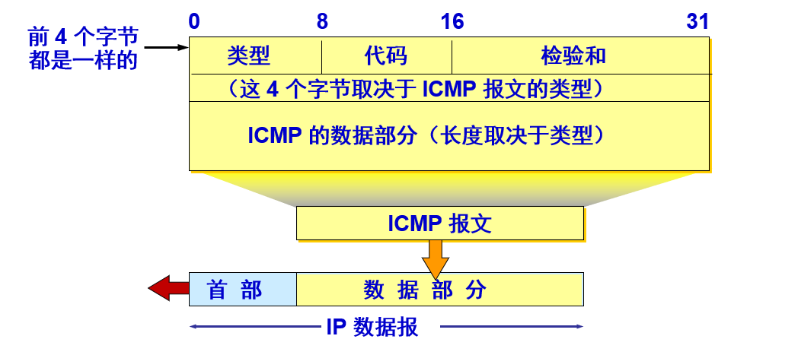
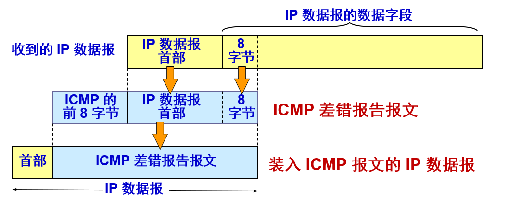

# ICMP

------

`ICMP` 是互联网的标准协议，为了更有效地转发 `IP` 数据报和提高交付成功的机会，在网际层使用了网际控制报文协议 `ICMP (Internet Control Message Protocol`）。



`ICMP` 允许主机或路由器报告差错情况和提供有关异常情况的报告。但 `ICMP` 不是高层协议（看起来好像是高层协议，因为 `ICMP` 报文是装在 `IP` 数据报中，作为其中的数据部分），而是 `IP` 层的协议。

## 差错报告报文

------

ICMP差错报告报文共有五种：`终点不可达、时间超过、参数问题 、源冷却、改变路由（重定向）(Redirect) `.



```bash
+-+-+-+-+-+-+-+-+-+-+-+-+-+-+-+-+-+-+-+-+-+-+-+-+-+-+-+-+-+-+-+-+
|     Type      |     Code      |          Checksum             |
+-+-+-+-+-+-+-+-+-+-+-+-+-+-+-+-+-+-+-+-+-+-+-+-+-+-+-+-+-+-+-+-+
|                             unused                            |
+-+-+-+-+-+-+-+-+-+-+-+-+-+-+-+-+-+-+-+-+-+-+-+-+-+-+-+-+-+-+-+-+
|      Internet Header + 64 bits of Original Data Datagram      |
+-+-+-+-+-+-+-+-+-+-+-+-+-+-+-+-+-+-+-+-+-+-+-+-+-+-+-+-+-+-+-+-+
```

#### 1.目的不可达(Destination Unreachable Message)

日常生活中，邮寄包裹会经过多个传递环节，任意一环如果无法传下去，都会返回寄件人，并附上无法邮寄的原因。同理，当路由器收到一个无法传递下去的IP报文时，会发送ICMP目的不可达报文（Type为3）给IP报文的源发送方。报文中的Code就表示发送失败的原因。

```bash
Code
0 = net unreachable;
1 = host unreachable;
2 = protocol unreachable;
3 = port unreachable;
4 = fragmentation needed and DF set;
5 = source route failed.
```

#### 2.超时(Time Exceeded Message)

超时分为两种情况，一种是过过程中超时，另一种则是等待超时。

网络传输IP数据报的过程中，如果IP数据包的TTL值逐渐递减为0时，需要丢弃数据报。这时，路由器需要向源发送方发送ICMP超时报文(Type为11)，Code为0，表示传输过程中超时了。

一个IP数据报可能会因为过大而被分片，然后在目的主机侧把所有的分片重组。如果主机迟迟没有等到所有的分片报文，就会向源发送方发送一个ICMP超时报文，Code为1，表示分片重组超时了

#### 3.参数错误报文(Parameter Problem Message)

当路由器或主机处理数据报时，发现因为报文头的参数错误而不得不丢弃报文时，需要向源发送方发送参数错误报文(Type为12)。当Code为0时，报文中的Pointer表示错误的字节位置。

#### 4.源冷却(Source Quench Message)

路由器在处理报文时会有一个缓存队列。如果超过最大缓存队列，将无法处理，从而丢弃报文。并向源发送方发一个ICMP源冷却报文(Type为4)，告诉对方：“嘿，我这里客满了，你迟点再来。”

#### 5.重定向(Redirect Message)

想像一下，在公司中，有人来你的项目组问你某某某在哪儿。你一想，我们组没有这人啊。你肯定就会说，我们组没有这号人，你去其他组看看。当路由收到IP数据报，发现数据报的目的地址在路由表上没有，它就会发ICMP重定向报文(Type为5)给源发送方，提醒它想要发送的地址不在，去其他地方找找吧。

#### **不应发送** **ICMP** **差错报告报文的几种情况**：

- 对 ICMP 差错报告报文不再发送 ICMP 差错报告报文。
- 对第一个分片的数据报片的所有后续数据报片都不发送 ICMP 差错报告报文。
- 对具有多播地址的数据报都不发送 ICMP 差错报告报文。
- 对具有特殊地址（如127.0.0.0 或 0.0.0.0）的数据报不发送 ICMP 差错报告报文。

## **ICMP** 询问报文

-------

询问报文也分为两种：回送请求和回答报文，时间戳请求和回答报文。

#### 1.请求回显或回显应答(Echo or Echo Reply Message)

```bash
+-+-+-+-+-+-+-+-+-+-+-+-+-+-+-+-+-+-+-+-+-+-+-+-+-+-+-+-+-+-+-+-+
|     Type      |     Code      |          Checksum             |
+-+-+-+-+-+-+-+-+-+-+-+-+-+-+-+-+-+-+-+-+-+-+-+-+-+-+-+-+-+-+-+-+
|           Identifier          |        Sequence Number        |
+-+-+-+-+-+-+-+-+-+-+-+-+-+-+-+-+-+-+-+-+-+-+-+-+-+-+-+-+-+-+-+-+
|     Data ...																									|
+-+-+-+-+-+-+-+-+-+-+-+-+-+-+-+-+-+-+-+-+-+-+-+-+-+-+-+-+-+-+-+-+
```

Type(8)是请求回显报文(Echo)；Type(0)是回显应答报文(Echo Reply)。请求回显或回显应答报文属于查询报文。Ping就是用这种报文进行查询和回应。

**PING (Packet InterNet Groper)** 

PING 用来测试两个主机之间的连通性，使用了 ICMP 回送请求与回送回答报文，PING 是应用层直接使用网络层 ICMP 的例子，它没有通过运输层的 TCP 或UDP。 

#### 2.时间戳或时间戳请求(Timestamp or Timestamp Reply Message)

```bash
+-+-+-+-+-+-+-+-+-+-+-+-+-+-+-+-+-+-+-+-+-+-+-+-+-+-+-+-+-+-+-+-+
|     Type      |      Code     |          Checksum             |
+-+-+-+-+-+-+-+-+-+-+-+-+-+-+-+-+-+-+-+-+-+-+-+-+-+-+-+-+-+-+-+-+
|           Identifier          |        Sequence Number        |
+-+-+-+-+-+-+-+-+-+-+-+-+-+-+-+-+-+-+-+-+-+-+-+-+-+-+-+-+-+-+-+-+
|     Originate Timestamp                                       |
+-+-+-+-+-+-+-+-+-+-+-+-+-+-+-+-+-+-+-+-+-+-+-+-+-+-+-+-+-+-+-+-+
|     Receive Timestamp                                         |
+-+-+-+-+-+-+-+-+-+-+-+-+-+-+-+-+-+-+-+-+-+-+-+-+-+-+-+-+-+-+-+-+
|     Transmit Timestamp                                        |
+-+-+-+-+-+-+-+-+-+-+-+-+-+-+-+-+-+-+-+-+-+-+-+-+-+-+-+-+-+-+-+-+
```

时间戳报文是用来记录收发以及传输时间的报文。Originate Timestamp记录的是发送方发送报文的时刻；**Receive Timestamp**记录的是接收方收到报文的时刻；**Transmit Timestamp**表示回显这最后发送报文的时刻。

