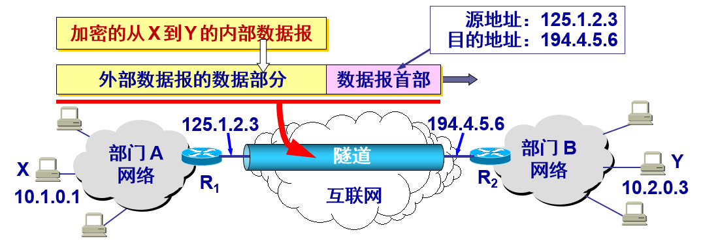
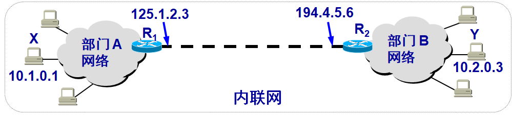
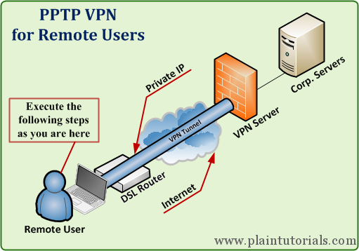

## 虚拟专用网 `VPN`

-------

`vpn` 英文全称是“`Virtual Private Network`”，翻译过来就是“虚拟专用网络”。`vpn`通常拿来做`2`个事情，一个是可以让世界上任意`2`台机器进入一个虚拟的局域网中（当然这个局域网的数据通讯是加密的，很安全，用起来和一个家庭局域网没有区别），一个是可以用来翻墙。

由于 `IP` 地址的紧缺，一个机构能够申请到的`IP`地址数往往远小于本机构所拥有的主机数。考虑到互联网并不很安全，一个机构内也并不需要把所有的主机接入到外部的互联网。

假定在一个机构内部的计算机通信也是采用 `TCP/IP` 协议，那么从原则上讲，对于这些仅在机构内部使用的计算机就可以由本机构自行分配其 `IP` 地址。

#### 专用地址划分

**本地地址**——仅在机构内部使用的 IP 地址，可以由本机构自行分配，而不需要向互联网的管理机构申请。

**全球地址**——全球唯一的 IP 地址，必须向互联网的管理机构申请。 

**问题：**在内部使用的本地地址就有可能和互联网中某个 IP 地址重合，这样就会出现地址的二义性问题。

**解决：**RFC 1918 指明了一些专用地址 (private address)。专用地址只能用作本地地址而不能用作全球地址。在互联网中的所有路由器，对目的地址是专用地址的数据报一律不进行转发。

**三个专用的IP地址：**

- 10.0.0.0 到 10.255.255.255
  - A类，或记为10.0.0.0/8，它又称为 24 位块

- 172.16.0.0 到 172.31.255.255
  - B类，或记为172.16.0.0/12，它又称为 20 位块

- 192.168.0.0 到 192.168.255.255
  - C类，或记为192.168.0.0/16，它又称为 16 位块

采用这样的专用 IP 地址的互连网络称为专用互联网或本地互联网，或更简单些，就叫做专用网，因为这些专用地址仅在本机构内部使用。专用IP地址也叫做可重用地址 (reusable address)。

#### 虚拟专用网

利用公用的互联网作为本机构各专用网之间的通信载体，这样的专用网又称为虚拟专用网VPN (Virtual Private Network)。

“专用网”是因为这种网络是为本机构的主机用于机构内部的通信，而不是用于和网络外非本机构的主机通信。

“虚拟”表示“好像是”，但实际上并不是，因为现在并没有真正使用通信专线，而VPN只是在效果上和真正的专用网一样。

#### VPN 的构建

如果专用网不同网点之间的通信必须经过公用的互联网，但又有保密的要求，那么所有通过互联网传送的数据都必须加密。
一个机构要构建自己的 VPN 就必须为它的每一个场所购买专门的硬件和软件，并进行配置，使每一个场所的 VPN 系统都知道其他场所的地址。

**用隧道技术实现虚拟专用网** 

#### 内联网 intranet 和外联网 extranet

由部门 A 和 B 的内部网络所构成的虚拟专用网 VPN 又称为内联网 (intranet)，表示A和B都是在同一个机构的内部。

一个机构和某些外部机构共同建立的虚拟专用网 VPN 又称为外联网 (extranet)。  

## 翻墙用途

------

VPN重要元素分为VPN客户端，**它通过操作系统的接口直接虚拟出一张网卡**，后续整个操作系统的网络通讯都将通过这张虚拟的网卡进行收发。这和任何一个代理的实现思路都差不多，应用层并不知道网卡是虚拟的，这样vpn虚拟网卡将以中间人的身份对数据进行加工，从而实现各种神奇的效果。具体来说，vpn是通过编写一套网卡驱动并注册到操作系统实现的虚拟网卡，这样数据只要经过网卡收发就可以进行拦截处理。

和VPN服务器，需要在vps上部署vpn server，客户端所有数据将经过虚拟网卡的加密封装后都转发给vps上的vpn server，由它来转发给目标服务器，这和ss server原理类似，由vpn协议加密从而绕过GFW实现访问墙外网站，下面将以pptp vpn协议为例说明。

假设要访问谷歌，那么客户端发出的数据包首先通过协议栈处理封装成IP包，其源地址是虚拟网卡的地址，例如：192.168.0.2，而目标地址是谷歌的IP。

原始IP包交给虚拟网卡发送时，PPTP网卡驱动会按PPP协议对这个IP包整体加密封装作为新的payload，用一层新的IP头封装这个payload发送出去，这个新IP头的目标地址是vpn server，源地址是客户端的外网IP。

vpn server的协议栈会剥离掉新IP头，将内部PPP协议的payload交给pptpd进程处理，pptpd进程会按PPP协议解包得到原始的IP包，我们知道这个IP包的源地址是192.168.0.2，目标地址google。因此，pptpd进程需要做的是将这个IP包的源IP地址改为vps的地址，然后将IP包发给谷歌，从而和谷歌进行数据交换。最终，pptpd理所应当将谷歌的应答IP包的目标IP地址换成192.168.0.2，然后经过PPP协议封装并添加新的IP头后发回给客户端既可。

不过要注意在pptpd的实现里，这个源地址修改是通过iptables实现的，也就是添加通过iptables添加一个NAT规则，实现来源地址的映射转换，这个在你配置pptp的过程中就会看到。

vpn 比 ss 更加底层，一句话，vpn在IP层工作，而ss在TCP层工作。