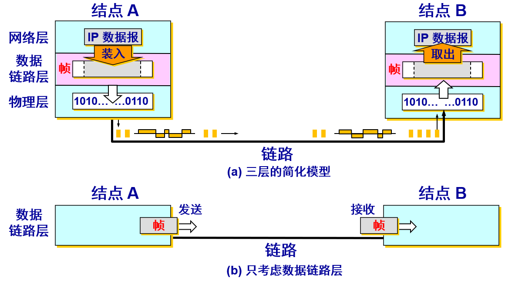
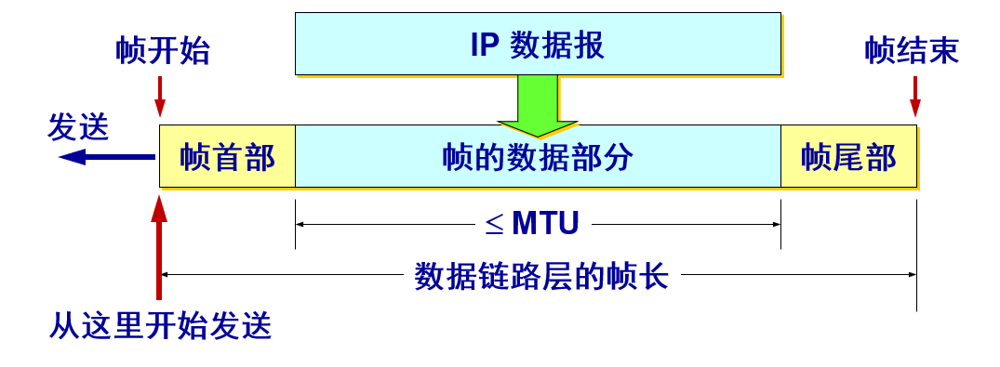
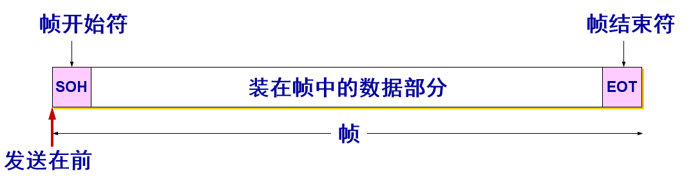
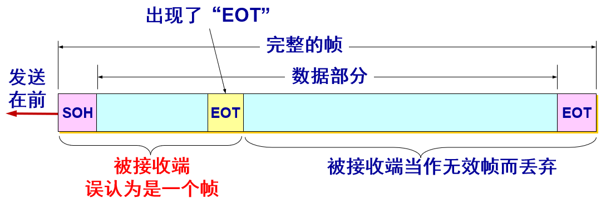
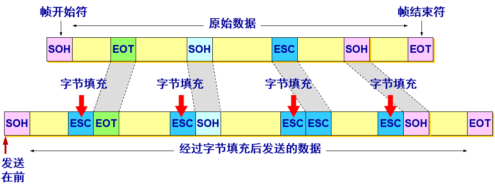
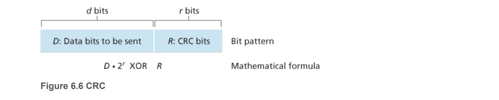
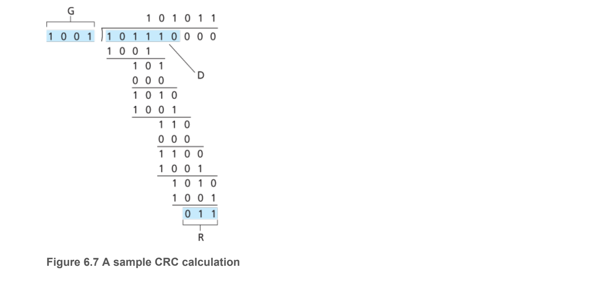
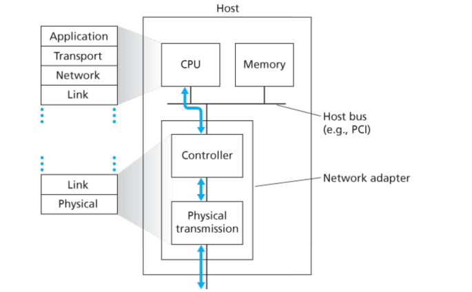

## 数据链路和帧

------

链路  `link`  是一条无源的点到点的物理线路段，中间没有任何其他的交换结点，一条链路只是一条通路的一个组成部分。数据链路 `data link` 除了物理线路外，还必须有通信协议来控制这些数据的传输。若把实现这些协议的硬件和软件加到链路上，就构成了数据链路。

- 现在最常用的方法是使用适配器（即网卡）来实现这些协议的硬件和软件。
- 一般的适配器都包括了数据链路层和物理层这两层的功能。   

也有人采用另外的术语。这就是把链路分为物理链路和逻辑链路：物理链路就是上面所说的链路，逻辑链路就是上面的数据链路，是物理链路加上必要的通信协议。

> 早期的数据通信协议曾叫做通信规程 `procedure`。因此在数据链路层，规程和协议是同义语。

我们常常在两个对等的数据链路层之间画出一个数字管道，而在这条数字管道上传输的数据单位是帧。



数据链路层不必考虑物理层如何实现比特传输的细节。甚至还可以更简单地设想好像是沿着两个数据链路层之间的水平方向把帧直接发送到对方。

## 解决问题

---------

数据链路层协议有许多种，但有三个基本问题则是共同的。这三个基本问题是：
1. **封装成帧**
2. **透明传输**
3. **差错控制** 

#### 封装成帧

封装成 `帧 (framing)` 就是在一段数据的前后分别添加首部和尾部，然后就构成了一个帧。确定帧的界限，首部和尾部的一个重要作用就是进行帧定界。  



**帧定界：**

当数据是由可打印的 `ASCII` 码组成的文本文件时，帧定界可以使用特殊的帧定界符。控制字符 `SOH (Start Of Header) `放在一帧的最前面，表示帧的首部开始。另一个字符 `EOT (End Of Transmission) `表示帧的结束。



#### 透明传输

如果数据中的某个字节的二进制代码恰好和 `SOH` 或 `EOT` 一样，数据链路层就会错误地“找到帧的边界”，这里的透明指的是，数据链路层对传输的数据透明，传输的数据实际上感受不到数据链路层所做的操作。



**解决方法：**`字节填充 (byte stuffing) 或字符填充 (character stuffing)`

发送端的数据链路层在数据中出现控制字符 `SOH` 或 `EOT` 的前面插入一个转义字符 `ESC` (其十六进制编码是 `1B`)。接收端的数据链路层在将数据送往网络层之前删除插入的转义字符。



如果转义字符也出现在数据当中，那么应在转义字符前面插入一个转义字符 `ESC`。当接收端收到连续的两个转义字符时，就删除其中前面的一个。 

#### 差错检测

在传输过程中可能会产生比特差错：`1` 可能会变成 `0` 而 `0` 也可能变成 `1`。在一段时间内，传输错误的比特占所传输比特总数的比率称为误码率 `BER (Bit Error Rate)`。为了保证数据传输的可靠性，在计算机网络传输数据时，必须采用各种差错检测措施。 

> 误码率与信噪比有很大的关系。

**CRC循环冗余检验**

现今的计算机网络中广泛应用的差错检测技术基于循环冗余检测 `Cyclic Redundancy Check , CRC` 编码 `CRC` 编码也称为多项式编码 `polynomial code` ，因为该编码能够将要发送的比特串看作为系数是 一个多项式，对比特串的操作被解释为多项式算术。

`CRC` 编码操作如下：考虑 `d` 比特的数据 `D`，发送结点要将它发送给接收结点，发送方和接收方首先必须协商 `r`+`1` 比特模式，称为生成多项式`(generaLor)` ，我们将其表示 `G`。我们将要求的最高有效位的比特(最左边)是 `1`，比如`1010`的生成多项式为 `x` + `x^3`。

对于一个给定的数据段 `D`，发送方要选择 `r` 个附加比特 `R`，并将它们附加到 `D` 上，得到的 `d` + `r` 比特模式(被解释为一个二进制数)用模 `2` 算术恰好能被 `G` 整除 (即没有余数)，接收方用 `G` 去除接收到的 `d`+`r` 比特 如果余数为非零，接收方知道出现了差错，否则认为数据正确而被接收。

总结的来说双方先拟定一个生成多项式 `G`，之后发送方根据 `r` 位的附加比特长度计算出附加比特 `R` 连同 `D` 一起发送，接收方若 `R`+`D` 能被 `G` 整除就是无错误的

所有 `CRC` 计算采用模 `2` 算术来做，在加法中不迸位，在减法中不借位，这意味着加法和减法是相同的，而且这两种操作等价于操作数的按位异或 `(XOR)` 。

```go
1011 XOR 0101 = 1110 
1001 XOR 1101 = 0100
===
1011  -	 0101 = 1110 
1001  -	 1101 =	0100
```

如通常的二进制算术中那样，乘以 `2^k` 就是以一种比特模式左移 `k` 个位置，这样，给定 `D` 和 `R` ，`D*2^r XOR R` 产生下面的的比特模式：



现在我们回到发送方怎样计算这个关键问题上来，前面说过我们要满足：
$$
D*2^r XOR ~R = nG
$$
也就是说，我们要选择 `R` 使得 `G` 能够除以 `D*2^r XOR R` 而没有余数 如果我们对上述等式的两边都用 `R` 异或(等同于用模加) ，我们得到
$$
D*2^r  = nG~XOR ~R
$$
这个等式告诉我们，如果我们用 `G` 来除 `D*2^r` ，余数值刚好是 `R` 换句话说，我们可以这样计算 `R`：

在 `D = 101110`，`d = 6`，`G = 1001`，`r=3` 的情况下的计算过程：



国际标准已经定义了 `8`、`12`、`16`、`32` 比特生成多项式 `CRC-32`，`32` 比特的标准被多种链路级 `IEEE` 协议采用，使用的一个生成多项式是:
$$
G(CRC-32) = 100000100110000010001110110110111 
$$

## 网卡

-----

链路层主体部分是在网络适配器中实现，网络适配器又称为`通信适配器 (adapter) `或`网络接口卡 NIC (Network Interface Card)`或网卡。 位于网络适配器核心的是链路层控制器，该控制器通常是一个实现了许多链路层服务(成帧、链路接入、差错检测等)的专用芯片。

例如，`Inlel 8254x` 控制器实现了以太网协议；`Atheros AR5006` 控制器实现了 `802. 11 WiFi` 协议，直到 `20` 世纪 `90` 年代后期，大部分网络适配器还是物理上分离的卡 ，但现在越来越多的网络适配器被综合进主机的主板，所谓的局域网在主极配置。

每一个网卡都有一个被称为 `MAC` 地址的独一无二的 `48` 位串行号，它被写在卡上的一块 `ROM` 中。在网络上的每一个计算机都必须拥有一个独一无二的 `MAC` 地址。没有任何两块被生产出来的网卡拥有同样的地址。这是因为电气电子工程师协会 `IEEE` 负责为网络接口控制器销售商分配唯一的 `MAC地址`。



在发送端，控制器取得了由协议战较高层生成并存储在主机内存巾的数据报，在链路层帧中封装该数据报(填写该帧的各个字段) ，然后遵循链路接入协议将该帧传进通信链路中。在接收端，控制器接收了整个帧，抽取出网络层数据报，如果链路层执行差错检测则在要发送控制器在该帧的首部设置差错检测比特，由接收控制器执行差错检测。

#### `RAM`

接口板上都有一些用来存储进出包的`RAM`。通常，在包被传送到第一个交换机之前，这个要送出的包必须被复制到接口板的`RAM`中。这样设计的原因是许多互连网络是同步的，所以一旦一个包的传送开始，比特流必须以恒定的速率连续进行。如果包在主`RAM`中，由于内存总线上有其他的信息流，所以这个送到网络上的连续流是不能保证的。在接口板上使用专门的`RAM`，就消除了这个问题。


同样的问题还出现在接收进来的包上。从网络上到达的比特流速率是恒定的，并且经常有非常高的速率。如果网络接口卡不能在它们到达的时候实时存储它们，数据将会丢失。同样，在这里试图通过系统总线（例如`PCI`总线）到达主`RAM`是非常危险的。由于网卡通常插在`PCI`总线上，这是一个惟一的通向主`RAM`的连接，所以不可避免地要同磁盘以及每个其他的`I/O`设备竞争总线。而把进来的包首先保存在接口板的私有`RAM`中，然后再把它们复制到主`RAM`中，则更安全些。

#### `DMA`

接口板上可以有一个或多个`DMA`通道，甚至在板上有一个完整的`CPU`（乃至多个`CPU`）。通过请求在系统总线上的块传送（`block transfer`），`DMA`通道可以在接口板和主`RAM`之间以非常高的速率复制包，因而可以一次性传送若干字而不需要为每个字分别请求总线。不过，准确地说，正是这种块传送（它占用了系统总线的多个总线周期）使接口板上的`RAM`的需要是第一位的。

很多接口板上有一个完整的`CPU`，可能另外还有一个或多个`DMA`通道。它们被称为网络处理器（`network processor`），并且其功能日趋强大。这种设计意味着主`CPU`将一些工作分给了网卡，诸如处理可靠的传送（如果底层的硬件会丢包）、多播（将包发送到多于一个的目的地）、压缩/解压缩、加密/解密以及在多进程系统中处理安全事务等。但是，有两个`CPU`则意味着它们必须同步，以避免竞争条件的发生，这将增加额外的开销，并且对于操作系统来说意味着要承担更多的工作。

#### 低层通信软件

**过度的复制**

在多计算机系统中高性能通信的敌人是对包的过度复制。在最好的情形下，在源节点会有从 `RAM` 到接口板的一次复制，从源接口板到目的接口板的一次复制（如果在路径上没有存储和转发发生）以及从目的接口板再到目的地 `RAM` 的一次复制，这样一共有三次复制。

*1.内核空间映射*

如果接口板被映射到内核虚拟地址空间中而不是用户虚拟地址空间的话，用户进程只能通过发出一个陷入到内核的系统调用的方式来发送包。内核会同时在输入和输出时把包复制到自己的存储空间去，从而在传送到网络上时避免出现缺页异常（`page fault`）。同样，接收包的内核在有机会检查包之前，可能也不知道应该把进来的包放置到哪里。这个时候复制的次数会从 `3` 变为 `5`，上述五个复制步骤如图所示。


*2.用户空间映射*

如果说进出`RAM`的复制是性能瓶颈，那么进出内核的额外复制会将端到端的延迟加倍，并把吞吐量（`throughput`）降低一半。为了避免这种对性能的影响，不少多计算机把接口板映射到用户空间，并允许用户进程直接把包送到卡上，而不需要内核的参与。尽管这种处理确实改善了性能，但却带来了两个问题。

首先，如果在节点上有若干个进程运行而且需要访问网络以发送包，该怎么办？哪一个进程应该在其地址空间中获得接口板呢？映射拥有一个系统调用将接口板映射进出一个虚拟地址空间，其代价是很高的，但是，如果只有一个进程获得了卡，那么其他进程该如何发送包呢？如果网卡被映射进了进程A的虚拟地址空间，而所到达的包却是进程 `B` 的，又该怎么办?

一个解决方案是，把接口板映射到所有需要它的进程中去，但是这样做就需要有一个机制用以避免竞争。例如，如果`A`申明接口板上的一个缓冲区，而由于时间片，`B`开始运行并且申明同一个缓冲区，那么就会发生灾难。需要有某种同步机制，但是那些诸如互斥信号量（`mutex`）一类的机制需要在进程会彼此协作的前提下才能工作。

从这里得到的结论是，对于将接口板映射到用户空间的方案，只有在每个节点上只有一个用户进程运行时才能够发挥作用，否则必须设置专门的预防机制（例如，对不同的进程可以把接口板上 `RAM` 的不同部分映射到各自的地址空间）。

**多队列网卡**

较新的网络接口通常都是多队列的，这意味着他们有多个缓冲区可以有效地支持多个用户，如 `Intel I350` 系列有 `8` 个接收队列和 `8` 个发送队列，可以虚拟化为许多虚拟端口。这种网卡可以通过自己的散列逻辑将数据包引导到合适的进程 (根据 `TCP` 的 `IP` 地址和端口号)

**内核与用户**

第二个问题是，内核本身会经常需要访问互连网络，例如，访问远程节点上的文件系统。如果考虑让内核与任何用户共享同一块接口板，即便是基于分时方式，也不是一个好主意。假设当板被映射到用户空间，收到了一个内核的包，那么怎么办？或者若某个用户进程向一个伪装成内核的远程机器发送了一个包，又该怎么办？结论是，最简单的设计是使用两块网络接口板，一块映射到用户空间供应用程序使用，另一块映射到内核空间供操作系统使用。许多多计算机就正是这样做的。

**如何复制**

下一个问题是如何将包送到接口板上。最快的方法是使用板上的`DMA`芯片直接将它们从`RAM`复制到板上。这种方式的问题是，`DMA`使用物理地址而不是虚拟地址，并且独立于`CPU`运行。首先，尽管一个用户进程肯定知道它打算发送的任何包所在的虚拟地址，但它通常不知道有关的物理地址。设计一个系统调用进行虚拟地址到物理地址的映射是不可取的，因为把接口板放到用户空间的首要原因就是为了避免不得不为每个要发送的包进行一次系统调用。

另外，如果操作系统决定替换一个页面，而`DMA`芯片正在从该页面复制一个包，就会传送错误的数据。然而更加糟糕的是，如果操作系统在替换某一个页面的同时`DMA`芯片正在把一个包复制进该页面，结果不仅进来的包会丢失，无辜的存储器页面也会被毁坏。

为了以避免上述问题，可采用一类将页面钉住和释放的系统调用，把有关页面标记成暂时不可交换的。但是不仅需要有一个系统调用钉住含有每个输出包的页面，还要有另一个系统调用进行释放工作，这样做的代价太大。如果包很小，比如`64`字节或更小，就不能忍受钉住和释放每个缓冲区的开销。对于大的包，比如说`1KB`或更大，也许会容忍相关开销。对于大小在这两者之间的包，就要取决于硬件的具体情况了。除了会对性能带来影响，钉住和释放页面将会增加软件的复杂性。