## 局域网概述

--------

局域网最主要的特点是：网络为一个单位所拥有，地理范围和站点数目均有限，局域网的工作跨越了物理层和链路层。局域网具有如下主要优点：

- 具有广播功能：从一个站点可很方便地访问全网。主机可共享连接在局域网上的各种硬件、软件资源。 
- 便于系统的扩展和逐渐地演变，各设备的位置可灵活调整和改变。
- 提高了系统的可靠性、可用性和残存性。

**局域网拓扑结构**

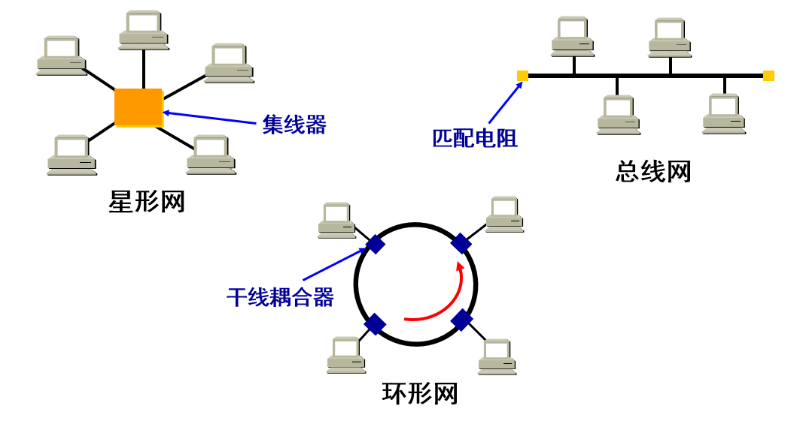

## 以太网

--------

`DIX Ethernet V2` 是世界上第一个局域网产品（以太网）的规约。`IEEE 802.3 `是第一个 IEEE 的以太网标准。`DIX Ethernet V2 标准与 IEEE 的 802.3 `标准只有很小的差别，因此可以将 802.3 局域网简称为“以太网”。严格说来，“以太网”应当是指符合 `DIX Ethernet V2 `标准的局域网 。 

#### 数据链路层的两个子层

为了使数据链路层能更好地适应多种局域网标准，`IEEE 802` 委员会就将局域网的数据链路层拆成两个子层：

- 逻辑链路控制 `LLC (Logical Link Control)` 子层 `IEEE 802.3`。
- 媒体接入控制 `MAC (Medium Access Control)` 子层 `DIX Ethernet V2`。

与接入到传输媒体有关的内容都放在 `MAC`子层，而 `LLC` 子层则与传输媒体无关，不管采用何种协议的局域网，对 `LLC` 子层来说都是透明的。

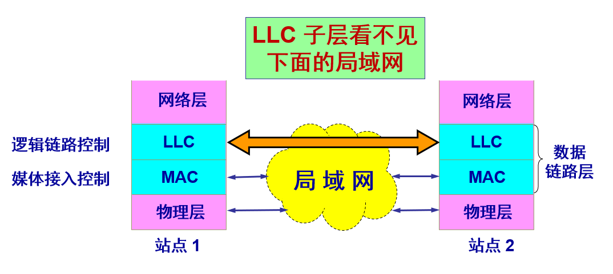

由于 `TCP/IP` 体系经常使用的局域网是 `DIX Ethernet V2` 而不是 `802.3` 标准中的几种局域网，因此现在 `802` 委员会制定的逻辑链路控制子层 `LLC`（即 `802.2` 标准）的作用已经不大了。很多厂商生产的适配器上就仅装有 `MAC` 协议而没有 `LLC` 协议。 

## 以太网协议

-------

以太网提供的服务是不可靠的交付，即尽最大努力的交付，当目的站收到有差错的数据帧时就丢弃此帧，其他什么也不做。差错的纠正由高层来决定。如果高层发现丢失了一些数据而进行重传，但以太网并不知道这是一个重传的帧，而是当作一个新的数据帧来发送。  

最初的以太网是将许多计算机都连接到一根总线上。当初认为这种连接方法简单又可靠，因为总线上没有源器件。 

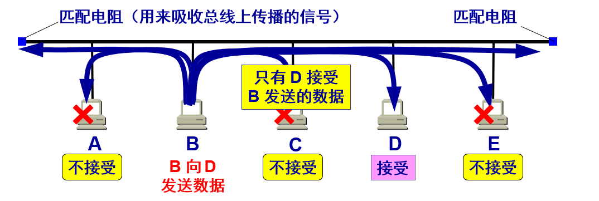

以太网采用广播方式发送，总线上的每一个工作的计算机都能检测到 `B` 发送的数据信号。 由于只有计算机 `D` 的地址与数据帧首部写入的地址一致，因此只有 `D` 才接收这个数据帧。 其他所有的计算机（`A, C` 和 `E`）都检测到不是发送给它们的数据帧，因此就丢弃这个数据帧而不能够收下来。在具有广播特性的总线上实现了一对一的通信。  

**为了通信的简便，以太网采取了两种重要的措施：**

(1) 采用较为灵活的无连接的工作方式：

1. 不必先建立连接就可以直接发送数据。

2. 对发送的数据帧不进行编号，也不要求对方发回确认。

   > 这样做的理由是局域网信道的质量很好，因信道质量产生差错的概率是很小的。 

(2) 以太网发送的数据都使用曼彻斯特 `(Manchester)` 编码：

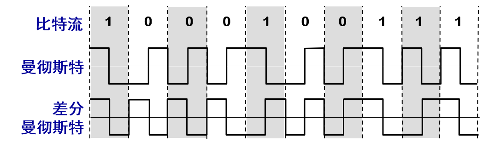

> 曼彻斯特编码缺点是：它所占的频带宽度比原始的基带信号增加了一倍。

#### `CSMA/CD` 协议：

`CSMA/CD` 含义：载波监听多点接入 / 碰撞检测 `(Carrier Sense Multiple Access with Collision Detection)` 。

- `多点接入`：表示许多计算机以多点接入的方式连接在一根总线上。

- `载波监听`：是指每一个站在发送数据之前先要检测一下总线上是否有其他计算机在发送数据，如果有，则暂时不要发送数据，以免发生碰撞。 

  > 总线上没有什么“载波”。因此，载波监听就是用电子技术检测总线上有没有其他计算机发送的数据信号。

- `碰撞检测`就是计算机边发送数据边检测信道上的信号电压大小。当几个站同时在总线上发送数据时，总线上的信号电压摆动值将会增大（互相叠加），**当一个站检测到的信号电压**摆动值超过一定的门限值时，就认为总线上至少有两个站同时在发送数据，表明产生了碰撞。

  在发生碰撞时，总线上传输的信号产生了严重的失真，无法从中恢复出有用的信息来。每一个正在发送数据的站，一旦发现总线上出现了碰撞，就要立即停止发送，免得继续浪费网络资源，然后等待一段随机时间后再次发送。

  > 所谓“碰撞”就是发生了冲突。因此“碰撞检测”也称为“冲突检测”。

**碰撞检测**

由于电磁波在总线上的传播速率是有限的，当某个站监听到总线是空闲时，也可能总线并非真正是空闲的，`A` 向 `B` 发出的信息，要经过一定的时间后才能传送到 `B`。`B` 若在 `A` 发送的信息到达 `B` 之前发送自己的帧 (因为这时 `B` 的载波监听检测不到 `A` 所发送的信息)，则必然要在某个时间和 `A` 发送的帧发生碰撞。

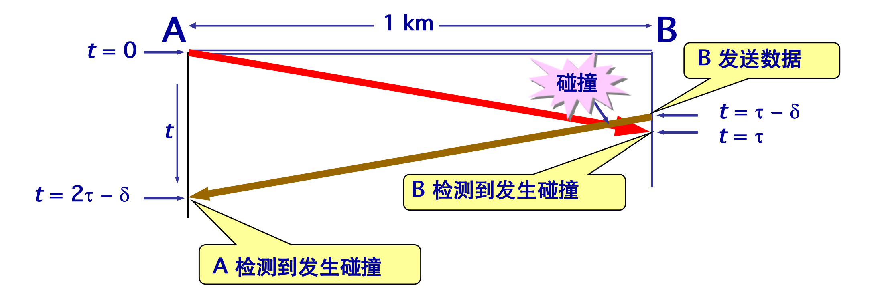

> `A`需要单程传播时延的 `2` 倍的时间，才能检测到与 `B` 的发送产生了冲突。

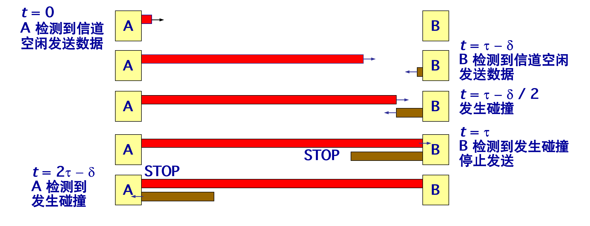

**特性：**

1. 使用 CSMA/CD 协议的以太网不能进行全双工通信而只能进行双向交替通信（半双工通信）。
2. 每个站在发送数据之后的一小段时间内，存在着遭遇碰撞的可能性。 
3. 这种发送的不确定性使整个以太网的平均通信量远小于以太网的最高数据率。  

**二进制指数类型退避算法 (truncated binary exponential type)**

发生碰撞的站在停止发送数据后，要推迟（退避）一个随机时间才能再发送数据。

基本退避时间取为争用期 `2t`，从整数集合 [`0, 1`, … , `(2^k - 1)`] 中随机地取出一个数，记为 `r`，重传所需的时延就是 `r` 倍的基本退避时间。参数 `k` 按下面的公式计算：
$$
k = Min[重传次数, 10]
$$
即当 `k <``= 10` 时，参数 `k` 等于重传次数，当重传达 `16` 次仍不能成功时即丢弃该帧，并向高层报告。 

**争用期：**

最先发送数据帧的站，在发送数据帧后至多经过时间 `2t` （两倍的端到端往返时延）就可知道发送的数据帧是否遭受了碰撞，以太网的端到端往返时延 `2t` 称为争用期，或碰撞窗口，经过争用期这段时间还没有检测到碰撞，才能肯定这次发送不会发生碰撞。

**争用期的长度 ：**

`10 Mbit/s` 以太网取 `51.2` μ`s` 为争用期的长度，对于 `10 Mbit/s` 以太网，在争用期内可发送 `512 bit`，即 `64` 字节，这意味着：以太网在发送数据时，若前 `64` 字节没有发生冲突，则后续的数据就不会发生冲突。

**最短有效帧长：** 

如果发生冲突，就一定是在发送的前 64 字节之内。 由于一检测到冲突就立即中止发送，这时已经发送出去的数据一定小于 64 字节。 以太网规定了最短有效帧长为 64 字节，凡长度小于 64 字节的帧都是由于冲突而异常中止的无效帧。

**强化碰撞 :**

当发送数据的站一旦发现发生了碰撞时：

- 立即停止发送数据；
- 再继续发送若干比特的人为干扰信号 `(jamming signal)`，以便让所有用户都知道现在已经发生了碰撞。 

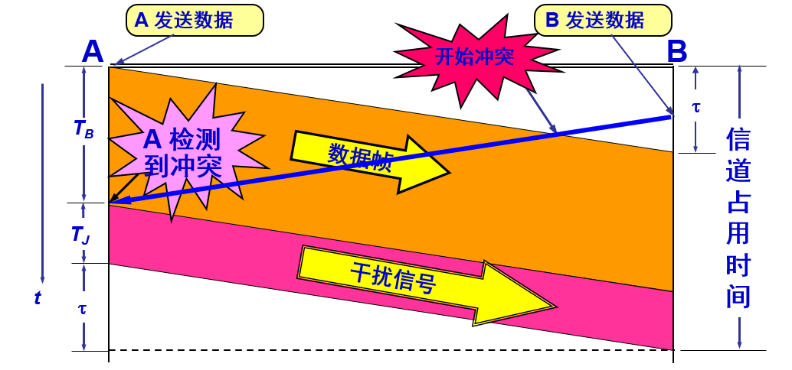

B 也能够检测到冲突，并立即停止发送数据帧，接着就发送干扰信号。这里为了简单起见，只画出 A 发送干扰信号的情况。

**CSMA/CD协议的要点：**

1. 准备发送：但在发送之前，必须先检测信道。
2. 检测信道：若检测到信道忙，则应不停地检测，一直等待信道转为空闲。若检测到信道空闲，并在 96 比特时间内信道保持空闲（保证了帧间最小间隔），就发送这个帧。
3. 检查碰撞：在发送过程中仍不停地检测信道，即网络适配器要边发送边监听。这里只有两种可能性：
4. 发送成功：在争用期内一直未检测到碰撞。这个帧肯定能够发送成功。发送完毕后，其他什么也不做。然后回到 (1)。
5. 发送失败：在争用期内检测到碰撞。这时立即停止发送数据，并按规定发送人为干扰信号。适配器接着就执行指数退避算法，等待 r 倍 512 比特时间后，返回到步骤 (2)，继续检测信道。但若重传达 16 次仍不能成功，则停止重传而向上报错。

#### 以太网的信道利用率

多个站在以太网上同时工作就可能会发生碰撞，当发生碰撞时，信道资源实际上是被浪费了。因此，当扣除碰撞所造成的信道损失后，以太网总的信道利用率并不能达到 `100%`。

假设 `t` 是以太网单程端到端传播时延。则争用期长度为 `2t`，即端到端传播时延的两倍，检测到碰撞后不发送干扰信号。设帧长为 `L (bit)`，数据发送速率为 `C (bit/s)`，则帧的发送时间为 `T0 = L/C (s)`。 

一个站在发送帧时出现了碰撞。经过一个争用期 `2t` 后，可能又出现了碰撞。这样经过若干个争用期后，一个站发送成功了。假定发送帧需要的时间是 `T0`。

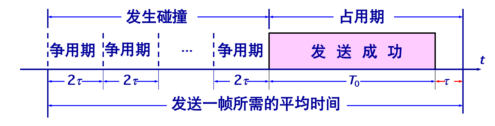

注意到，**成功发送一个帧(占用期)**需要占用信道的时间是 T0 + t，比这个帧的发送时间要多一个单程端到端时延 t。

要提高以太网的信道利用率，就必须减小 t 与 T0 之比，在以太网中定义了参数 α，它是以太网单程端到端时延 t 与帧的发送时间 T0 之比： 

> α 越大，表明争用期所占的比例增大，每发生一次碰撞就浪费许多信道资源，使得信道利用率明显降低。

**对以太网参数 α 的要求是：**

1. 当数据率一定时，以太网的连线的长度受到限制，否则 t 的数值会太大。

2. 以太网的帧长不能太短，否则 T0 的值会太小，使 α 值太大。  

**理想情况：**

在理想化的情况下，以太网上的各站发送数据都不会产生碰撞（这显然已经不是 CSMA/CD，而是需要使用一种特殊的调度方法），即总线一旦空闲就有某一个站立即发送数据。

发送一帧占用线路的时间是 T0 + t，而帧本身的发送时间是 T0。于是我们可计算出理想情况下的极限信道利用率 Smax 为： 

> 只有当参数 a 远小于 1 才能得到尽可能高的极限信道利用率。

#### 使用集线器的星形拓扑

传统以太网最初是使用粗同轴电缆，后来演进到使用比较便宜的细同轴电缆，最后发展为使用更便宜和更灵活的双绞线。采用双绞线的以太网采用星形拓扑，在星形的中心则增加了一种可靠性非常高的设备，叫做集线器 `(hub)`。

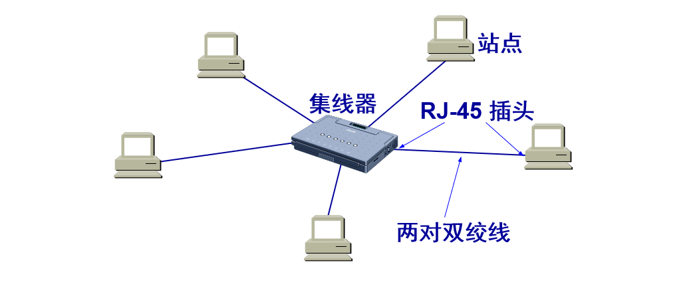

`1990` 年，`IEEE` 制定出星形以太网 `10BASE-T` 的标准 `802.3i`。

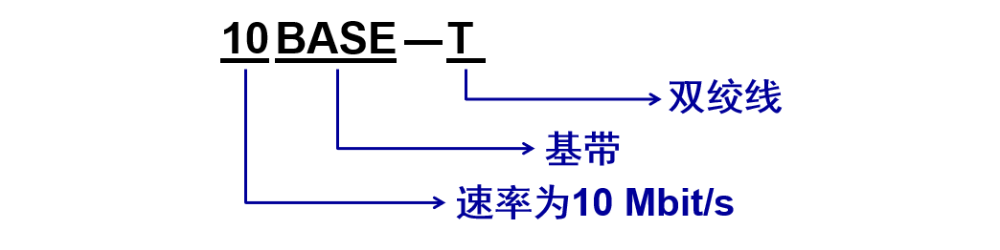

星形以太网 `10BASE-T` 使用无屏蔽双绞线，采用星形拓扑，每个站需要用两对双绞线，分别用于发送和接收，双绞线的两端使用 `RJ-45` 插头。集线器使用了大规模集成电路芯片，因此集线器的可靠性提高。 `10BASE-T` 的通信距离稍短，每个站到集线器的距离不超过 `100 m`。

**集线器：**

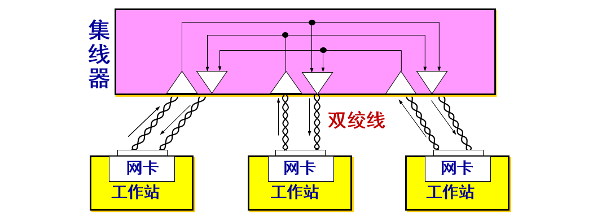

(1) 集线器是使用电子器件来模拟实际电缆线的工作，因此整个系统仍然像一个传统的以太网那样运行。 
(2) **使用集线器的以太网在逻辑上仍是一个总线网，各工作站使用的还是 CSMA/CD 协议，并共享逻辑上的总线。** 
(3) 集线器很像一个多接口的转发器，工作在物理层。
(4) 集线器采用了专门的芯片，进行自适应串音回波抵消，减少了近端串音。 

## 以太网的 `MAC` 层

-------

#### `MAC` 层的硬件地址

在局域网中，硬件地址又称为物理地址，或 `MAC` 地址。 `802` 标准所说的地址严格地讲应当是每一个站的“名字”或标识符。

> **注意：**如果连接在局域网上的主机或路由器安装有多个适配器，那么这样的主机或路由器就有多个“地址”。更准确些说，这种 48 位“地址”应当是某个接口的标识符。

`IEEE 802` 标准规定 `MAC` 地址字段可采用 `6` 字节 (`48`位) 或 `2` 字节 ( `16` 位) 这两种中的一种。

`IEEE` 的注册管理机构 `RA` 负责向厂家分配地址字段 `6` 个字节中的前三个字节 (即高位 `24` 位)，称为组织唯一标识符。地址字段 `6` 个字节中的后三个字节 (即低位 `24` 位) 由厂家自行指派，称为扩展唯一标识符，必须保证生产出的适配器没有重复地址。

一个地址块可以生成 `2^24` 个不同的地址。这种 `48` 位地址称为 `MAC-48`，它的通用名称是 `EUI-48`。生产适配器时，`6` 字节的 `MAC` 地址已被固化在适配器的 `ROM`，因此，`MAC` 地址也叫做硬件地址 `(hardware address)`或物理地址。

“`MAC`地址”实际上就是适配器地址或适配器标识符 `EUI-48`。

#### 单站地址，组地址，广播地址

`IEEE` 规定地址字段的第一字节的最低位为 `I/G` 位。`I/G` 表示 `Individual / Group`。

当 `I/G`位 `= 0` 时，地址字段表示一个单站地址。

当 `I/G`位 `= 1` 时，表示组地址，用来进行多播。此时，`IEEE` 只分配地址字段前三个字节中的 `23` 位。

所有 `48` 位都为 `1` 时，为广播地址。只能作为目的地址使用。

> 当 `I/G` 位分别为 `0` 和 `1` 时，一个地址块可分别生成 `2^23` 个单个站地址和 `2^23` 个组地址。

#### 全球管理，本地管理

`IEEE` 把地址字段第一字节的最低第 `2` 位规定为 `G/L` 位，表示 `Global / Local`。

当 `G/L`位 `= 0` 时，是全球管理（保证在全球没有相同的地址），厂商向`IEEE`购买的 `OUI` 都属于全球管理。

当 `G/L`位 `= 1` 时， 是本地管理，这时用户可任意分配网络上的地址。

#### 适配器检查 `MAC` 地址

适配器从网络上每收到一个 `MAC` 帧就首先用硬件检查 `MAC` 帧中的 `MAC` 地址，如果是发往本站的帧则收下，然后再进行其他的处理。否则就将此帧丢弃，不再进行其他的处理。

发往本站的帧包括以下三种帧： 

- 单播 `(unicast)` 帧（一对一）
- 广播 `(broadcast)` 帧（一对全体）
- 多播 `(multicast)` 帧（一对多）

所有的适配器都至少能够识别前两种帧，即能够识别单播地址和广播地址，有的适配器可用编程方法识别多播地址。以混杂方式 `(promiscuous mode)` 工作的以太网适配器只要“听到”有帧在以太网上传输就都接收下来。

#### `MAC` 帧的格式

常用的以太网 MAC 帧格式有两种标准 ：`DIX Ethernet V2` 标准、`IEEE 的 802.3 `标准，最常用的 `MAC` 帧是以太网 `V2` 的格式。

+ ==类型字段== 用来标志上一层使用的是什么协议，以便把收到的 `MAC` 帧的数据上交给上一层的这个协议。 

+ ==数据字段== 的正式名称是 `MAC` 客户数据字段，最小长度 `64` 字节 `- 18` 字节的首部和尾部 `=` 数据字段的最小长度（`46`字节） 

> + 当数据字段的长度小于 `46` 字节时，应在数据字段的后面加入整数字节的填充字段，以保证以太网的 `MAC` 帧长不小于 `64` 字节。

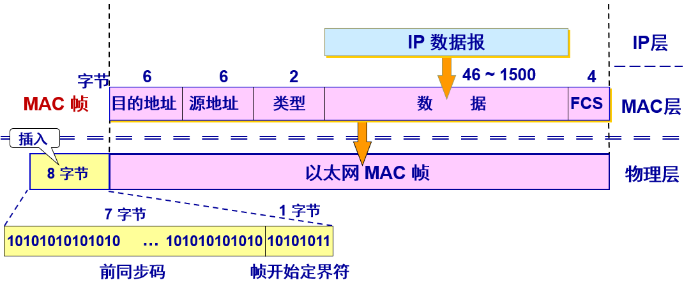

+ ==前同步码和帧定界符== 为了达到比特同步，在传输媒体上实际传送的要比 MAC 帧还多 8 个字节：

> + 在帧的前面插入（硬件生成）的 `8` 字节中，第一个字段共 `7` 个字节，是前同步码，用来迅速实现 `MAC` 帧的比特同步。第二个字段 `1` 个字节是帧开始定界符，表示后面的信息就是 `MAC` 帧。 

> **IEEE 802.3** 与以太网V2 MAC 帧格式相似，区别在于：
>
> + IEEE 802.3 规定的 MAC 帧的第三个字段是“长度 / 类型”。当这个字段值大于 0x0600 时 (相当于十进制的 1536)，就表示“类型”。这样的帧和以太网 V2 帧完全一样。当这个字段值小于 0x0600 时才表示“长度”。
>
> + 当“长度/类型”字段值小于 0x0600 时，数据字段必须装入上面的逻辑链路控制 LLC 子层的 LLC 帧

## 以太网的拓展

--------

现如今以太网一般采用双绞线和集线器进行数据传输，传输范围大概100米，那么如何使用手段拓展以太网？

#### 在物理层扩展以太网

**光纤拓展：**

使用光纤扩展主机使用光纤（通常是一对光纤）和一对光纤调制解调器连接到集线器。 很容易使主机和几公里以外的集线器相连接。

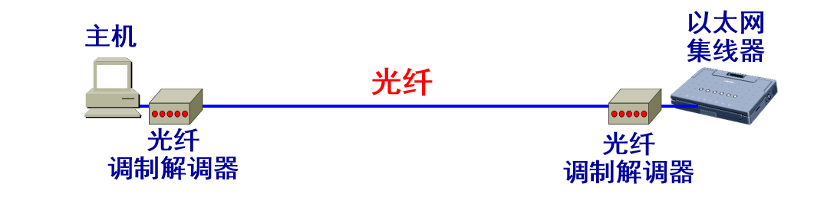

**使用集线器扩展：**

使用多个集线器可连成更大的、多级星形结构的以太网。一个学院的三个系各有一个 10BASE-T 以太网，可通过一个主干集线器把各系的以太网连接起来，成为一个更大的以太网。

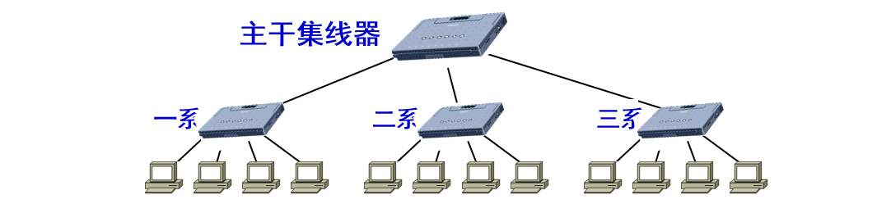

这样使原来属于不同碰撞域的以太网上的计算机能够进行跨碰撞域的通信，扩大了以太网覆盖的地理范围。但是碰撞域增大了，但总的吞吐量并未提高。如果不同的碰撞域使用不同的数据率，那么就不能用集线器将它们互连。   

#### 在数据链路层扩展以太网

扩展以太网更常用的方法是在数据链路层进行，早期使用网桥，现在使用以太网交换机。

**网桥：**

网桥工作在数据链路层。它根据 MAC 帧的目的地址对收到的帧进行转发和过滤，当网桥收到一个帧时，并不是向所有的接口转发此帧，而是先检查此帧的目的 MAC 地址，然后再确定将该帧转发到哪一个接口，或把它丢弃。 

**以太网交换机：**

交换式集线器常称为以太网交换机 (switch) 或第二层交换机 (L2 switch)，强调这种交换机工作在数据链路层。

以太网交换机实质上就是一个多接口的网桥，通常都有十几个或更多的接口。**每个接口都直接与一个单台主机或另一个以太网交换机相连，并且一般都工作在全双工方式。**相互通信的主机都是独占传输媒体，无碰撞地传输数据。

**交换方式：**

- 存储转发方式：把整个数据帧先缓存后再进行处理。当需要进行线路速率匹配、协议转换或差错检测时采用储存转发的方式。
- 直通 (cut-through) 方式：接收数据帧的同时就立即按数据帧的目的 MAC 地址决定该帧的转发接口，因而提高了帧的转发速度。缺点是它不检查差错就直接将帧转发出去，因此有可能也将一些无效帧转发给其他的站。

> IEEE 802.1D 标准制定了一个生成树协议 `STP  (Spanning Tree Protocol)`，其要点是：不改变网络的实际拓扑，但在逻辑上则切断某些链路，使得从一台主机到所有其他主机的路径是无环路的树状结构，从而消除了兜圈子现象。

**交换表：**

以太网交换机运行自学习算法自动维护交换表，开始时，以太网交换机里面的交换表是空的：

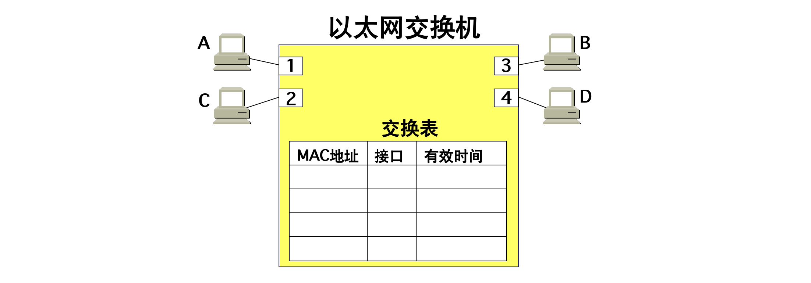

`A` 先向 `B` 发送一帧，从接口 `1` 进入到交换机，交换机收到帧后，先查找交换表，没有查到应从哪个接口转发这个帧，交换机把这个帧的源地址 `A` 和接口 `1` 写入交换表中，并向除接口`1`以外的所有的接口广播这个帧。

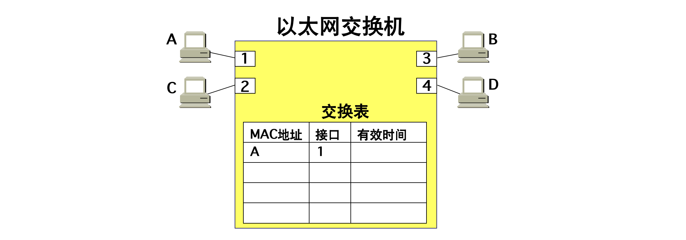

`C` 和 `D` 将丢弃这个帧，因为目的地址不对。只 `B` 才收下这个目的地址正确的帧。这也称为过滤。从新写入交换表的项目 `(A, 1)` 可以看出，以后不管从哪一个接口收到帧，只要其目的地址是`A`，就应当把收到的帧从接口`1`转发出去。

`B` 通过接口 `3` 向 `A` 发送一帧，交换机查找交换表，发现交换表中的 `MAC` 地址有 `A`。表明要发送给`A`的帧（即目的地址为 `A` 的帧）应从接口`1`转发。于是就把这个帧传送到接口 `1` 转发给 `A`。显然，现在已经没有必要再广播收到的帧。

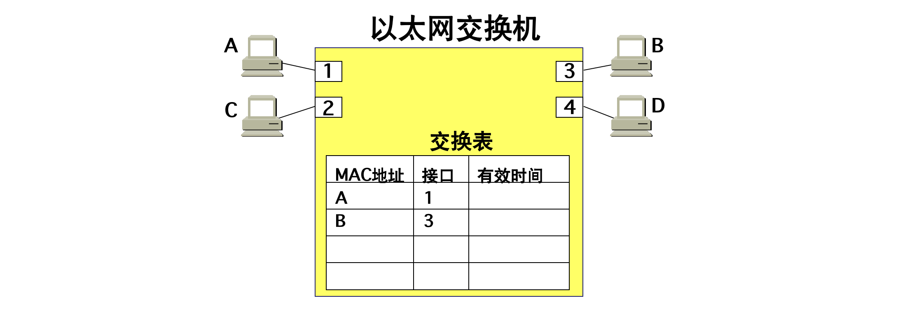

交换表这时新增加的项目 `(B, 3)`，表明今后如有发送给 `B` 的帧，就应当从接口 `3` 转发出去，经过一段时间后，只要主机 `C` 和 `D` 也向其他主机发送帧，以太网交换机中的交换表就会把转发到 `C` 或 `D` 应当经过的接口号（`2` 或 `4`）写入到交换表中。

> 考虑到可能有时要在交换机的接口更换主机，或者主机要更换其网络适配器，这就需要更改交换表中的项目。为此，在交换表中每个项目都设有一定的有效时间。过期的项目就自动被删除。

以太网交换机的这种自学习方法使得以太网交换机能够即插即用，不必人工进行配置，因此非常方便。

## 令牌环

------

**令牌环**（英语：Token-Ring）又称**权标环**或**權杖環**，是定义在[IEEE 802.5](https://zh.wikipedia.org/wiki/IEEE_802.5)标准中的一种[局域网](https://zh.wikipedia.org/wiki/局域网)接入方式。

令牌环网络的基本原理是利用令牌（代表发信号的许可）来避免网络中的冲突，它与使用冲突检测算法[CSMA/CD](https://zh.wikipedia.org/wiki/CSMA/CD)的[以太网](https://zh.wikipedia.org/wiki/以太网)相比能提高网络的数据传送率。此外，它还可以设定传送的优先度。一个4M的令牌环网络和一个10M的[以太网](https://zh.wikipedia.org/wiki/以太网)数据传送率相当，一个16M的令牌环网络的数据传送率接近一个100M的以太网。但这种网络不可复用，导致网络利用率低下。当网络中一个结点拿到令牌而使用网络后，不管此结点使用多少带宽，其他结点都必须等待其使用完网络并放弃令牌后才有机会申请令牌并使用网络。此外，网络中还需专门结点维护令牌。

令牌环也暗示了除了使用令牌外，这还是一个环形[网络拓扑](https://zh.wikipedia.org/wiki/网络拓扑)。令牌环是一个[OSI 7层模型](https://zh.wikipedia.org/wiki/TCP/IP参考模型)中的第二层（[数据链路层](https://zh.wikipedia.org/wiki/数据链路层)）协议。除了4Mbps、16Mbps外，IEEE 802.5还定义了100Mbps和1Gbps的数据传输率，不过后两者极少被用到。

令牌环网络是1980年代中期由[IBM](https://zh.wikipedia.org/wiki/IBM)开发，很长一段时间是IBM的网络标准、被IBM生产所有的计算机支持。令牌环可以用[桥接器](https://zh.wikipedia.org/wiki/橋接器)或[路由器](https://zh.wikipedia.org/wiki/路由器)连接其他网络。令牌环网络在实际应用中确实是“环”形网络，只不过由于使用所谓[多站接入单元](https://zh.wikipedia.org/wiki/多站接入单元)设备而可以实现星形布线。这样的设备具有一定智能，会将不用的[端口](https://zh.wikipedia.org/wiki/端口)环接起来，使令牌畅通。IEEE 802.5标准主要基于IBM的令牌环网络，但也有一些细微差别。

#### 传输方法

传送数据时会由掌握令牌的电脑先发送数据。接收数据的电脑会检查帧表头，若是送给自己的则处理之。无论是否是送给自己的，都会再传下去，传一圈后检查资料是否相同以确认资料没有传输错误。待送完数据后可以依需要调整令牌的优先度（改得比自己的优先度低），再把令牌传递到下一台电脑。若接收到令牌但优先度较自己的高，则要把令牌传递到下一台电脑。

## 虚拟局域网

-------

利用以太网交换机可以很方便地实现虚拟局域网 `VLAN (Virtual LAN)`。虚拟局域网 `VLAN` 是由一些局域网网段构成的**与物理位置无关的逻辑组**，而这些网段具有某些共同的需求。每一个 `VLAN` 的帧都有一个明确的标识符，指明发送这个帧的计算机是属于哪一个 `VLAN`。虚拟局域网其实只是局域网给用户提供的一种服务，而并不是一种新型局域网。

> + 由于虚拟局域网是用户和网络资源的逻辑组合，因此可按照需要将有关设备和资源非常方便地重新组合，使用户从不同的服务器或数据库中存取所需的资源。

#### 示例

`10` 台计算机划分为三个虚拟局域网：`VLAN1, VLAN2` 和 `VLAN3`，当 `B1` 向 `VLAN2` 工作组内成员发送数据时，工作站 `B2` 和 `B3` 将会收到广播的信息。`B1` 发送数据时，工作站 `A1`，`A2` 和 `C1`都不会收到 `B1` 发出的广播信息。 

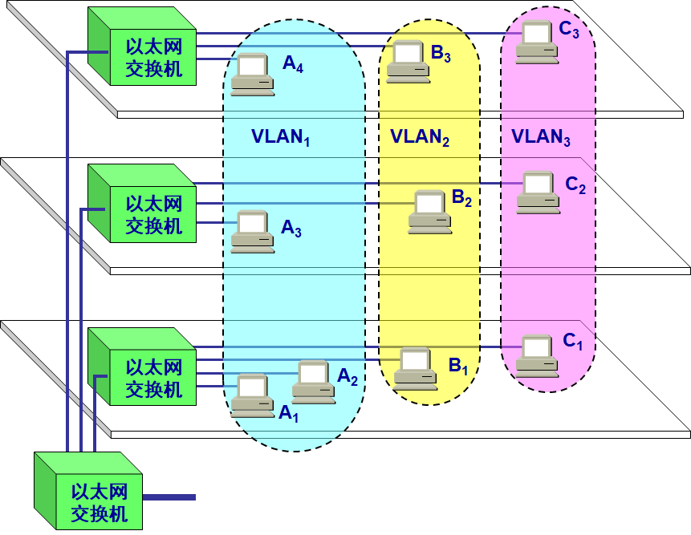

虚拟局域网限制了接收广播信息的工作站数，使网络不会因传播过多的广播信息(即“广播风暴”)而引起性能恶化。 

#### 以太网帧格式

`IEEE` 批准了 `802.3ac` 标准，该标准定义了以太网的帧格式的扩展，以支持虚拟局域网。虚拟局域网协议允许在以太网的帧格式中插入一个`4`字节的标识符，称为 `VLAN` 标记 `(tag)`，用来指明发送该帧的计算机属于哪一个虚拟局域网。插入 `VLAN` 标记得出的帧称为 `802.1Q`帧或带标记的以太网帧。

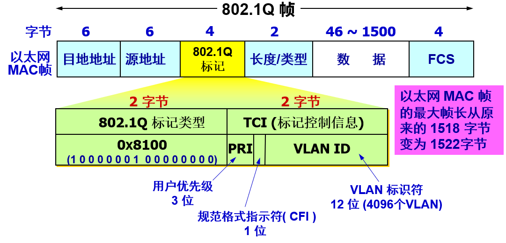

#### `VLAN` 划分

**按端口划分 `VLAN`**

许多`VLAN`厂商都利用交换机的端口来划分 `VLAN` 成员。被设定的端口都在同一个广播域中。例如，一个交换机的 `1`，`2`，`3`，`4`，`5` 端口被定义为虚拟网 `AAA` ，同一交换机的`6`，`7`，`8` 端口组成虚拟网 `BBB`。这样做允许各端口之间的通讯，并允许共享型网络的升级。但是，这种划分模式将虚拟网限制在了一台交换机上。 

第二代端口 `VLAN` 技术允许跨越多个交换机的多个不同端口划分 `VLAN`，不同交换机上的若干个端口可以组成同一个虚拟网。 [`4`] 

以交换机端口来划分网络成员，其配置过程简单明了。因此，从目前来看，这种根据端口来划分 `VLAN` 的方式仍然是最常用的一种方式。 [`4`] 

**按 `MAC` 地址划分 `VLAN`**

这种划分 `VLAN` 的方法是根据每个主机的 `MAC` 地址来划分，即对每个 `MAC` 地址的主机都配置它属于哪个组。这种划分 `VLAN` 方法的最大优点就是当用户物理位置移动时，即从一个交换机换到其他的交换机时，`VLAN` 不用重新配置，所以，可以认为这种根据 `MAC` 地址的划分方法是基于用户的 `VLAN`，这种方法的缺点是初始化时，所有的用户都必须进行配置，如果有几百个甚至上千个用户的话，配置是非常累的。而且这种划分的方法也导致了交换机执行效率的降低，因为在每一个交换机的端口都可能存在很多个 `VLAN` 组的成员，这样就无法限制广播包了。另外，对于使用笔记本电脑的用户来说，他们的网卡可能经常更换，这样，`VLAN` 就必须不停地配置。 [`4`] 

**按网络层划分**

这种划分 `VLAN` 的方法是根据每个主机的网络层地址或协议类型(如果支持多协议)划分的，虽然这种划分方法是根据网络地址，比如 `IP` 地址，但它不是路由，与网络层的路由毫无关系。 

这种方法的优点是用户的物理位置改变了，不需要重新配置所属的`VLAN`，而且可以根据协议类型来划分`VLAN`，这对网络管理者来说很重要，还有，这种方法不需要附加的帧标签来识别`VLAN`，这样可以减少网络的通信量。 [`4`] 

这种方法的缺点是效率低，因为检查每一个数据包的网络层地址是需要消耗处理时间的(相对于前面两种方法)，一般的交换机芯片都可以自动检查网络上数据包的以太网帧头，但要让芯片能检查`IP`帧头，需要更高的技术，同时也更费时。当然，这与各个厂商的实现方法有关。 [`4`] 

**按`IP`组播划分**

`IP`组播实际上也是一种`VLAN`的定义，即认为一个组播组就是一个`VLAN`，这种划分的方法将`VLAN`扩大到了广域网，因此这种方法具有更大的灵活性，而且也很容易通过路由器进行扩展，当然这种方法不适合局域网，主要是效率不高。 [`4`] 

**基于规则的`VLAN`**

也称为基于策略的`VLAN`。这是最灵活的`VLAN`划分方法，具有自动配置的能力，能够把相关的用户连成一体，在逻辑划分上称为“关系网络”。网络管理员只需在网管软件中确定划分`VLAN`的规则（或属性），那么当一个站点加入网络中时，将会被“感知”，并被自动地包含进正确的`VLAN`中。同时，对站点的移动和改变也可自动识别和跟踪。 [`4`] 

采用这种方法，整个网络可以非常方便地通过路由器扩展网络规模。有的产品还支持一个端口上的主机分别属于不同的`VLAN`，这在交换机与共享式`Hub`共存的环境中显得尤为重要。自动配置`VLAN`时，交换机中软件自动检查进入交换机端口的广播信息的`IP`源地址，然后软件自动将这个端口分配给一个由`IP`子网映射成的`VLAN`。 [`4`] 

**按用户定义、非用户授权划分**

基于用户定义、非用户授权来划分`VLAN`，是指为了适应特别的`VLAN`网络，根据具体的网络用户的特别要求来定义和设计`VLAN`，而且可以让非`VLAN`群体用户访问`VLAN`，但是需要提供用户密码，在得到`VLAN`管理的认证后才可以加入一个`VLAN`。 [`4`] 

> 以上划分`VLAN`的方式中，基于端口的`VLAN`端口方式建立在物理层上；`MAC`方式建立在数据链路层上；网络层和`IP`广播方式建立在第三层上。 [`4`]

## 高速以太网

--------

#### 100BASE-T 以太网

速率达到或超过 `100 Mbit/s` 的以太网称为高速以太网，`100BASE-T` 在双绞线上传送 `100 Mbit/s` 基带信号的星形拓扑以太网，仍使用 `IEEE 802.3` 的`CSMA/CD` 协议。

==100 Mbit/s 以太网的三种不同的物理层标准：==

**100BASE-TX：**

- 使用 2 对 UTP 5 类线 或 屏蔽双绞线 STP。
- 网段最大程度：100米。

**100BASE-T4：**

- 使用 4 对 UTP 3 类线 或 5 类线。 
- 网段最大程度：100米。

**100BASE-FX ：**

- 使用 2 对光纤。 
- 网段最大程度：2000米。

#### 吉比特以太网

允许在 `1 Gbit/s` 下以全双工和半双工两种方式工作。仍使用 `IEEE 802.3` 协议规定的帧格式。在半双工方式下使用 `CSMA/CD` 协议，全双工方式不使用 `CSMA/CD` 协议。与 `10BASE-T` 和 `100BASE-T` 技术向后兼容。

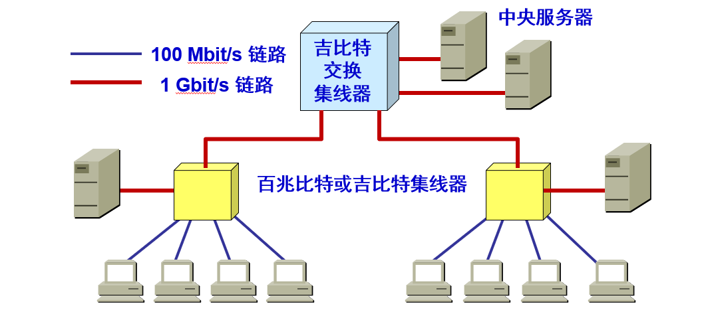

> 吉比特以太网可用作现有网络的主干网，也可在高带宽（高速率）的应用场合中。

使用两种成熟的技术：一种来自现有的以太网，另一种则是美国国家标准协会 ANSI 制定的光纤通道 FC 。

| **名称**        | **媒体** | **网段最大长度** | **特点**                                       |
| --------------- | -------- | ---------------- | ---------------------------------------------- |
| **1000BASE-SX** | **光缆** | **550  m**       | **多模光纤（50** 和 62.5  mm）                 |
| **1000BASE-LX** | **光缆** | **5000  m**      | **单模光纤（10** mm）多模光纤（50 和 62.5 mm） |
| **1000BASE-CX** | **铜缆** | **25  m**        | **使用 2 对屏蔽双绞线电缆** STP                |
| **1000BASE-T**  | **铜缆** | **100  m**       | **使用 4 对 UTP  5 类**线                      |

