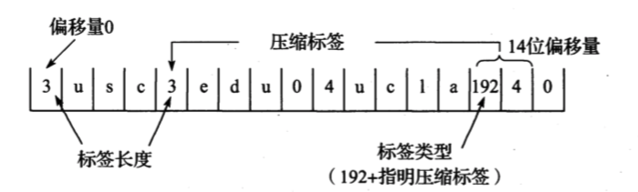

## DNS

------

域名系统（`DNS`）是一种用于`UDP/IP`应用程序的分布式数据库，它提供主机名字和`IP`地址之间的转换及有关电子邮件的选路信息。这里提到的分布式是指在`Internet`上的单个站点不能拥有所有的信息。每个站点（如大学中的系、校园、公司或公司中的部门）保留它自己的信息数据库，并运行一个服务器程序供`Internet`上的其他系统（客户程序）查询。`DNS`提供了允许服务器和客户程序相互通信的协议。

从应用的角度上看，对`DNS`的访问是通过一个地址解析器（`resolver`）来完成的。在`Unix`主机中，该解析器对外暴露两个库函数`gethostbyname(3)`和`gethostbyaddr(3)`接口来访问，它们在编译应用程序时与应用程序连接在一起。前者接收主机名字返回`IP`地址，而后者接收`IP`地址来寻找主机名字。解析器通过一个或多个名字服务器来完成这种相互转换。

解析器通常是**应用程序**的一部分。解析器并不像`TCP/IP`协议那样是操作系统的内核。所以在一个应用程序请求`TCP`打开一个连接或使用`UDP`发送一个数据报之前。心须将一个主机名转换为一个`IP`地址。而操作系统内核中的`TCP/IP`协议族对于`DNS`一点都不知道。

## 域名系统

------

`DNS`的名字空间和`Unix`的文件系统相似，也具有层次结构。下图显示了这种层次的组织形式。


每个结点有一个至多`63`个字符长的标识。这颗树的树根是没有任何标识的特殊结点。命名标识中一律不区分大写和小写。命名树上任何一个结点的域名就是将从该结点到最高层的域名串连起来，中间使用一个点 `.`分隔这些域名（注意这和`Unix`文件系统路径的形成不同，文件路径是由树根依次向下的形成的）。域名树中的每个结点必须有一个唯一的域名，但域名树中的不同结点可使用相同的标识。

以点 `.` 结尾的域名称为绝对域名或完全合格的域名`FQDN`（`Full Qualified DomainName`），例如`sun.tuc.noao.edu.`。完全限定的域名 `(FQDN)` 唯一地标识在 `DNS` 分层树中的主机的位置，通过指定的路径中点分隔从根引用的主机的名称列表。如果一个域名不以点结尾，则认为该域名是不完全的。如何使域名完整依赖于使用的`DNS`软件。如果不完整的域名由两个或两个以上的标号组成，则认为它是完整的；或者在该域名的右边加入一个局部后缀。例如域名`sun`通过加上局部后缀.`tuc.noao.edu`.成为完整的。

#### 域名空间

域名空间一般由五个部分组成：

+ 根域： `DNS` 域名使用的时候，规定由句尾的 `.` 来表示名称位于根或者更高级的结构。

+ 顶级域名被分为三个部分：

  1. `arpa` 是一个用作地址到名字转换的特殊域。

  2. `7` 个 `3` 字符长的普通域。有些书也将这些域称为组织域。

     

  3. 所有 `2` 字符长的域均是基于 `ISO3166` 中定义的国家代码，这些域被称为国家域，或地理域。

+ 第二层域：个人或者组织在 `internal` 注册的域名

+ 子域：已注册的二级域名的派生域名，通俗的将就是网站名。

+ 主机名：用于表示某一个网络上的主机，一般只在局域网中发生作用。

#### 域名授权

`DNS`的一个没在图中表示出来的重要特征是`DNS`中域名的授权。没有哪个机构来管理域名树中的每个标识，相反，只有一个机构，即网络信息中心`NIC`负责分配顶级域和委派其他指定地区域的授权机构。

一个独立管理的`DNS`子树称为一个区域`(zone)`。一个常见的区域是一个二级域，如`noao.edu`。许多二级域将它们的区域划分成更小的区域。例如，大学可能根据不同的系来划分区域，公司可能根据不同的部门来划分区域。

一个名字服务器负责一个或多个区域。一个区域的管理者必须为该区域提供一个主名字服务器和至少一个辅助名字服务器。主、辅名字服务器必须是独立和冗余的，以便当某个名字服务器发生故障时不会影响该区域的名字服务。主、辅名字服务器的主要区别在于主名字服务器从磁盘文件中调入该区域的所有信息，而辅名字服务器则从主服务器调入所有信息。我们将辅名字服务器从主服务器调入信息称为区域传送。

当一个新主机加入一个区域时，区域管理者将适当的信息（最少包括名字和`IP`地址）加入到运行在主名字服务器上的一个磁盘文件中，然后通知主名字服务器重新调入它的配置文件。辅名字服务器定时（通常是每隔`3`小时）向主名字服务器询问是否有新数据。如果有新数据，则通过区域传送方式获得新数据。

当一个名字服务器没有请求的信息时，它将如何处理？它必须与其他的名字服务器联系。（这正是`DNS`的分布特性）。然而，并不是每个名字服务器都知道如何同其他名字服务器联系。相反，每个名字服务器必须知道如何同根的名字服务器联系。`1993`年`4`月时有`8`个根名字服务器，所有的主名字服务器都必须知道根服务器的`IP`地址（这些`IP`地址在主名字服务器的配置文件中，主服务器必须知道根服务器的`IP`地址，而不是它们的域名）。根服务器则知道所有二级域中的每个授权名字服务器的名字和位置（即`IP`地址）。这意味着这样一个反复的过程：正在处理请求的名字服务器与根服务器联系，根服务器告诉它与另一个名字服务器联系。

> 你可以通过匿名的`FTP`获取当前的根服务器清单。具体是从`ftp.rs.internic.net`或`nic.ddn.mil`获取文件`netinfo/root-servers.txt`。

`DNS`的一个基本特性是使用超高速缓存。即当一个名字服务器收到有关映射的信息（主机名字到`IP`地址）时，它会将该信息存放在高速缓存中。这样若以后遇到相同的映射请求，就能直接使用缓存中的结果而无需通过其他服务器查询。

## DNS解析流程

------

了解一个域名的 `DNS` 解析流程之前我们先来看看三种 `DNS` 服务器：

+ 根 (`root`) `DNS` 服务器：在因特网上有 `13` 个根 `DNS` 服务器(标号为 `A` 到 `M)` ，尽管我们将这 `13` 个 `DNS` 服务器中的每个都视为单个的服务器，但每台"服务器"实际上是一个冗余服务器的网络，以提供安全性和可靠性到了 `2011` 年秋季，共有 `247` 个根服务器。
+ 
+ 顶级域 (`TLD`) `DNS` 服务器：这些服务器负责顶级域名如 `com`、`org`、`net`、`edu`、`gov`。
+ 权威 `DNS` 服务器：在因特网上具有公共可访问主机的每个组织机构必须提供公共可访问的 `DNS` 记录，这些记录将这些主机的名字映射为 `IP` 地址一个组织机构的权威 `DNS` 服务器收藏了这些 `DNS` 记录一个组织机构能够选择实现它自己的权威 `DNS` 服务器以保存这些记录;另一种方法是，该组织能够支付费用，让这些记录存储在某个服务提供商的一个权威 `DNS` 务器中 多数大学和大公司实现和维护它们自己基本和辅助(备份)的权威 `DNS` 服务器

还有另一类重要的 `DNS` ，称为本地 `DNS` 服务器 `(local DNS server)` 一个本地 `DNS` 服务器，严格说来并不属于该服务器的层次结构，但它对 `DNS` 层次结构是重要的 每个 `ISP` (如一个大学、一个系、一个公司或一个居民区的 `ISP)` 都有一台本地 `DNS` 服务器(也叫默认名字服务器) 。

#### 解析流程

**缓存**

当用户通过浏览器访问某域名时，浏览器首先会在自己的缓存中查找是否有该域名对应的`IP`地址（若曾经访问过该域名且没有清空缓存便存在），当浏览器缓存中无域名对应`IP`则会自动检查用户计算机系统`Hosts`文件`DNS`缓存是否有该域名对应`IP`；当浏览器及系统缓存中均无域名对应`IP`则进入路由器缓存中检查，以上三步均为客服端的`DNS`缓存；当在用户客服端查找不到域名对应`IP`地址，则将进入`ISP DNS`缓存中进行查询。比如你用的是电信的网络，则会进入电信的`DNS`缓存服务器中进行查找；

> *注意* 在缓存中获得的地址解析不具有权威性。

**递归查询**

如果每一层缓存都没有命中，接下来将进入递归查询或者迭代查询的流程(取决于查询报文的字段)，在递归查询中，如果本地`DNS`没命中，那么本地`DNS`回去向根域名服务器询问，根域名服务器会去向对应的`TLD`域名服务器询问，`TLD`又回去向权威`DNS`服务器询问，权威`DNS`查询到`ip`地址之后就会一层一层的返回，最后由本地`DNS`返回给客户端。


**迭代查询**

如果客户端使用的是迭代查询，那么如果本地`DNS`没命中，本地`DNS`会把根`DNS`服务器返回给客户端，之后客户端再去问根`DNS`，根`DNS`会把`TLD`服务器返回给客户端。在之后客户端去问`TLD`，`TLD`返回给他权威服务器，之后通过权威服务器返回`ip`给客户端。


#### 域名注册

上面的讨论只是关注如何从 `DNS` 数据库中取数据，你可能想知道这些数据最初是怎么进入数据库中的 我们在以个特定的例子中看看这是如何完成的 假定你刚刚创建一个*创业公司*，你必定要做的第一件事是在注册登记机构注册域名 `innoweb.cn`，注册登记机构 `registrar` 是一个商业实体，它验证该域名的唯一性，将该域名输入 `DNS` 数据库，对提供的服务收取少量费用。

当你向某些注册登记机构注册域名时，需要向该机构提供你的基本和辅助权威 `DNS` 服务器的名字和 `IP` 地址 假定该名字和 地址是 `dns1.innoweb.com`(`114.114.114.114`) 和 `dns2.innoweb.com` (`115.115.115.115`)，对这两个权威 `DNS` 服务器的每个，该注册登记机构确保将一个类型 `NS` 和一个类型 `A` 的记录输入 `TLD com` 服务，特别是对于用于 `innoweb.com` 的基本权威服务器，该注册登记机构将下列两条资源记录插入该 `DNS` 系统中：

```go
(`innoweb.com`, `dns1.innoweb.com`, `NS`) 
(`dns1.innoweb.com`, `114.114.114.114`, `A`) 
```

这样只要你的权威 `DNS` 服务器运行正常，那么整个的流程就跑完了。

## 报文格式

------

`DNS`定义了一个用于查询和响应的报文格式。下图显示这个报文的总体格式，这个报文由`12`字节长的首部和`4`个长度可变的字段组成：


标识字段由客户程序设置并由服务器返回结果。客户程序通过它来确定响应与查询是否匹配。

`16 bit`的标志字段被划分为若干子字段，如图所示。


我们从最左位开始依次介绍各子字段：

1. `QR`是`1bit`字段：`0`表示查询报文，`1`表示响应报文。
2. `opcode`是一个`4bit`字段：通常值为`0`（标准查询），其他值为`1`（反向查询）和`2`（服务器状态请求）。
3. `AA`是`1bit`标志，表示“授权回答`(authoritative answer)`”。该名字服务器是授权于该域的。
4. `TC`是`1bit`字段，表示“可截断的`(truncated)`”。使用`UDP`时，它表示当应答的总长度超过`512`字节时，只返回前`512`个字节。
5. `RD`是`1bit`字段，表示**期望递归（recursion desired）**。该比特能在一个查询中设置，并在响应中返回。该标志告诉名字服务器必须处理这个查询，即这是一个递归查询（**说白了就是，我把请求交给你，不管你最终找谁处理，最后必须将响应回复给我**）。如果设置为 0，说明这是一个迭代查询（**我把请求给你，如果当前名字服务器无法处理，返回谁可以处理的名单**），当请求的名字服务器没有一个授权回答，它就返回一个能解答该类型的其他名字服务器的列表；
6. `RA`是`1bit`字段，表示“可用递归”。如果名字服务器支持递归查询，则在响应中将该比特设置为`1`。在后面的例子中可看到大多数名字服务器都提供递归查询，除了某些根服务器。
7. `ZORE` 随后的`3bit`字段必须为`0`。
8. `rcode`是一个`4bit`的返回码字段。通常的值为`0`（没有差错）和`3`（名字差错）。名字差错只有从一个授权名字服务器上返回，它表示在查询中制定的域名不存在。

随后的`4`个`16 bit`字段说明最后`4`个变长字段中包含的条目数。对于查询报文，问题`(question)`数通常是`1`，而其他`3`项则均为`0`。类似地，对于应答报文，回答数至少是`1`，剩下的两项可以是`0`或非`0`。

##### DNS查询报文中的问题部分

问题部分中每个问题的格式如图所示，通常只有一个问题：


查询名是要查找的名字，它是一个或多个标识符的序列。每个标识符以首字节的计数值来说明随后标识符的字节长度，每个名字以最后字节为`0`结束，长度为`0`的标识符是根标识符。计数字节的值必须是`0~63`的数，因为标识符的最大长度仅为`63`。不像我们已经看到的许多其他报文格式，该字段无需以整`32 bit`边界结束，即无需填充字节。

下图显示了如何存储域名 `gemini.tuc.noao.edu`。


每个问题有一个查询类型，而每个响应（也称一个资源记录，我们下面将谈到）也有一个响应类型。大约有`20`个不同的类型值，其中的一些目前已经过时。下图显示了其中的一些值。查询类型是类型的一个超集`(superset)`：图中显示的类型值中只有两个能用于查询类型。


最常用的查询类型是`A`类型，表示期望获得查询名的`IP`地址。一个`PTR`查询则请求获得一个`IP`地址对应的域名。这是一个指针查询。

最后的查询类通常是 `1`，指互联网地址（某些站点也支持其他非IP地址）。

#### DNS响应中的回答、授权和额外信息

`DNS` 报文中最后三个字段均采用资源记录 `RR`（`Resource Record`）的相同格式，如下所示：


对应字段解释：

+ **域名**：记录中数据对应的名字，格式与前文查询报文中对应字段一致；
+ **类型**：与前文中的查询报文中的查询类型一致；
+ **类**：通常是 1，指互联网数据；
+ **生存时间**：客户端程序保留该资源记录的秒数，通常为 2 天；
+ **资源记录长度**：说明资源记录的数量，该数据的格式依赖于类型字段的值。对于类型 1（A 记录）的资源数据是 4 字节的 IP 地址；

#### 标签压缩

每一个查询请求和 RR 都是由名称开始，名称由一系列标签`label`组成。标签有两种类型：**数据标签（data label）和压缩标签（compression label）**。数据标签如上文所述，压缩标签则相当于一个指针。

在许多情况下，DNS 响应消息中几个字段中会有重复字符串，为避免这种冗余，采用如下压缩方式：**原本计数字节高两位设置为 1，剩余位与随后的一个 byte 组成一个 14 位的指针**，即**偏移量**，给出距离距离 DNS 消息开始出的字节数，在那可找到一个用于替代压缩标签的数据标签，即压缩标签能够指向一个距离开始处多达 16384（`2^14`）个字节的位置。如下所示：

](https://zhengyinyong.com/images/dns-compress-label-example.png)

这表示了两个域名：`usc.edu` 和 `ucla.edu`，其中 `edu` 字符串只需要出现一次，并与其他域名共享。

#### 指针查询

`DNS`中一直难于理解的部分就是指针查询方式，即给定一个`IP`地址，返回与该地址对应的域名。

首先回到最上面的那张图，查看一下顶级域`arpa`，及它下面的`in-addr`域。当一个组织加入`Internet`，并获得`DNS`域名空间的授权，如`noao.edu`，则它们也获得了对应`IP`地址的`in-addr.arpa`域名空间的授权。在`noao.edu`这个例子中，它是网络号为`140.252`的`B`类网络。在`DNS`树中结点`in-addr.arpa`的下一级必须是该`IP`地址的第一字节（例中为`140`），再下一级为该`IP`地址的下一个字节（`252`），依此类推。但应牢记的是`DNS`名字是由`DNS`树的底部逐步向上书写的。这意味着对于`IP`地址为`140.252.13.33`的`sun`主机，它的`DNS`名字为`33.13.252.140.in-addr.arpa`。

必须写出`4`字节的`IP`地址，因为授权的代表是基于网络号：`A`类地址是第一字节，`B`类地址是第一、二字节，`C`类地址则是第一、二、三字节。`IP`地址的第一字节一定位于`in-addr`的下一级，但`FQDN`却是自树底往上书写的。如果`FQDN`由顶往下书写，则这个`IP`地址的`DNS`名字将是`arpa.in-addr.140.252.13.33`，而它所对应的域名将是`edu.noao.tuc.sun`。

如果`DNS`树中没有独立的分支来处理这种地址—名字的转换，将无法进行这种反向转换，除非从树根开始依次尝试每个顶级域。毫不夸张地说，这将需要数天或数周的时间。虽然反写`IP`地址和特殊的域名会造成某些混乱，但`in-addr`解决方案仍是一种最有效的方式。

只有在使用`host`程序或`tcpdump`程序直接同`DNS`打交道时，才会担心`in-addr`域和反写`IP`地址影响我们。从应用的角度上看，正常的名字解析器函数（`gethostbyaddr`）将接收一个`IP`地址并返回对应主机的有关信息。反转这些字节和添加`in-addr.arpa`域均由该函数自动完成。

## 资源记录

------

至今我们已经见到了一些不同类型的资源记录（`RR`）：`IP`地址查询为`A`类型，指针查询为类型`PTR`。也已看到了由名字服务器返回的资源记录：回答`RR`、授权`RR`和附加信息`RR`。现有大约`20`种不同类型的资源记录，下面将介绍其中的一些。另外，随着时间的推移，会加入更多类型的`RR`。


