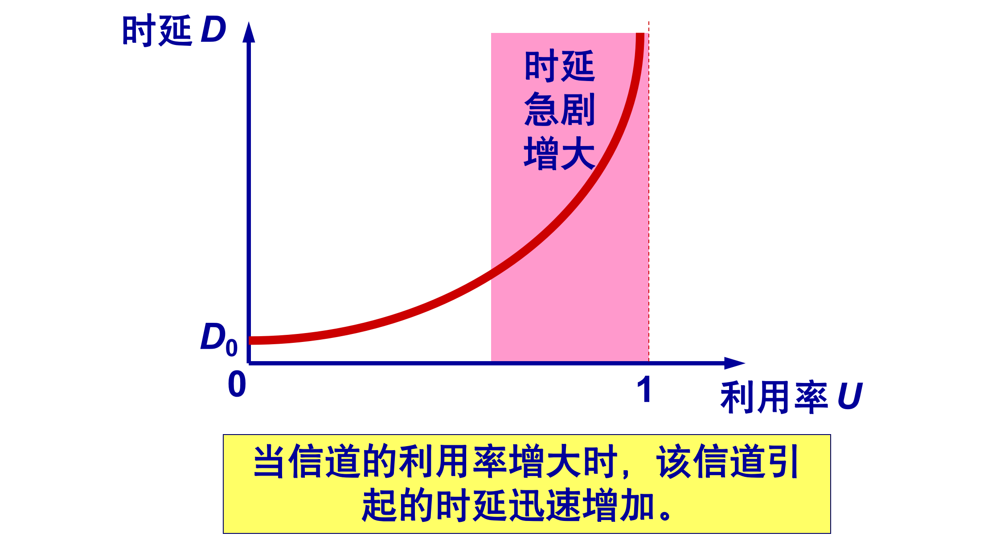
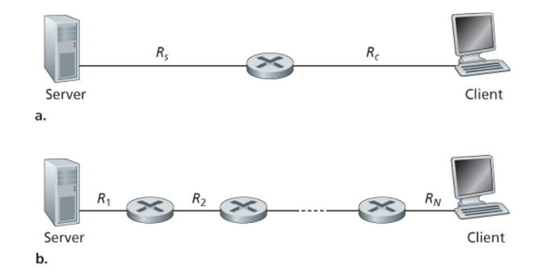
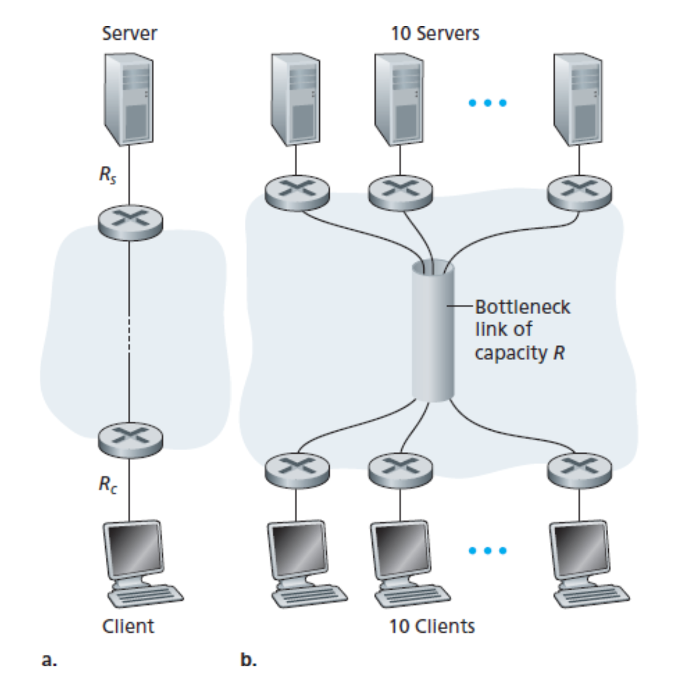

#  因特网概述

## 什么是因特网？

#### 从具体构成出发：

因特网是一个世界范围的计算机网络，他是一个互联了编辑全球数十亿计算设备的网络。

对于因特网术语而言，所有设接入的设备都被称为**`主机(host)`**或者是**`端系统(end)`**，端系统通过**`通信链路(communication link)`**和**`分组交换机(packet switch)`**连接在一起。当一台端系统要向另一台端系统发送数据的时候 ，发送端将数据分段，并且为每段加上首部字段。由此形成的信息包称之为**`分组(packet)`**,分组交换机通过其一条通信链路接收到达的分组，并且从其另一条通信链路转发出去。两种比较常见的分组交换机包括**`路由器(roter)`**和**`链路层交换机(link-layer switch)`**,其中链路层交换机常用于接入网中，而路由器常用于网络核心。**从发送端到接收端系统，一个分组所经过的所有通信链路和分组交换机成为通过该网络的`路径(route或者path)`。**端系统一般通过**`因特网服务提供商(Internet Service Provider, ISP)`**接入因特网。因特网中的每一个部件，交换机，端系统都要遵循一系列**`协议(protocol)`**，这些协议控制这因特网中的信息发送和接受。

#### 从服务出发：

人们在因特网上享受的应用程序涉及多个端系统之间的数据交换，所以他们被称为**`分布式应用服务(distributed app)`**,重要的是这些应用服务并不运行在分组交换机中反而是运行在处于网络边缘的端系统之中，那么一个端系统上的应用程序如何向另一个端系统上的应用程序发送数据呢，对于所有与因特网相连端系统提供了一个**`套接字接口(socket interface)`**,该系统规定了因特网上一个端系统向另一个端系统交付数据的方式。

#### 什么是协议：

**`协议(protocol)`**定义了在两个或者多个通信实体之间交换的报文格式和顺序，以及发送和接受一条报文或者其他事件所采取的动作。

## 因特网的类别

**1. 按照网络的作用范围进行分类**

广域网 WAN (Wide Area Network)：作用范围通常为几十到几千公里。

城域网 MAN (Metropolitan Area Network)：作用距离约为  5 ~ 50 公里。

局域网 LAN (Local Area Network) ：局限在较小的范围（如 1 公里左右）家庭用网，校园网。

个人区域网 PAN (Personal Area Network) ：范围很小，大约在 10 米左右。

**2. 按照网络的使用者进行分类**

公用网 (public network) ：按规定交纳费用的人都可以使用的网络。因此也可称为公众网。

专用网 (private network) ：为特殊业务工作的需要而建造的网络。

# 网络边缘

端系统也称为主机，因为它们容纳(即运行)应用程序，如 `Web`浏览器程序、 `Web` 服务器程序、电子邮件阅读程序或电子邮件服务器程序等。本书通篇将交替使用主机和端系统这两个术语，即主机=端系统。主机又被进一步划分为两类:**`客户(client)`** 和 **`服务器 (server)`** 。 客户非正式地等同于桌面应用、移动PC 和智能手机等，而服务器非正式地等同于更为强大的机器，用于存储和发布 `Web`页面、流视频、中继电子邮件等。今天，大部分提供搜索结果、电子邮件、`Web` 页面和视频的服务器都属于大型**`数据中心(data center)`** 。 

## 接入网

**`接入网 ( access network)`**，这是指将端系统连接到其`边缘路由器(edge router)`的物理链路。边缘路由器是端系统到任何其他远程端系统的路径上的第一台路由器。 

### 家庭接人: DSL、电缆、 FTTH、拨号和卫星

##### DSL

宽带住宅接人有两种最流行的类型:**`数字用户线 (Digital Subscriber Line , DSL)`**和电缆。住户通常从提供本地电话接人的本地电话公司处获得 `DSL` 因特网接人。 因此，当使用 `DSL` 时，用户的本地电话公司也是它的 `ISP`。

##### 电缆

当 DSL 利用本地电话公司现有的本地电话基础设施时， **`电缆因特网接入 (cable lnlemet access)`** 利用了有线电视公司现有的有线电视基础设施。 电缆因特网接人需要特殊的调制解调器，称为**`电缆调制解调器 (cable modem)`** 。 如同 `DSL` 调制解调器，电缆调制解调器通常是一个外部设备，通过一个以太网端口连接到家庭 `PC` 。

##### FTTH

**`光纤到户( Fiber To The Home ，FTTH)`** ,`FTTH` 概念简单，从本地中心局直接到家庭提供了一条光纤路径。  从本地巾心局到家庭有几种s竞争性的光纤分布方案。 最简单的光纤分布网络称为直接光纤，从本地中心局到每户设置一根光纤。 更为一般的是，从中心局出来的每根光纤实际 上由许多家庭共享，直到相对接近这些家庭的位置，该光纤才分成每户一根光纤。 进行这种划分的有两种竞争性的光纤分布体系结构:**`主动光纤网络 (Aclive Optical Network , AON)`**和**`被动光纤网络 (Presive Optical Network , PON)`**,其中AON 基本上就是交换因特网， `FTTH` 有潜力提供每秒千兆比特范围的因特网接人速率。 

### 企业和家庭接人:以太网和 WiFi 

##### 以太网

在公司和大学校园以及在越来越多的家庭环境中，通常是用**`局域网 (LAN)`** 将端用户 连接到边缘路由器。 尽管有许多不同类型的局域网技术，但是以太网到目前为止是当前公 司、大学和家庭网络中最为流行的接人技术。使用以太网接人，用户通常以 **100Mbps** 速率接人以太 网交换机，而服务器可能具有 **lGbps 甚至lOGbps** 的接人速率。

##### WIFI

越来越多的人从便携机、智能手机、平板电脑和其他设备无线接人因特网。在无线 LAN 环境中，无线用户从一个接人点发送/接收分组，该接人点与企业网连接(很可能包括有线以太网) ，该企业网再与有线因特网相连。一个无线 LAN 用户通常必须位于接人点的几十米范围内 。 基于 IEEE 802.11 技术的无钱 LAN 接人，更为通俗地称为 WiFi 

##### 常见家用网络

今天许多家庭正在将宽带住宅接人(即电缆调制解调器或DSL)与廉价的无线局域网技术结合起来，以产生强大的家用网络，图 1-9 显示了典型的家庭网络。 这个家庭网络组成如下:一台漫游的便携机和 l 台有线 PC; 一个与无线 PC 通信的基站(无线接人点); 一个提供与因特网宽带接人的电缆调制解调器; 以及一台互联了基站及带有电缆调制解调器的固定 PC 的路由器。该网络允许家庭成员经宽带接人因特网，其中一个成员可以在厨房、院子或卧室漫游上网。

### 广域无线接人: 3G 和 LTE 

##### 3G

 3G 为分组交换广域 无线因特网接人提供了超过 1Mbps 的速率。 甚至更高速率的广域接人技术及第四代(4G) 广域无线网络已经在部署中。

## 物理媒介

考虑一个比特从一个端系统开始传输，通过一系列链路和路由器，到达另一个端系统。这个比特被传输许许多多次，源端系统首先传输这个比特，不久后其中的第一台路由器接收该比特、第一台路由器传输该比特，接着不久后第二台路由器接收该比特。 因此，这个比特当从源到目的地传输时，通过一系列"传输器-接收器"对。对于每个传输器-接收器，通过跨越一种`物理媒体 (physical medium)` 传播电磁波或光脉冲来发送该比特。 

>  物理媒体划分为两类:**`导引型媒体 (guided media)`** 和**`非导引型媒体(unguided media)`** 。 对于导引型媒体，电波沿着固体媒体前行，如光缆、双绞铜线或同轴电缆。 对于非导引型媒体，电波在空气或外层空间中传播，例如在无线局域网或数字卫星频道。 

### 双绞铜线

双绞线由两根隔离的铜线组成，每根大约 lmm 粗，以规则的螺旋形式排列着。这两根线被绞合起来，以减少来自邻近类似的双 绞线的电气干扰。通常许多双绞线捆扎在一起形成一根电缆，并在这些双绞线外面覆盖上保护性防护层。 一对电线构成了一个通信链路。**`无屏蔽双绞线 (Unsbielded TwisLed Pair, UTP)`** 常用在建筑物内的计算机网络中，即用于**`局域网 (LAN)`** 中。 目前局域网中的双绞线的数据速率从 `10Mbps` 到`1OGbps` 所能达到的数据传输速率取决于线的粗细以及传输方和接收方之间的距离。 

### 同轴电缆 

与双绞线类似，同轴电缆由两个铜导体组成，但是这两个导体是同心的而不是并行的。借助于这种结构及特殊的绝缘体和保护层，同轴电缆能够达到较高的数据传输速率。电缆电视系统最近与电缆调制解调器结合起来，为住宅区用户提供数`10Mbps` 速率的因特网接人。 

### 光纤 

光纤是一种细而柔软的、能够导引光脉冲的媒体，每个脉冲表示一个比特。一根光纤能够支持极高的比特速率，高达数十甚至数百`Gbps`它们不受电磁干扰，长达`100km`的光缆信号衰减极低，井且很难窃听。这些特征使得光纤成为长途引导型传输媒体，特别是跨海链路。

### 陆地无线电信道 

它不需要安装物理线路，并具有穿透墙壁、提供与移动用户的连接以及长距离承载信号的能力，因而成为一种有吸引力的媒体。 无线电信 道的特性极大地依赖于传播环境和传输信号的距离。

陆地无线电信道能够大致划分为三类:一类运行在很短距离(如 1 米或 2 米) ;另一类 运行在局域，通常跨越数十到几百米;第三类运行在广域，跨越数万米。 个人设备如元线头 戴式耳机、键盘和医疗设备跨短距离运行，在无线 LAN 技术使用了局域无线电信道;蜂窝接入技术使用了广域无线电信道。

### 卫星无线电信道 

近地轨道卫星技术未来也许能够用于因特网接人。

# 网络核心

即由互联因特网端系统的分组交换机和链路构成的网状网络。

## 电路交换

2 部电话机只需要用 1 对电线直接连接就能够互相通话。 

5 部电话机两两直接相连，需 10 对电线。

> N 部电话机两两直接相连，需 N(N – 1)/2 对电线。这种直接连接方法所需要的电线对的数量与电话机数量的平方（ N2 ）成正比。

当电话机的数量增多时，就要使用交换机来完成全网的交换任务。

电路交换必定是面向连接的，电路交换分为三个阶段：

- **建立连接：**建立一条专用的物理通路，以保证双方通话时所需的通信资源在通信时不会被其他用户占用；
- **通信：**主叫和被叫双方就能互相通电话；
- **释放连接：**释放刚才使用的这条专用的物理通路（释放刚才占用的所有通信资源）。

#### 电路交换缺点

A 和 B 通话经过四个交换机，通话在 A 到 B 的连接上进行电路交换的，两	用户始终占用端到端的通信资源。

计算机数据具有突发性。这导致在传送计算机数据时，通信线路的利用率很低（用来传送数据的时间往往不到10%甚至1% ）。

## 分组交换

在各种网络应用中，端系统彼此交换**`报文(message)`**。 报文能够包含协议设计者需要的任何东西。为了从源端系统向目的端系统发送一个报文，将长报文划分为较小的数据块，称之为**`分组(packet)`** 。在源和目的之间，每个分组都通过**`通信链路`**和**`分组交换机 (packet switch) (交换机主要有两类: 路由器和链路层交换机)`**传送。分组以等于该链路最大传输速率的速度传输通过通信链路。 因此，如果某源端系统或分组交换机经过一条链路发送一个`L比特`的分组，链路的传输速率为 `R 比特/秒`，则传输该分组的时间为 `L/R 秒`。 

接下来我们详细的描述一下分组交换原则

### 存储转发传输 

多数分组交换机在链路的输入端使用**`存储转发传输(store and forward packet switching)`** 机制，当路由器已经接收完了该分组的所有比特后，它才能开始向出链路传输(即"转发")该分组。

为了深刻领悟得储转发传输，我们现在计算一下从源开始发送分组到目的地收到整个分组所经过的时间。源在时刻`0`开始传输，在时刻 `L/R 秒`，因为该路由器刚好接收到整个分组，所以它能够朝着目的地向出链路开始传输分组;在时刻 `2L/R`，路由器已经传输了整个分组，并且整个分组已经被目的地接收。 所以，总时延是 `2L/R`。如果交换机一旦比特到达就转发比特(不必首先收到整个分组) , 则因为比特没有在路由器保持，总时延将是`L/R`。 

> [**上面L表示bit总量，R表示Rmbps，若一条线路的传输速率为1mbps，传输速率于距离看作无关，只与bit量有关。**]()

现在我们来计算从源开始发送第一个分组直到目的地接收到所有三个分组所需的时间，与前面一样，在时刻`L/R`，路由器开始转发第一个分组，而在时刻 `L/R`， 源也开始发送第二个分组，因为它已经完成了发送整个第一个分组。因此，在时刻 `2L/R`， 目的地已经收到第一个分组并且路由器已经收到第二个分组。 类似地，在时刻 `3L/R`， 目的地已经收到前两个分组并且路由器已经收到第三个分组。最后，在时刻 `4L/R`， 目的地已经收到所 有 `3` 个分组。

我们现在来考虑通过由 `N` 条速率均为 `R` 的链路组成的路径(所以，在源和目的地之间有`N-1`台路由器) ，从源到目的地发送一个分组的总体情况。 应用如上相同的逻辑，我们看到端到端时延是:
$$
d_{end~to~end} = N\frac{L}{R}
$$

### 排队时延和分组丢失

每个分组交换机有多条链路与之相连。对于每条相连的链路，该分组交换机具有一个 **`输出缓存 (output buffer) (也称为输出队列 output queue)`** ，它用于存储路由器准备发往那条链路的分组。 该输出缓存在分组交换中起着重要的作用。如果到达的分组需要传输到某条链路，但发现该链路正忙于传输其他分组，该到达分组必须在该输出缓存中等待。 

除了存储转发时延以外，分组还要承受输出缓存的**`排队时延 (queue delay)`** 。 这些时延是变化的，变化的程度取决于网络中的拥塞程度。 因为缓存空间的大小是有限的， 一个到达的分组可能发现该缓存已被其他等待传输的分组完全充满了。此情况下，将出现分组丢失**`丢包(packet lost)`** ，刚到达的分组或已经排队的分组之一将被丢弃。

### 转发表和路由选择协议

路由器从与它相连的一条通信链路得到分组，将其向与它相连的另一条通信链路转发。但是该路由器怎样决定它应当向哪条链路进行转发呢?

在因特网，每个端系统具有一个称为 IP 地址的地址。当源主机要向目的端系统发送一个分组时，源在该分组的首部包含了目的地的`IP地址`。当一个分组到达网络中的路由器时，路由器检查该分组的目的地址的一部分，并向一台相邻路由器转发该分组。更特别的是，每台路由器具有一个**`转发表 (forwarding table)`**，用于将目的地址(或目的地址的一部分)映射成为输出链路。 当某分组到达一台路由器时，路由器检查该地址，并用这个目的地址搜索其转发表，以发现适当的出链路。路由器则将分组导向该出链路。此外因特网具有一些特殊的**`路由选择协议 (routing protocol)`**，用于自动地设置这些转发表。例如，一个路由选择协议可以决定从每台路由器到每个目的地的最短路径，并使用这些最短路径结果来配置路由器中的转发表。 

## 网络的网络

端系统经过一个接人 `ISP` 与因特网相连。 该**接入ISP** 能够提供有线或无线连接，使用了包括 `DSL、电缆、 FITH、 WiFi 和蜂窝等多种接入技术`。  但为端用户和内容提供商提供与接人 ISP 的连接仅解 决了连接难题中的很小一部分，因为因特网是由数以亿计的用户构成的。要解决这个难题，接人`lSP` 自身必须互联。 通过创建网络的网络可以做到这一点，理解这个短语是理解因特网的关键。年复一年，构成因特网的"网络的网络"已经演化成为一个非常复杂的结构。 这种演化很大部分是由经济和国家策略驱动的，而不是由性能考虑驱动的。 

### 网络结构 0

使每个接人`ISP` 直接与每个其他接人 ISP 连接。 当然，这样的网状设计 对于接人 `ISP` 费用太高，因为这将要求每个接人 ISP 与世界上数十万个其他接人 `ISP` 有一 条单独的通信链路。

### 网络结构 1

用单一的全球承载 `ISP` 互联所有接人 `ISP`。 我们 假想的`全球承载 ISP` 是一个由路由器和通信链路构成的网络，该网络不仅跨越全球，而且 至少具有一个路由器靠近数十万接人 `ISP` 中的每一个 当然，对于全球承载 `ISP`，建造这 样一个大规模的网络将耗资巨大。 为了有利可图，自然要向每个连接的接人 `ISP` 收费，其价格反映(并不一定正比于)一个接人 `ISP` 经过全球 `ISP` 交换的流量大小。 因为接人 `ISP` 向全球承载 `ISP` 付费，故接人 ISP 被认为是**`客户(customer)`** .而全球承载 `ISP` 被认为是**`提供商(provider)`** 。 

### 网络结构 2

它由数十万接人 `ISP` 和多个全球承载 `ISP` 组成。 接人 `ISP` 无疑喜欢网络结构 2 胜过喜欢网络结构 1 , 因为它们现在能够根据价格和服务的函数，在多个竞争的全球承载提供商之间进行选择。值得注意的是，这些全球承载 `ISP` 之间必须是互联的。不然的话，与某个全球承载 `lSP` 连接的接人 ISP 将不能与连接到其他全球承载 `ISP` 的接人 `ISP` 通信。 

### 网络结构 3

在任何给定的区域，可能有一个**`区域 ISP (reginal ISP)`**，区域中的接入`lSP`与之连接。每个区域`lSP` 则与第一层 `ISP` (tier-1 ISP) 连接。 第一层 `ISP` 类似于我们假想的全球承载 `ISP` 尽管第一层 `ISP` 不 是在世界上每个城市巾都存在，但它确实存在。 有大约十几个第一层 `ISP`，包括`Level3 通信、 AT&T、 SprinL 和 NTT`。 有趣的是，没有组织正式认可第一层状态。 俗话说:如果必须 问你是有是一个组织的成员，你可能不是。 

### 网络结构 3.5

为了建造一个与今天因特网更为相似的网络，我们必须在等级结构的网络结构3上增加**`存在点 (Point of Presence, PoP)`** 、多宿、对等和**`因特网交换点 (Jnternet exchange point , IXP)`** PoP 存在于等级结构的所有层次，但底层(接人 `ISP`) 等级除外。一个`PoP` 只是提 供商网络巾的一台或多台路由器(在相同位置)群组，其中客户ISP 能够与提供商`ISP`连 接。对于要与提供商`PoP` 连接的客户网络，它能从第三方通信提供商租用高速链路直接将它的路由器之一连接到位于该`PoP` 的一台路由器。任何 `ISP` (除了第一层 `ISP`)可以选择 为`多宿 (multi-home)`，即可以与两个或更多提供商`ISP` 连接。例如，一个接人 ISP 可能与 两个区域 `ISP` 多宿，或者可以与两个区域 `ISP` 多宿，也可以与多个第一层 `ISP` 多宿。当一个 `ISP` 多宿时，即使它的提供商之一出现故障，它仍然能够继续发送和接收分组。

### 网络结构4

客户 `ISP` 向它们的提供商 ISP 付费以获得全球因特网互联能力客户 `ISP` 支付给提供商 `ISP` 的费用数额反映了它通过提供商交换的流量，为了减少这些费用，位于相同等级结构层次的邻近一对 ISP 能够对等。当两个 `ISP` 对等时，通常不进行结算，即任一个 `ISP` 不向其对等付费如前面提到的那样，第一层 `ISP` 也与另一个第一层 `ISP`等，它们之间无结算。沿着这些相同路线，地方公司创建一个`因特网交换点 (InLemet Exchange Point)` ,` IXP`是一个汇合点，多个 `ISP` 能够在这里共同对等。在今天的因特网中有大约300个`IXP`。我们称这个系统为生态系统，由接人`ISP`、以区域`ISP`、第一层`ISP`、`POP`、多宿、对等和 `IXP` 组成，这个系统作为网络结构 4。 

### 网络结构5

我们现在最终到达了网络结构5，它通过在顶部增加**`内容提供商网络 (conLent provider net work)`** 构建而成。  

# 因特网的性能

## 计算机网络的性能指标

计算机网络的性能一般是指它的几个重要的性能指标，主要包括：

- 速率
- 带宽
- 吞吐率
- 时延
- 时延带宽积
- 往返时间 RTT
- 利用率

**1. 速率**

比特（bit）是计算机中数据量的单位，也是信息论中使用的信息量的单位。比特来源于 binary digit，意思是一个“二进制数字”，因此一个比特就是二进制数字中的一个 1 或 0。

速率是计算机网络中最重要的一个性能指标，指的是数据的传送速率，它也称为数据率 (data rate)或比特率 (bit rate)，单位是 bit/s，或 kbit/s、Mbit/s、 Gbit/s 等。例如 4 * 10^10 bit/s 的数据率就记为 40 Gbit/s。

> 速率往往是指额定速率或标称速率，非实际运行速率。  

**2. 带宽**

带宽(bandwidth) 本来是指信号具有的频带宽度，其单位是赫，在计算机网络中，带宽用来表示网络中某通道传送数据的能力。表示在单位时间内网络中的某信道所能通过的“最高数据率”。单位是 bit/s ，即 “比特每秒”。     

> 在“带宽”的上述两种表述中，前者为频域称谓，而后者为时域称谓，其本质是相同的。也就是说，一条通信链路的“带宽”越宽，其所能传输的“最高数据率”也越高。

常用的带宽单位：

- 比特每秒，即 b/s （1bps表示1秒钟能传送比特的数据）
- 千比每秒，即 kb/s （10^3 b/s）
- 兆比每秒，即 Mb/s（10^6 b/s）
- 吉比每秒，即 Gb/s（10^9 b/s）
- 太比每秒，即 Tb/s（10^12 b/s）

>  **注意：**在计算机界，K = 2^10 = 1024   M = 220,  G = 230,  T = 240。对应的是字节Byte，bit 和 Byte的进制是不一样的：
>
>  - 1 Byte = 8 bits
>  - 1 KB = 1024Byte= 2^10 Byte
>  - 1 MB = 1024 KB =2^20 Byte
>  - 1 GB = 1024 MB = 2^30Byte
>  - 1 T B = 1024 GB = 2&40Byte

3**. 吞吐量**

吞吐量 (throughput) 表示在单位时间内通过某个网络（或信道、接口）的数据量，经常地用于对现实世界中的网络的一种测量，以便知道实际上到底有多少数据量能够通过网络。

> 吞吐量受网络的带宽或网络的额定速率的限制。  

**4. 时延 (delay 或 latency)**

时延 (delay 或 latency) 是指数据（一个报文或分组，甚至比特）从网络（或链路）的一端传送到另一端所需的时间，数据在网络中经历的总时延就是发送时延、传播时延、处理时延和排队时延之和。

**5. 时延带宽积**

链路的时延带宽积又称为以比特为单位的链路长度。 
$$
时延带宽积 = 传播时延* 带宽
$$
只有在代表链路的管道都充满比特时，链路才得到了充分利用。

**6. 往返时间 RTT**

往返时间表示从发送方发送数据开始，到发送方收到来自接收方的确认，总共经历的时间。

**7. 利用率**

分为信道利用率和网络利用率：

- 信道利用率指出某信道有百分之几的时间是被利用的（有数据通过）。完全空闲的信道的利用率是零，信道利用率并非越高越好。当某信道的利用率增大时，该信道引起的时延也就迅速增加。

  

- 网络利用率则是全网络的信道利用率的加权平均值。

若令 D0 表示网络空闲时的时延，D 表示网络当前的时延，则在适当的假定条件下，可以用下面的简单公式表示 D 和 D0之间的关系，其中：U 是网络的利用率，数值在 0 到 1 之间。

 

## 时延和丢包 

### 分组交换网中的时延概述

当分组从一个**结点(主机或路由器)**沿着**后继结点(主机或路由器)**，该分组在沿途的每个结点经受了几种不同类型的时延。这些时延最为重要的是**结点处理时延(nodal processing delay)**、**排队时延(queuing delay)**、**传输时延(ansmission delay)** 和**传播时延 (propagalÍon delay)**，这些时延总体累加起来是**结点总时延(nodal delay)** 。

### 时延的类型 

**传输的条件：**

- 路由器 A 具有通往路由器 B 的出链路。
- 当在该链路没有其他分组正在传输并且没有其他分组排在该队列前面时，才能在这条链路上传输该分组。

#### 处理时延

检查分组首部和决定将该分组导向何处所需要的时间是处理时延的一部分。高速路由器的处理时延通常是微秒或更低的数量级。在这种结点处理之后，路由器将该分组引向通往路由器 B 链路之前的队列。

#### 排队时延 

在队列中，当分组在链路上等待传输时，它经受排队时延。一个特定分组的排队时延长度将取决于先期到达的正在排队等待向链路传输的分组数量。

------

#### 传输时延

也称为发送时延。发送数据时，数据帧从结点进入到传输媒体所需要的时间。也就是从发送数据帧的第一个比特算起，到该帧的最后一个比特发送完毕所需的时间。 用 `L` 比特表示该数据帧的长度，用 `R bps (即 b/s)` 表示从路由器 A 到路由器 B 的**链路传输速率**(A的发送速率)。传输时延是`L/R`。这是将所有分组的比特推向链路所需要的时间。
$$
发送时延 = 数据帧长度（bit）/发送速率（bit/s）
$$

#### 传播时延

从该链路的起点到路由器 B 传播所需要的时间是传播时延。 该比特以该链路的传播速率传播。 该传播速率取决于该链 路的物理媒体(即光纤、双绞铜线等)，其速率等于或略小于光速。该传播时延等于两台路由器之间的距离除以传播速率。即传播时延是d/s，其中 d 是路由器 A 和路由器 B 之间的距离，s是该链路的传播速率。 一旦该分组的最后一个比特传播到结点 B ，该比特及前面的所有比特被存储于路由器 B。 整个过程将随着路由器 B 执行转发而持续下去。
$$
传播时延 = 传播时延 （米）/ 信号在信道上的传播速率（米/秒）
$$

#### 总结

如果我们令**`d(prod)、d(queue)、d(trans)、d(prop)`**分别表示处理时延、排队时延、传输时延和传播时延，则结点的总时延由下式给定: 
$$
d_{nodal}~=~d_{prod}~+~d_{queue}~+~d_{trans}~+~d_{prop}
$$
处理时延`d(proc)`通常是微不足道的，然而，它对一台路由器的最大吞吐量有重要影响，最大吞吐量是一台路由器能够转发分组的最大速率。

### 排队时延和丢包

**排队时延**

结点时延的最为复杂和有趣的成分是排队时延 `d(queue)`，例如，如果 10 个分组同时到达空队列，传输的第一个分组没有排队时延，而传输的最后一个分组将经受相对大的排队时延(这时它要等待其他9个分组被传输)。因此，当计算排队时延时，人们通常使用统计量测度，如平均排队时延、排队时延的方差和排队时延超过某些特定值的概率。 

为了更深入地领会某些要点，令 `α` 表示**`分组到达队列的平均速率 (α 的单位是分组/ 秒，即 pkt/s)`** 。 前面讲过 `R` 是传输速率，即从队列中**`推出比特的速率(以 bps 即 b/s 为单位)`** 。为了简单起见，也假定所有分组都是由 `L` 比特组成的。 则比特到达队列的平均速率 是 `Lα bps`。 最后，假定队列非常大，因此它基本能容纳无限数量的比特。`比率 Lα/R`  称为**`流量强度( traffic intensity)`**，它在估计排队时延的范围方面经常起着重要的作用。 如果 `La/R > 1` ，则 比特到达队列的平均速率超过从该队列传输出去的速率。在这种不幸的情况下，该队列趋向于无界增加，并且排队时延将趋向无穷大！因此流量工程中的一条金科玉律是：**设计系统时流量强度不能大于 1** 。 

**丢包**

我们已经假设队列能够容纳无穷多的分组。在现实中，一条链路前的队列只有有限的容量，尽管**排队容量极大地依赖于路由器设计和成本**。 因为该排队容量是有限的，随着流量强度接近 1 ，排队时延并不实际趋向无穷大。 相反，到达的分组将发现 一个满的队列。 由于没有地方存储这个分组，路由器将`丢弃(drop)` 该分组，即该分组将会`丢失(lost)` 。

### 端到端时延

 我们现在考虑从源到目的地的总时延。 为了能够理解这个概念，假定在源主机和日的主机之间有`N-1` 台路由器。 我们还要假设该网络此时是无拥塞的(因此排队时延是微不足道的) ，在每台路由器和源主机上的处理时延是`d(proc)`，每台路由器和源主机的输出速率是`R bps`，每条链路的传播时延是 `d(prop)`。 结点时延累加起来，得到端到端时延: 
$$
d_{end~to~end}~=~N*(d_{prod}~+~d_{trans}~+~d_{prop})
$$

## 计算机网络中的吞吐量

### 吞吐量的定义

为了定义吞吐量，考虑从**主机A**到**主机B**跨越计算机网络传送个大文件。 例如，也许是从一个**P2P文件**共享系统中的一个对等方向另一个对等方传送一个大视频片段。在任何时间瞬间的**`瞬时吞吐量( instantaneous throughput)`** 是主机B接收到该文件的速率(以**bps**计)。如果该文件由F比特组成，主机**B**接收到所有**F**比特用去**T**秒，则文件传送的**`平均吞吐量(average throughput)`**是**`F/T bps`**。对于某些应用程序如因特网电话，希望具有低时延和在某个阈值之上的一致的瞬时吞吐量。

为了进一步深人理解吞吐量这个重要概念，我们考虑几个例子。上图显示了服务器和客户这两个端系统，它们由两条通信链路和一台路由器相连。考虑从服务器传送一个文件到客户的吞吐量。令**Rs**表示服务器与路由器之间的链路速率、**Rc**表示路由器与客户之间的链路速率。假定在整个网络中只有从这台服务器到那台客户的比特在传送。我们可以想象比特是流体，通信链路是管道。显然，这台服务器不能以快于**Rsbps**的速率通过其链路注人比特，这台路由器也不能以快于**Rc bps**的速率转发比特。如果**Rs <Rc**，则由该服务器注人的比特将顺畅地通过路由器“流动"，并以速率**Rc bps**到达客户，给定了**Rsbps**的吞吐量。在另方面，如果**Rc < Rs**，则该路由器将不能够以接收它们那样快的速率来转发比特。在这种情况下，比特将以速率**Rs**离开该路由器，从而得到端到端吞吐量**Rs**。(还要注意的是，如果比特继续以速率**Rs**到达该路由器，继续以**Rc**离开路由器的话，在该路由器中等待传输给客户的积压比特将不断增加，这是一种非常不希望的情况!)。因此，对于这种简单的两链路的网络，其吞吐量是**min{Rc，Rs}**，这就是说，它是**`瓶颈链路(bot一tleneck link)`**的传输速率。在决定了吞吐量之后，我们现在近似地得到从服务器到客户传输一个**F**比特的大文件所需要的时间是**F/min{Rc，Rs}**。对于一个特定的例子，假定你正在下载一个**F=32x10^6**比特的MP3文件，服务器具有**Rc =2Mbps**的传输速率，并且你有一条**Rs=1Mbps**的接人链路。则传输该文件所需的时间是32秒。当然，这些吞吐量和传送时间的表达式仅是近似的，因为它们并没有考虑分组层次和协议的问题。

下图此时显示了在服务器和客户之间具有N条链路的一个网络，这**N**条链路的传输速率分别是**R1,R2,,,,Rx**。应用与对两条链路网络的分析相同的方法，我们发现从服务器到客户的文件传输的吞吐量是**min{R1, R2, .., RN**}。

考虑从服务器向客户的文件传送的吞吐量。服务器以速率为**Rs**的接人速率与网络相连，且客户以速率为**Rc**的接入速率与网络相连。现在假定在计算机网络核心中的所有链路具有非常高的传输速率，即该速率比**Rc和Rs**要高得多。目前因特网的核心的确过度装备了高速率的链路，从而很少出现拥塞。同时假定在整个网络中发送的比特都是从该服务器到该客户。在这个例子中，因为计算机网络的核心就像一个宽大的管子，所以比特从服务器向目的地的流动速率仍是Rc和Rs中的最小者，即**吞吐量=min{Rs, Rc}**。因此，在今天因特网中对吞吐量的限制因素通常是接人网。

## 例题

### 例题1

收发两端之间的传输距离为1000km，信号在媒体上的传输速率为2×108m/s。

1. 请写出发送时延的计算公式
2. 请写出传播时延的计算公式
3. 计算数据长度107bit,数据发送速率为100kb/s的发送时延和传播时延（写清计算过程）
4. 计算数据长度103bit,数据发送速率为1Gb/s的发送时延和传播时延（写清计算过程）
5. 从计算结果得出什么结论？

**正确答案：**

1. 发送时延=数据帧长度(b)/发送速率(b/s)
2. 传播时延=信道长度(m)/信号在信道上的传播速率(m/s)
3. 传播时延=1000km/2×10^8m/s=0.005s=5ms,发送时延=10^7bit/100kb/s=100s。
4. 传播时延=1000km/2×10^8m/s=0.005s=5ms,发送时延=10^3bit/1Gb/s=0.000001s=1μs。
5. 数据长度大而发送速率低，在总的时延中发送时延占主要成分，若数据长度短而发送速率高，在总的时延中传播时延占主要成分。

### 例题2

假设信号在媒体上的传播速率为2.3×108m/s，媒体长度L分别为以下四种情况：

(1)10cm(网络接口卡)；(2)100m(局域网)；(3)100km(城域网)；(4)5000km(广域网)。

试计算当数据率为1Mb/s和10Gb/s时在以上媒体中正在传播的比特数?

**正确答案：**

数据率指的就是带宽，而带宽表示单位时间通过媒介的bit数，所以我们需要做的就是求出bit通过媒介所需的时间在与带宽相乘：

1. L=10cm，数据率=1Mb/s时，传播比特数=(10cm/2.3×108m/s) ×1Mb/s= 4.35×10-4bit。

   L=10cm，数据率=10Gb/s时，传播比特数=(10cmm/2.3×108m/s) ×10Gb/s = 4.35bit。

2. L=100m，数据率=1Mb/s时，传播比特数=(100m/2.3×108m/s) ×1Mb/s= 0.435bit。

   L=100m，数据率=10Gb/s时，传播比特数=(100m/2.3×108m/s) ×10Gb/s = 4.35×103bit。

3. L=100m，数据率=1Mb/s时，传播比特数=(100m/2.3×108m/s) ×1Mb/s= 4.35×102bit。

   L=100m，数据率=10Gb/s时，传播比特数=(100m/2.3×108m/s) ×10Gb/s = 4.35×106bit。

4. L=5000km，数据率=1Mb/s时，传播比特数=(5000km /2.3×108m/s) ×1Mb/s= 2.17×104bit。

   L=5000km，数据率=10Gb/s时，传播比特数=(5000km /2.3×108m/s) ×10Gb/s = 2.17×108bit。

# 层次协议和服务模型

> 对于大而复杂且需要不断更新的系统，改变服务的实现而不影响该系统其他组件是分层的另一个重要优点。

## 概述

计算机网络中的数据交换必须遵守事先约定好的规则，这些规则明确规定了所交换的数据的格式以及有关的同步问题（同步含有时序的意思）。网络协议 (network protocol)，简称为协议，是为进行网络中的数据交换而建立的规则、标准或约定。

#### 网络协议的三个组成要素

**语法：**数据与控制信息的结构或格式 。 

**语义：**需要发出何种控制信息，完成何种动作以及做出何种响应。 

**同步：**事件实现顺序的详细说明。 

ARPANET 的研制经验表明，对于非常复杂的计算机网络协议，其结构应该是层次式的。

## 协议分层

网络设计者以分层 (layer) 的方式组织协议以及实现这些协议的网络硬件 和软件。每个协议属于这些层次之一，我们再次关注某层向它的上一层提供的服务( service) ，即所谓一层的服 务模型 ( service model) 。 

一个协议层能够用软件、硬件或两者的结合来实现。 诸如 HTIP 和 SMTP 这样的应用 层协议几乎总是在端系统中用软件实现的，运输层协议也是如此。，一 个第 n 层协议也分布在构成该网络的端系统、分组交换机和其他组件中。 这就是说，第 π 层协议的不同部分常常位于这些网络组件的各部分中。 

分层的一个潜在缺点 是一层可能冗余较低层的功能。 例如，许多协议横在基于每段链路和基于端到端两种情况 下，都提供了差错恢复。 第二种潜在的缺点是某层的功能可能需要仅在其他某层才出现的 信息(如时间戳值) ，这违反了层次分离的目标。 

### OSI 模型

讨论过因特网协议校后，我们应当提及它不是唯一的协议战。 特别是在 20 世 纪 70 年代后期，国际标准化组织 (1S0) 提出计算机网络应组织为大约 7 层，称为开放系 统互连( OSI) 模型 。 OSI 参考模型的 7 层是:应用层、表示层、会话层、运输层、网 络层、 数据链路层和物理层。 因特网缺少了在 OSI 参考模型中建立的两个层次，这两个层次留给应用程序开发者处理。 应用程序开发者决定一个服务是再是重要的，如果该服务重要，应用程序开发者就应该在应用程序中构建该功能。

任何两个同样的层次把数据（即数据单元加上控制信息）通过水平虚线直接传递给对方。这就是所谓的“对等层”(peer layers)之间的通信，各层协议实际上就是在各个对等层之间传递数据时的各项规定。

实体 (entity) 表示任何可发送或接收信息的硬件或软件进程，协议是控制两个对等实体进行通信的规则的集合。 

协议是“水平的”，即协议是控制对等实体之间通信的规则，服务是“垂直的”，即服务是由下层向上层通过层间接口提供的。在协议的控制下，两个对等实体间的通信使得本层能够向上一层提供服务，要实现本层协议，还需要使用下层所提供的服务。 协议的实现保证了能够向上一层提供服务，本层的服务用户只能看见服务而无法看见下面的协议。即下面的协议对上面的服务用户是透明的。

OSI 参考模型把对等层次之间传送数据单位称为该层的协议数据单元 `PDU (Protocol Data Unit)`，同一系统相邻两层的实体进行交互的地方，称为服务访问点 `SAP (Service Access Point)`，服务访问点SAP是一个抽象的概念，它实际上就是一个逻辑接口。把层与层之间交换的数据的单位称为服务数据单元 `SDU (Service Data Unit)`。

### TCP/IP

非国际标准 TCP/IP 却获得了最广泛的应用。TCP/IP 常被称为事实上的 (de facto) 国际标准。TCP/IP 是四层体系结构：应用层、运输层、网际层和网络接口层。

### 五层协议体系结构

OSI 的七层协议体系结构的概念清楚，理论也较完整，但它复杂又不实用。TCP/IP 是四层体系结构：应用层、运输层、网际层和网络接口层。但网络接口层并没有具体内容。因此往往采取折中的办法，即综合 OSI 和 TCP/IP 的优点，采用一种只有五层协议的体系结构 。 

将这些综合起来，各层的所有协议被称为协议枝 (protocol Rtack) 。因特网的协议枝由 5 个层次组成:物理层、链路层、网络层、运输层和应用层。

### 应用层

应用层是网络应用程序及它们的应用层协 议存留的地方。 因特网的应用层包括许多协 议，例如 HTIP (它提供了 Web 文档的请求和 传送)， SMTP (它提供了电子邮件报文的传 输)布I ITP (它提供两个端系统之间的文件 传送) 。

应用层协议分布在多个端系统上，一个端系统中的应用程序使用协议与另一个端系统 中的应用程序交换信息的分组。 我们把这种位于应用层的信息分组称为报文 (mess鸣叫 。

### 运输层

因特网的运输层在应用程序端点之间传送应用层报文。在因特网中，有两个运输协 议，即 TCP 和 UDP，利用其中的任一个都能运输应用层报文。 TCP 向它的应用程序提供了 面向连接的服务。 这种服务包括了应用层报文向目的地的确保传递和流量控制(即发送方 /接收方速率匹配) 0 TCP 也将长报文划分为短报文，并提供拥塞控制机制，因此当网络拥 塞时，源抑制其传输速率。 UDP 协议向它的应用程序提供无连接服务。 这是一种不提供不 必要服务的服务，没有可靠性，没有流量控制，也没有拥塞控制。 在本书中，我们把运输 层分组称为报文段( segment) 。 

### 网络层

因特网的网络层负责将称为数据报( datagram) 的网络层分组从一台主机移动到另一 台主机。 在一台源主机中的因特网运输层协议 (TCP 或 UDP) 向网络层递交运输层报文段 和目的地址。

因特网的网络层包括著名的 E 协议，该协议定义了在数据报巾的各个字段以及端系 统和路由器如何作用于这些字段。 仅有一个 E 协议，所有具有网络层的因特网组件必须 运行 E 协议。 尽管网络层包括了 IP 协议和一些路由选择协议，但通常把它简单地称为 lP 层。

### 链路层 

因特网的网络层通过源和日的地之间的一系列路由器路由数据报。 为了将分组从一个 结点(主机或路由器)移动到路径上的下一个结点，网络层必须依靠眩链路层的服务。 特 别是在每个结点，网络层将数据报下传给链路层，链路层沿着路径将数据报传递给下一个 结点。 在下个结点，链路层将数据报上传给网络层。 

由链路层提供的服务取决于应用于该链路的特定链路层协议。值得注意的是这种传递服务不同于TCP协议的可靠传递服务，TCP协议保证一个端到一个端的可交付型。 链 路层的例子包括以太网、 WiFi 和电缆接入网的 DOCS1S 协议。网为数据报从源到目的地传 送通常需要经过几条链路，一个数据报可能被沿途不同链路上的不同链路层协议处理。同时，我们把链路层分组称为帧(frame) 。

### 物理层

虽然链路层的任务是将整个帧从一个网络元素移动到邻近的网络元素(分组交换机，端系统)，而物理层的任 务是将该帧中的一个一个比特从一个结点移动到下一个结点在这层巾的协议仍然是链路相关的，并且进一步与该链路(例如，双绞铜线、 单模光纤)的实际传输媒体相关。 例 如，以太网具有许多物理层协议:一个是关于双绞铜线的，另-个是关于同轴电缆的，还 有一个是关于光纤的，等等。 在每种场合中，跨越这些链路移动一个比特是以不同的方式 进行的。

## 封装

路由器和链路层交换机都是分组交换机。 与端系统类似，路由器 和链路层交换机以多层次的方式组织它们的网络硬件和软件。 而路由器和链路层交换机并 不实现协议楼中的所有层次。 如图 1-24 所示，链路层交换机实现了第一层和第二层;路 由器实现了第一层到第三层。 例如，这意味着因特网路由器能够实现 IP 协议(一种第= 层协议) ，而链路层交换机则不能。 我们将在后面看到，尽管链路层交换机不能识别 IP 地 址，但它们能够识别第二层地址，如以太网地址。 值得注意的是，主机实现了所有 5 个层 次，这与因特网体系结构将它的复杂性放在网络边缘的观点是一致的。

封装( encapsulation ) 。在发送主机端，一个应用层报文 (application-layer message) 被传送给运输层。 在最简单的情况下， 运输层收取到报文并附上附加信息) ，该首部将被 接收端的运输层使用。 应用层报文和运输层首部信息一道构成了运输层报文段( lransportlayer segment) 。 运输层报文段因此封装了应用层报文。  附加的信息也许包括了下列信息: 如允许接收端运输层向上向适当的应用程序交付报文的信息;。运输层则向网络层传递该报文段， 网络层增加了如源和目的端系统地址等网络层首部信息，产生了网络 层数据报( network-layer dal唔ram) 。 该数据报接下来被传递给链路层，链路层(向然而然 地)增加它自己的链路层首部信息并创建链路层帧 (link-layer frame) 。 所以，我们看到在每一层，一个分组具有两种类型的字段:首部宇段和有效载荷字段 (payload field) 。 有效 载荷通常是来自上一层的分组。

封装的过程能够比前面描述的更为复杂。 例如，一个大报文可能被划分为多个运输层 的报文段(这些报文段每个可能被刷分为多个网络层数据报) 。 在接收端，则必须从其连 续的数据报中重构这样一个报文段。