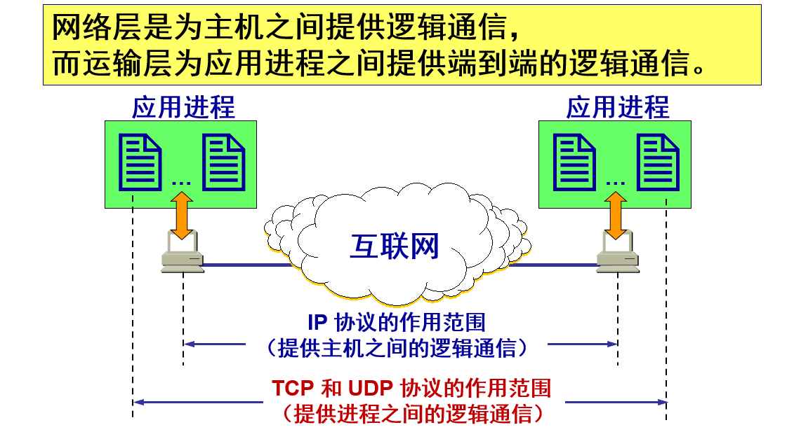
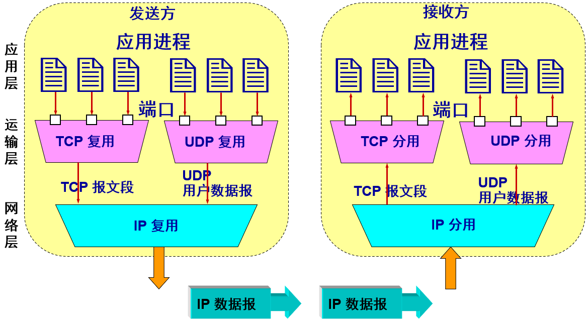
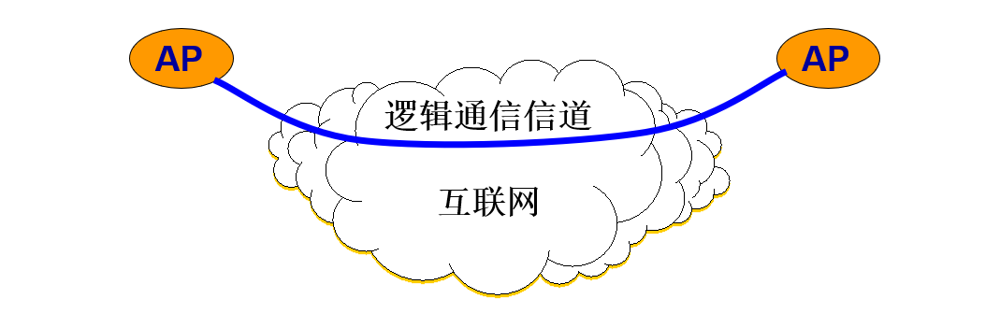
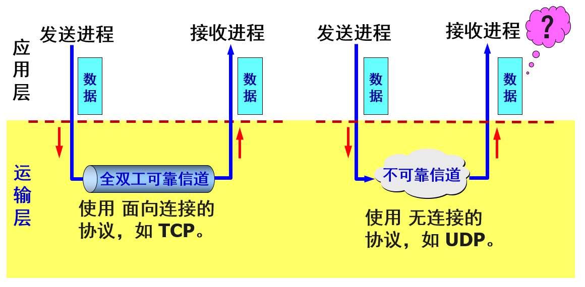
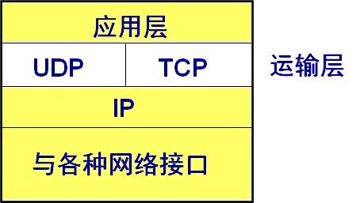
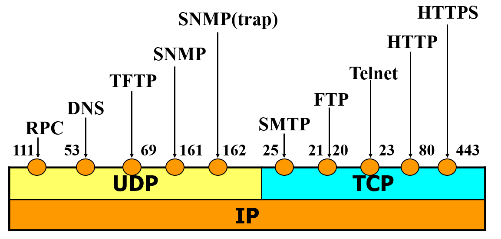

## 概述

-------

#### 进程之间的通信

从通信和信息处理的角度看，运输层向它上面的应用层提供通信服务，它属于面向通信部分的最高层，同时也是用户功能中的最低层。
当网络的边缘部分中的两个主机使用网络的核心部分的功能进行端到端的通信时，只有位于网络边缘部分的主机的协议栈才有运输层，而网络核心部分中的路由器在转发分组时都只用到下三层的功能。 

逻辑通信的意思是好像是这样通信，但事实上并非真的这样通信。

从 `IP` 层来说，通信的两端是两台主机。但“两台主机之间的通信”这种说法还不够清楚。严格地讲，两台主机进行通信就是两台主机中的应用进程互相通信。从运输层的角度看，通信的真正端点并不是主机而是主机中的进程。也就是说，端到端的通信是应用进程之间的通信。

## 运输层的功能

--------

#### 多路复用和分解

在一台主机中经常有多个应用进程同时分别和另一台主机中的多个应用进程通信，这表明运输层有一个很重要的功能——复用 `multiplexing` 和分用 `demultiplexing`。

#### 屏蔽作用

运输层向高层用户屏蔽了下面网络核心的细节（如网络拓扑、所采用的路由选择协议等），它使应用进程看见的就是好像在两个运输层实体之间有一条端到端的逻辑通信信道。

#### 两种不同的运输协议

这条逻辑通信信道对上层的表现却因运输层使用的不同协议而有很大的差别，TCP/IP 的运输层有两个主要协议：

- 用户数据报协议 `UDP (User Datagram Protocol)`
- 传输控制协议 `TCP (Transmission Control Protocol)`

当运输层采用面向连接的 `TCP` 协议时，尽管下面的网络是不可靠的（只提供尽最大努力服务），但这种逻辑通信信道就相当于一条全双工的可靠信道。

当运输层采用无连接的 `UDP` 协议时，这种逻辑通信信道是一条不可靠信道。 

两个对等运输实体在通信时传送的数据单位叫作运输协议数据单元 `TPDU (Transport Protocol Data Unit)`。

- `TCP` 传送的数据单位协议是 `TCP` 报文段 `(segment)`。
- `UDP` 传送的数据单位协议是 `UDP` 报文或用户数据报。 

**UDP：一种无连接协议**

提供无连接服务，在传送数据之前不需要先建立连接，传送的数据单位协议是 `UDP` 报文或用户数据报。

对方的运输层在收到 `UDP` 报文后，不需要给出任何确认。虽然 `UDP` 不提供可靠交付，但在某些情况下 `UDP` 是一种最有效的工作方式。

**TCP：一种面向连接的协议**

提供面向连接的服务，传送的数据单位协议是 `TCP` 报文段 `(segment)`。

`TCP` 不提供广播或多播服务。

由于 `TCP` 要提供可靠的、面向连接的运输服务，因此不可避免地增加了许多的开销。这不仅使协议数据单元的首部增大很多，还要占用许多的处理机资源。

#### 注意

- 运输层的 `UDP` 用户数据报与网际层的`IP`数据报有区别。`IP` 数据报要经过互连网中许多路由器的存储转发。
- `UDP` 用户数据报是在运输层的端到端抽象的逻辑信道中传送的。
- `TCP` 报文段是在运输层抽象的端到端逻辑信道中传送，这种信道是可靠的全双工信道。但这样的信道却不知道究竟经过了哪些路由器，而这些路由器也根本不知道上面的运输层是否建立了 `TCP` 连接。 

## 运输层的端口

--------

运行在计算机中的进程是用进程标识符来标志的。但运行在应用层的各种应用进程却不应当让计算机操作系统指派它的进程标识符。这是因为在互联网上使用的计算机的操作系统种类很多，而不同的操作系统又使用不同格式的进程标识符。为了使运行不同操作系统的计算机的应用进程能够互相通信，就必须用统一的方法对 `TCP/IP` 体系的应用进程进行标志。 

#### 端口号 `protocol port number`

解决这个问题的方法就是在运输层使用协议端口号 (protocol port number)，或通常简称为端口 (port)。
虽然通信的终点是应用进程，但我们可以把端口想象是通信的终点，因为我们只要把要传送的报文交到目的主机的某一个合适的目的端口，剩下的工作（即最后交付目的进程）就由 TCP 来完成。

#### 区别

在协议栈层间的抽象的协议端口是软件端口，路由器或交换机上的端口是硬件端口。

硬件端口是不同硬件设备进行交互的接口，而软件端口是应用层的各种协议进程与运输实体进行层间交互的一种地址。 

#### 表示方法

端口用一个 16 位端口号进行标志`0-65535`，端口号只具有本地意义，即端口号只是为了标志本计算机应用层中的各进程，在互联网中，不同计算机的相同端口号是没有联系的。

**服务器端使用的端口号**

- 熟知端口：数值一般为 `0~1023`。

- 登记端口号：数值为 `1024~49151`，为没有熟知端口号的应用程序使用的。使用这个范围的端口号必须在 `IANA` 登记，以防止重复。

**客户端使用的端口号**

又称为短暂端口号，数值为 `49152~65535`，留给客户进程选择暂时使用，当服务器进程收到客户进程的报文时，就知道了客户进程所使用的动态端口号。通信结束后，这个端口号可供其他客户进程以后使用。 

