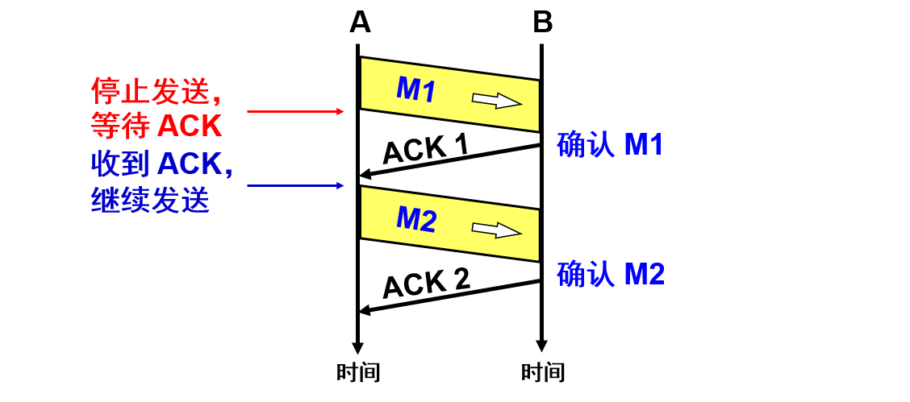
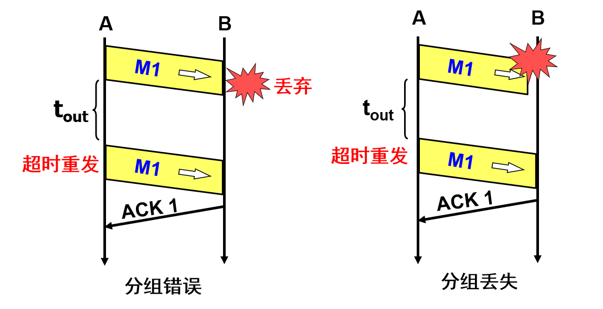
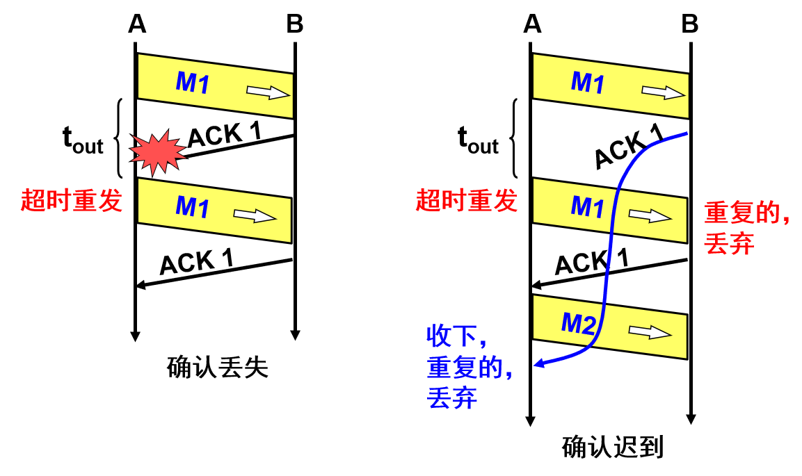
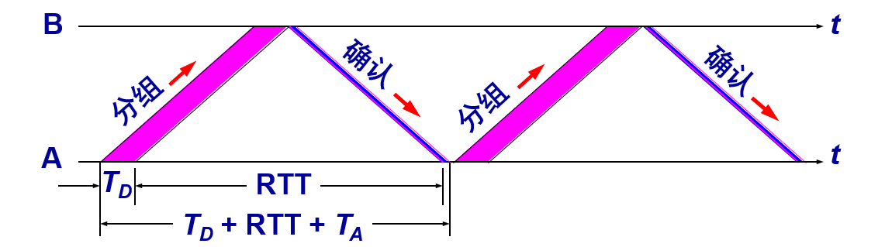
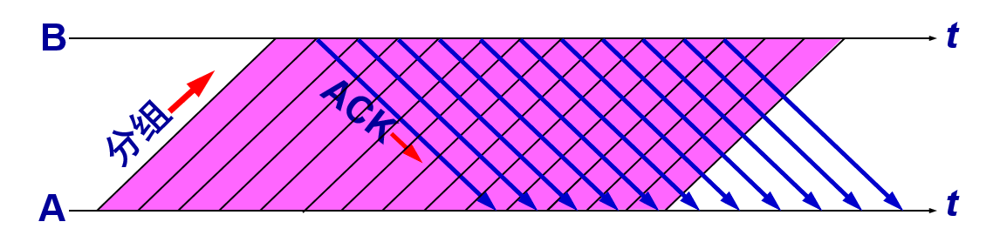
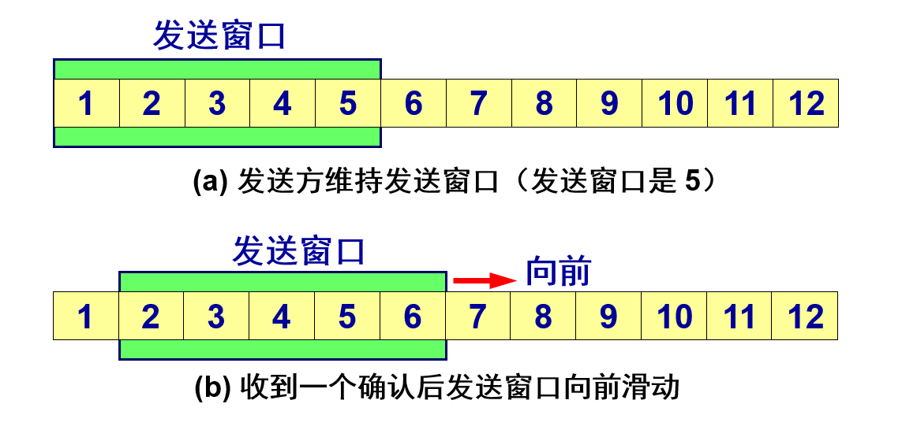

## 需要被实现的理想传输条件

---------

理想的传输条件有以下两个特点：

1. 传输信道不产生差错。
2. 不管发送方以多快的速度发送数据，接收方总是来得及处理收到的数据。

在这样的理想传输条件下，不需要采取任何措施就能够实现可靠传输。然而实际的网络都不具备以上两个理想条件。必须使用一些可靠传输协议，在不可靠的传输信道实现可靠传输。

## 停止等待协议

--------

停止等待就是每发送完一个分组就停止发送，等待对方的确认。在收到确认后再发送下一个分组。全双工通信的双方既是发送方也是接收方。

为了讨论问题的方便，我们仅考虑 `A` 发送数据而 `B` 接收数据并发送确认。因此 `A` 叫做发送方，而 `B` 叫做接收方。

#### 1.无差错的情况

`A` 发送分组 `M1`，发完就暂停发送，等待 `B` 的确认 `(ACK)`。`B` 收到了 `M1` 向 `A` 发送 `ACK`。`A` 在收到了对 `M1` 的确认后，就再发送下一个分组 `M2`。

#### 2.出现差错的情况

**接收方 B 的两种情况：**

1. `B` 接收 `M1` 时检测出了差错，就丢弃 `M1`，其他什么也不做（不通知 `A` 收到有差错的分组）。
2. `M1` 在传输过程中丢失了，这时 `B` 当然什么都不知道，也什么都不做。

在这两种情况下，B 都不会发送任何信息。

**发送方 A 的对应操作：**

1. 为每一个已发送的分组都设置了一个超时计时器。只要在超时计时器到期之前收到了相应的确认，就撤销该超时计时器，继续发送下一个分组 M2 。

#### 3.确认丢失和确认迟到

**确认丢失：**

若 `B` 所发送的对 `M1` 的确认丢失了，那么 `A` 在设定的超时重传时间内不能收到确认，但 `A` 并无法知道：是自己发送的分组出错、丢失了，或者 是 `B` 发送的确认丢失了。因此 `A` 在超时计时器到期后就要重传 `M1`。

假定 `B` 又收到了重传的分组 `M1`。这时 `B` 应采取两个行动：

1. 丢弃这个重复的分组 M1，不向上层交付。
2. 向 A 发送确认。不能认为已经发送过确认就不再发送，因为 A 之所以重传 M1 就表示 A 没有收到对 M1 的确认。

**确认迟到：**

传输过程中没有出现差错，但 `B` 对分组 `M1` 的确认迟到了。此时，`A` 会收到重复的确认。对重复的确认的处理很简单：收下后就丢弃。`B` 仍然会收到重复的 `M1`，并且同样要丢弃重复的 `M1`，并重传确认分组。

> **注意**
>
> - 在发送完一个分组后，必须暂时保留已发送的分组的副本，以备重发。
>
> - 分组和确认分组都必须进行编号。
>
> - 超时计时器的重传时间应当比数据在分组传输的平均往返时间更长一些。 

#### 4.自动重传请求 ARQ

通常 `A` 最终总是可以收到对所有发出的分组的确认。如果 `A` 不断重传分组但总是收不到确认，就说明通信线路太差，不能进行通信。使用上述的确认和重传机制，我们就可以在不可靠的传输网络上实现可靠的通信。

像上述的这种可靠传输协议常称为自动重传请求 `ARQ (Automatic Repeat reQuest)`。意思是重传的请求是自动进行的，接收方不需要请求发送方重传某个出错的分组。

**信道利用率计算：**

停止等待协议的优点是简单，缺点是信道利用率太低。用`TD`(分组发送时间),`TA`(分组接收时间),`RTT`(分组往返时间)来表示信道利用率信道利用率：
$$
U = T_D / (T_D~+~RTT~+~T_A)
$$

可以看出，当往返时间 `RTT` 远大于分组发送时间 `TD` 时，信道的利用率就会非常低。若出现重传，则对传送有用的数据信息来说，信道的利用率就还要降低。

## 连续 ARQ 协议

--------

为了提高传输效率，发送方可以不使用低效率的停止等待协议，而是采用流水线传输。流水线传输就是发送方可连续发送多个分组，不必每发完一个分组就停顿下来等待对方的确认。这样可使信道上一直有数据不间断地传送。

由于信道上一直有数据不间断地传送，这种传输方式可获得很高的信道利用率。 

### 滑动窗口

-------

滑动窗口协议比较复杂，发送方维持的发送窗口，它的意义是：位于发送窗口内的分组都可连续发送出去，而不需要等待对方的确认。这样，信道利用率就提高了。

连续 ARQ 协议规定，发送方每收到一个确认，就把发送窗口向前滑动一个分组的位置。

#### 累积确认

接收方一般采用累积确认的方式。即不必对收到的分组逐个发送确认，而是对按序到达的最后一个分组发送确认，这样就表示：到这个分组为止的所有分组都已正确收到了。

**优点：**容易实现，即使确认丢失也不必重传。

**缺点：**不能向发送方反映出接收方已经正确收到的所有分组的信息。

#### Go-back-N

如果发送方发送了前 `5` 个分组，而中间的第 `3` 个分组丢失了。这时接收方只能对前两个分组发出确认。发送方无法知道后面三个分组的下落，而只好把后面的三个分组都再重传一次。

这就叫做 `Go-back-N`（回退 `N`），表示需要再退回来重传已发送过的 `N` 个分组。可见当通信线路质量不好时，连续 `ARQ` 协议会带来负面的影响。 

## TCP 可靠通信的具体实现

-------

+ **滑动窗口** TCP 连接的每一端都必须设有两个窗口 —— 一个发送窗口和一个接收窗口。
+ **连续 ARQ** TCP 的可靠传输机制用字节的序号进行控制。TCP 所有的确认都是基于序号而不是基于报文段。
+ **流量控制** TCP 两端的四个窗口经常处于动态变化之中。
+ **拥塞控制** TCP 连接的往返时间 RTT 也不是固定不变的。需要使用特定的算法估算较为合理的重传时间。  