## 概述

------

运输层位于应用层和网络层之间，是分层的网络体系结构的重要部分。运输层服务即是即将网络层的在两个端系统之间的交付服务扩展到运行在两个不同端系统上的应用 层进程之间的交付服务。

运输层协议为运行在不同主机牛的应用进程之间提供了逻辑通信 (logic communication) 功能。通过逻辑通信，运行不同进程的主机好像直接相连一样;实 际上，这些主机也许位于地球的两侧，通过很多路由器及多种不同类型的链路相连。 应用 进程使用运输层提供的逻辑通信功能彼此发送报文，而无需考虑承载这些报文的物理基础 设施的细节。

运输层协议是在端系统中而不是在路由器中实现的。 在发送端，运输层将从发送应用程序进程接收到的报文转换成运输层分组，该分组称为 运输层报文段 ( segment) 。 实现的方法(可能)是将应用报文划分为较小的块，并为每块 加上一个运输层首部以生成运输层报文段。 在发送端系统中，运输层将这些报文段 传递给网络层，网路层将其封装成网络层分组(即数据报)并向目的地发送。在接收端，网络层从数据报中提取运输层报文段，并将该报文 段向上交给运输层。 运输层则处理接收到的报文段，使该报文段中的数据为接收应用进程使用。 

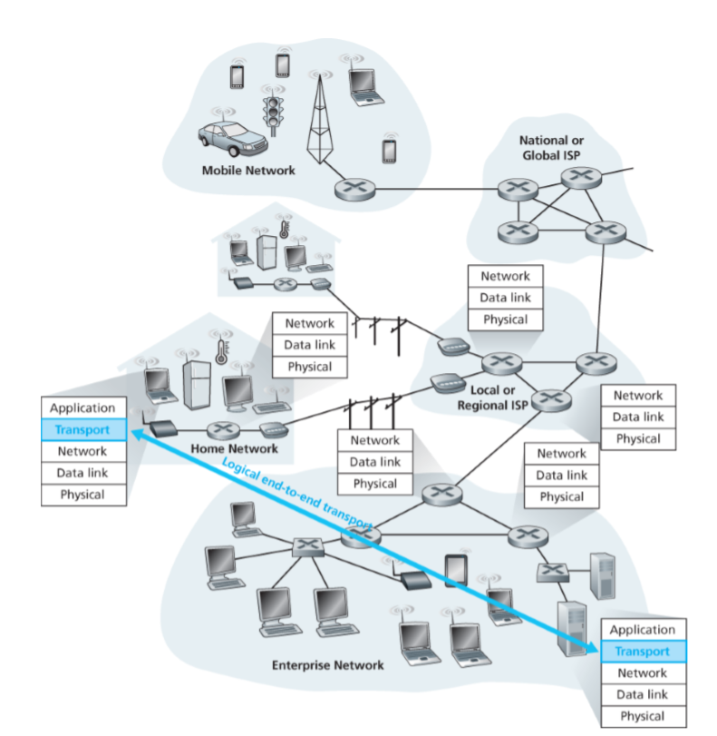

## 运输层和网络层的关系

网络层提供了主机之间的逻辑通信，而运输层为运行在不同主机上的进程之间提供了逻辑通信。运输层协议只工作在端系统中。在端系统中，运输层协议将来自应用进程的报文移动到网络边缘(即网络层)，反过来也是一样，但对有关这些报文在网络核心如何移动并不作任何规定。事实上，如图所示，中间路由器既不处理也不识别运输层加在应用层报文的任何信息。计算机网络中可以安排多种运输层协议，每种协议为应用程序提供不同的服务模型。运输协议能够提供的服务常常受制于底层网络层协议的服务模型。如果网络层协议无法为主机之间发送的运输层报文段提供时延或带宽保证的话，运输层协议也就无法为进程之间发送的应用程序报文提供时延或带宽保证。

然而，即使底层网络协议不能在网络层提供相应的服务，运输层协议也能提供某些服务。例如，如我们将在本章所见，即使底层网络协议是不可靠的，也就是说网络层协议会使分组丢失、篡改和冗余，运输协议也能为应用程序提供可靠的数据传输服务。另一个例子是即使网络层不能保证运输层报文段的机密性，运输协议也能使用加密来确保应用程序报文不被入侵者读取。

## 因特网运输层概述

前面讲过因特网为应用层提供了两种截然不同的可用运输层协议。这些协议一种是UDP(用户数据报协议)，它为调用它的应用程序提供了一种不可靠、无连接的服务。另一种是TCP(传输控制协议)，它为调用它的应用程序提供了一种可靠的、面向连接的服务。我们认为将TCP和UDP的分组统称为报文段，而将数据报名称保留给网络层分组不容易混淆。

因特网网络层协议有一个名字叫IP，即网际协议。IP为主机之间提供了逻辑通信。IP的服务模型是尽力而为交付服务(besl-e[[ortdeliveryservice)。这意味着IP尽它"最大的努力"在通信的主机之间交忖报文段，但它并不做任何确保。特别是，它不确保报文段的交付，不保证报文段的按序交付，不保证报文段巾数据的完整性。由于这些原因，IP被称为不可靠服务(unreliableservice)。在此还要指出的是，每台主机至少有一个网络层地址，即所谓的E地址。

UDP和TCP最基本的责任是，将两个端系统间E的交付服务扩展为运行在端系统上的两个进程之间的交付服务。将主机间交付扩展到进程间交付被称为运输层的多路复用(transport-layermultiplexing)与多路分解(demultiplexing)。

另一方面，TCP为应用程序提供了几种附加服务。首先，它提供可靠数据传输(reliabledalatTansfer)。通过使用流量控制、序号、确认和定时器(本章将详细介绍这些技术)，TCP确保正确地、按序地将数据从发送进程交付给接收进程。这样，TCP就将两个端系统间的不可靠IP服务转换成了一种进程间的可靠数据传输服务。TCP还提供拥塞控制(congestionconlrol)。拥塞控制与其说是一种提供给调用它的应用程序的服务，不如说是一种提供给整个因特网的服务，这是一种带来通用好处的服务。不太严格地说，TCP拥塞控制防止任何一条TCP连接用过多流量来淹没通信主机之间的链路和交换设备TCP力求为每个通过一条拥塞网络链路的连接平等地共享网络链路带宽。这可以通过调节TCP连接的发送端发送进网络的流量速率来做到。在另一方面，UDP流量是不可调节的。使用UDP传输的应用程序可以根据其需要以其愿意的任何速率发送数据。

## 多路复用与多路分解

将由网络层提供的主机到主机交付服务延伸到为运行在主机上的应用程序提供进程到进程的交付服务。

运输层负责将这些报文段中的数据交付给在主机上运行的适当应用程序进程。一个进程(作为网络应用的一部分)有一个或多个套接字(socket)，它相当于从网络向进程传递数据和从进程向网络传递数据的门户。因此，如图3-2所示，在接收主机中的运输层实际上并没有直接将数据交付给进程，而是将数据交给了一个中间的套接字。由于在任一时刻，在接收主机上可能有不止一个套接字，所以每个套接字都有唯一的标识符。

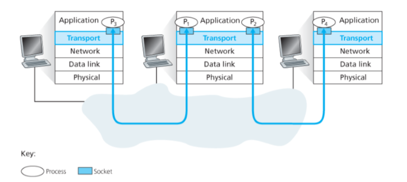

将运输层报文段中的数据交付到正确的套接字的工作称为多路分解(demulliplexing)。在源主机从不同套接字中收集数据块，并为每个数据块封装上首部信息(这将在以后用于分解)从而生成报文段，然后将报文段传递到网络层，所有这些工作称为多路复用(multiplexing)。

为了说明分僻的工作过程，可以再以前面一节的家庭进行类比。每一个孩子通过他们的名字来标识。主与Bill从邮道员处收到一批信件，并通过查看收信人名字而将信件亲手交付给他的兄弟姐妹们时，他执行的就是一个分解操作。当Ann从兄弟姐妹们那里收集信件并将它们交给邮递员时，她执行的就是一个多路复用操作。

通过上述讨论，我们知道运输层多路复用要求:

- 套接宇都有唯一标识符。

- 每个报文段有特殊字段来指示该报文段所要交付到的套接字。

这些特殊字段是源端口号字段(sourceportoumberfield)和目的端口号字段(destinationportnurnberfield)。端口号是一个16比特的数，其大小在0-65535之间。0-1023也围的端口号称为周知端口号(well-knownporlnumber)，是受限制的，这是指它们保留给诸如HTTP(它使用端口号80)和FTP(它使用端口号21)之类的周知应用层协议来使用。

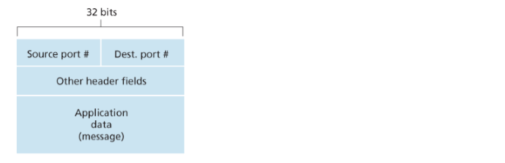

当报文段到达主机时，运输层检查报文段中的目的端口号，并将其定向到相应的套接字。然后报文段中的数据通过套接字进人其所连接的进程。

### 无连接的多路复用和分解

当用这种方式创建一个UDP套接字时，运输层自动地为该套接字分配一个端口号。特别是，运输层从范围1024-65535内分配一个端口号，该端口号是当前未被该主机中任何其他UDP端口使用的号。当然我们也可以在程序中指定特定端口号。

假定在主机A中的一个进程具有UDP端口19157，它要发送一个应用程序数据块给位于主机B巾的另一进程，该进程具有UDP端口46428。主机A中的运输层创建一个运输层报文段，其中包括应用程序数据、源端口号(19157)、日的端口号(46428)和两个其他值(将在后面讨论，它对当前的讨论并不重要)。然后.运输层将得到的报文段传递到网络层。网络层将该报文段封装到一个E数据报中，并尽力而为地将.j1Q.文段交付给接收主机。如果该报文段到达接收主机B，接收主机运输层就检查该报文段中的目的端口号(钊428)并将该报文段交付给端门号46428所标识的套接字。

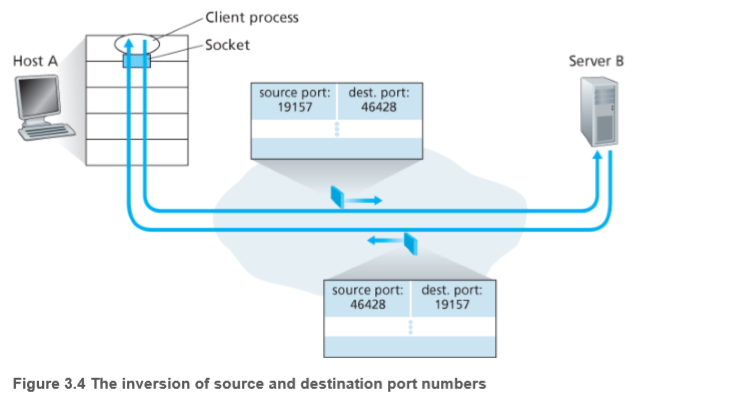

源端口号的用途是什么呢?如图 3-4 所示，在 A 到 B 的报文段 中，源端口号用作"退回地址"的一部分，即当 B 需要回发一个报文段给 A 时， B 到 A 的报文段中的目的端口号便从 A 到 B 的报文段中的源端口号中取值。 (完整的返回地址是 A 的 IP 地址和源端口号。)

### 面向连接的多路复用与多路分解

为了理解TCP分解，我们必须更为仔细地研究TCP套接字和TCP连接创建。TCP套接字是由一个四元组(源JP地址，游、端口号，目的IP地址，目的端口号)来标识的。特别与UDP不同的是，两个具有不同源E地址或惊端口号的到达TCP报文段将被定向到两个不同的套接字。

- TCP服务器应用程序有一个"welcomingsocket"，它在12∞0号端口上等待来自TCP客户(见图2-29)的连接建立请求。

- TCP客户使用下面的代码创建一个套接字并发送一个连接建立请求报文段:

  - ```python
    clientSocket = socket(AF_INET, SOCK_STREAM)               clientSocket.connect((serverName,12000))
    ```

- 当运行服务器进程的计算机的主机操作系统接收到具有目的端口12000的入连接请求报文段后，它就定位服务器进程，该进程正在端口号12000等待接受连接。该服务器进程则创建一个新的套接宇:

  - ```python
    connectionSocket, addr = serverSocket.accept()
    ```

- 该服务器的运输层还注意到连接请求报文段巾的下列4个值:①该报文段巾的源端口号;②源主机E地址;③该报文段中的目的端口号;④向身的E地址。新创建的连接套接字通过这4个值来标识。所有后续到达的报文段，如果它们的源端口号、源主机IP地址、目的端口号和目的E地址都与这4个值匹配，则被分解到这个套接字。随着TCP连接完成，客户和服务器便可相互发送数据了。

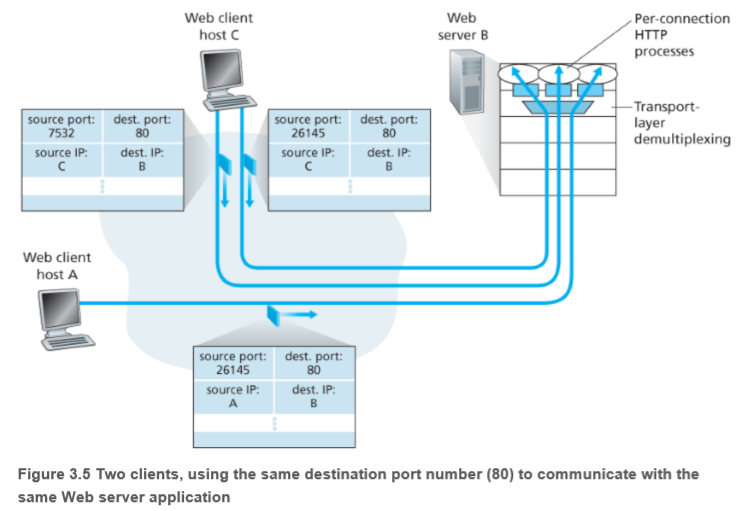

### Web 服务器与 TCP

考虑一台运行Web服务器的主机，例如在端口80上运行一个ApacheWeb服务器。当客户(如浏览器)向该服务器发送报文段时，所有报文段的目的端口都将为80。特别是，初始连接建立报文段和承载HTTP请求的报文段都有80的目的端口。如我们刚才描述的那样，该服务器能够根据源IP地址和源端口号来区分来自不同客户的报文段。

图3-5显示了一台Weh服务器为每条连接生成一个新进程。如图3-5所示，每个这样的进程都有自己的连接套接字，通过这些套接字可以收到HTTP请求和发送HTTP响应。然而，我们要提及的是，连接套接字与进程之间并非总是有着一一对应的关系。事实上，当今的高性能Weh服务器通常只使用一个进程，但是为每个新的客户连接创建一个具有新连接套接字的新线程。(线程可被看作是一个轻量级的子进程。)

## 无连接运输 : UDP 

运输层最低限度必须提供一种复用/分解服务，以便在网络层与正确的应用级进程之间传递数据。

UDP从应用进程得到数据，附加上用于多路复用/分解服务的源和目的端口号字段，以及两个其他的小字段，然后将形成的报文段交给网络层。如果该报文段到达接收主机，UDP使用目的端口号将报文段中的数据交付给正确的应用进程。值得注意的是，使用UDP时，在发送报文段之前，发送方和接收方的运输层实体之间没有握手。正因为如此，UDP被称为是无连接的。

DNS是一个通常使用UDP的应用层协议的例子。当一台主机中的DNS应用程序想要进行一次查询时，它构造了一个DNS查询报文并将其交给UDPo元须执行任何与运行在日的端系统中的UDP实体之间的握手，主机端的UDP为此报文添加1首部字段，然后将形成的报文段交给网络层。网络层将此UDP报文段封装迸一个E数据报l书，然后将其发送给一个名字服务器。在查询主机中的DNS应用程序则等待对该查询的响应。如果它没有收到响应(可能是由于底层网络丢失了查询或响应)，则要么试罔向另一个名字服务器发送该查询，要么通知调用的应用程序它不能获得响应。

有许多应用更适合用UDP，原因主要以下儿点:

- 因为实时应用通常要求最小的发送速率，不希望过分地延迟报文段的传送，且能容忍一些数据丢失，TCP服务模型并不是特别适合这些应用的需要。
- TCP在开始数据传输之前要经过气次握手。UDP却不需要任何准备即可进行数据传输。因此UDP不会引人建立连接的时延。这可能是DNS运行在UDP之上而不是运行在TCP之上的主要原因(如果运行在TCP上，则DNS会慢得多)0HTTP使用TCP而不是UDP，因为对于具有文本数据的Wt>b网贞来说，可靠性是至关重要的。
- 无连接状态。TCP需要在端系统中维护连接状态。此连接状态包括接收和发送缓存、拥塞控制参数以及序号与确认号的参数。UDP不维护连接状态，也不跟踪这些参数。
- 分组首部开销小。每个TCP报文段都有20字节的首部开销，而UDP仅有8字节的开销。

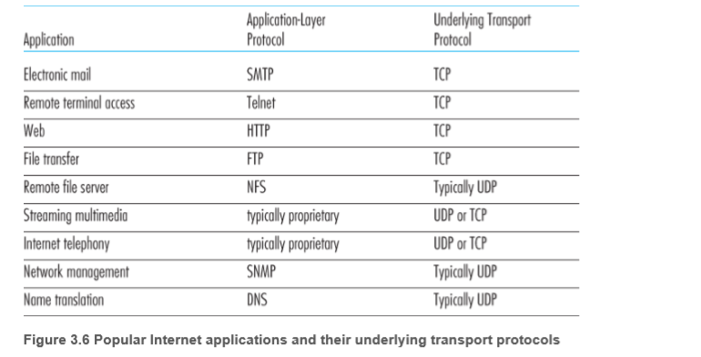

如我们前面所述，UDP没有拥塞控制。但是，需要拥塞控制来预防网络进入一种拥塞状态，此时只能做很少的有用工作。如果每个人都启动流式高比特率视频而不使用任何拥塞控制的话，就会使路由器中有大量的分组溢出，以至于几乎没有UDP分组能成功地通过源到目的的路径传输。况且，由元控制的UDP发送方引人的高丢包率将引起TCP发送方(如我们将看到的那样，TCP遇到拥塞将减小它们的发送速率)大大地减小它们的速率。因此，UDP中缺乏拥塞控制能够导致UDP发送方和接收方之间的高丢包率，并挤垮了TCP会话，这是一个潜在的严重问题。很多研究人员已提出了一些新机制，以促使所有的数据源(包括UDP源)执行自适应的拥塞控制。

### UDP 报文段结构

UDP首部只有4个字段，每个字段由两个字节组成。通过端口号可以使目的主机将应用数据交给运行在目的端系统中的相应进程(即执行分解功能)。长度字段指示了在UDP报文段中的字节数(首部加数据)。首部固定8个字节，我们可以算出来数据段的大小。接收方使用检验和来检查在该报文段中是否出现了差错。

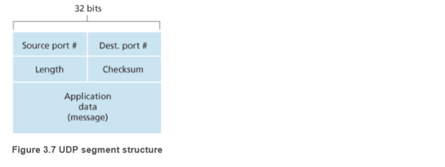

### UDP 检验和

## 可靠数据传输原理

为上层实体提供的服务抽象是:数据可以通过一条可靠的信道进行传输。借助于可靠信道，传输数据比特就不会受到损坏(由0变为1，或者相反)或丢失，而且所有数据都是按照其发送顺序迸行交付。这恰好就是TCP向调用它的因特网应用所提供的服务模型。

实现这种服务抽象是可靠数据传输协议(reliabledatatransferprotocol)的责任。由于可靠数据传输协议的下层协议也许是不可靠的，因此这是一项困难的任务。例如，TCP是在不可靠的(IP)端到端网络层之上实现的可靠数据传输协议。 

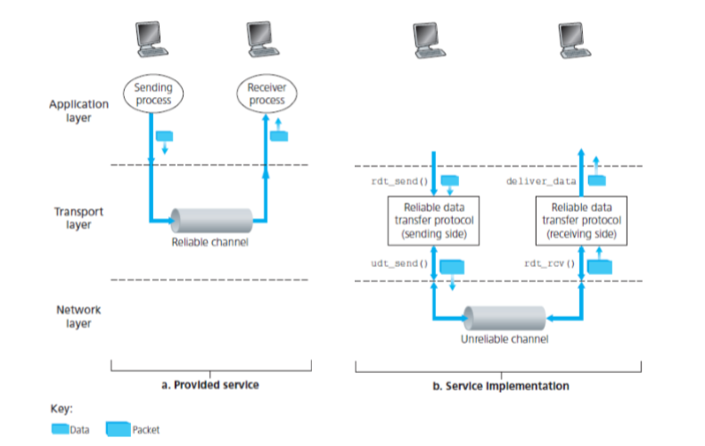

### rdt协议

### 流水线协议

## 面向连接的运输: TCP 

TCP是因特网运输层的面向连接的可靠的运输协议。为了提供可靠数据传输，TCP依赖于许多基本原理，其中包括差错检测、重传、累积确认、定时器以及用于序号和确认号的首部字段。

TCP被称为是面向连接的(connection-oriented)，这是因为在一个应用进程可以开始向另一个应用进程发送数据之前，这两个进程必须先相互"握手"，即它们必须相互发送某些预备报文段，以建立确保数据传输的参数。作为TCP连接建立的一部分，连接的双方都将初始化与TCP连接相关的许多TCP状态变量。

这种TCP"连接"不是一条像在电路交换网络中的端到端TDM或FDM电路，也不是一条虚电路，因为其连接状态完全保留在两个端系统中。由于TCP协议只在端系统中运行，而不在中间的网络元素(路由器和链路层交换机)中运行，所以中间的网络元素不会维持TCP连接状态。事实上，中间路由器对TCP连接完全视而不见，它们看到的是数据报，而不是连接。

TCP连接提供的是全双工服务(full-duplexservice):如果一台主机上的进程A与另一台主机上的进程B存在一条TCP连接，那么应用层数据就可在从进程B流向进程A的同时，也从进程A流向进程。TCP连接也总是点对点(point-to-point)的，即在单个发送方与单个接收方之间的连接。所谓"多播"，即在一次发送操作中，从一个发送方将数据传送给多个接收方，对TCP来说这是不可能的。

### 流程概述

现在来看看 TCP 连接是怎样建立的，客户首先发送一个特殊的TCP报文段，服务器用另一个特殊的TCP报文段来响应，最后，客户再用第三个特殊报文段作为响应。前两个报文段不承载"有效载荷由于在这两台主机之间发送了3个报文段，所以这种连接建立过程常被称为三次握手(three-way handshake)。

客户进程通过套接字(该进程之门)传递数据流。数据一旦通过该门，它就由客户中运行的TCP控制了。如图3-28所示，TCP将这些数据引导到该连接的发送缓存(sendbuffer)里，发送缓存是在三次握手初期设置的缓存之一。接下来TCP就会不时从发送缓存里取出一块数据。

TCP可从缓存中取出并放人报文段中的数据数量受限于最大报文段长度(MaximumSegmenlSize,MSS)。MSS通常根据最初确定的由本地发送主机发送的最大链路层帧长度(即所谓的最大传输单元(MaximumTransmissionUnit,MTU))来设置。设置该MSS要保证一个TCP报文段(当封装在一个IP数据报中)加上TCP/IP首部长度(通常40字节)将适合单个链路层帧。以太网和PPP链路层协议都具有1500字节的MTU，因此MSS的典型值为1460字节。

TCP为每块客户数据配上一个TCP首部，从而形成多个TCP报文段(TCPsegment)。这些报文段被下传给网络层，网络层将其分别封装在网络层E数据报中。然后这些E数据报被发送到网络中。当TCP在另一端接收到一个报文段后，该报文段的数据就被放人该TCP连接的接收缓存中，如图3-28中所示。应用程序从此缓存中读取数据流。TCP连接的每一端都有各自的发送缓存和接收缓存。

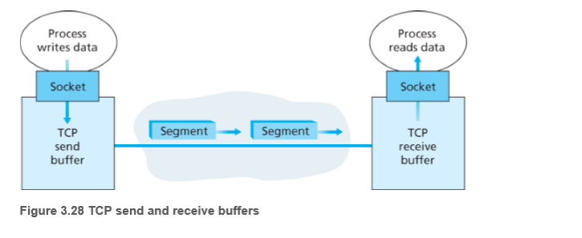

### TCP 报文段结构

当TCP发送一个大文件，TCP通常是将该文件划分成长度为MSS的若干块(最后一块除外，它通常小于MSS)。然而，交互式应用通常传送长度小于MSS的数据块。例如，对于像Telnet这样的远程登录应用，其TCP报文段的数据字段经常只有一个字节。由于TCP的首部一般是20字节(比UDP首部多12字节)，所以Telnet发送的报文段也许只有21字节长。

与UDP一样，首部包括源端口号和目的端口号，它被用于多路复用/分解来自或送到上层应用的数据。另外，同UDP一样，T巳P首部也包括检验和字段(cbecksumfield)。TCP报文段首部还包含下列字段:

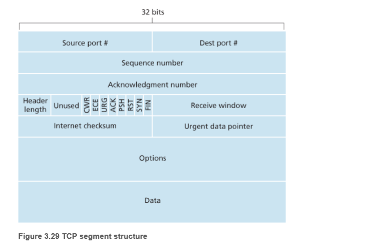

- 32比特的序号字段(sequencenumberfield)和32比特的确认号字段(acknowledgmentnumberfield)。
- 6比特的标志字段(fLagfield)0ACK比特用于指示确认字段中的值是有效的，即该报文段包括一个对已被成功接收报文段的确认。RST、SYN和FIN比特用于连接建立和拆除。
- 4比特的首部长度字段(headerlengthfield)，该字段指示了以32比特的字为单位的TCP首部长度。由于TCP选项字段的原因，TCP首部的长度是可变的。(通常，选项字段为空，所以TCP首部的典型长度就是20字节。)
- 16比特的接收窗口字段(receivewindowfield)，该字段用于流量控制。
- 可选与变长的选项字段(optionsfield)，该字段用于发送方与接收方协商最大报文段长度(MSS)时，或在高速网络环境下用作窗口调节因子时使用。首部宇段巾还定义了一个时间戳选项。

> PSH比特被设置的时候，就指示接收方应立即将数据交给上层。最后，URG比特用来指示报文段里存在着被发送端的上层实体置为"紧急"的数据。紧急数据的最后一个字节由16比特的紧急数据指针字段指出。当紧急数据存在并给出指向紧急数据尾的指针的时候，TCP必须通知接收端的上层实体。(在实践巾，PSH、URG和紧急数据指针并没有使用。为了完整性起见，我们才提到这些字段。)

#### 序号和确认号

TCP 报文段首部中两个最重要的字段是序号字段和确认号字段。

TCP把数据看成一个无结构并有序的字节流。我们从TCP对序号的使用上可以看出这一点，因为序号是建立在传送的字节流之上，而不是建立在传送的报文段的序列之上。一个报文段的序号(sequencenumberforasegment)因此是该报文段**首字节**的字节流编号。4

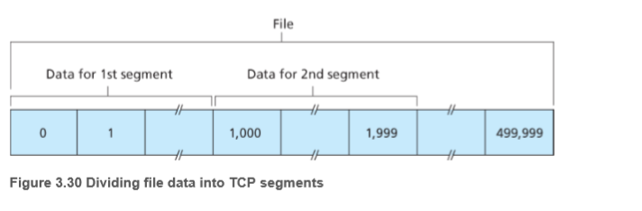

假设主机A上的一个进程想通过一条TCP连接向主机B上的一个进程发送一个数据流。主机A中的TCP将隐式地对数据流中的每一个字节编号。假定数据流由一个包含500000字节的文件组成，其MSS为1000字节，数据流的首字节编号是0。如图3-30所示，该TCP将为该数据流构建500个报文段。给第一个报文段分配序号0，第二个报文段分配序号1000，第三个报文段分配序号20∞，以此类推。每一个序号被填人到相应TCP报文段首部的序号字段中。

确认号要比序号难处理一些。前面讲过，TCP是全双工的，肉此主机A在向主机B发送数据的同时，也许也接收来自主机B的数据(都是同一条TCP连接的一部分)。从主机B到达的每个报文段中都有一个序号用于从B流向A的数据。主机A填充进报文段的确认号是主机A期望从主机B收到的下一字节的序号。看一些例子有助于理解实际发生的事情。假设主机A已收到了来自主机B的编号为0-535的所有宇节，同时假设它打算发送一个报文段给主机B。主机A等待主机B的数据流中字节536及之后的所有字节。所以主机A就会在它发往主机B的报文段的确认号字段中填上536。

举一个例子，假设主机A己收到一个来自主机B的包含字节0-535的报文段，以及另一个包含字节900-1000的报文段。由于某种原因，主机A还没有收到字节536-899的报文段。在这个例子中，主机A为了重新构建主机B的数据流，仍在等待字节536(和其后的字节)。因此，A到B的下一个报文段将在确认号字段中包含536。因为TCP只确认该流中至第一个丢失字节为止的字节，所以TCP被称为提供累积确认(cumulativeacknowledgment)。

一条TCP连接的双方均可随机地选择初始序号。这样做可以减少将那些仍在网络中存在的来自两台主机之间先前已终止的连接的报文段，误认为是后来这两台主机之间新建连接所产生的有效报文段的可能性(它碰巧与旧连接使用了相同的端口号)

### 往返时间的估计与超时

TCP如同前面所讲的 rdt 协议一样，它采用超时/重传机制来处理报文段的丢失问题。最明显的一个问题就是超时间隔长度的设置。显然，超时间隔必须大于该连接的往返时间(RTT)，即从一个报文段发出到它被确认的时间。否则会造成不必要的重传。但是这个时间间隔到底应该是多大呢?刚开始时应如何估计往返时间呢?

#### 估计往返时间

报文段的样本Rπ(表示为SampleRTT)就是从某报文段被发出(即交给IP)到对该**报文段的确认**被收到之间的时间量。大多数TCP的实现仅在某个时刻做一次SampleRTT测量

由于路由器的拥塞和端系统负载的变化，这些报文段的SampleRTT值会随之披动。由于这种波动，任何给定的SampleRTT值也许都是非典型的。因此，为了估计一个典型的RTT，自然要采取某种对SampleRTT取平均的办法。TCP维持一个SampleRTT均值(称为EstimatedRTT)。一旦获得一个新SampleRTT时，TCP就会根据下列公式来更新EstimaLedRTT。
$$
EstimatedRTT = (1 -α)*EstimatedRTT +α*SampleRTT 
$$
α 参考值是 α=0.125 (即 1/8) ，这时上面的公式变为 : 
$$
EstimatedRTT =0.875 *EstimaledRTT +0. 125* SampleRTT 
$$
除了估算RTT外，测量RTT的变化也是有价值的。RFC定义了RTT偏差DevRtt，用于估算SampleRtt一般会偏离EstimaLedRTT的程度:
$$
DevRTT=(1-β).DevRTT+β.|SampleRTT一EstimatedRTT|
$$

#### 设置和管理重传超时间隔 

假设已经给出了EstimatedRTI值和DevRTI值，那么TCP超时间隔应该用什么值呢?很明显，超时间隔应该大于等于EstimatedRTI，否则，将造成不必要的重传。但是超时间隔也不应该比EstimatedRTI大太多，否则当报文段丢失时，TCP不能很快地重传该报文段，导致数据传输时延大。因此要求将超时间隔设为EstimatedRTI加上一定余量。当SampleRTI值波动较大时，这个余量应该大些;当波动较小时，这个余量应该小些。因此，DevRTI值应该在这里发挥作用了。在TCP的确定重传超时间隔的方法中，所有这些因素都考虑到了:
$$
TimeoutInterval = EstimatedRTT +4*DevRTI
$$
推荐的初始TimeoutInterval值为1秒[盯C6298]。同样，当出现超时后，TimeoutInterval值将加倍，以免即将被确认的后继报文段过早出现超时。不管怎样，一旦报文段收到并更新EstimatedRTI后，TimeoutInterval就又使用上述公式计算了。

### 可靠数据传输

对于lP服务，数据报能够溢出路由器缓存而永远不能到达目的地，数据报也可能是乱序到达，而且数据报中的比特可能损坏(由0变为1或者相反)。

TCP在lP不可靠的尽力而为服务之上创建了一种可靠数据传输服务。TCP的可靠数据传输服务确保一个进程从其接收缓存中读出的数据流是无损坏、无间隔、非冗余和按序的数据流;即该字节流与连接的另一方端系统发送出的字节流是完全相同。

在我们前面研发可靠数据传输技术时，曾假定每一个已发送但未被确认的报文段都与一个定时器相关联，这在概念上是最简单的。虽然这在理论上很好，但定时器的管理却需要相当大的开销。因此，TCP协议遵循了这种单一定时器。

我们先给出一个TCP发送方的高度简化的描述，该发送方只用超时来恢复报文段的丢失;然后再给出一个更全面的描述，该描述中除了使用超时机制外，还使用冗余确认技术。

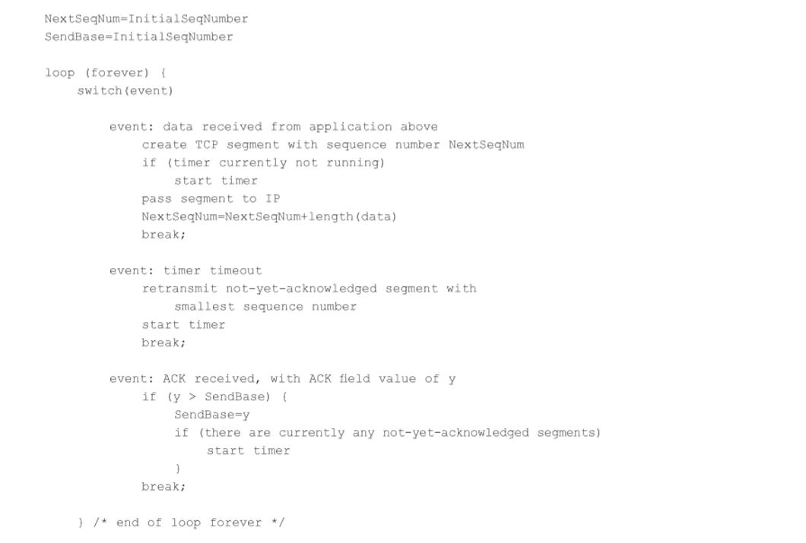

> **以上是tcp协议发送端（单向）的伪代码：**
>
> **首先**：从上层接受数据之后我们检测数据是否超出窗体限制，若是没有则使nextSequence序号+数据的长度，如果说没有定时器启动就启动定时器。
>
> **其次**：每一次定时器超时，我们都重新传输最小序号报文段。
>
> **最后**：当接受到确认的Ack序号为y之后，说明y之前的报文段都已被确认，将sendBase改为y(y需要大于未确认的最小序号)。

#### 情况分析

第一张图没有什么好说的，只要超过定时器时间限制，就会重新传输第一序号的报文段。

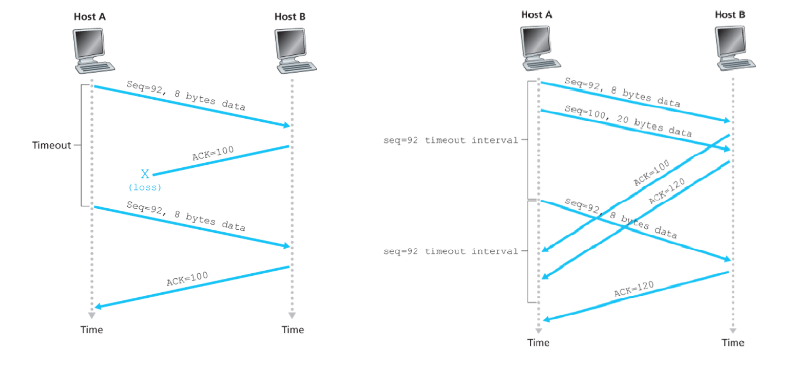

而在第二张图中，第一序号和第二序号超时到达，其间触发了一次第一序号的重传，重传的确认报文到达之后，其实什么也不会发生，由上面伪代码的`if y > SendBase`可以看出。

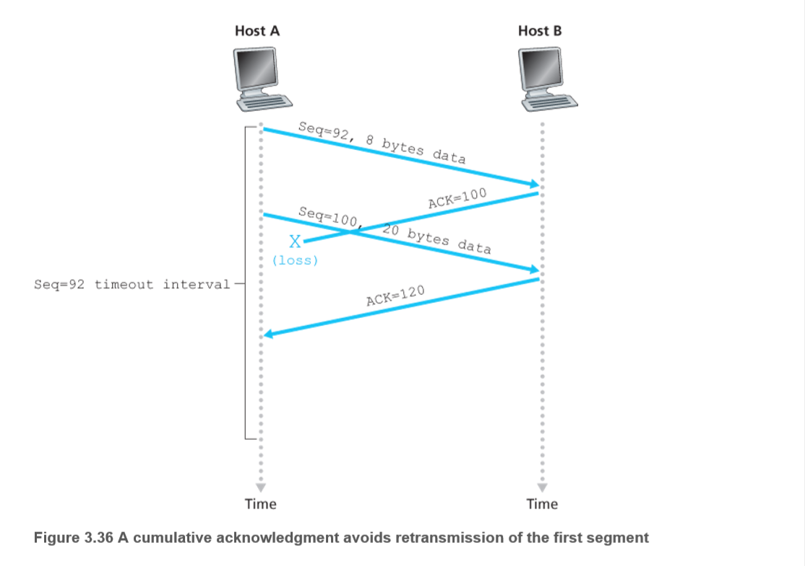

在第三种也是最后一种情况中，假设主机A与在第二种情况中完全一样，发送两个报文段。第一个报文段的确认报立在网络丢失，但在超时事件发生之前主机A收到一个确认号为120的确认报文。主机A因而知道主机B已经收到了序号为119及之前的所有字节;所以主机A不会重传这两个报文段中的任何一个。

#### 超时间隔加倍

TCP重传具有最小序号的还未被确认的报文段。只是每次TCP重传时都会将下一次的超时间隔设为先前值的两倍，而不是用从EstimatedRTT和DevRπ推算出的值。然而，每当定时器在另两个事件(即收到上层应用的数据和收到ACK)中的任意一个启动时，Timeoutlnterval由最近的EstimaledRTT值与DevRTT值推算得到。

#### 快速重传

超时触发重传存在的问题之一是超时周期可能相对较氏。当一个报文段丢失时，这种民超时周期迫使发送方延迟重传丢失的分组，因而增加了端到端时延。幸运的是，发送方通常可在超时事件发生之前通过注意所谓冗余ACK来较好地检测到丢包情况。冗余ACK(duplicateACK)就是再次确认某个报文段的ACK，而发送方先前已经收到对读报文段的确认。

 当 TCP 接收方收到一个具 有这样序号的报文段时，即其序号大于下一个所期望的、按序的报文段，它检测到了数据 流中的一个间隔，这就是说有报文段丢失。 这个间隔可能是由于在网络中报文段丢失或重 新排序造成的。 因为 TCP 不使用否定确认，所以接收方不能向发送方发囚一个显式的否定 确认。 相反，它只是对已经接收到的最后一个按序字节数据进行重复确认(即产生一个冗 余 ACK) 即可。 

```go
event: ACK received, with ACK field value of y
    if (y > SendBase) {
                    SendBase=y            
                    if (there are currently any not yet acknowledged segments){
                           start timer
                    }
    }            
	else {
        /* a duplicate ACK for already ACKed segment */
        increment number of duplicate ACKs received for y
        if (number of duplicate ACKS received for y == 3) /* TCP fast retransmit */ {
            resend segment with sequence number y
        }
    }
break;
```

如果一个报文段丢失，就很可能引起许多一个接一个的冗余ACK。如果TCP发送方接收到对相同数据的3个冗余ACK，它把这当作一种指示，说明跟在这个已被确认过3次的报文段之后的报文段已经丢失。一旦收到3个冗余ACK，TCP就执行快速重传(fastretransmil)，即在该报文段的定时器过期之前重传丢失的报文段。

#### 是回退 N 步还是选择重传

前面讲过，TCP确认是累积式的，正确接收但失序的报文段是不会被接收方逐个确认的。因此,TCP发送方仅需维持已发送过但未被确认的字节的最小序号(SendBase)和下一个要发送的字节的序号(NextSeqNum)。

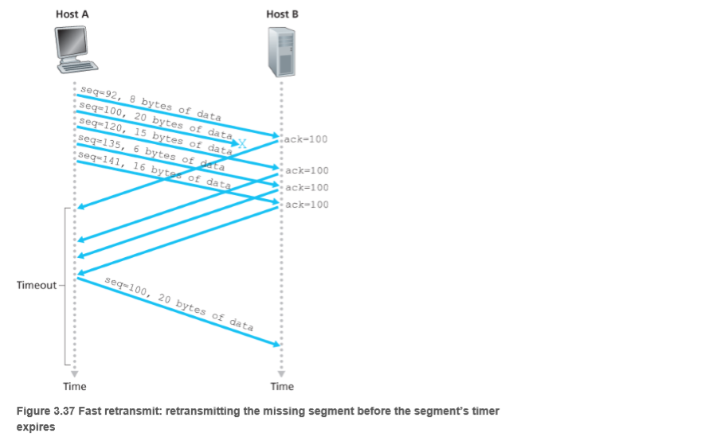

对TCP提出的一种修改意见是所谓的选择确认,它允许TCP接收方有选择地确认失序报文段，而不是累积地确认最后一个正确接收的有序。报文段。当将该机制与选择重传机制结合起来使用时(即跳过重传那些已被接收方选择性地确认过的报文段)，

### 流量控制

前面讲过，一条TCP连接每一侧主机都为该连接设置了接收缓存。主与该TCP连接收到正确、按序的字节后，它就将数据放入接收缓存。相关联的应用进程会从该缓存中i卖取数据，但不必是数据刚一到达就立即读取。事实上，接收方应用也许正忙于其他任务，甚至要过很长时间后才去读取该数据。如果某应用程序读取数据时相对缓慢，而发送方发送得太多、太快，发送的数据就会很容易地使眩连接的接收缓存溢出。

TCP为它的应用程序提供了流量控制服务(110w-controlservice)以消除发送方使接收方缓存溢出的可能性。即发送方的发送速率与接收方应用程序的民取速率相匹配。

TCP通过让发送方维护一个称为接收窗口(receivewindow)的变量来提供流量控制。通俗地说，接收窗口用于给发送方一个指示一一该接收方还有多少可用的缓存空间。

假设主机A通过一条TCP连接向主机B发送一个大文件主机B为该连接分配了一个接收缓存，并用RcvBuffer来表示其大小。主机B上的应用进程不时地从该缓存中读取数据。我们定义以下变量:

- LastByteReacl:主机B上的应用进程从缓存读出的数据流的最后一个字节的编号。
- LastByteRcvd:从网络中到达的并且已放人主机B接收缓存巾的数据流的最后一个字节的编号。

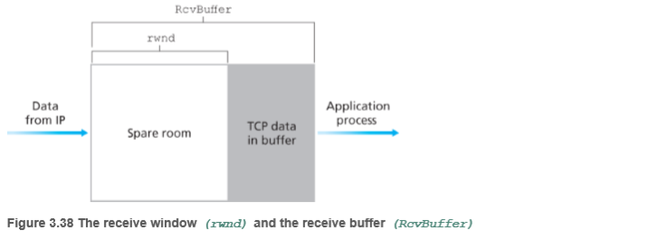

由于TCP不允许已分配的缓存溢出，下式必须成立:
$$
LasLByteRcvd-LastByteRead<RcvBuffer
$$
接收窗口用rwnd表示，根据缓存可用空间的数量来设置:
$$
rwnd=RcvBuffer-[LastByteRcvd-LastßyteRead]
$$
由于该空间是随着时间变化的，所以rwnd是动态的。

主机A轮流跟踪两个变量，LastByteSent和LastByteAcked，这两个变量的意义很明显。注意到这两个变量之间的差LastByteSent-LastByteAcked满足：
$$
LastByteSent - LastByteAcked < rwnd 
$$
对于这个方案还存在一个小小的技术问题。为了理解这一点，假设主机B的接收缓存已经存满，使得rwnd=0。在将rwnd=0届告给主机A之后，还要假设主机B没有任何数据要发给主机A。此时，考虑会发生什么情况。因为主机B上的应用进程将缓存清空，TCP并不向主机A发送带有rwnd新值的新报文段;

事实上，TCP仅当在它有数据或有确认要发时才会发送报文段给主机A。这样，主机A不可能知道主机B的接收缓存已经有新的空间了，即主机A被阻塞而不能再发送数据!为了解决这个问题，TCP规范中要求:当主机B的接收窗口为0时，主机A继续发送只有一个字节数据的报文段。这些报文段将会被接收方确认。最终缓存将开始清空，并且确认报文里将包含一个非0的nvnd值。 

### TCP 连接管理

接下来我们更为仔细地观察如何建立和拆除一条 TCP 连接。 

#### 建立：

- 第一步：客户端的TCP首先向服务器端的TCP发送一个特殊的TCP报文段。该报文段中不包含应用层数据。但是在报文段的首部(参见图3-29)中的一个标志位(即SYN比特)被置为i。因此，这个特殊报文段被称为SYN报文段。另外，客户会随机地选择一个初始序号(client_isn)，并将此编号放置于该起始的TCPSYN报文段的序号字段中。
- 第二步：服务器会从该数据报中提取出TCPSYN报文段，为该TCP连接分配TCP缓存和变量，并向该客户TCP发送允许连接的报文段。这个允许连接的报文段也不包含应用层数据。 但是，在报文段 的首部却包含 3 个重要的信息。 首先， SYN 比特被置为 1 0 其次，该 TCP 报文段 首部的确认号字段被置为 client_ isn + 1 。 最后，服务器选择自己的初始序号 (server_isn) ，并将其放置到 TCP 报文段首部的序号宇段中。 该允许连接的报文段有时被称为SYNACK报文段(SYNACKsegment)。
- 第三步：在收到 SYNACK 报文段后， 客户也要给该连接分配缓存和变量。 客户主 机则向服务器发送另外一个报文段。这最后一个报文段对服务器的允许连接的报 文段进行了确认(该客户通过将值 server_isn + 1 放置到 TCP 报文段首部的确认字 段中来完成此项工作)。 因为连接已经建立了， 所以该 S刊比特被置为 0。 该三次 握手的第三个阶段可以在报文段负载中携带客户到服务器的数据。

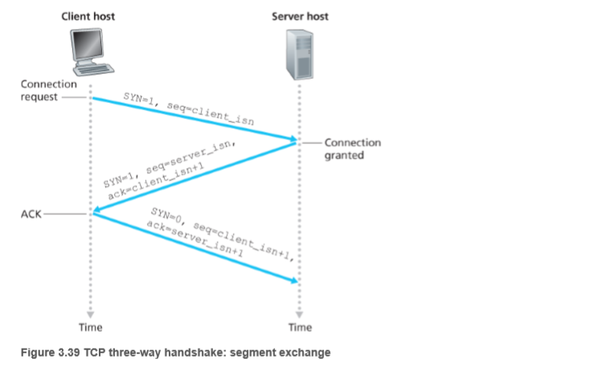

这种连接创建过程通常被称为3次握手(three-way handshake)。

#### 拆除：

客户应用进程发出一个关闭连接命令。这会引起客户TCP向服务器进程发送一个特殊的TCP报文段。这个特殊的报文段让其首部中的一个标志位即FIN比特被设置为1。当服务器接收到该报文段后，就向发送方回送一个确认报文段。然后，服务器发送它自己的终止报文段，其FIN比特被置为1。最后，该客户对这个服务器的终止报文段进行确认。此时，在两台主机上用于该连接的所有资源都被释放了。

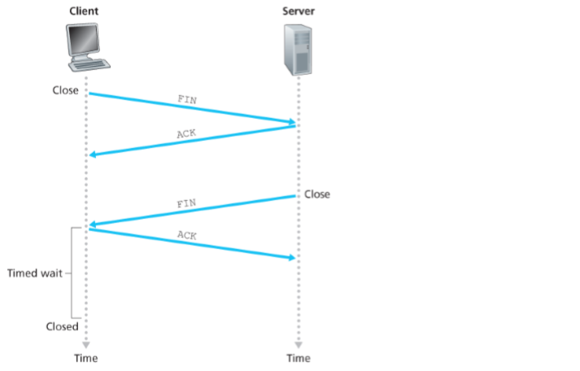

#### **状态变迁：**

在一个TCP连接的生命周期内，运行在每台主机中的TCP协议在各种TCP状态(TCPstate)之间变迁。

**client：**

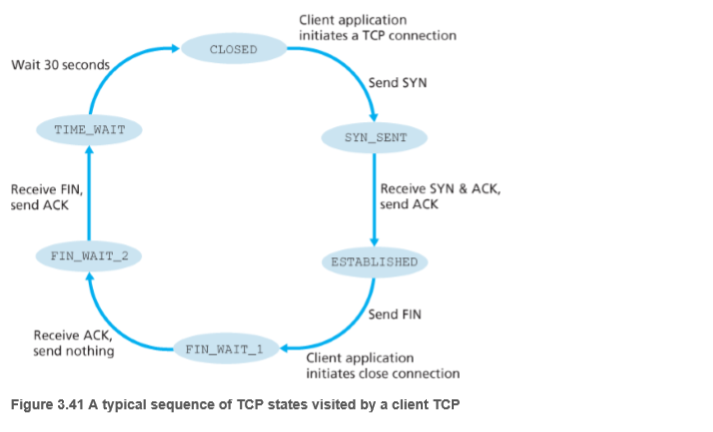

**server：**

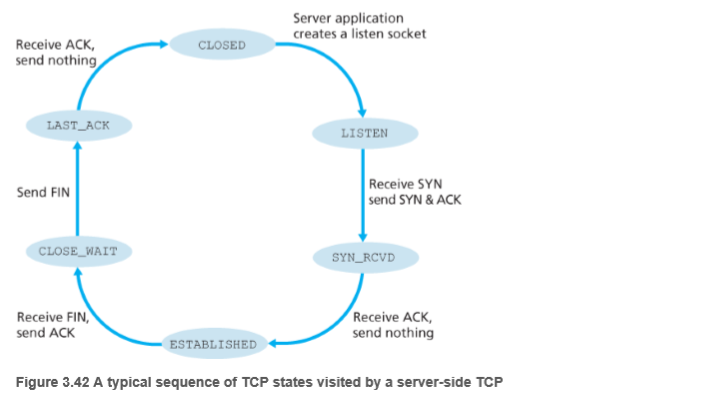

#### SYN 洪泛攻击

见书P169

### TCP连接重置

假如一台主机接收了具有目的端口80的一个TCPSYN分组，但该主机在端口80不接受连接则该主机将向源发送一个特殊重置报文段。该TCP报文段将RST标志位置为1。因此，当主机发送一个重置报文段时，它告诉该源"我没有那个报文段的套接字。"

综上我们可以看出当源主机发起一个TCP请求之后会有三种响应结果：

- 源主机从目标主机接收到一个TCPSYNACK报文段。

- 源主机从目标主机接收到一个TCPRST报丈段。

- 源什么也没有收到。这很可能表明该SYN报文段被中间的防火墙所阻挡，无法到达目标主机。

### 拥塞控制方法

在最为宽泛的级别上，我们可根据网络层是否为运输层拥塞控制提供了显式帮助，来区分拥塞控制方法。

- **端到端拥塞控制**：在端到端拥塞控制方法中，网络层没有为运输层拥塞控制提供显式支持。TCP报文段的丢失(通过超时或3次冗余确认而得知)被认为是网络拥塞的一个迹象，TCP会相应地减小其窗口长度。
- **网络辅助的拥塞控制**：在网络辅助的拥塞控制中，网络层构件(即路由器)向发送方提供关于网络中拥塞状态的显式反馈信息。例如，ATMABR拥塞控制形式，它允许路由器显式地通知发送方，告知它(路由器)能在输出链路上支持的传输速率。

对于网络辅助的拥塞控制，拥塞信息从网络反馈到发送方通常有两种方式：

- **第一种**直接反馈信息可以由网络路由器发给发送方。这种方式的通知通常采用了一种阻塞分组(chokepacket)的形式(主要是说"我拥塞了!")。
- **第二种**形式的通知是，路由器标记或更新从发送方流向接收方的分组中的某个字段来指示拥塞的产生。一旦收到一个标记的分组后，接收方就会向发送方通知该网络拥塞指示。注意到后一种形式的通知至少要经过一个完整的往返时间。

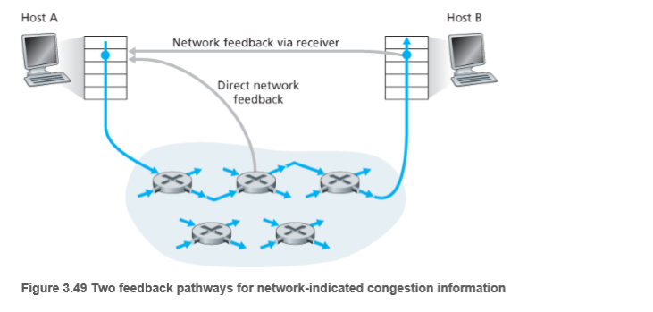

### TCP 拥塞控制

TCP必须使用端到端拥塞控制而不是使网络辅助的拥塞控制，因为TP层不向端系统提供显式的网络拥塞反馈。

TCP所采用的方法是让每一个发送方根据所感知到的网络拥塞程度来限制其能向连接发送流量的速率。

我们首先分析一下TCP发送方是如何限制向其连接发送流量的。在3.5节巾我们看到，TCP连接的每一端都是由一个接收缓存、一个发送缓存和几个变量(LaslByleReadrwnd等)组成。运行在发送方的TCP拥塞控制机制跟踪一个额外的变量，即拥塞窗口(congeslionwindow)。拥塞窗口表示为cwnd，它对一个TCP发送方能向网络巾发送流量的速率进行了限制。特别是，在一个发送方中未被确认的数据量不会超过cwnd与rwnd中的最小值，即
$$
LastByteSent - LastByteAcked <= min | cwnd ，rwnd |
$$
上面的约束限制了发送方中未被确认的数据量，因此间接地限制了发送方的发送速率。在每个往返时间(RTT)的起始点，上面的限制条件允许发送方向该连接发送cwnd个字节的数据，在该RTI结束时发送方接收对数据的确认报文。因此，该发送方的发送速率大概是cwnd/RTT字节/秒。通过调节cwnd的位，发送方因此能调整它向连接发送数据的这率。

要么出现超时，要么收到来自接收方的3个冗余ACK。当出现过度的拥塞时，在沿着这条路径上的一台(或多台)路由器的缓存会溢出，引起一个数据报(包含一个TCP报文段)被丢弃。丢弃的数据报接着会引起发送方的丢包事件(要么超时或收到3个冗余ACK)，发送方就认为在发送方到接收方的路径上出现了拥塞的指示。

考虑了拥塞检测问题后，我们接下来考虑网络没有拥塞这种更为乐观的情况，即没有出现丢包事件的情况。在此情况下，在TCP的发送方将收到对于以前未确认报文段的确认。如我们将看到的那样，TCP将这些确认的到达作为一切正常的指示，即在网络上传输的报文段正被成功地交付给目的地，并使用确认来增加窗口的长度(及其传输速率)。注意到如果确认以相当慢的速率到达(例如，如果该端到端路径具有高时延或包含一段低带宽链路)，则该拥塞窗口将以相当慢的速率增加。在另一方面，如果确认以高速率到达，则该拥塞窗口将会更为迅速地增大。因为TCP使用确认来触发(或计时)增大它的拥塞窗口长度，TCP被说成是自计时(self-clocking)的。

**TCP使用下列指导性实现拥塞控制:**

- **一个丢失的报文段表意味着拥塞。**因此当丢失报文段时应当降低TCP发送方的速率。减小它的拥塞窗口长度，即减小其发送速率。

- **一个确认报文段指示该网络正在向接收方交付发送方的报文段，因此，当对先前未确认报文段的确认到达时，能够增加友送方的速率**。确认的到达被认为是一切顺利的隐含指示，即报文段正从发送方成功地交付给接收方，因此该网络不拥塞。拥塞窗口长度因此能够增加。
- **带宽探测。**给定ACK指示源到目的地路径无拥塞，而丢包事件指示路径拥塞，TCP调节其传输速率的策略是增加其速率以响应到达的ACK，除非出现丢包事件，此时才减小传输速率。因此，为探测拥塞开始出现的速率，TCP发送方增加它的传输速率，从该速率后退，进而再次开始探测，看看拥塞开始速率是否发生了变化。TCP发送方的行为也许类似于要求(并得到)越来越多糖果的孩子，直到最后告知他/她"不行!"，孩子后退一点，然后过一会儿再次开始提出请求。注意到网络中没有明确的拥塞状态信令，即ACK和丢包事件充当了隐式信号，并且每个TCP发送方根据异步于其他TCP发送方的本地信息而行动。

#### TCP拥塞控制算法

**该算法包括3个主要部分：**①慢启动；②拥塞避免；③快速恢复；

慢启动和拥塞避免是TCP的强制部分，两者的差异在于对收到的ACK做出反应时增加cwnd长度的方式。我们很快将会看到慢启动比拥塞避免能更快地增加cwnd的长度(不要被名称所迷惑!)。快速恢复是推荐部分，对TCP发送方并非是必需的。

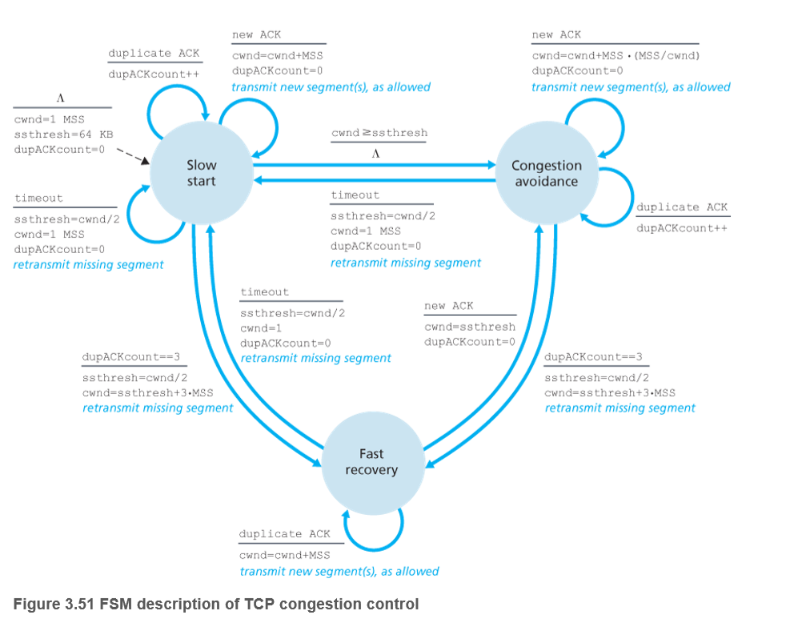

#### 慢启动

当一条TCP连接开始时，cwnd的值通常初始置为-个MSS的较小值，这就使得初始发送速率大约为MSS/RTT。例如，如果MSS=500字节且RTT=200ms，则得到的初始发送速率大约只有20kbps。由于对TCP发送方而言，可用带宽可能比MSS/RTT大得多，TCP发送方希望迅速找到可用带宽的数量。因此，在慢启动(slow-strut)状态，cwnd的值以1个MSS开始并且每当传输的报文段首次被确认就增加1个MSS。这一过程每过一个Rπ，发送速率就翻番。因此，TCP发送速率起始慢，但在慢启动阶段以指数增长。

**何时结束这种指数增长呢?**

- 首先，如果存在一个由超时指示的丢包事件(即拥塞)，TCP发送方将cwnd设置为l并重新开始慢启动过程。它还将第二个状态变量的值ssthresh("慢启动阔值"的速记)设置为cwnd/2，即当检测到拥塞时将ssthresh置为拥塞窗口值的一半。
- 慢启动结束的第二种方式是直接与ssthresh的值相关联。因为当检测到拥塞时ssthresh设为cwnd的值一半，当到达或超过ssthresh值时，继续使cwnd翻番有些鲁莽。因此，当cwnd的值等于ssthresh时，结束慢启动并且TCP转移到拥塞避免模式。
- 最后一种结束慢启动的方式是，如果检测到3个冗余ACK，这时TCP执行一种快速重传并进入快速恢复状态。

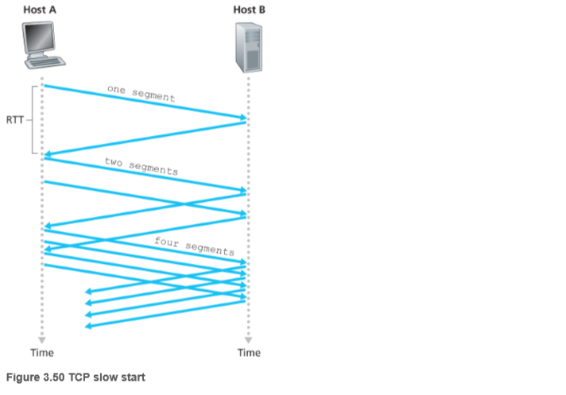

#### 拥塞避免

一旦进入拥塞避免状态，cwnd的值大约是上次遇到拥塞时的值的一半，即距离拥塞可能并不遥远!因此，TCP无法每过一个Rπ再将cwnd的值翻番，而是采用了一种较为保守的方法，每个RTT只将cwnd的值增加一个MSS。

**何时应当结束拥塞避免的线性增长(每RTTlMSS)呢?**

- 当出现超时时，TCP的拥塞避免算法行为相同。与慢启动的情况一样，cwnd的值被设置为1个MSS，当丢包事件出现时，ssthresh的值被更新为cwnd值的一半，再次进行慢启动。
- 然而，前面讲过丢包事件也能由一个三个冗余ACK事件触发。TCP对这种丢包事件的行为，相比于超时指示的丢包，应当不那么剧烈:TCP将cwnd的值减半(为使测量结果更好，计及已收到的3个冗余的ACK要加上3个MSS)，并且当收到3个冗余的ACK，将ssthresh的值记录为cwnd的值的一半。接下来进入快速恢复状态。

#### 快速恢复

在快速恢复中，对于引起TCP进入快速恢复状态的缺失报文段，对收到的每个冗余的ACK，cwnd的值增加一个MSS。最终，当对丢失报文段的一个ACK到达时，**TCP在降低cwnd后进入拥塞避免状态**。如果出现超时事件，快速恢复在执行如同在慢启动和拥塞避免中相同的动作后，迁移到慢启动状态。

快速恢复是TCP推荐的而非必需的构件。有趣的是，一种称为TCPTahoe的TCP早期版本，不管是发生超时指示的丢包事件，还是发生3个冗余ACK指示的丢包事件，都无条件地将其拥塞窗口减至1个MSS，并进入慢启动阶段。TCP的较新版本丁CPReno，则综合了快速恢复。

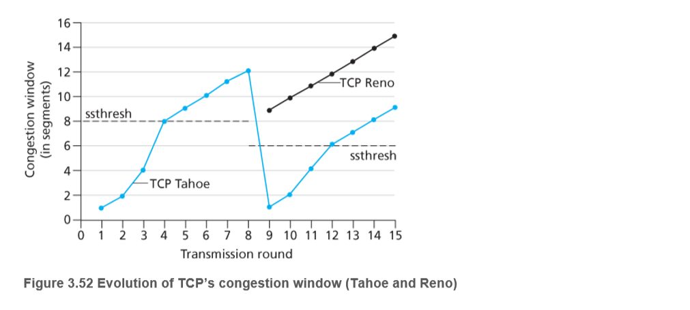

上图展示了Reno版TCP与Tahoe版TCP的拥塞控制窗口的演化情况。

#### 回顾 

忽略一条连接开始时初始的慢启动阶段，假定丢包由3个冗余的ACK而不是超时指示，TCP的拥塞控制是:每个RTT内cwnd线性(加性)增加lMSS，然后出现3个冗余ACK事件时cwnd减半(乘性减)。因此，TCP拥塞控制常常被称为加性增、乘性减拥塞控制方式。AIMD拥塞控制引发了在图3-54中所示的"锯齿"行为，如前所述，许多 TCP 实现采用了 Reno 算法。

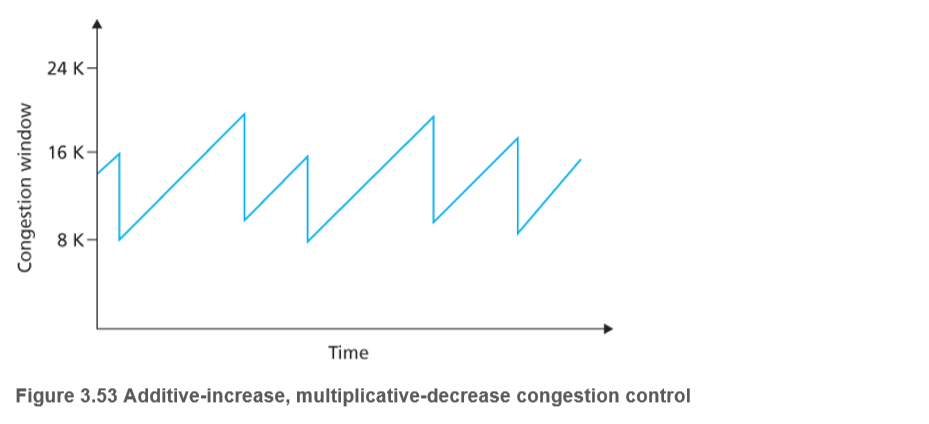

#### 对 TCP 吞吐量的宏观描述 

给出TCP的锯齿状行为后，自然要考虑一个长存活期的TCP连接的平均吞吐量(即平均速率)可能是多少。忽略在超时事件后出现的慢启动阶段。(这些阶段通常非常短，因为发送方很快就以指数增民离开该阶段。)，当窗口长度是w字节，且当前往返时间是RTT秒时，则TCP的发送速率大约是ω/RTT。于是，TCP通过每经过1个Rπ将w增加1个MSS探测出额外的带宽，直到一个丢包事件发生为止。用W表示ω的值。假设在连接持续期间RTT和W几乎不变，那么TCP的传输速率在W/(2xRTT)到W/RTT之间变化。

忽略在超时事件后出现的慢启动阶段。(这些阶段通常非常短，因为发送方很快就以指数增民离开该阶段。)，当窗口长度是w字节，且当前往返时间是RTT秒时，则TCP的发送速率大约是ω/RTT。于是，TCP通过每经过1个Rπ将w增加1个MSS探测出额外的带宽，直到一个丢包事件发生为止。用W表示ω的值。假设在连接持续期间RTT和W几乎不变，那么TCP的传输速率在W/(2xRTT)到W/RTT之间变化。
$$
一条连接的平均吞吐量~=~(W/RTT+W/2RTT)/2~=~0.75*W/RTT
$$


当速率增长至W/RTT时，网络丢弃来自连接的分组;然后发送速率就会减半，进而每过一个RTT就发送速率增加MSS/RTT，直到再次达到W/RTT为止。

### 公平性

考虑K条TCP连接，每条都有不同的端到端路径，但是都经过一段传输速率为Rbps的瓶颈链路。(所谓瓶颈链路，是指对于每条连接，沿着该连接路径上的所有其他段链路都不拥塞，而且与该瓶颈链路的传输容量相比，它们都有充足的传输容量。)假设每条连接都在传输一个大文件，而且无UDP流量通过该段瓶颈链路。如果每条连接的平均传输速率接近R/K，即每条连接都得到相同份额的链路带宽.则认为该拥塞控制机制是公平的。

我们考虑有两条TCP连接共享一段传输速率为R的链路的简单例子，如图3-55中所示。我们将假设这两条连接有相同的MSS和RTf(这样如果它们有相同的拥塞窗口氏度，就会有相同的吞吐量)，它们有大量的数据要发送，且没有其他TCP连接或山P数据报穿越该段共享链路。我们还将忽略TCP的慢启动阶段，并假设TCP连接一直按CA模式(AlMD)运行。

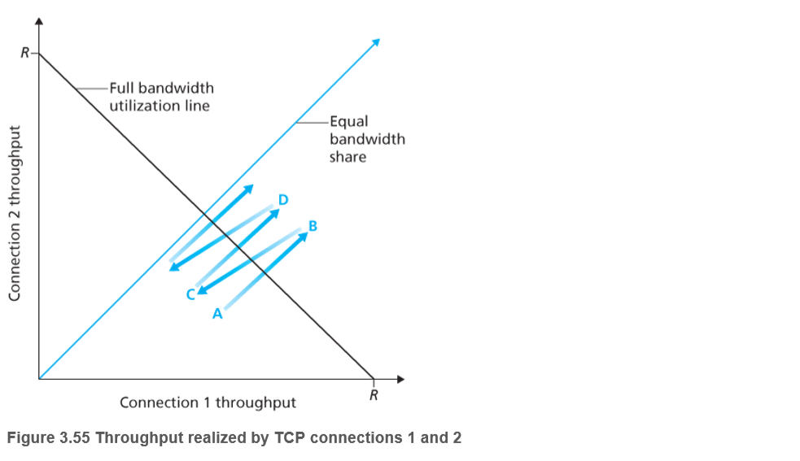

根据TCP的拥塞避免算法的结果，这两条连接每过一个RTT都要将其窗口增加1个MSS。因此，这两条连接的总吞吐量就会从A点开始沿45。线前行(两条连接都有相同的增长)。最终，这两条连接共同消起的带宽将超过R，最终将发生分组丢失。假设连接1和连接2实现B点指明的吞吐量时，它们都经历了分组丢失。连接1和连接2于是就按二分之一减小其窗口。所产生的结果实现了C点指明的吞吐量，它正好位于始于B点止于原点的一个向量的中间。因为在C点，共同消耗的带宽小于R，所以这两条连接再次沿着始于C点的45。线增加其吞吐量。

#### 公平性和 UDP 

从TCP的观点来看，运行在UDP上的多媒体应用是不公平的，因为它们不与其他连接合作，也不适时地调整其传输速率。因为TCP拥塞控制在面临拥塞增加(丢包)时，将降低其传输速率，而UDP源则不必这样做，UDP源有可能压制TCP流量。

#### 公平性和并行 TCP 连接 

即使我们能够迫使UDP流量具有公平的行为，但公平性问题仍然没有完全解决。这是因为我们没有什么办法阻止基于TCP的应用使用多个井行连接。当一个应用使用多条并行连接时.它占用了一条拥塞链路中较大比例的带宽。举例来说，考虑一段速率为R且支持9个在线客户-服务器应用的链路，每个应用使用一条TCP连接。如果一个新的应用加入进来，也使用一条TCP连接，则每个应用得到差不多相同的传输速率RllO。但是如果这个新的应用这次使用了11个并行TCP连接，则这个新应用就不公平地分到超过R/2的带宽。

### 显式拥塞通知 （ECN）：网络辅助拥塞控制

TCP已实现端拥控制的形式，最近，对IP和TCP的扩展被提议、实施和部署，允许网络明确向TCP发出拥塞信号发送方和接收方。这种形式的网络辅助拥塞控制称为显式拥塞通知。

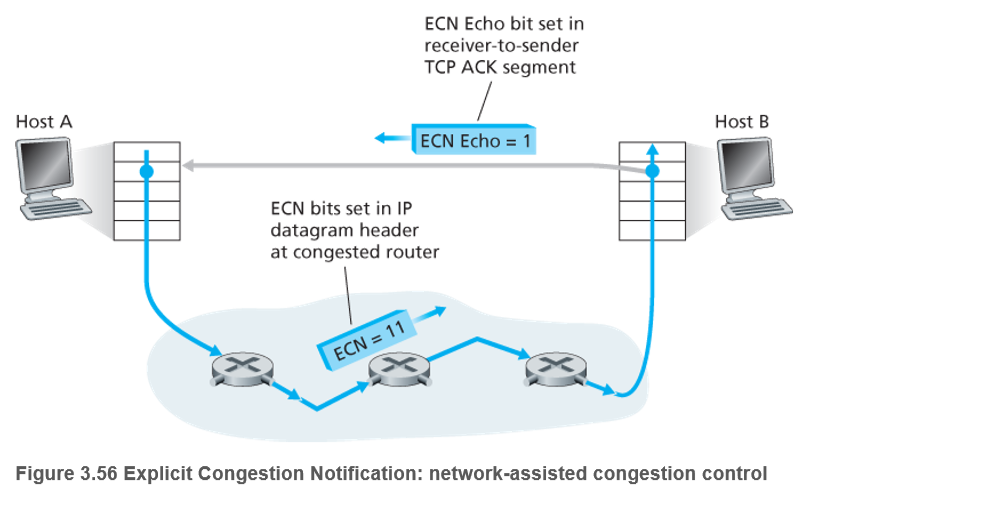

在网络层，在 IP 数据报头的服务类型字段中的两个位（总体值有四个可能值）用于 ECN。ECN 位的一个设置由路由器用于指示它正在遭受拥塞，然后，此拥塞指示在标记的 IP 数据报中携带到目标主机，然后通知发送主机。

当接收主机中的 TCP 通过接收的数据报接收 ECN 拥塞指示时，接收主机中的 TCP 通过设置 ECE（显式拥塞通知响应）位通知发送主机中的 TCP 拥塞指示在接收方到发送方 TCP ACK 段中。TCP 发送方则通过将拥塞窗口减半来响应具有 ECE 拥塞指示的 ACK，因为它会使用快速重新传输对丢失的段做出反应，并将 CWR（拥塞窗口减小）位设置在下一个传输 TCP 的标头中发送方到接收方段。