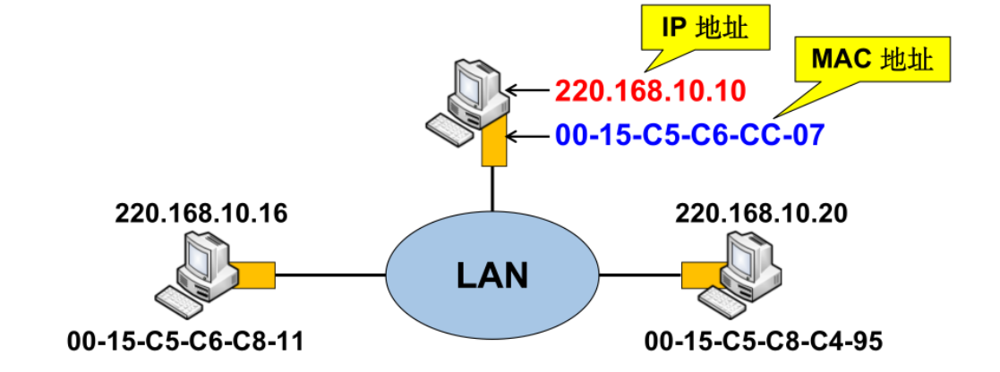
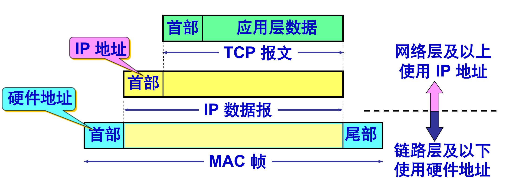
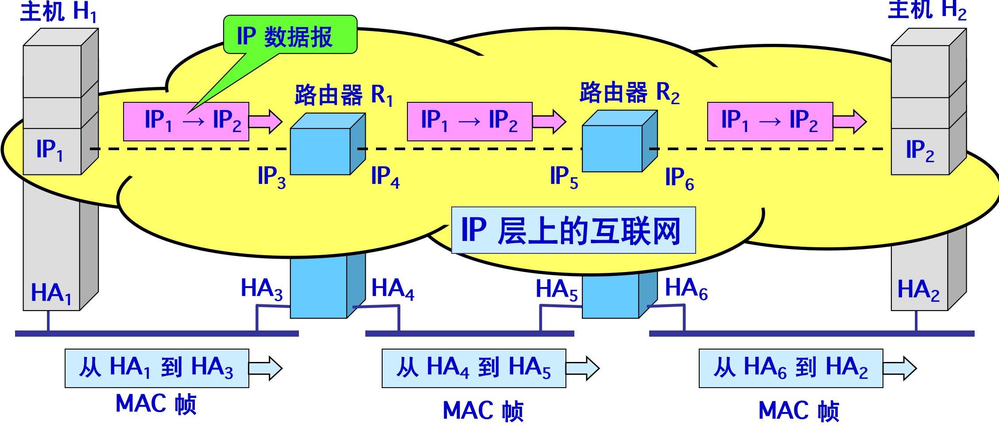

## `ip` 地址和硬件地址

------

`IP` 地址与硬件地址是不同的地址，从层次的角度看，硬件地址（或物理地址）是数据链路层和物理层使用的地址，`IP` 地址是网络层和以上各层使用的地址，是一种逻辑地址（称 `IP` 地址是逻辑地址是因为 `IP` 地址是用软件实现的），而`mac`地址是确确实实的某个网络设备的硬件接口编号。

主机通信时使用了两个地址：`IP` 地址（网络层地址）、`MAC` 地址（数据链路层地址）。



`IP` 地址放在 `IP` 数据报的首部，而硬件地址则放在 `MAC` 帧的首部。



在 `IP` 层抽象的互联网上只能看到 `IP` 数据报，图中的 `IP1` → `IP2` 表示从源地址 `IP1` 到目的地址 `IP2` ，两个路由器的 `IP` 地址并不出现在 `IP` 数据报的首部中，路由器只根据目的站的 `IP` 地址的网络号进行路由选择。 

在具体的物理网络的链路层只能看见 `MAC` 帧而看不见 `IP` 数据报，`IP` 层抽象的互联网屏蔽了下层很复杂的细节。在抽象的网络层上讨论问题，就能够使用统一的、抽象的 `IP` 地址研究主机和主机或主机和路由器之间的通信。



## `ARP` 地址解析协议

-------

#### **arp 概念：**

已经知道了一个机器的 `IP` 地址，如何找出其相应的硬件地址？地址解析协议 `ARP` 就是用来解决这样的问题的，`ARP` 作用从网络层使用的 `IP` 地址，解析出在数据链路层使用的硬件地址。


> 不管网络层使用的是什么协议，在实际网络的链路上传送数据帧时，最终还是必须使用硬件地址。 

#### `arp` 报文：

`ARP`是一个独立的三层协议，所以`ARP`报文在向数据链路层传输时不需要经过`IP`协议的封装，而是直接生成自己的报文，其中包括`ARP`报头，到数据链路层后再由对应的数据链路层协议（如以太网协议）进行封装。`ARP`报文分为`ARP`请求和`ARP`应答报文两种，它的报文不是直接在网络层上发送的，它还是需要向下传输到数据链路层，所以当`ARP`报文传输到数据链路层之后，需要再次进行封装。以以太网为例，`ARP`报文传输到以太网数据链路层后会形成`ARP`帧：


**硬件类型：**占两字节，表示 `ARP` 报文可以在哪种类型的网络上传输，值为1时表示为以太网地址。

**上层协议类型：**占两字节，表示硬件地址要映射的协议地址类型，映射 `IP` 地址时的值为 `0x0800`。

**MAC地址长度：**占一字节，标识 `MAC` 地址长度，以字节为单位，此处为 `6`。

**IP协议地址长度：**占一字节，标识 `IP` 得知长度，以字节为单位，此处为 `4`。

**操作类型：**占 `2` 字节，指定本次 `ARP` 报文类型。`1` 标识 `ARP` 请求报文，`2` 标识 `ARP` 应答报文。

**源MAC地址：** 占 `6` 字节，标识发送设备的硬件地址。

**源IP地址：**占 `4` 字节，标识发送方设备的 `IP` 地址。

**目的MAC地址：**占 `6` 字节，表示接收方设备的硬件地址，在请求报文中该字段值全为 `0`，即 `00-00-00-00-00-00`，表示任意地址。

**目的IP地址：** 占`4`字节，表示接受方的 `IP` 地址。

#### **arp 缓存：**

每一个主机都设有一个 **ARP 高速缓存 (ARP cache)**，里面有所在的局域网上的各主机和路由器的 IP 地址到硬件地址的映射表。


Arp 高速缓存可以存放最近获得的 IP 地址到 MAC 地址的绑定，以减少 ARP 广播的数量，我们可以通过`arp -a`查看具体信息:

```bash
inno@patrick$ arp -a
? (192.168.1.1) at 1c:fa:68:5d:c9:f8 on en0 ifscope [ethernet]
? (192.168.1.102) at e0:19:1d:2:d9:39 on en0 ifscope [ethernet]
? (192.168.1.108) at 44:23:7c:db:af:17 on en0 ifscope [ethernet]
? (224.0.0.251) at 1:0:5e:0:0:fb on en0 ifscope permanent [ethernet]
? (239.255.255.250) at 1:0:5e:7f:ff:fa on en0 ifscope permanent [ethernet]
```

**动态ARP表项**

动态ARP表项由ARP协议通过ARP报文自动生成和维护，可以被老化，可以被新的ARP报文更新，也可以被静态ARP表项所覆盖。当到达老化时间或接口关闭时会删除相应的动态ARP表项。

**静态ARP表项**

静态ARP表项通过手工配置（通过对应设备的IP地址与MAC地址绑定命定进行）和维护。不会被老化，也不会被动态ARP表项覆盖。配置静态ARP表项可以增加通信的安全性，因为静态ARP可以限定和指定IP地址的设备通信时只使用指定的MAC地址（也就是我们通常所说的IP地址和MAC地址的绑定），此时攻击报文无法修改此表项的IP地址和MAC地址的映射关系，从而保护了本设备和指定设备间正常通信。静态ARP表项又分为短静态ARP表项和长静态ARP表项

### **arp 寻址流程：**

当主机 `PC1` 欲向本局域网上的某个主机 `PC2` 发送 `IP` 数据报时，就先在其 `ARP` 高速缓存中查看有无主机 `PC2` 的 `IP` 地址。如有，就可查出其对应的硬件地址，再将此硬件地址写入 `MAC` 帧，然后通过局域网将该 `MAC` 帧发往此硬件地址。


如没有，请求方将请求包**以广播的形式**发送，交换机或 `WiFi` 设备（无线路由器）收到广播包时，会将此数据发给同一局域网的其他所有主机。`PC1`发送的请求广播包同时被其他主机收到，然后`PC3`和`PC4`收到之后（发现不是问自己）则丢弃。而`PC2`收到之后，根据请求包里面的信息（有自己的`IP`地址），判断是给自己的，所以不会做丢弃动作，而是返回`ARP`回应包。

> 大部分广播包都有一个共同特征：**二层封装时目的MAC是全 `f (ffff.ffff.ffff)` 或三层封装时目的 `IP` 是全 `1(255.255.255.255)`**。可以这样更方便的记住：目的地址最大的，就是广播。


`ARP` 请求是通过广播方式来实现的，那么，`PC2` 返回 `ARP` 回应包，是否也需要通过广播来实现呢？答案是否定的。**大部分网络协议在设计的时候，都需要保持极度克制，不需要的交互就砍掉，能合并的信息就合并，能不用广播就用单播，以此让带宽变得更多让网络变得更快。**

**ARP请求首先有"自我介绍"，然后才是询问**。这样的话，`PC2`在收到请求之后，就可以将`PC1`的`IP`和`MAC`映射信息存储在本地的【`ARP`缓存表】，既然知道`PC1`在哪里，就可以返回`ARP`单播回应包。

`ARP` 是解决同一个局域网上的主机或路由器的 `IP` 地址和硬件地址的映射问题，如果所要找的主机和源主机不在同一个局域网上，那么就要通过 `ARP` 找到一个位于本局域网上的某个路由器的硬件地址，然后把分组发送给这个路由器，让这个路由器把分组转发给下一个网络。剩下的工作就由下一个网络来做。

从 `IP` 地址到硬件地址的解析是自动进行的，主机的用户对这种地址解析过程是不知道的。只要主机或路由器要和本网络上的另一个已知 `IP` 地址的主机或路由器进行通信，`ARP` 协议就会自动地将该 `IP` 地址解析为链路层所需要的硬件地址。  

#### **arp 到底所属哪一层?**

`ARP`协议为例，它的功能最终是获取到`MAC`信息，服务于链路层，从这点考虑，`ARP`是链路层协议；但是从层次来看，`ARP`基于`Ethernet`协议，`IP`协议基于`Ethernet`协议，它们在`Ethernet`协议里面有独立的`Type`类型，前者是`0x0806`，后者是`0x0800`，既然`ARP`和`IP`协议"平起平坐"，那么 `ARP` 是网络层，


> **总结：**基于功能来考虑，`ARP` 是链路层协议；基于分层/包封装来考虑，`ARP` 是网络层协议。（此方法亦可用于 `ICMP` 协议）

### 为什么不使用mac地址通信？

由于全世界存在着各式各样的网络，它们使用不同的硬件地址。要使这些异构网络能够互相通信就必须进行非常复杂的硬件地址转换工作，因此几乎是不可能的事。

> 硬件地址解析匹配自然是在硬件中进行的。

`IP` 编址把这个复杂问题解决了。连接到互联网的主机只需各自拥有一个唯一的 `IP` 地址，它们之间的通信就像连接在同一个网络上那样简单方便，因为上述的调用 `ARP` 的复杂过程都是由计算机软件自动进行的，对用户来说是看不见这种调用过程的。

