##    `IP` 地址表示方法

-------

我们把整个因特网看成为一个单一的、抽象的网络。`IP` 地址就是给每个连接在互联网上的主机（或路由器）分配一个在全世界范围是唯一的 `32` 位的标识符。`IP` 地址现在由互联网名字和数字分配机构 `ICANN (Internet Corporation for Assigned Names and Numbers)` 进行分配。 

- 分类的 `IP` 地址。这是最基本的编址方法，在 `1981` 年就通过了相应的标准协议。
- 子网的划分。这是对最基本的编址方法的改进，其标准 [`RFC 950`] 在 `1985` 年通过。
- 构成超网。这是比较新的无分类编址方法。 `1993` 年提出后很快就得到推广应用。

## 分类的 `IP` 地址

--------

分类的 `IP` 地址。这是最基本的编址方法，在 `1981` 年就通过了相应的标准协议。每一类地址都由两个固定长度的字段组成，其中一个字段是网络号 `net-id`，它标志主机或路由器所连接到的网络，而另一个字段则是主机号 `host-id`，它标志该主机或路由器。

这种两级的 `IP` 地址结构如下：

这种两级的 `IP` 地址可以记为：

其中**一个字段是网络号 net-id**，它标志主机（或路由器）所连接到的网络，而另**一个字段则是主机号 host-id**，它标志该主机（或路由器）。主机号在它前面的网络号所指明的网络范围内必须是唯一的。

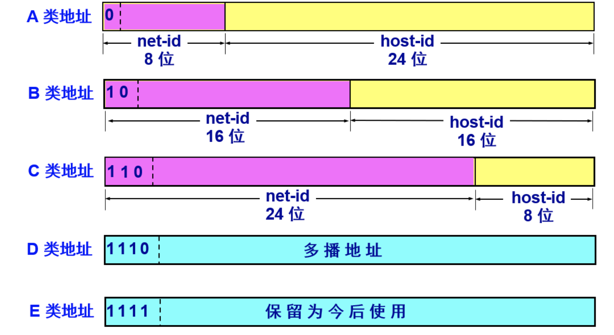

| `网络类别` | `最大可指派的网络数` | `第一个可指派的网络好` | `最后一个可指派的网络号` | `每个网络中最大的主机数` |
| :--------- | :------------------- | :--------------------- | :----------------------- | :----------------------- |
| A          | 126(2^7 – 2)         | 1                      | 126                      | 16777214                 |
| B          | 16383(2^14 – 1)      | 128.1                  | 191.255                  | 65534                    |
| C          | 2097151(2^21 – 1)    | 192.0.1                | 223.255.255              | 254                      |

## 划分子网

------

> `网络地址 = 网络号+子网号 = ip 地址 & CIDR掩码位`，在互联网中我们使用的是网络地址进行寻址，而在局域网内我们使用的是 `mac` 地址，**我们所说的同一网络一般指的就是同一网络地址。**

从 `1985` 年起在 `IP` 地址中又增加了一个“子网号字段”，使两级的 `IP` 地址变成为三级的 `IP` 地址，这种改变是在分类的`ip`地址之上发生的，分类的`ip`地址仍然存在。这种做法叫做划分子网 `(subnetting)` 。划分子网已成为互联网的正式标准协议。 划分子网纯属一个单位内部的事情。单位对外仍然表现为没有划分子网的网络。

从主机号借用若干个位作为子网号 `subnet-id`，而主机号 `host-id` 也就相应减少了若干个位。

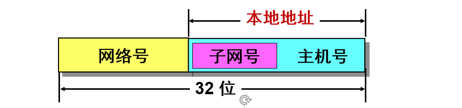

凡是从其他网络发送给本单位某个主机的 `IP` 数据报，仍然是根据 `IP` 数据报的目的网络号 `net-id`，先找到连接在本单位网络上的路由器。然后此路由器在收到 `IP` 数据报后，再按目的网络号 `net-id` 和子网号 `subnet-id` 找到目的子网。最后就将 `IP` 数据报直接交付目的主机。 

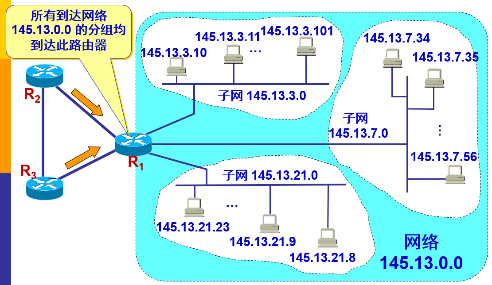

当没有划分子网时，`IP` 地址是两级结构。划分子网后 `IP` 地址就变成了三级结构。划分子网只是把 `IP` 地址的主机号 `host-id` 这部分进行再划分，而不改变 `IP` 地址原来的网络号 `net-id`。 

划分子网纯属一个单位内部的事情，对外部网络透明，对外仍然表现为没有划分子网的一个网络。

#### 子网掩码

从一个 `IP` 数据报的首部并无法判断源主机或目的主机所连接的网络是否进行了子网划分。使用子网掩码 `(subnet mask)` 可以找出 `IP` 地址中的子网部分。 

**格式**

子网掩码长度 ＝ `32` 位，子网号位数 + 网络号位数 = 子网掩码为 `1` 的位数。

> 某位 ＝ `1`：`IP` 地址中的对应位为网络号和子网号;
>
> 某位 ＝ `0`：`IP` 地址中的对应位为主机号;

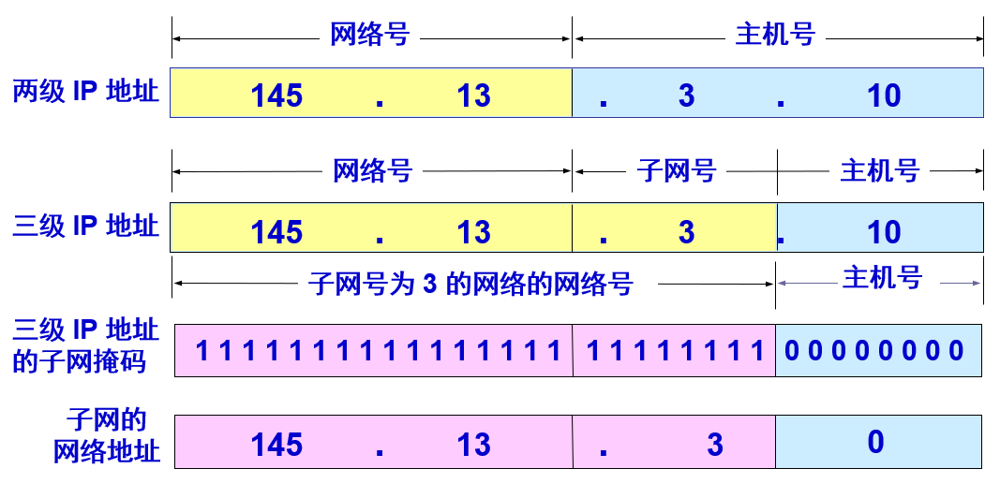

网络地址和ip地址的转换方式：

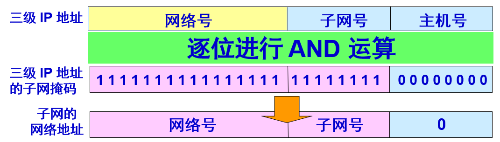

几类地址的默认子网掩码：

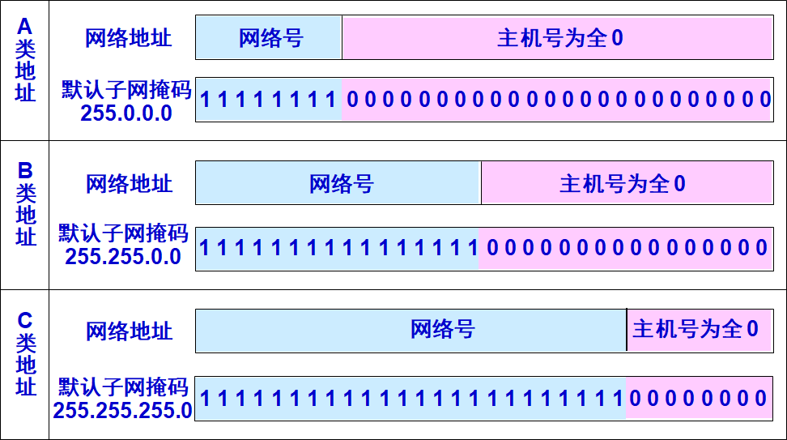

**特征：**

子网掩码是一个网络或一个子网的重要属性：

- 路由器在和相邻路由器交换路由信息时，必须把自己所在网络（或子网）的子网掩码告诉相邻路由器。
- *路由器的路由表中的每一个项目，除了要给出目的网络地址外，还必须同时给出该网络的子网掩码。*
- 若一个路由器连接在两个子网上就拥有两个网络地址和两个子网掩码。

#### 子网的划分方式：

有固定长度子网和变长子网两种子网划分方法。在采用固定长度子网时，**所划分的所有子网的子网掩码都是相同**。

虽然根据已成为互联网标准协议的 `RFC 950` 文档，子网号不能为全 `1` 或全 `0`，但随着无分类域间路由选择 `CIDR` 的广泛使用，现在全 `1` 和全 `0` 的子网号也可以使用了，但一定要谨慎使用，确认你的路由器所用的路由选择软件是否支持全 `0` 或全 `1` 的子网号这种较新的用法。

**划分子网增加了灵活性，但却减少了能够连接在网络上的主机总数。**

#### `B` 类地址的子网的划分选择：

表中的子网号的位数中没有 0, 1, 15 和 16 这四种情况，因为这没有意义。

- 当子网号位数为`0`时： 相当于没有划分子网。
- 当子网号位数为`1`时：相当于子网号位一位有两种取值（`0,1`）。这两个取值也就是含子网号全`0`全`1`与父网络网络地址和广播地址重名冲突的两种情况（对路由器来说具有二义性，会发生错误）。
- 当子网号位数为`15`时：相当于主机号剩余一位，即有两种取值（`0,1`）。当取值为`0`时，实际为该子网的网络地址，取值为`1`时实际为该子网的广播地址。这两个取值都不能作为有效的主机号标识，所以也没有意义。
- 当子网号位数为`16`时：相当于主机所占位全部用于划分子网，只有子网号，却没有主机号了，即每个子网中有效主机数为`0`。

| `子网号的位数` | `子网掩码`      | `子网数` | `每个子网的主机数` |
| -------------- | --------------- | -------- | ------------------ |
| 2              | 255.255.192.0   | 2        | 16382              |
| 3              | 255.255.224.0   | 6        | 8190               |
| 4              | 255.255.240.0   | 14       | 4094               |
| 5              | 255.255.248.0   | 30       | 2046               |
| 6              | 255.255.252.0   | 62       | 1022               |
| 7              | 255.255.254.0   | 126      | 510                |
| 8              | 255.255.255.0   | 254      | 254                |
| 9              | 255.255.255.128 | 510      | 126                |
| 10             | 255.255.255.192 | 1022     | 62                 |
| 11             | 255.255.255.224 | 2046     | 30                 |
| 12             | 255.255.255.240 | 4094     | 14                 |
| 13             | 255.255.255.248 | 8190     | 6                  |
| 14             | 255.255.255.252 | 16382    | 2                  |

#### 例题：

已知 IP 地址是 141.14.72.24，子网掩码是 255.255.192.0。试求网络地址?

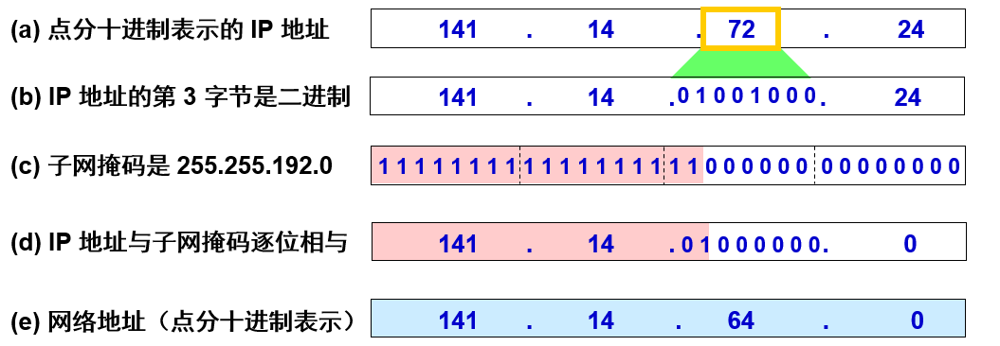

## 广播地址

------

广播地址 `(Broadcast Address)` 是专门用于同时向同一网络内（**通常指同一子网**）所有工作站进行发送的一个地址。在使用 `TCP/IP` 协议的网络中，主机标识段 `host ID`（**简称主机 ID**） 为全 `1` 的 `IP` 地址为广播地址，广播的分组传送给同一个子网的所有计算机。

例如: 对于 `10.1.1.0 (255.255.255.0)` 网段，其广播地址为 `10.1.1.255` ，当发出一个目的地址为 `10.1.1.255` 的数据包时，它将被分发给该网段上的所有计算机。

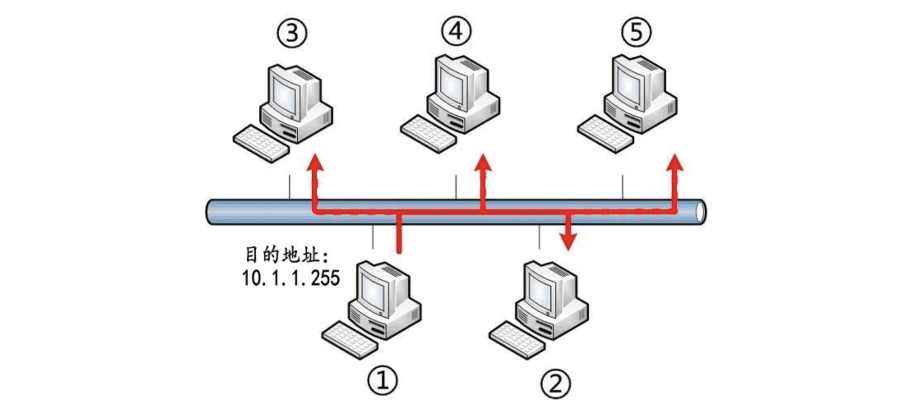

### 四种 IP 广播地址

**受限的广播地址：**

`受限的广播地址是255.255.255.255`：该地址用于主机配置过程中 `IP` 数据包的目的地址，此时，主机可能还不知道它所在网络的网络掩码，甚至连它的 `IP` 地址也不知道。在任何情况下，路由器都不转发目的地址为受限的广播地址的数据报，这样的数据报仅出现在本地网络中。

**指向网络的广播：**

`指向网络的广播地址是主机号为全1的地址`：`A` 类网络广播地址为 `netid.255.255.255`，其中 `netid` 为 `A` 类网络的网络号。一个路由器可以设置是否转发这个广播地址的数据。

> 这里的网络一般指未划分子网的网络

**指向子网的广播**

`指向子网的广播地址为主机号为全1且有特定子网号的地址`：作为子网直接广播地址的 `IP` 地址需要了解子网的掩码。

例如，如果路由器收到发往 `128.1.2.255` 的数据报，当 `B` 类网络 `128.1` 的子网掩码为 `255.255.255.0` 时，该地址就是指向子网的广播地址；但如果该子网的掩码为 `255.255.254.0`，该地址就不是指向子网的广播地址 (此时应该是 `128.1.1.255`)。

**指向所有子网的广播**

指向所有子网的广播也需要了解目的网络的子网掩码，以便与指向网络的广播地址区分开。指向所有子网的广播地址的**子网号及主机号为全1**。例如，如果 `B` 类目的子网掩码为 `255.255.255.0`，那么`IP` 地址`128.1.255.255` 是一个指向所有子网的广播地址。然而，如果网络没有划分子网，这就是一个指向网络的广播。**[这一类型的地址现在已经基本不使用了，而由D类组播地址所取代](http://blog.csdn.net/tennysonsky/article/details/44493407)。** 

## 组播

-------

组播是指将 `IP` 组播包发往处于同一物理的或虚拟的数据链路层的若干主机组。由于这种组播不需要复杂的路由，因此其应用要广泛得多。在 `IPv6` 中，它被用于地址解析，而在零配置网络中，它取代了低效的广播协议，完成服务发现、名字解析和地址冲突解析的功能。

#### `IP` 地址

组播 `IP` 地址用于标识一个 `IP` 组播组。`IANA` 把 `D` 类地址空间分配给 `IP` 组播，其范围是从 `224.0.0.0` 到 `239.255.255.255`。`IP`组播地址前四位均为`1110`。

+ `224.0.1.0～238.255.255.255` 为用户可用的[组播地址](https://baike.baidu.com/item/组播地址)（临时组地址），全网范围内有效。
+ `239.0.0.0～239.255.255.255` 为本地管理[组播地址](https://baike.baidu.com/item/组播地址)，仅在特定的本地范围内有效。常用的预留组播地址列表如下：
+ `224.0.0.0` 基准地址（保留）
+ `224.0.0.1` 所有[主机](https://baike.baidu.com/item/主机)的地址
+ `224.0.0.2` 所有组播[路由器](https://baike.baidu.com/item/路由器)的地址
+ `224.0.0.3` 不分配
+ `224.0.0.4` （Distance Vector Multicast Routing Protocol，[距离矢量](https://baike.baidu.com/item/距离矢量)组播[路由协议](https://baike.baidu.com/item/路由协议)）[路由器](https://baike.baidu.com/item/路由器)
+ `224.0.0.5` ospf（Open Shortest Path First，[开放最短路径优先](https://baike.baidu.com/item/开放最短路径优先)）[路由](https://baike.baidu.com/item/路由)器
+ `224.0.0.6` ospf dr（Designated Router，[指定路由器](https://baike.baidu.com/item/指定路由器)）

## 无分类编址 CIDR

------

网络前缀划分子网在一定程度上缓解了互联网在发展中遇到的困难。然而在 `1992` 年互联网仍然面临三个必须尽早解决的问题：

- `B` 类地址在 `1992` 年已分配了近一半，眼看就要在 `1994` 年 `3` 月全部分配完毕！
- 互联网主干网上的路由表中的项目数急剧增长（从几千个增长到几万个）。
- 整个 `IPv4` 的地址空间最终将全部耗尽。

`1987` 年，`RFC 1009` 就指明了在一个划分子网的网络中可同时使用几个不同的子网掩码。使用变长子网掩码 `VLSM (Variable Length Subnet Mask)` 可进一步提高 `IP` 地址资源的利用率。在 `VLSM` 的基础上又进一步研究出无分类编址方法，它的正式名字是无分类域间路由选择 `CIDR (Classless Inter-Domain Routing)`。  

#### 无分类编址规则

`CIDR` 消除了传统的 `A` 类、`B` 类和 `C` 类地址以及划分子网的概念，因而可以更加有效地分配 `IPv4` 的地址空间。`CIDR`使用各种长度的“网络前缀”`(network-prefix)`来代替分类地址中的**网络号和子网号**。`IP` 地址从三级编址（使用子网掩码）又回到了两级编址。  

无分类的两级编址的记法是： 

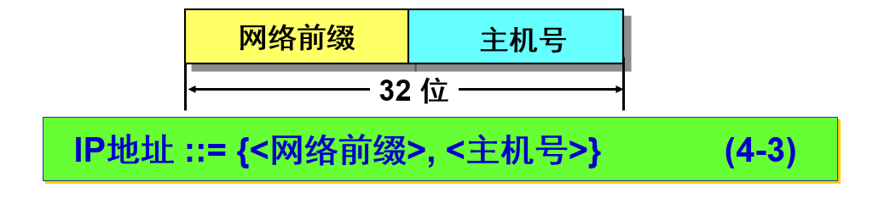

`CIDR` 使用“斜线记法”`(slash notation)`，它又称为 `CIDR` 记法，即在 `IP` 地址面加上一个斜线“/”，然后写上网络前缀所占的位数（这个数值对应于三级编址中子网掩码中 `1` 的个数）。例如： `220.78.168.0/24`

**CIDR 把网络前缀都相同的连续的 IP 地址组成“CIDR 地址块”。**

`128.14.32.0/20` 表示的地址块共有 `2^12` 个地址（因为斜线后面的 `20` 是网络前缀的位数，所以这个地址的主机号是 `12` 位。这个地址块的起始地址是 `128.14.32.0`。

在不需要指出地址块的起始地址时，也可将这样的地址块简称为 `/20` 地址块。

- `128.14.32.0/20` 地址块的最小地址：`128.14.32.0`
- `128.14.32.0/20` 地址块的最大地址：`128.14.47.255`

**全 0 和全 1 的主机号地址一般不使用，所以我们划分地址的时候要避免 (全零和网络号冲突，全一位广播地址)**

#### 常见的CIDR地址块

| **CIDR  前缀长度** | **点分十进制**  | **包含的地址数** | **相当于包含分类的网络数** |
| ------------------ | --------------- | ---------------- | -------------------------- |
| /13                | 255.248.0.0     | 512  K           | 8 个 B类或 2048 个 C 类    |
| /14                | 255.252.0.0     | 256  K           | 4 个 B 类或 1024  个 C 类  |
| /15                | 255.254.0.0     | 128  K           | 2 个 B 类或 512  个 C 类   |
| /16                | 255.255.0.0     | 64  K            | 1 个 B 类或 256  个 C 类   |
| /17                | 255.255.128.0   | 32  K            | 128  个 C 类               |
| /18                | 255.255.192.0   | 16  K            | 64 个 C 类                 |
| /19                | 255.255.224.0   | 8 K              | 32 个 C 类                 |
| /20                | 255.255.240.0   | 4 K              | 16 个 C 类                 |
| /21                | 255.255.248.0   | 2 K              | 8 个 C 类                  |
| /22                | 255.255.252.0   | 1 K              | 4 个 C 类                  |
| /23                | 255.255.254.0   | 512              | 2 个 C 类                  |
| /24                | 255.255.255.0   | 256              | 1 个 C 类                  |
| /25                | 255.255.255.128 | 128              | 1/4  个 C 类               |
| /26                | 255.255.255.192 | 64               | 1/4  个 C 类               |
| /27                | 255.255.255.224 | 32               | 1/8  个 C 类               |

#### 路由聚合 `route aggregation`

一个 `CIDR` 地址块可以表示很多地址，这种地址的聚合常称为路由聚合，它使得路由表中的一个项目可以表示很多个（例如上千个）原来传统分类地址的路由。路由聚合有利于减少路由器之间的路由选择信息的交换，从而提高了整个互联网的性能。

路由聚合也称为构成超网 `(supernetting)`。`CIDR` 虽然不使用子网了，但仍然使用“掩码”这一名词（但不叫子网掩码）。对于 `/20`  地址块，它的掩码是 `20` 个连续的 `1`。 斜线记法中的数字就是掩码中1的个数。    

#### 构成超网

前缀长度不超过 `23` 位的 `CIDR` 地址块都包含了多个 `C`  类地址，这些 C 类地址合起来就构成了超网。

`CIDR` 地址块中的地址数一定是 `2` 的整数次幂。网络前缀越短，其地址块所包含的地址数就越多。而在三级结构的 `IP` 地址中，划分子网是使网络前缀变长。`CIDR` 的一个好处是：可以更加有效地分配 `IPv4` 的地址空间，可根据客户的需要分配适当大小的 `CIDR` 地址块。  

**`CIRD` 地址划分举例**

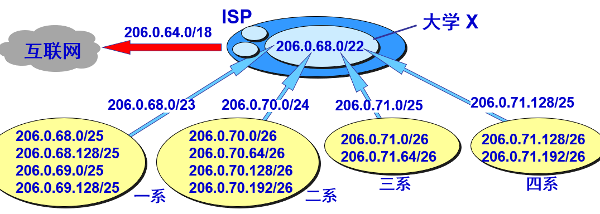

这个 `ISP` 共有 `64` 个 `C` 类网络。如果不采用 `CIDR` 技术，则在与该 `ISP` 的路由器交换路由信息的每一个路由器的路由表中，就需要有 `64` 个项目。但采用地址聚合后，只需用路由聚合后的 `1` 个项目 `206.0.64.0/18` 就能找到该 `ISP`。 

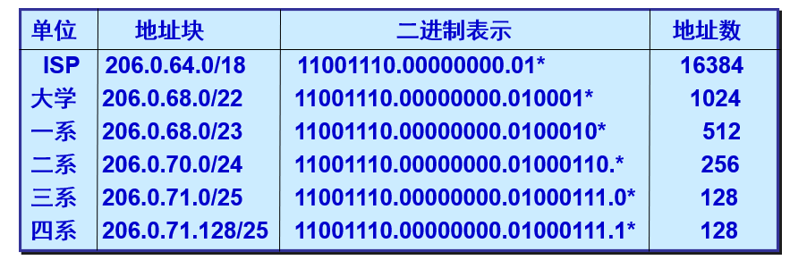

#### 最长匹配前缀

最长前缀匹配又称为最长匹配或最佳匹配。使用 `CIDR` 时，路由表中的每个项目由“网络前缀”和“下一跳地址”组成。在查找路由表时可能会得到不止一个匹配结果。 应当从匹配结果中选择具有最长网络前缀的路由：最长前缀匹配 `(longest-prefix matching)`。

网络前缀越长，其地址块就越小，因而路由就越具体 `(more specific)` 。

#### Example

收到的分组的目的地址 ：`D = 206.0.71.130`

路由表中的项目：

| 网络前缀          | 下一跳地址 |
| ----------------- | ---------- |
| `206.0.68.0/22`   | 1          |
| `206.0.71.128/25` | 2          |

**解法：**

1.查找路由表中的第 1 个项目：

第 `1` 个项目 `206.0.68.0/22` 的掩码 `M` 有 `22` 个连续的 `1`，因此只需把 `D` 的第 `3` 个字节转换成二进制。

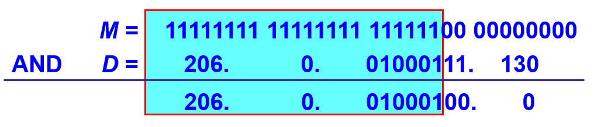

2.`D` 与 `206.0.68.0/22` 匹配，同理查找第二个项目：

第 `2` 个项目 `206.0.71.128/25` 的掩码 `M` 有 `25` 个连续的 `1`，因此只需把 `D` 的第 `4` 个字节转换成二进制。

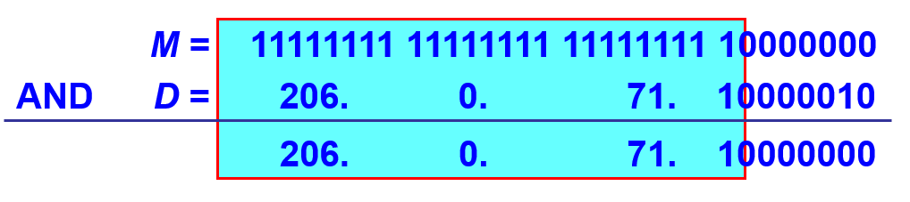

`D` 与 `206.0.71.128/25` 匹配，选择两个匹配的地址中更具体的一个，即选择最长前缀的地址。 

#### 二叉线索树查找路由表

当路由表的项目数很大时，怎样设法减小路由表的查找时间就成为一个非常重要的问题。 

为了进行更加有效的查找，通常是将**无分类编址的路由表**存放在一种层次的数据结构中，然后自上而下地按层次进行查找。这里最常用的就是二叉线索 (binary trie)。IP 地址中从左到右的比特值决定了从根结点逐层向下层延伸的路径，而二叉线索中的各个路径就代表路由表中存放的各个地址。

比如下面的线索树就是由五个ip地址的唯一前缀构成：`0100，0101，011，10110，10111`。

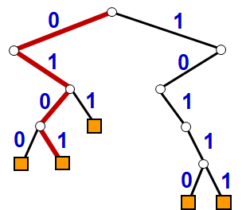

从二叉线索的根节点自顶向下的深度最多有 `32` 层，每一层对应于`IP`地址中的一位。一个`IP`地址存入二叉线索的规则很简单。先检查`IP`地址左边的第一位，如为 `0`，则第一层的节点就在根节点的左下方；如为 `1`，则在右下方。然后再检查地址的第二位，构造出第二层的节点。依此类推，直到唯一前缀的最后一位。

## 分组转发

-----

假设：有四个 `A` 类网络通过三个路由器连接在一起。每一个网络上都可能有成千上万个主机。

可以想像，若按目的主机号来制作路由表，每 一个路由表就有 `4` 万个项目，即 `4` 万行（每一行对应于一台主机），则所得出的路由表就会过于庞大。但若按主机所在的网络地址来制作路由表，那么每一个路由器中的路由表就只包含 `4` 个项目（每一行对应于一个网络），这样就可使路由表大大简化。 

所以在路由表中，对每一条路由，最主要的是目的网络地址，下一跳地址。

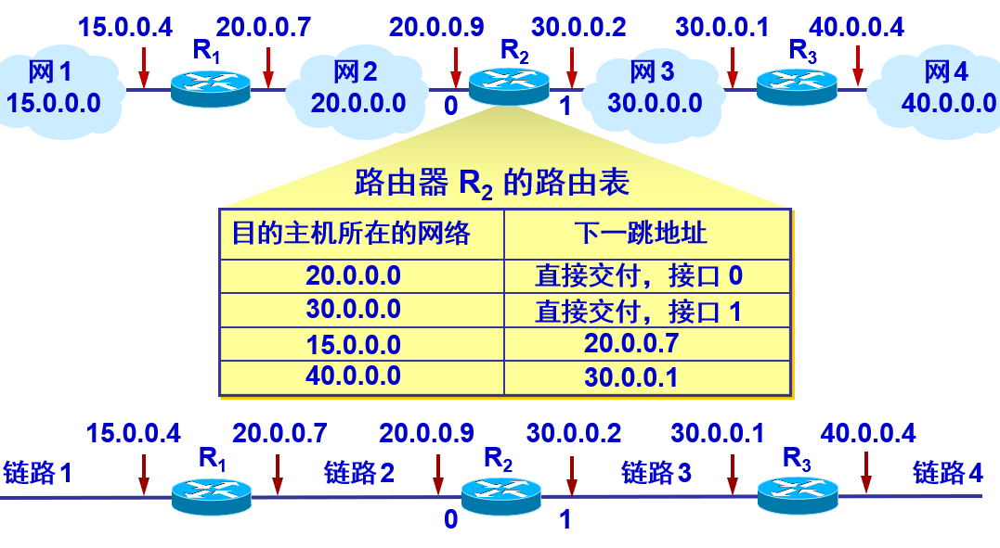

根据目的网络地址就能确定下一跳路由器，这样做的结果是：

`IP` 数据报最终一定可以找到目的主机所在目的网络上的路由器（可能要通过多次的间接交付），只有到达最后一个路由器时，才试图向目的主机进行直接交付。 

#### 特定主机路由

虽然互联网所有的分组转发都是基于目的主机所在的网络，但在大多数情况下都允许有这样的特例，即为特定的目的主机指明一个路由。
采用特定主机路由可使网络管理人员能更方便地控制网络和测试网络，同时也可在需要考虑某种安全问题时采用这种特定主机路由。 

#### 默认路由

路由器还可采用默认路由以减少路由表所占用的空间和搜索路由表所用的时间。这种转发方式在一个网络只有很少的对外连接时是很有用的。默认路由在主机发送 IP 数据报时往往更能显示出它的好处。如果一个主机连接在一个小网络上，而这个网络只用一个路由器和互联网连接，那么在这种情况下使用默认路由是非常合适的。 

#### 举例：

只要目的网络不是 `N1` 和 `N2`，一律选择默认路由，把数据报先间接交付路由器 `R1`，让 `R1` 再转发给下一个路由器。 

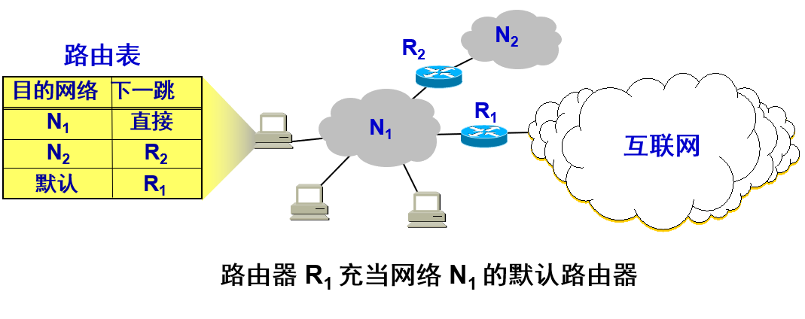

> **注意：**
>
> `IP` 数据报的首部中没有地方可以用来指明“下一跳路由器的 `IP` 地址”。当路由器收到待转发的数据报，**不是将下一跳路由器的 IP 地址填入 IP 数据报，而是送交下层的网络接口软件**。
>
> 网络接口软件使用 `ARP` 负责将下一跳路由器(详情请见`arp`的章节)的 `IP` 地址转换成硬件地址，并将此硬件地址放在链路层的 `MAC` 帧的首部，然后根据这个硬件地址找到下一跳路由器。  

#### 分组转发算法：

(1) 从数据报的首部提取目的主机的 IP 地址 D, 得出目的网络地址为 N。

(2) 若网络 N 与此路由器直接相连，则把数据报直接交付目的主机 D；否则是间接交付，执行 (3)。

(3) 若路由表中有目的地址为 D 的特定主机路由，则把数据报传送给路由表中指明的下一跳路由器；否则,执行(4)。

(4) 若路由表中有到达网络 N 的路由，则把数据报传送给路由表指明的下一跳路由器；否则，执行 (5)。

(5) 若路由表中有一个默认路由，则把数据报传送给路由表中所指明的默认路由器；否则，执行 (6)。

(6) 报告转发分组出错。 

#### 路由表：

路由表没有给分组指明到某个网络的完整路径，路由表指出，到某个网络应当先到某个路由器（即下一跳路由器），在到达下一跳路由器后，再继续查找其路由表，知道再下一步应当到哪一个路由器，这样一步一步地查找下去，直到最后到达目的网络。

## 使用子网时分组的转发

-------

在不划分子网的两级 IP 地址下，从 IP 地址得出网络地址是个很简单的事。但在划分子网的情况下，从 IP 地址却不能唯一地得出网络地址来，这是因为网络地址取决于那个网络所采用的子网掩码，但数据报的首部并没有提供子网掩码的信息，因此分组转发的算法也必须做相应的改动。 

### 划分子网情况下路由器转发分组的算法 ：

(1) 从收到的分组的首部提取目的 IP 地址 D。

(2) 先用各网络的子网掩码和 D 逐位相“与”，看是否和相应的网络地址匹配。若匹配，则将分组直接交付。否则就是间接交付，执行 (3)。

(3) 若路由表中有目的地址为 D 的特定主机路由，则将分组传送给指明的下一跳路由器；否则，执行 (4)。

(4) 对路由表中的每一行，将子网掩码和 D 逐位相“与”。若结果与该行的目的网络地址匹配，则将分组传送给该行指明的下一跳路由器；否则，执行 (5)。

(5) 若路由表中有一个默认路由，则将分组传送给路由表中所指明的默认路由器；否则，执行 (6)。

(6) 报告转发分组出错。

#### 举例：

已知互联网和路由器 `R1` 中的路由表。主机 `H1` 向 `H2` 发送分组。试讨论 `R1` 收到 `H1` 向 `H2` 发送的分组后查找路由表的过程。

 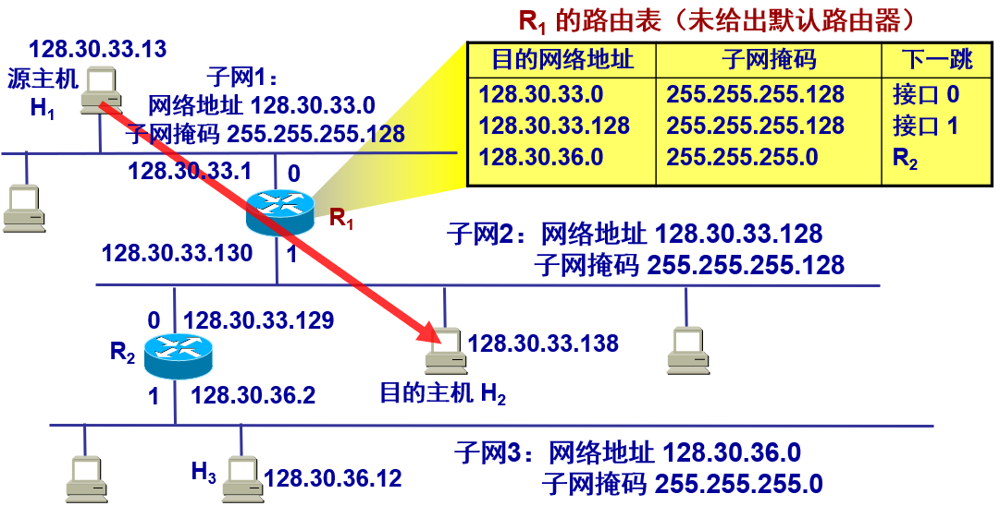

因此 `H1` 首先检查主机 `128.30.33.138` 是否连接在本网络上如果是，则直接交付；否则，就送交路由器 `R1`，并逐项查找路由表。

主机 `H1` 首先将本子网的子网掩码 `255.255.255.128`与分组的 `IP` 地址 `128.30.33.138` 逐比特相“与”`(AND` 操作) ，`255` 就是二进制的全 `1`，因此 `255 AND xyz = xyz`，这里只需计算最后的 `128 AND 138` 即可。

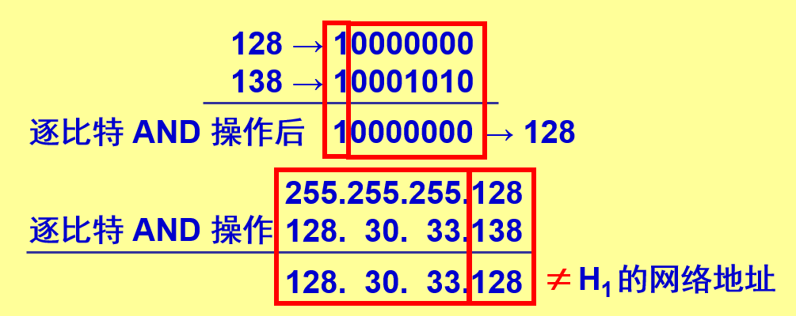

因此 `H1` 必须把分组传送到路由器 `R1`然后逐项查找路由表。`R1` 收到的分组的目的 `IP` 地址：`128.30.33.138`，`255.255.255.128 AND 128.30.33.138 = 128.30.33.128`匹配，这表明子网 `2` 就是收到的分组所要寻找的目的网络。