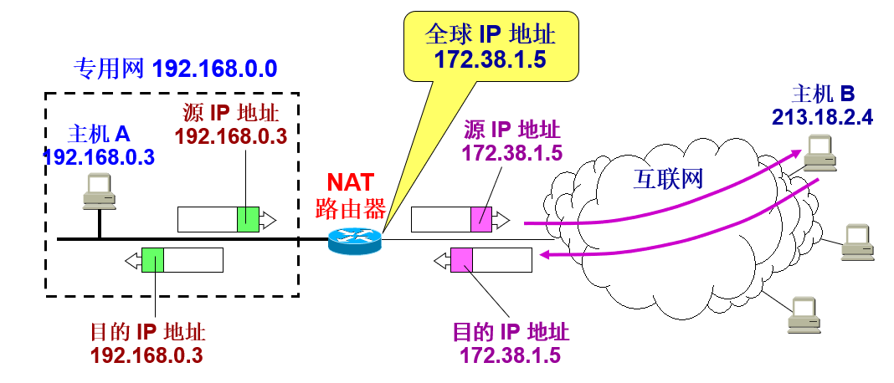

## 内网和外网

-------

姑且认为“外网”指国际互联网，“内网”指私有网络，从范围上来讲内网就是小部分的网络，一般指的是特定环境下组成网络，比如某一个家庭多台计算机互联成的网络，也可以学校和公司的大型局域网，内网的`IP`一般都是`192.168.1.100`，`192.168.0.100`, `172.16.1.100`……这些都是内网`IP`，内网是不能直接连接外网，比较封闭，但在内网里面可以实现文件管理，应用软件共享、打印机共享等服务。

看网络习惯书籍无法理解很多原因是因为教科书太古老，不与时俱进造成的。几乎所有的教科书都会告诉大家私有`IP`有`3`种：`A`类`10.0.0.0`～`10.255.255.255`，`B`类`172.16.0.0`～`172.31.255.255`，`C`类`192.168.0.0`～`192.168.255.255`。但事实上远远不止。下面有详细的列表。

```go
Address Block                    Name                              RFC                       
0.0.0.0/8                        "This host on this network"       [RFC1122], section 3.2.1.3
10.0.0.0/8                       Private-Use                       [RFC1918]                 
100.64.0.0/10                    Shared Address Space              [RFC6598]                 
127.0.0.0/8                      Loopback                          [RFC1122], section 3.2.1.3
169.254.0.0/16                   Link Local                        [RFC3927]                 
172.16.0.0/12                    Private-Use                       [RFC1918]                 
192.0.0.0/24[2]                  IETF Protocol Assignments         [RFC6890], section 2.1    
192.0.0.0/29                     IPv4 Service Continuity Prefix    [RFC7335]                 
192.0.0.8/32                     IPv4 dummy address                [RFC7600]                 
192.0.0.9/32                     Port Control Protocol Anycast     [RFC-ietf-pcp-anycast-08] 
192.0.0.170/32, 192.0.0.171/32   NAT64/DNS64 Discovery             [RFC7050], section 2.2    
192.0.2.0/24                     Documentation (TEST-NET-1)        [RFC5737]                 
192.31.196.0/24                  AS112-v4                          [RFC7535]                 
192.52.193.0/24                  AMT                               [RFC7450]                 
192.88.99.0/24                   Deprecated (6to4 Relay Anycast)   [RFC7526]                 
192.168.0.0/16                   Private-Use                       [RFC1918]                 
192.175.48.0/24                  Direct Delegation AS112 Service   [RFC7534]                 
198.18.0.0/15                    Benchmarking                      [RFC2544]                 
198.51.100.0/24                  Documentation (TEST-NET-2)        [RFC5737]                 
203.0.113.0/24                   Documentation (TEST-NET-3)        [RFC5737]                 
240.0.0.0/4                      Reserved                          [RFC1112], section 4      
255.255.255.255/32               Limited Broadcast                 [RFC919], section 7 
```

如上表，运营商给你的 `100.64.*.*` 也是私有地址（因为地主家也没有余量啊，以前大家大家共享一个地址池，有随机的公网地址，现在公网地址更加紧张，运营商只给客户分配私网地址，然后nat后大家共享一个公网地址），上述 `IP` 地址中，有四段地址专门用于私网的规划，不能被用于互联网上的连接如下：

+ `A` 类：`10.0.0.0-10.255.255.255`
+ `B` 类：`172.16.0.0-172.31.255.255`
+ `C` 类：`192.168.0.0-192.168.255.255`
+ `D` 类： `100.64.0.0-100.64.255.255`

也正是因为有了私网地址的出现，解决了局域网内电脑终端设备的 `IP` 问题，而所有使用本地地址的主机在和外界通信时，都要在 `NAT` 路由器上将其本地地址转换成全球 `IP` 地址，才能和互联网连接。  

## 网络地址转换 `NAT`

-------

`NAT` 被叫做地址转换技术，诞生于`IP`地址匮乏的年代，传统`IPV4`的公网地址已经枯竭，如果没有`NAT`地址转换技术，现在很多设备都是连接不上互联网的，很多人在公司上班或者在家里上网，电脑都会分配到一个`192.168.1.100`的私网地址，这种地址只适用于在局域网内通信，是出不了外网的，正是因为`NAT`技术的出现才使得内网地址能很方便的访问互联网。

`NAT` 主要功能是可以在内网配置私有`IP`地址，然后在路由或者防火墙等边界设备上统一转换为公网地址在访问互联网，这样就不需要为局域网内的每台终端设备配置公网`IP`地址，解决了公网`IPV4`地址枯竭的问题。

使用 `NAT` 技术需要在专用网连接到互联网的路由器上安装 `NAT` 软件。装有 `NAT` 软件的路由器叫做 **`NAT` 路由器**，它至少有一个有效的外部全球 `IP` 地址。

#### 转换流程

内部主机 `A` 用本地地址 `IP` 和互联网上主机 `B` 通信所发送的数据报必须经过 `NAT` 路由器：

+ `NAT` 路由器将数据报的源地址 `IPA` 转换成全球地址 `IPG`，并把转换结果记录到 `NAT` 地址转换表中，目的地址 `IPB` 保持不变，然后发送到互联网。

+ `NAT` 路由器收到主机 `B` 发回的数据报时，知道数据报中的源地址是 `IPB` 而目的地址是 `IPG`，根据 `NAT` 转换表，`NAT` 路由器将目的地址 `IPG` 转换为 IPA，转发给最终的内部主机 `A`。 



可以看出，在内部主机与外部主机通信时，在NAT路由器上发生了两次地址转换：

+ 离开专用网时：替换源地址，将内部地址替换为全球地址；

+ 进入专用网时：替换目的地址，将全球地址替换为内部地址；

| **方向** | **字段**   | **旧的IP地址** | **新的IP地址** |
| -------- | ---------- | -------------- | -------------- |
| 出       | 源IP地址   | 192.168.0.3    | 172.38.1.5     |
| 入       | 目的IP地址 | 172.38.1.5     | 192.168.0.3    |
| 出       | 源IP地址   | 192.168.0.7    | 172.38.1.6     |
| 入       | 目的IP地址 | 172.38.1.6     | 192.168.0.7    |

#### NAT 路由器特点

当 `NAT` 路由器具有 `n` 个全球 `IP` 地址时，专用网内最多可以同时有 `n` 台主机接入到互联网。这样就可以使专用网内较多数量的主机，轮流使用 `NAT` 路由器有限数量的全球 `IP` 地址。

通过 `NAT` 路由器的通信必须由专用网内的主机发起。专用网内部的主机不能充当服务器用，因为互联网上的客户无法请求专用网内的服务器提供服务。

#### 端口号转换NATP

为了更加有效地利用 `NAT` 路由器上的全球`IP`地址，现在常用的 `NAT` 转换表把运输层的端口号也利用上。这样，就可以使多个拥有本地地址的主机，共用一个 `NAT` 路由器上的全球 `IP` 地址，因而可以同时和互联网上的不同主机进行通信。

使用端口号的 `NAT` 叫做网络地址与端口号转换`NAPT (Network Address and Port Translation)`，而不使用端口号的 `NAT` 就叫做传统的 `NAT (traditional NAT)`。

| **方向** | **字段**               | **旧的IP地址和端口号** | **新的IP地址和端口号** |
| -------- | ---------------------- | ---------------------- | ---------------------- |
| 出       | 源IP地址:TCP源端口     | 192.168.0.3:30000      | 172.38.1.5:40001       |
| 出       | 源IP地址:TCP源端口     | 192.168.0.4:30000      | 172.38.1.5:40002       |
| 入       | 目的IP地址:TCP目的端口 | 172.38.1.5:40001       | 192.168.0.3:30000      |
| 入       | 目的IP地址:TCP目的端口 | 172.38.1.5:40002       | 192.168.0.4:30000      |

`NATP` 把专用网内不同的源 `IP` 地址，都转换为同样的全球 `IP` 地址。但对源主机所采用的 `TCP` 端口号（不管相同或不同），则转换为不同的新的端口号。因此，当 `NAPT` 路由器收到从互联网发来的应答时，就可以从 `IP` 数据报的数据部分找出运输层的端口号，然后根据不同的目的端口号，从 `NAPT` 转换表中找到正确的目的主机。

