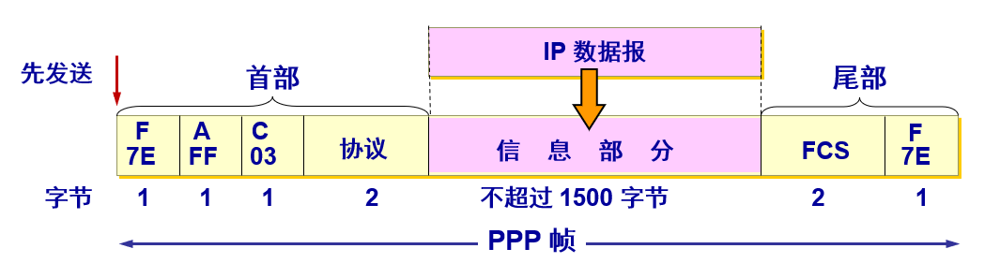
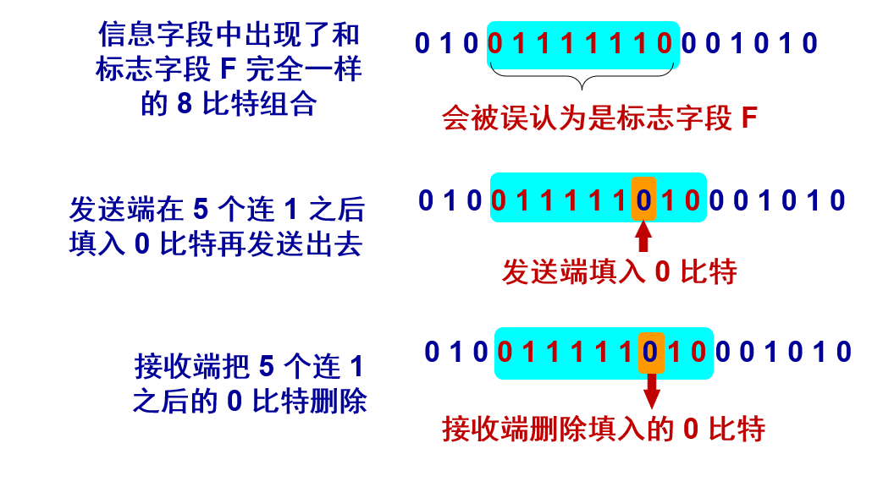
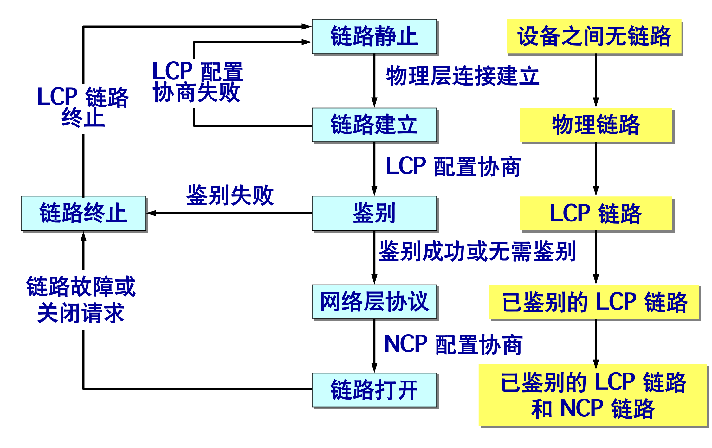

## 链路层信道

-------

数据链路层使用的信道主要有以下两种类型：

1. **点对点信道**: 这种信道使用一对一的点对点通信方式。

2. **广播信道**: 这种信道使用一对多的广播通信方式，因此过程比较复杂。广播信道上连接的主机很多，因此必须使用专用的共享信道协议来协调这些主机的数据发送。 

## 协议概述

-------

对于点对点的链路，使用得最广泛的数据链路层协议是点对点协议 `PPP (Point-to-Point Protocol)`。用户使用拨号电话线接入互联网时， 用户计算机和 `ISP` 进行通信时所使用的数据链路层协议就是 `PPP` 协议。

> `PPP` 协议在 `1994` 年就已成为互联网的正式标准。

根据之前我们对链路层协议要解决问题的介绍，`PPP` 协议满足如下需求：

1. **简单** —— 这是首要的要求。
2. **封装成帧** —— 必须规定特殊的字符作为帧定界符。
1. **透明性** —— 必须保证数据传输的透明性。
1. **差错检测** —— 能够对接收端收到的帧进行检测，并立即丢弃有差错的帧。
2. **多种网络协议** —— 能够在同一条物理链路上同时支持多种网络层协议。
3. **多种类型链路** —— 能够在多种类型的链路上运行。
4. **检测连接状态** —— 能够及时自动检测出链路是否处于正常工作状态。
5. **最大传送单元** —— 对每种点对点链路设置最大传送单元  MTU 的标准值，促进各种实现之间的互操作性。
6. **网络地址协商** —— 提供一种机制使通信的两个网络层实体能够通过协商知道或能够配置彼此的网络地址。
7. **数据压缩协商** —— 提供一种方法来协商使用数据压缩算法。

## 协议组成

-------

PPP 协议有三个组成部分：

1. 将 `IP` 数据报封装到串行链路的方法。
2. 链路控制协议` LCP (Link Control Protocol)`。
3. 网络控制协议` NCP (Network Control Protocol)`。   

#### 帧格式

`PPP` 帧的首部和尾部分别为 `4` 个字段和 `2` 个字段：

| 格式划分 |  F   |  A   |  C   |  网络层协议  |  数据报  | FCS  |  F   |
| :------: | :--: | :--: | :--: | :----------: | :------: | :--: | :--: |
| 具体内容 |  7E  |  FF  |  03  | 如C021（IP） | 数据部分 |  -   |  7E  |
|  字节数  |  1   |  1   |  1   |      2       |  <=1500  |  2   |  1   |

1. 标志字段 `F = 0x7E` （符号 `0x` 表示后面的字符是用十六进制表示。二进制表示是 `01111110`）。
2. 地址字段 `A` 只置为 `0xFF`。地址字段实际上并不起作用。
3. 控制字段 `C` 通常置为 `0x03`。
4. `PPP` 有一个 `2` 个字节的协议字段。其值：
   - 若为 0x0021，则信息字段就是 IP 数据报。
   - 若为 0x8021，则信息字段是网络控制数据。
   - 若为 0xC021，则信息字段是 PPP 链路控制数据。
   - 若为 0xC023，则信息字段是鉴别数据。

`PPP` 是面向字节的，所有的 `PPP` 帧的长度都是整数字节。

#### 透明传输问题

当 `PPP` 用在同步传输链路时，协议规定采用硬件来完成比特填充（和 HDLC 的做法一样），在异步传输时，就使用一种特殊的字符填充法。 

**字符填充：** 

1. 将信息字段中出现的每一个 `0x7E` 字节转变成为 `2` 字节序列 (`0x7D, 0x5E`)。 
2. 若信息字段中出现一个 `0x7D` 的字节, 则将其转变成为 `2` 字节序列 (`0x7D, 0x5D`)。
3. 若信息字段中出现 `ASCII` 码的控制字符（即数值小于 `0x20` 的字符），则在该字符前面要加入一个 `0x7D` 字节，同时将该字符的编码加以改变。  

**零比特填充：** 

`PPP` 协议用在 `SONET/SDH` 链路时，使用同步传输（一连串的比特连续传送）。这时采用零比特填充方法。

在发送端，只要发现有 `5` 个连续 `1`，则立即填入一个 `0`，接收端对帧中的比特流进行扫描。每当发现 `5` 个连续 `1` 时，就把这 `5` 个连续 `1` 后的一个 `0` 删除。

#### PPP 协议的工作状态

当用户拨号接入 `ISP` 时，路由器的调制解调器对拨号做出确认，并建立一条物理连接，`PC` 机向路由器发送一系列的 `LCP` 分组（封装成多个 `PPP` 帧）。这些分组及其响应选择一些 `PPP` 参数，并进行网络层配置，`NCP` 给新接入的 `PC` 机分配一个临时的 `IP` 地址，使 `PC` 机成为因特网上的一个主机。通信完毕时，`NCP` 释放网络层连接，收回原来分配出去的 `IP` 地址。接着，`LCP` 释放数据链路层连接。最后释放的是物理层的连接。可见，`PPP` 协议已不是纯粹的数据链路层的协议，它还包含了物理层和网络层的内容。

