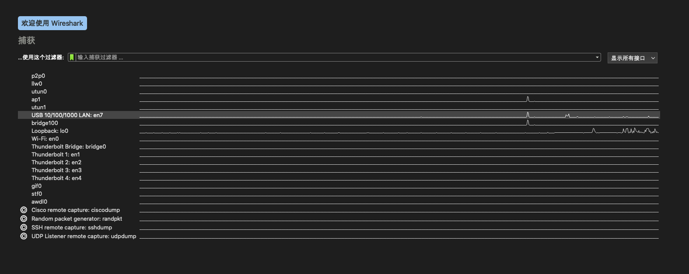
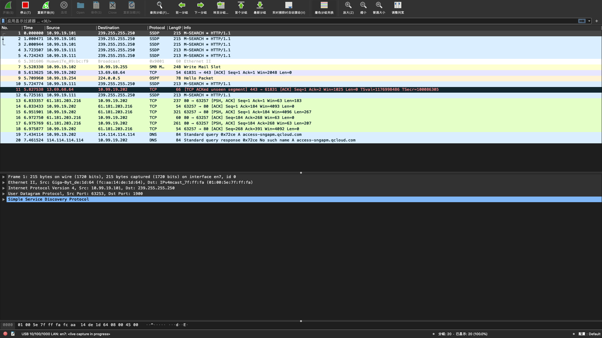
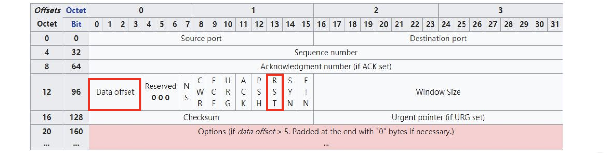
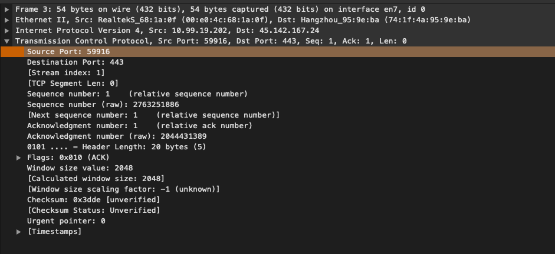
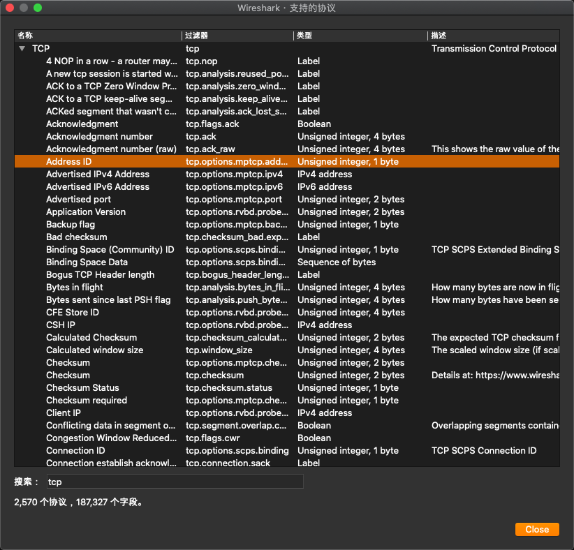

## Wireshark

#### 选择捕获接口



#### 抓包分析面板



数据包列表面板的标记符号：

• 会话中的第 `1` 个数据包 

• 会话中选中的数据包 

• 不属于所选会话中的数据包 

• 会话中最后 `1` 个数据包 

• 请求 

• 响应 

• 若当前选中的是 ACK 报文，则此报文是它确认的那个报文 

• 若当前选中的是 `ACK` 报文，则此报文是它重复确认的那个报文 

• 选中的报文与此报文有某种关联

#### 抓包文件

+ 标记报文 `Ctrl+M`;
+ 导出标记报文（文件->导出特定分组），亦可按过滤器导出报文;
+ 合并读入多个报文（文件->合并）;

#### 抓取移动设备

+ 在操作系统上打开 `wifi` 热点；
+ 手机连接 `wifi` 热点；
+ 用 `Wireshark` 打开捕获->选项面板，选择 `wifi` 热点对应的接口设备抓包；

## Wireshark 过滤器

-------

`WireShark`有两种过滤器：

- 捕获过滤器：用于减少抓取的报文体积，使用 `BPF` 语法。 
- 显示过滤器：对已经抓取到的报文过滤显示。

## 捕获过滤器：BPF

-------

`Berkeley Packet Filter`，在设备驱动级别提供抓包过滤接口，多数抓包工具都支持此语法，此过滤器使用 `expression` 表达式，由多个原语组成。

#### Expression

一个 `BPF` 过滤器的表达式由多个 `primitives` 原语以及原语运算符组成组成，而原语本身由由名称以及描述它的多个限定词组成：
+ `qualifiers` 限定词
  - `Type`：设置数字或者名称所指示类型，例如 `host www.baidu.com`
  - `Dir`：设置网络出入方向，例如 `dst  port 80 `
  - `Proto`：指定协议类型，例如 `udp`

- 原语运算符
  - 与：`&&` 或者 `and`
  - 或：`||` 或者 `or`
  - 非：`!` 或者 `not`

例如：

```shell
src or dst portrange 6000-8000 && tcp or ip6
# 出 || 入方向端口范围 6000 - 8000，要么是 tcp 要么是 ip6
```

#### 限定词 qualifier

**Type：**用于设置数字或者名称所指示类型

+ `host、port`：主机和端口
+ `net`：设定子网，`net 192.168.0.0 mask 255.255.255.0` 等价于 `net 192.168.0.0/24``
+ ``portrange`：设置端口范围，例如 portrange 6000-8000

**Dir：**设置网络出入方向

+ `src、dst、src or dst、src and dst`：出，入
+ `ra、ta、addr1、addr2、addr3、addr4`（仅对 IEEE 802.11 Wireless LAN 有效）

> *注意* `Dir 和 Type`之间不需要运算符。

**Proto：**指定协议类型 

+ `ether、fddi、tr、 wlan、 ip、 ip6、 arp、 rarp、 decnet、 tcp、udp、icmp、igmp、icmp、 igrp、pim、ah、esp、vrrp`

> *协议* 只支持底层协议

**其他：**

- `gateway`：指明网关 IP 地址，等价于 `ether host ehost and not host host`
- `broadcast`：广播报文，例如 `ether broadcast` 或者 `ip broadcast`
- `multicast`：多播报文，例如 `ip multicast` 或者 `ip6 multicast` 
- `less, greater`：小于或者大于

#### 基于协议域过滤



**捕获所有 TCP 中的 RST 报文：**

```bpf
tcp[13]&4==4
```

**抓取 HTTP GET 报文：**

```bpf
port 80 and tcp[((tcp[12:1] & 0xf0) >> 2):4] = 0x47455420
```

> **注意**
>
> + `47455420` 是 `ASCII` 码的 `16` 进制，表示 `GET`；
> + `TCP` 报头可能不只 `20` 字节，`data offset` 提示了承载数据的偏移，但它以 `4` 字节为单位；

## 显示过滤器

--------

任何在报文细节面板中解析出的字段名，都可以作为过滤属性，例如，在报文细节面板中 `TCP` 协议头中的 `Source Port`，对应着过滤属性为 `tcp.srcport`



在 `视图->内部->支持的协议面板` 里，可以看到各字段名对应的属性名：



对应每一个属性，大概有五种过滤值类型：

+ `Unsigned integer:` 无符号整型，例如 `ip.len le 1500`
+ `Signed integer:` 有符号整型
+ `Boolean:` 布尔值，例如 `tcp.flags.syn``
+ ``Ethernet address:` 以 `:` 、`-` 或者 `.` 分隔的 `6` 字节地址，例如 `eth.dst == ff:ff:ff:ff:ff:ff`
+ `IPv4 address:` 例如 `ip.addr == 192.168.0.1`
+ `IPv6 address:` 例如 `ipv6.addr == ::1`
+ `Text string:` 例如 `http.request.uri == "https://www.wireshark.org/"`

#### 过滤值比较符号

显示过滤器支持比较符号限定显示属性的范围：

| 英文        | 符号 | 描述及示例                                    |
| ----------- | ---- | --------------------------------------------- |
| eq          | ==   | 等于. ip.src==10.0.0.5                        |
| ne          | !=   | 不等于. ip.src!=10.0.0.5                      |
| gt          | >    | 大于. frame.len > 10                          |
| lt          | <    | 小于. frame.len < 128                         |
| ge          | >=   | 大于等于. frame.len ge 0x100                  |
| le          | <=   | 小于等于. frame.len ⇐ 0x20                    |
| contains    |      | 包含. sip.To contains "a1762"                 |
| matches     | ~    | 正则匹配.host matches "acme\.(org\|com\|net)" |
| bitwise_and | &    | 位与操作. tcp.flags & 0x02                    |

#### 多个表达式间的组合

显示过滤器同样允许多个语法的组合：

| 英文 | 符号 | 描述及示例                                                |
| ---- | ---- | --------------------------------------------------------- |
| and  | &&   | 逻辑与. ip.src==10.0.0.5 and tcp.flags.fin                |
| or   | \|\| | 逻辑或. ip.scr==10.0.0.5 or ip.src==192.1.1.1             |
| xor  | ^^   | 逻辑异或. tr.dst[0:3] == 0.6.29 xor tr.src[0:3] == 0.6.29 |
| not  | !    | NOT 逻辑非. not llc                                       |
| […]  |      | 见 Slice 切片操作符.                                      |
| in   |      | 见集合操作符.                                             |

#### 其他操作符

**大括号 {} 集合操作符** 

例如 `tcp.port in {443 4430..4434} `，实际等价于 `tcp.port == 443 || (tcp.port >= 4430 && tcp.port ⇐ 4434)`

**中括号 []Slice 切片操作符**

[`n`:`m`]表示 `n` 是起始偏移量，`m` 是切片长度 

+ `eth.src[0:3] == 00:00:83`

[`n-m`] 表示 `n` 是起始偏移量，`m` 是截止偏移量 

+ `eth.src[1-2] == 00:83`

`[:m]` 表示从开始处至 `m` 截止偏移量 

+ `eth.src[:4] == 00:00:83:00`

[`m`:]表示 `m` 是起始偏移量，至字段结尾 

+ `eth.src[4:] == 20:20`

[`m`]表示取偏移量 `m` 处的字节

+ `eth.src[2] == 83`

[`,`]使用逗号分隔时，允许以上方式同时出现 

+ `eth.src[0:3,1-2,:4,4:,2] ==00:00:83:00:83:00:00:83:00:20:20:83`

