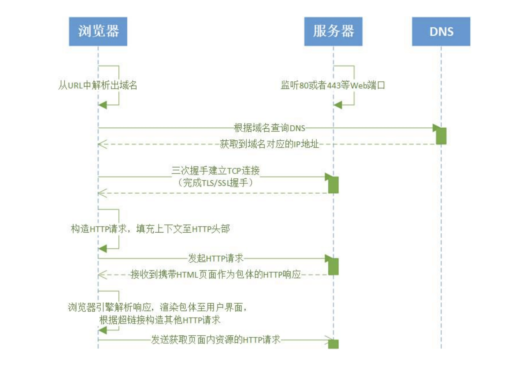
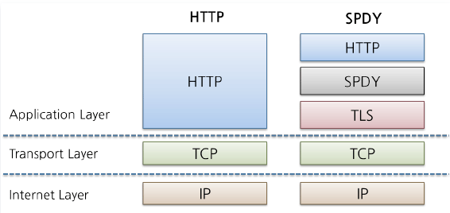

## HTTP 协议概述

------

一种无状态的、应用层的、以请求/应答方式运行的协议，它使用可扩展的语义和自描述消息格式，与基于网络的超文本信息系统灵活的互动。

`HTTP`是一个客户端（用户）和服务端（网站）之间请求和应答的标准，通常使用`TCP`协议。通过使用网页浏览器、网络爬虫或者其它的工具，客户端发起一个`HTTP`请求到服务器上指定端口（默认端口为`80`）。

我们称这个客户端为用户代理程序（`user agent`）。应答的服务器上存储着一些资源，比如`HTML`文件和图像。我们称这个应答服务器为源服务器。在用户代理和源服务器中间可能存在多个“中间层”，比如代理服务器、网关或者隧道（`tunnel`）。

#### 事务

事务指的是一次`http`交换（不包括`tcp/ip`连接，只包括一次`http`报文发送与接收）的整个过程，由请求命令和响应结果组成，中间数据格式是`http`报文。我们平常打开一个网站，里面包括很多事务。如：请求网页文档、请求某个`logo`图片及请求某个视频等。

#### web 组件

一次 `http` 请求可能会经过一些 `web` 组件，`web` 组件主要有代理、缓存、网关以及隧道，分别简介如下：

+ 代理：代理位于客户端和服务器之间，接收所有客户端的HTTP请求，并把这些请求转发给服务器（可能会对请求进行修改之后转发）。对用户来说，这些应用程序就是一个代理，代表用户访问服务器。代理的主要作用有过滤、屏蔽等。（还有需要注意一点：代理既可以代表服务器对客户端进行响应，又可以代表客户端对服务器进行请求！）

+ 缓存：首先说明一下，缓存某种意义上来说也是一种代理服务器。它主要使用代表服务器对客户端进行响应。发送预先缓存好的资源的副本。这样会加快事务响应速度、同时也会减少服务器的负载、减轻带宽。
+ 网关：网关就是网络边缘路由器又称网间连接器、协议转换器。就是一个网络连接到另一个网络的“关口”。负责路由协议的转换，同时也可能提供 `NAT` 服务等等。
+ 隧道：就是一个连接通道，用于在http信道上发送非http协议的资源。
+ Agent代理：说白了就是我们平时所说的浏览器，以及web机器人、爬虫等。

## HTTP 发展史

------

互联网工程任务组（`IETF`）在去年提议将 `HTTP-over-QUIC` 重命名为 `HTTP/3`。我们是做技术的，需要保持一定敏感度。一旦 `HTTP/3` 标准被定下来，各大产商会相继支持，那会给我们带来什么影响？需要我们回顾下 `HTTP` 的发展史。

#### **HTTP 0.9**

我们把时间拨回到 `1991`年， 万维网协会（`World Wide Web Consortium`，`W3C`）和互联网工程任务组（`IETF`）制定了 `HTTP 0.9` 标准。因为那个年代互联网还在普及，加上网速带宽低，所以 `HTTP 0.9` 只支持 `GET` 请求。

#### **HTTP 1.0**

时间来到`1996` 年 `5` 月，`HTTP/1.0` 版本发布，`HTTP` 协议新增很多内容。首先是请求方式的多样化，从单一的 `GET` 请求，增加了 `POST` 命令和 `HEAD` 命令。除此之外，还支持发送任何格式的内容。这两项新增内容，不仅使得互联网不仅可以传输文字、传输图像、视频、二进制文件，还丰富了浏览器与服务器的互动方式。这为互联网的大发展奠定了基础。

再次，`HTTP`请求和回应的格式也变了。除了数据部分，每次通信都必须包括头信息（`HTTP header`），用来描述一些元数据。其他的新增功能还包括状态码（`status code`）、多字符集支持、多部分发送（`multi-part type`）、权限（`authorization`）、缓存（`cache`）、内容编码（`content encoding`）等。

但 `HTTP/1.0` 还是存在缺点：

+ 第一点是：连接无法复用。`HTTP 1.0` 规定浏览器与服务器只保持短暂的连接，浏览器的每次请求都需要与服务器建立一个`TCP`连接，服务器完成请求处理后立即断开`TCP`连接，服务器不跟踪每个客户也不记录过去的请求。如果还要请求其他资源，就必须再新建一个连接。
+ 第二点是：`Head-Of-Line Blocking`（`HOLB`，队头阻塞）。`HOLB` 是指一系列包（`package`）因为第一个包被阻塞；当页面中需要请求很多资源的时候，`HOLB` 会导致在达到最大请求数量时，剩余的资源需要等待其它资源请求完成后才能发起请求。这会导致带宽无法被充分利用，以及后续健康请求被阻塞。

#### **HTTP 1.1**

`W3C` 组织为了解决 `HTTP 1.0` 遗留的问题，在 `1997` 年 `1` 月，发布 `HTTP/1.1` 版本，只比 `1.0` 版本晚了半年。它进一步完善了 `HTTP` 协议，一直用到了`20`年后的今天，直到现在还是最流行的版本。具体优化点：

1. 缓存处理。在 `HTTP 1.0` 中主要使用 `header` 里的 `If-Modified-Since,Expires` 来做为缓存判断的标准，`HTTP 1.1`则引入了更多的缓存控制策略例如 `Entity tag`，`If-Unmodified-Since, If-Match, If-None-Match`等更多可供选择的缓存头来控制缓存策略。
2. 带宽优化及网络连接的使用。针对网络开销大的问题，`HTTP 1.1` 在请求头引入了`range`头域，它允许只请求资源的某个部分，即返回码是`206`（`Partial Content`），这样就方便了开发者自由的选择以便于充分利用带宽和连接。
3. 错误通知的管理。在`HTTP1.1`中新增了`24`个错误状态响应码。 `4` . 长链接。`HTTP/1.1` 加入 `Connection`：`keep-alive` 可以复用一部分连接，在一个`TCP`连接上可以传送多个`HTTP`请求和响应，减少了建立和关闭连接的消耗和延迟。

随着网络的发展，`HTTP 1.1` 还是暴露出一些局限性。

1. 虽然加入 `keep-alive` 可以复用一部分连接，但域名分片等情况下仍然需要建立多个 `connection`，耗费资源，给服务器带来性能压力。
2. `pipeling` 只部分解决了 `HOLB`。`HTTP 1.1` 尝试使用 `pipeling` 来解决队头阻塞问题，即浏览器可以一次性发出多个请求（同个域名、同一条 `TCP` 链接）。但 `pipeling` 要求返回是按序的，那么前一个请求如果很耗时（比如处理大图片），那么后面的请求即使服务器已经处理完，仍会等待前面的请求处理完才开始按序返回。
3. 协议开销大。`HTTP/1` 在使用时，`header` 里携带的内容过大，在一定程度上增加了传输的成本，并且每次请求 `header` 基本不怎么变化，尤其在移动端增加用户流量。

#### **HTTP 2.0**

互联网的发展还是受到网络速度的限制。有个调侃的话，永远不要忽略一辆载满磁带的在高速公路上飞驰的卡车的带宽。大概意思说数据量大到一定程度时，物理运输无论是速度、安全性、便捷性都比网络传输好。

谷歌是业务首先提出云计算的概念；加上谷歌的公司文化特点是自己内部信息公开、透明，每个人都能了解到其他任何人当前的工作计划、代码等。谷歌为了解决内部系统传输数据慢的问题，自行研发的 `SPDY` 协议，目的是以最小化网络延迟，提升网络速度，解决 `HTTP/1.1` 效率不高的问题。

`SPDY` 协议是在 `TCP` 协议之上。相比 `HTTP/1` 的文本格式，`HTTP/2` 采用二进制格式传输数据，解析起来更高效。同时，还支持对 `Header` 压缩，减少头部的包体积大小。

`HTTP 2.0` 还引入了多路复用技术。多路复用很好地解决了浏览器限制同一个域名下的请求数量的问题，同时也更容易实现全速传输，毕竟新开一个 `TCP` 连接都需要慢慢提升传输速度。

谷歌于`2009` 年公开了 `SPDY` 协议，`W3C` 组织协议不错。于是乎，`W3C` 将 `SPDY` 协议引入到 `HTTP` 协议中，在 `2012` 年发布 `HTTP 2.0`。

#### **HTTP 3.0**

不得不说谷歌的技术确实牛逼，`TCP` 协议虽然能保证不丢包，但还是存在一些局限性。谷歌为了提高`Web`联网的速度决定推倒重来，吸收 `TCP` 快速打开的技术，缓存当前会话的上下文等优点，基于 `UDP` 协议研发一种名为`QUIC` （全称是“快速`UDP`互联网连接”）的实验性网络协议，并且使用运用在 `Chrome` 浏览器上。

我们可以在 Chrome 浏览器地址栏上输入 `chrome://flags/` 来体验 QUIC。

身兼 `IETF` 旗下 `HTTP` 工作组组长和 `QUIC` 工作组组长的马克•诺丁汉（`Mark Nottingham`）提议，将 `HTTP-over-QUIC` 实验性协议将被重命名为 `HTTP/3`，并有望成为 `HTTP` 协议的第三个正式版本。