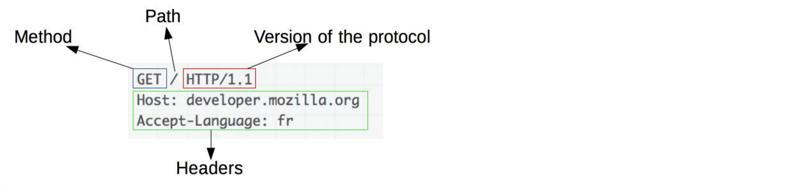

## HTTP协议描述格式

------

在实际制作`http` 报文的时候，`http` 报文格式是否合法，不同的服务器之间判定格式可能不同，比如说：换行用什么字符表述，还有一些格式的要求。这些都定义在 `RFC` 规范中，而 `RFC` 描述`http`语法进行表述不能通过口语，这个时候我们需要引入`ABNF`，`ABNF` 是一个定义语法的源语言。

## ABNF

------

巴科斯范式的英文缩写为`BNF`,它是以美国人巴科斯（`Backus`）和丹麦人（`Naur`）的名字命名的一种形式化的语法表示方法，用来描述语法的一种形式体系，是一种典型的元语言。又称巴科斯-诺尔形式（`Backus-Naur form`）。它不仅能严格的表示语法规则，而且所描述的语法与上下文无关的。它具有语法简单，表示明确，便于语法分析和编译的特点。

#### ABNF 操作符

**空白字符：** 用来分隔定义中的各个元素，这个空白字符不是指报文中的空白字符，而是ABNF定义中的空白字符。

- `method SP request-target SP HTTP-version CRLF`，这里的 SP 才是报文中的空白字符。

**选择 `/`： **表示多个规则都是可供选择的规则。

- `start-line = request-line / status-line`

**值范围：** `%c##-## ：`

- `OCTAL = “0” / “1” / “2” / “3” / “4” / “5” / “6” / “7” 与 OCTAL = %x30-37 等价`

**序列组合 `()`：**将规则组合起来，视为单个元素。

**不定量重复 `m*n`：**

- `*` 元素表示零个或更多元素： `*( header-field CRLF ) `。
- `1*` 元素表示一个或更多元素，`2*4` 元素表示两个至四个元素。

**可选序列` []`：**

- `[ message-body ]`

#### ABNF 核心规则

用上面的操作符可以表示多组规则，下面是比较其中重要的几个：

|规则|形式定义|意义|
|-----|----|-----|
|ALPHA|%x41-5A / %x61-7A|大写和小写ASCII字母（A-Z,|a-z）|
|DIGIT|%x30-39|数字（0-9）|
|HEXDIG|DIGIT / "A" / "B" / "C" / "D" / "E" / "F"|十六进制数字（0-9,A-F,a-f）|
|DQUOTE|%x22|双引号|
|SP|%x20|空格|
|HTAB|%x09|横向制表符|
|WSP|SP / HTAB|空格或横向制表符|
|LWSP|\*(WSP / CRLF WSP)|直线空白（晚于换行）|
|VCHAR|%x21-7E|可见（打印）字符|
|CHAR|%x01-7F|任何7-位US-ASCII字符，不包括NUL（%x00）|
|OCTET|%x00-FF|8位数据|
|CTL|%x00-1F / %x7F|控制字符|
|CR|%x0D|回车|
|LF|%x0A|换行|
|CRLF|CR LF|互联网标准换行|
|BIT|"0" / "1"|二进制数字|

## 基于 `ABNF` 描述的http报文

--------

由于在 `http/1.1` 之前协议采用的都是文本`(ASCII)`编码(当然最后传输的还是二进制流)，为了分隔报文中不同的部分，`http` 使用 `CRLF` 也就是回车换行符来对每一部分进行分隔，起始行和请求/响应头之间有一个 `CRLF`，每一个请求/响应头的末尾有一个 `CRLF`，在请求/响应头的结束和消息体的开始中间有 `2` 个 `CRLF`。

`http` 协议定义了两种报文，请求报文和相应报文，二者的区别主要在于首行的不同。

## HTTP 请求报文

------

#### 请求行

**标准格式描述：** `request-line = method SP request-target SP HTTP-version CRLF`

- **method**：`method` 方法： 指明操作目的，动词
  - `GET`：主要的获取信息方法，大量的性能优化都针对该方法，幂等方法 
  - `HEAD`：类似 GET 方法，但服务器不发送 BODY，用以获取 HEAD 元数据，幂等方法 
  - `POST`：常用于提交 HTML FORM 表单、新增资源等 
  - `PUT`：更新资源，带条件时是幂等方法 
  - `DELETE`：删除资源，幂等方法 
  - `CONNECT`：建立 tunnel 隧道 
  - `OPTIONS`：显示服务器对访问资源支持的方法，幂等方法 
  - `TRACE`：回显服务器收到的请求，用于定位问题。有安全风险
- **request-target**：`request-target = origin-form / absolute-form / authority-form / asterisk-form`
  - `origin-form = absolute-path [ "?" query ] `：向 origin server 发起的请求，path 为空时必须传递 / 
  - `absolute-form = absolute-URI`：仅用于向正向代理 proxy 发起请求时，详见正向代理与隧道 
  - `authority-form = authority`：仅用于 CONNECT 方法，例如 CONNECT -  HTTP/1.1 
  - `asterisk-form = "*“`：仅用于 OPTIONS 方法
- **HTTP-version：** 版本号
  - `HTTP/0.9`：只支持 GET 方法，过时 
  - `HTTP/1.0`：RFC1945，1996， 常见使用于代理服务器（例如 Nginx 默认配置） 
  - `HTTP/1.1`：RFC2616，1999 
  - `HTTP/2.0`：2015.5 正式发布

#### 请求头

**标准协议描述：** `header-field = field-name ":" OWS field-value OWS`

+ `OWS` 用于分隔请求头的多个值：`OWS = *( SP / HTAB ) `
+ `field-name = token`
+ `field-value = *( field-content / obs-fold )`

## HTTP 响应报文

-------

#### HTTP 响应行

**标准格式描述：**`status-line = HTTP-version SP status-code SP reason-phrase CRLF `

- `status-code = 3DIGIT `
- `reason-phrase = *( HTAB / SP / VCHAR / obs-text )`

#### 响应码

**响应码分类：`1xx`**

- `1xx`：请求已接收到，需要进一步处理才能完成，`HTTP1.0` 不支持 。
  - `100 Continue`：上传大文件前使用，由客户端发起请求中携带 `Expect: 100-continue` 头部触发 。
  - `101 Switch Protocols`：协议升级使用，由客户端发起请求中携带 Upgrade: 头部触发，如 websocket 或 http/2.0 。
  - `102 Processing`：WebDAV 请求可能包含许多涉及文件操作的子请求，需要很长时间才能完成请求。该代码表示服务器已经收到并正在处理请求，但无响应可用。这样可以防止客户端超时，并假设请求丢失。

**响应码分类： `2xx`**

- `2xx`：成功处理请求 
  - `200 OK`: 成功返回响应。 
  - `201 Created`: 有新资源在服务器端被成功创建。 
  - `202 Accepted`: 服务器接收并开始处理请求，但请求未处理完成。这样一个模糊的概念是有意如此设计，可以覆盖更多的场景。例如异步、需要长时间处理的任务。 
  - `203 Non-Authoritative Information`：当代理服务器修改了 origin server 的原始响应包体时，代理服务器可以通过修改 200 为 203 的方式告知客户端这一事实，方便客户端为这一行为作出相应的处理。 
  - `204 No Content`：成功执行了请求且不携带响应包体，并暗示客户端无需更新当前的页面视图。 
  - `205 Reset Content`：成功执行了请求且不携带响应包体，同时指明客户端需要更新当前页面视图。 
  - `206 Partial Content`：使用 range 协议时返回部分响应内容时的响应码 
  - `207 Multi-Status`：RFC4918 ，在 WEBDAV 协议中以 XML 返回多个资源的状态。 

**响应码分类： `3xx`**

- 3xx：重定向使用` Location` 指向的资源或者缓存中的资源。在 RFC中规定客户端重定向次数不应超过 5 次，以防止死循环。
  - `300 Multiple Choices`：资源有多种表述由客户端自行选择访问哪一种表述。由于缺乏明确的细节，300 很少使用。 
  - `301 Moved Permanently`：资源永久性的重定向到另一个 URI 中。 
  - `302 Found`：资源临时的重定向到另一个 URI 中。
  - `303 See Other`：重定向到其他资源，常用于 POST/PUT 等方法的响应中。 
  - `304 Not Modified`：当客户端拥有可能过期的缓存时，会携带缓存的标识 etag、时间等信息询问服务器缓存是否仍可复用，而304是告诉客户端可以复用缓存。 
  - `307 Temporary Redirect`：类似302，但明确重定向后请求方法必须与原请求方法相同，不得改变。 
  - `308 Permanent Redirect`：类似301，但明确重定向后请求方法必须与原请求方法相同，不得改变。

**响应码分类： `4xx`**

- `4xx`：客户端出现错误 
  - `400 Bad Request`：服务器认为客户端出现了错误，但不能明确判断为以下哪种错误，如HTTP请求格式错误。
  - `401 Unauthorized`：用户认证信息缺失或者不正确，导致服务器无法处理请求。 
  - `407 Proxy Authentication Required`：对需要经由代理的请求，认证信息未通过代理服务器的验证。
  - `403 Forbidden`：服务器理解请求的含义，但没有权限执行此请求。
  - `404 Not Found`：服务器没有找到对应的资源。
  - `410 Gone`：服务器没有找到对应的资源，且明确的知道该位置永久性找不到该资源。
  - `405 Method Not Allowed`：服务器不支持请求行中的 method 方法。
  - `406 Not Acceptable`：对客户端指定资源表述不存在，服务器返回表述列表供客户端选择。 
  - `408 Request Timeout`：服务器接收请求超时。
  - `409 Conflict`：资源冲突，例如上传文件时目标位置已经存在版本更新的资源。
  - `411 Length Required`：如果请求含有包体且未携带 Content-Length 头部，且不属于chunk类请求时，返回 411。
  - `412 Precondition Failed`：复用缓存时传递的 `If-Unmodified-Since` 或 `If-None-Match` 头部不被满足。
  - `413 Payload Too Large/Request Entity Too Large`：请求的包体超出服务器能处理的最大长度。
  - `414 URI Too Long`：请求的 URI 超出服务器能接受的最大长度。
  - `415 Unsupported Media Type`：上传的文件类型不被服务器支持。
  - `416 Range Not Satisfiable`：无法提供 Range 请求中指定的那段包体。
  - `417 Expectation Failed`：对于 Expect 请求头部期待的情况无法满足时的响应码。
  - `421 Misdirected Request`：服务器认为这个请求不该发给它，因为它没有能力处理。 
  - `426 Upgrade Required`：服务器拒绝基于当前 HTTP 协议提供服务，通过 Upgrade 头部告知客户端必须升级协议。 
  - `428 Precondition Required`：用户请求中缺失了条件类头部，例如 If-Match。
  - `429 Too Many Requests`：客户端发送请求的速率过快。
  - `431 Request Header Fields Too Large`：请求的 HEADER 头部大小超过限制。
  - `451 Unavailable For Legal Reasons`：RFC7725 ，由于法律原因资源不可访问。

**响应码分类： `5xx`**

- `5xx`：服务器端出现错误 
  - `500 Internal Server Error`：服务器内部错误，且不属于以下错误类型。
  - `501 Not Implemented`：服务器不支持实现请求所需要的功能。
  - `502 Bad Gateway`：代理服务器无法获取到合法响应。
  - `503 Service Unavailable`：服务器资源尚未准备好处理当前请求。
  - `504 Gateway Timeout`：代理服务器无法及时的从上游获得响应。
  - `505 HTTP Version Not Supported`：请求使用的 HTTP 协议版本不支持。
  - `507 Insufficient Storage`：服务器没有足够的空间处理请求。
  - `508 Loop Detected`：访问资源时检测到循环。
  - `511 Network Authentication Required`：代理服务器发现客户端需要进行身份验证才能获得网络访问权限。

#### 响应头

**标准协议描述：** `header-field = field-name ":" OWS field-value OWS `

+ `OWS` 用于分隔响应头的多个值：`OWS = *( SP / HTAB ) `
+ `field-name = token`
+ `field-value = *( field-content / obs-fold )`