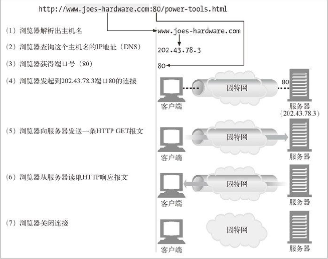
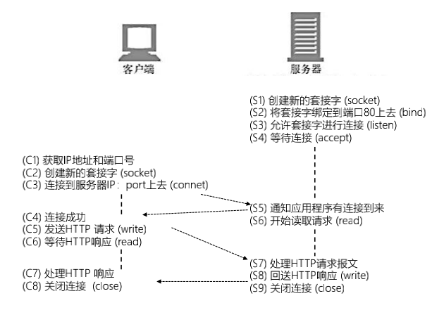
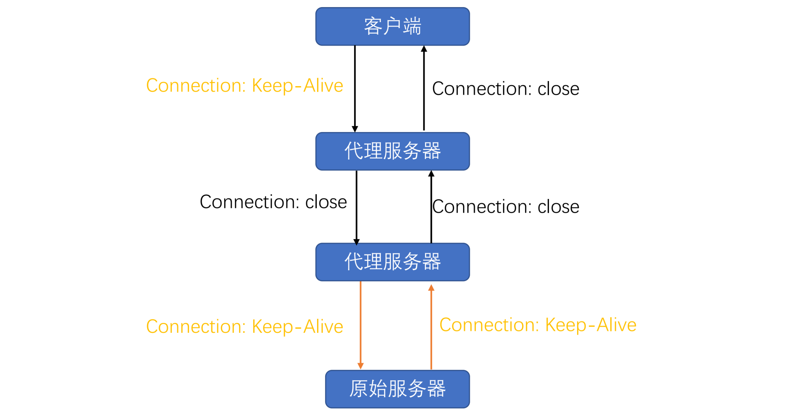
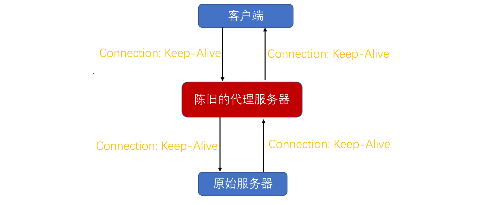
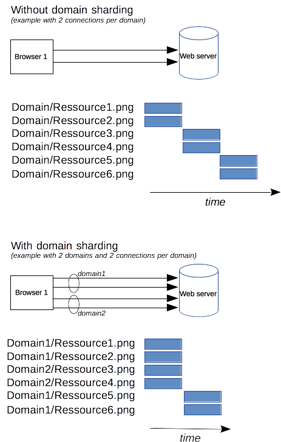

## 连接管理

-----

连接管理是一个 `HTTP` 的关键话题：打开和保持连接在很大程度上影响着网站和 `Web` 应用程序的性能。在 `HTTP/1.x` 里有多种模型：短连接, 长连接, 和 `HTTP` 流水线。

`HTTP` 的传输协议主要依赖于 `TCP` 来提供从客户端到服务器端之间的连接。在早期，`HTTP` 使用一个简单的模型来处理这样的连接。这些连接的生命周期是短暂的：每发起一个请求时都会创建一个新的连接，并在收到应答时立即关闭。

这个简单的模型对性能有先天的限制：打开每一个 `TCP` 连接都是相当耗费资源的操作。客户端和服务器端之间需要交换好些个消息。当请求发起时，网络延迟和带宽都会对性能造成影响。现代浏览器往往要发起很多次请求(十几个或者更多)才能拿到所需的完整信息，证明了这个早期模型的效率低下。

有两个新的模型在 `HTTP/1.1` 诞生了。首先是长连接模型，它会保持连接去完成多次连续的请求，减少了不断重新打开连接的时间。然后是 `HTTP` 流水线模型，它还要更先进一些，多个连续的请求甚至都不用等待立即返回就可以被发送，这样就减少了耗费在网络延迟上的时间。

#### hop by hop

要注意的一个重点是 `HTTP` 的连接管理适用于两个连续节点之间的连接，如 `hop-by-hop`，而不是 `end-to-end`。上面的模型我们可以当做是没有中间节点的 `http` 连接。当模型用于从客户端到第一个代理服务器的连接和从代理服务器到目标服务器之间的连接时(或者任意中间代理)效果可能是不一样的。`HTTP` 协议头受不同连接模型的影响，比如 `Connection` 和 `Keep-Alive`，就是 `hop-by-hop` 协议头，它们的值是可以被中间节点修改的。

## 短连接

-----

`HTTP` 最早期的模型，也是 `HTTP/1.0` 的默认模型，是短连接。每一个 `HTTP` 请求都由它自己独立的连接完成；这意味着发起每一个 `HTTP` 请求之前都会有一次 `TCP` 握手，而且是连续不断的。

首先从`http`的角度来看，一次`http`请求的过程大概是下面这样的，首先浏览器解析主机名，通过`DNS`服务查询出主机的`IP`地址，浏览器建立`tcp`与主机建立`80`端口的连接，写入报文到`tcp`缓存，从`tcp`缓存中读取报文，最后关闭连接：

不过如果从`tcp`的角度来看这次连接，那么`http`的请求响应则是下面这样的过程，`TCP` 协议握手本身就是耗费时间的，所以 `TCP` 可以保持更多的热连接来适应负载。短连接破坏了 `TCP` 具备的能力，新的冷连接降低了其性能。：

这是 `HTTP/1.0` 的默认模型(如果没有指定 `Connection` 协议头，或者是值被设置为 `close`。而在 `HTTP/1.1` 中，只有当 `Connection` 被设置为 `close` 时才会用到这个模型。

> 除非是要兼容一个非常古老的，不支持长连接的系统，没有一个令人信服的理由继续使用这个模型。

## 长连接

------

短连接有两个比较大的问题：创建新连接耗费的时间尤为明显，另外 `TCP` 连接的性能只有在该连接被使用一段时间后(热连接)才能得到改善。为了缓解这些问题，长连接 的概念便被设计出来了，甚至在 `HTTP/1.1` 之前。或者这被称之为一个 `keep-alive` 连接。

`HTTP1.0`协议不支持长连接，从`HTTP1.1`协议以后，连接默认都是长连接，所谓的长连接是指`tcp`连接，连接复用，实际上`http`还是一个请求一个相应，同时必须服务器客户端都支持长连接。

一个长连接会保持一段时间，重复用于发送一系列请求，节省了新建 `TCP` 连接握手的时间，还可以利用 `TCP` 的性能增强能力。当然这个连接也不会一直保留着：连接在空闲一段时间后会被关闭(服务器可以使用 `Keep-Alive` 协议头来指定一个最小的连接保持时间)。

长连接也还是有缺点的；就算是在空闲状态，它还是会消耗服务器资源，而且在重负载时，还有可能遭受 `DoS attacks` 攻击。这种场景下，可以使用非长连接，即尽快关闭那些空闲的连接，也能对性能有所提升。

长短连接的控制定义在`connection`头部，`keepalive`的时间范围内，这些`http`请求共用同一个`TCP connection`. 如果`keepalive`为`off`的话，则每次`http`请求都需要新建`tcp connection`。

- `Connection` 头部 
  - `Keep-Alive`：长连接
    - 客户端请求长连接：`Connection: Keep-Alive`
    - 服务器表示支持长连接：`Connection: Keep-Alive`
    - 客户端复用连接
  - `Close`：短连接

长连接并不是永久连接的。如果一段时间内，这个连接没有`HTTP`请求发出的话，一方会发出一个心跳包(`Keep Alive`包)，如果对方有回包则表明当前连接有效，继续监控。（具体时间长短可以在`header`当中设置，比如`Keep-Alive:timeout=20`）

`HTTP/1.0` 里默认并不使用长连接。把 `Connection` 设置成 `close` 以外的其它参数都可以让其保持长连接，通常会设置为 `retry-after`。

在 `HTTP/1.1` 里，默认就是长连接的，协议头都不用再去声明它(但我们还是会把它加上，万一某个时候因为某种原因要退回到 `HTTP/1.0` 呢)。

> `HTTP/1.1` 默认支持长连接，所以说在`HTTP/1.1`中`Connection: Keep-Alive` 无意义，如果`HTTP1.1`版本的请求报文不希望使用长连接，则要请求报文首部加上`Connection: close`。

#### hop by hop

上面我们说了 `HTTP` 的连接管理适用于两个连续节点之间的连接，如 `hop-by-hop`，而不是 `end-to-end`。上面的模型我们可以当做是没有中间节点的 `http` 连接。当模型用于从客户端到第一个代理服务器的连接和从代理服务器到目标服务器之间的连接时(或者任意中间代理)效果可能是不一样的。`HTTP` 协议头受不同连接模型的影响，比如 `Connection` 和 `Keep-Alive`，就是 `hop-by-hop` 协议头，它们的值是可以被中间节点修改的。

**代理服务器**

对于理解 `Connection` 头部的代理服务器的行为是代理服务器不转发 `Connection` 列出头部，该头部仅与当前连接相关：

#### 盲中继(blind relay)

虽然那些不理解 `Connection` 首部，而且不知道在沿着转发链路将其发送出去之前，应该将该首部删除的代理。但是很多老的或简单的代理都 是盲中继`(blind relay)`，它们只是将字节从一个连接转发到另一个连接中去，不对 `Connection` 首部进行特殊的处理，而这就会因为一个严重的问题。

**老旧的代理**

`HTTP权威指南`提到，有部分古老的`HTTP1.0` 代理不理解`Keep-alive`，而客户端带有`Keep-alive`，而代理不认识，于是将报文原封不动转给了服务端，服务端响应了`Keep-alive`，代理服务器收到响应中 `Connection: Keep-Alive` 后不认，转发给客户端，同时等待服务器关闭短连接，客户端收到了` Connection: Keep-Alive`，认为可以复用长连接，继续在该连接上发起请求，最后代理服务器出错，因为短连接上不能发起两次请求

书上也介绍了解决方案：当发现`HTTP`版本为`1.0`时，服务器就忽略`Keep-alive`返回的报文不携带这个头，客户端就知道当前不该使用长连接。其实，在实际使用中不需要考虑这么多，很多时候代理是我们自己控制的，如`Nginx`代理，代理服务器有长连接处理逻辑，服务端无需做处理，常见的是客户端跟`Nginx`使用`HTTP1.1协议&长连接`，而`Nginx`跟后端服务器使用`HTTP1.0协议&短连接`。

这个问题最根本的原因是代理服务器转发了禁止转发的 `Header`。但是要升级所有老旧的代理也不是件简单的事，所以浏览器厂商和代理实现者协商了一个变通的方案：首先，显式给浏览器设置代理后，浏览器会把请求头中的 `Connection` 替换为 `Proxy-Connetion`。这样，对于老旧的代理，它不认识这个 `Header`，会继续发给服务器，服务器也不认识，代理和服务器之间不会建立持久连接（不能正确处理 `Connection` 的都是 `HTTP/1.0` 代理），服务器不返回 `Keep-Alive`，代理和浏览器之间也不会建立持久连接。而对于新代理，它可以理解 `Proxy-Connetion`，会用 `Connection` 取代无意义的 `Proxy-Connection`，并将其发送给服务器，以收到预期的效果。

`Proxy-Connetion` 可以看做指定了代理之后显示的声明是和代理之间的长连接。

## 流水线

----

> HTTP 流水线在现代浏览器中并不是默认被启用的：
>
> + Web 开发者并不能轻易的遇见和判断那些搞怪的[代理服务器](https://en.wikipedia.org/wiki/Proxy_server)的各种莫名其妙的行为。
> + 正确的实现流水线是复杂的：传输中的资源大小，多少有效的 [RTT](https://en.wikipedia.org/wiki/Round-trip_delay_time) 会被用到，还有有效带宽，流水线带来的改善有多大的影响范围。不知道这些的话，重要的消息可能被延迟到不重要的消息后面。这个重要性的概念甚至会演变为影响到页面布局！因此 HTTP 流水线在大多数情况下带来的改善并不明显。
> + 流水线受制于 [HOL](https://en.wikipedia.org/wiki/Head-of-line_blocking) 问题。
>
> 由于这些原因，流水线已经被更好的算法给代替，如 *multiplexing*，已经用在 HTTP/2。

默认情况下，`HTTP` 请求是按顺序发出的。下一个请求只有在当前请求收到应答过后才会被发出。由于会受到网络延迟和带宽的限制，在下一个请求被发送到服务器之前，可能需要等待很长时间。

流水线是在同一条长连接上发出连续的请求，而不用等待应答返回。这样可以避免连接延迟。理论上讲，性能还会因为两个 `HTTP` 请求有可能被打包到一个 `TCP` 消息包中而得到提升。就算 `HTTP` 请求不断的继续，尺寸会增加，但设置 `TCP` 的 `MSS(Maximum Segment Size)` 选项，仍然足够包含一系列简单的请求。

并不是所有类型的 `HTTP` 请求都能用到流水线：只有 `idempotent` 方式，比如 `GET`、`HEAD`、`PUT` 和 `DELETE` 能够被安全的重试：如果有故障发生时，流水线的内容要能被轻易的重试。

今天，所有遵循 `HTTP/1.1` 的代理和服务器都应该支持流水线，虽然实际情况中还是有很多限制：一个很重要的原因是，目前没有现代浏览器默认启用这个特性。

## 域名分片

-----

> 除非你有紧急而迫切的需求，不要使用这一过时的技术，升级到 `HTTP/2` 就好了。在 `HTTP/2` 里，做域名分片就没必要了：`HTTP/2` 的连接可以很好的处理并发的无优先级的请求。域名分片甚至会影响性能。大多数 `HTTP/2` 的实现还会使用一种称作连接凝聚的技术去尝试合并被分片的域名。

作为 `HTTP/1.x` 的连接，请求是序列化的，哪怕本来是无序的，在没有足够庞大可用的带宽时，也无从优化。一个解决方案是，浏览器为每个域名建立多个连接，以实现并发请求。曾经默认的连接数量为 `2` 到 `3` 个，现在比较常用的并发连接数已经增加到 `6` 条。如果尝试大于这个数字，就有触发服务器 `DoS` 保护的风险。

如果服务器端想要更快速的响应网站或应用程序的应答，它可以迫使客户端建立更多的连接。例如，不要在同一个域名下获取所有资源，假设有个域名是 `www.example.com`，我们可以把它拆分成好几个域名：`www1.example.com`、`www2.example.com`、`www3.example.com`。所有这些域名都指向同一台服务器，浏览器会同时为每个域名建立 `6` 条连接(在我们这个例子中，连接数会达到 `18` 条)。这一技术被称作域名分片。

