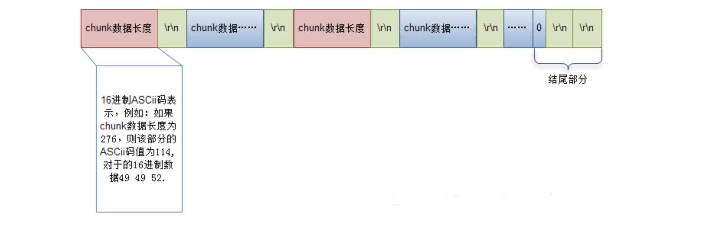

## HTTP包体

-------

请求的最后一部分是它的 `body`。不是所有的请求都有一个 `body`：例如获取资源的请求，`GET`，`HEAD`，`DELETE` 和 `OPTIONS`，通常它们不需要 `body`。 有些请求将数据发送到服务器以便更新数据：常见的的情况是 `POST` 请求（包含 `HTML` 表单数据）。

`Body` 大致可分为两类：

+ `Single-resource bodies`，由一个单文件组成。该类型 `body` 由两个 `header` 定义： `Content-Type` 和 `Content-Length`.
+ `Multiple-resource bodies`，由多部分 `body` 组成，每一部分包含不同的信息位。通常是和  `HTML Forms` 连系在一起。

响应的最后一部分是 `body`。不是所有的响应都有 `body`：具有状态码 (如 `201` 或 `204)` 的响应，通常不会有 `body`。

`Body` 大致可分为三类：

+ `Single-resource bodies`，由已知长度的单个文件组成。该类型 `body` 由两个 `header` 定义：`Content-Type` 和 `Content-Length`。

+ `Single-resource bodies`，由未知长度的单个文件组成，通过将 `Transfer-Encoding` 设置为 `chunked` 来使用 `chunks` 编码。

+ `Multiple-resource bodies`，由多部分 `body` 组成，每部分包含不同的信息段。但这是比较少见的。

#### 包体的格式：

`HTTP-message = start-line *( header-field CRLF ) CRLF [ message-body ] `

- `message-body = *OCTET`：二进制字节流 (非不定长二进制流)

> **注意：**以下消息不能含有包体
>
> 1. `HEAD` 方法请求对应的响应 
> 2. `1xx、204、304` 对应的响应 
> 3. `CONNECT` 方法对应的 `2xx` 响应

#### 包体传输的两种方式：

**1.发送 HTTP 消息时已能够确定包体的全部长度：**

使用 `Content-Length` 头部明确指明包体长度用 `10` 进制表示包体中的字节个数，且必须与实际传输的包体长度一致，如果长度不同则不符合`http`协议规范，服务器无法正确解析。

- `Content-Length = 1*DIGIT` 

**2.发送 HTTP 消息时不能确定包体的全部长度：**

当我们想要基于长连接持续推送动态内容，或者压缩体积较大的包体时，不必完全压缩完再发送，可以边发送边压缩（压缩过程中无法计算体积），使用 `Transfer-Encoding` 头部指明使用 `Chunk` 传输方式。

*规范格式*

+ ` Transfer-Coding = "chunked" / "compress" / "deflate" / "gzip" / transfer-extension `
  - 含 `Transfer-Encoding = chunked` 头部后 `Content-Length` 头部应被忽略

当数据很大的时候，还会分多个块`（chunk）`传输。`chunked`编码的格式如下，`Chunked transfer encoding` 分块传输编码：

+ `chunked-body` = `*chunk`

  ​				  `last-chunk ` 

  ​				  `trailer-part `

  ​				  `CRLF `

  + `chunk = chunk-size [ chunk-ext ] CRLF chunk-data CRLF `
    + `chunk-size` = `1*HEXDIG`：注意这里是 `16` 进制而不是 `10` 进制。
    + `chunk-data = 1*OCTET`
  + `last-chunk = 1*("0") [ chunk-ext ] CRLF`
  + `trailer-part = *( header-field CRLF )`

通过分块技术，实体被分成许多的块，也就是应用层的数据，`TCP`在传送的过程中，不对它们做任何的解释，而是把应用层产生数据全部理解成二进制流，然后按照`MSS`的长度切成一分一分的，一股脑塞到`tcp发送缓存`里面去，而具体这些二进制的数据如何做解释，需要应用层来完成，所以在这之前，一个整体应用层的数据需要等它分成的所有`TCP segment`到达对方，重新组装后，应用程序才使用自己的解码方法还原它们，所以对于分块传输，只要打包好一部分`chunk`就可以写入`tcp`缓存等待发送。

> 分块传输最常见的使用场景就是结合`Content-Encoding: gzip` 使用的时候使用`Transfer-Encoding: chunked`。

**3.Trailer 头部的传输：**

trailer头部指的就是分块传输最后可以发送的头部，目前支持的并不多：

- TE 头部：客户端在请求在声明是否接收 Trailer 头部 
  - `TE: trailers `

- Trailer 头部：服务器告知接下来 chunk 包体后会传输哪些 Trailer 头部 
  - `Trailer: Date`

以下头部不允许出现在 Trailer 的值中： 

- 用于信息分帧的首部 (例如 `Transfer-Encoding` 和 `Content-Length`) 
- 用于路由用途的首部 (例如 `Host`) 
- 请求修饰首部 (例如控制类和条件类的，如 `Cache-Control，Max-Forwards，或者 TE`) 
- 身份验证首部 (例如 `Authorization 或者 Set-Cookie`) 
- `Content-Encoding, Content-Type, Content-Range`，以及 `Trailer` 自身

### MIME（ Multipurpose Internet Mail Extensions ） 

`mime`类型，也就是媒体类型，该头部标志着包体的内容，比如：`Content-type: text/plain; charset="us-ascii"`。

- `"Content-Type" ":" type "/" subtype *(";" parameter) `

  - `type := discrete-type / composite-type`
    - `discrete-type := "text" / "image" / "audio" / "video" / "application" / extension-token` 
    - `composite-type := "message" / "multipart" / extension-token `
    - `extension-token := ietf-token / x-token `

  - `subtype := extension-token / iana-token `
  - `parameter := attribute "=" value`

### `Content-Disposition` 头部

该头部用来给客户端描述包体的处理方式，平时我们在浏览器中下载内容用的就是这个头部：

- `disposition-type = "inline" | "attachment" | disp-ext-type`
  - `inline`：指定包体是以` inline` 内联的方式，作为页面的一部分展示 
  - `attachment`：指定浏览器将包体以附件的方式下载 
    - 例如： `Content-Disposition: attachment `
    - 例如： `Content-Disposition: attachment; filename=filename.jpg `
  - 在 `multipart/form-data` 类型应答中，可以用于子消息体部分 
    - 如 `Content-Disposition: form-data; name="fieldName"; `

