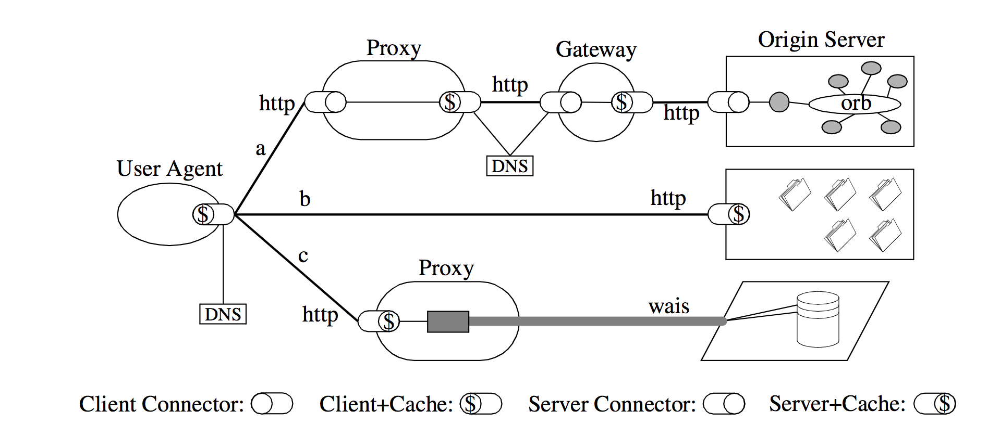
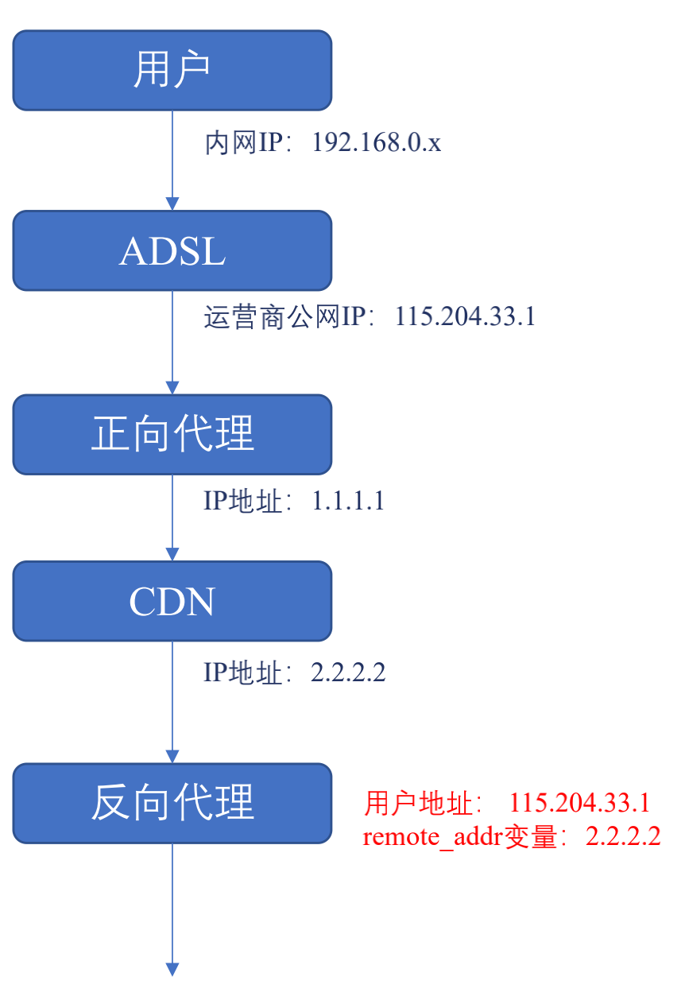

## 代理服务器头部

------

服务器经常需要通过不同用户的 `ip` 来实现负载均衡，这个时候我们可能会想到通过 `tcp` 四元组来拿到主机的 `ip` 地址。但是在现有的 `restful` 风格的网络架构下，服务器和主机之间通常间隔了多个代理服务器、`cdn`、网关，而 `tcp` 连接建立在两个最近的通信主机之间，换句话说服务器只能拿到代理服务器或者 `cdn` 的 `ip`。

> *注* 在`TCP`连接四元组里，我们能拿到最近的代理服务器`ip`和端口号。



拿实际的例子举例，用户和反向代理服务器之间分隔着正向代理和 `cdn`，反向代理为了实现均衡负载需要拿到运营商分配给用户的公网 `ip`，但是 `tcp` 四元组只能拿到 `cdn` 的 `2.2.2.2`。为此我们需要传递最初的客户端`ip`和途径的代理服务器`ip`，因为目的服务器的连接中只能拿到最近的代理服务器的`ip`，所以需要一个特殊的头部。



#### `X-Forwarded-For`&`X-Real-IP`

`X-Forwarded-For` 用于传递所有途径的 `ip` 地址，以空格分隔。

```http

X-Forwarded-For： 115.204.33.1，1.1.1.1 
```

`X-Real-IP` 用于传递用户 `ip`但是非`RPC`规范。

```http

X-Real-IP： 115.204.33.1
```

## 其他代理服务器头部

-------

#### Max-Forwards

限制 `Proxy` 代理服务器的最大转发次数，仅对 `TRACE/OPTIONS` 方法有效:

+ `Max-Forwards` = `1*DIGIT`

#### Via

指明经过的代理服务器名称及版本：

+ `Via` = `1#( received-protocol RWS received-by [ RWS comment ] )`
  - `received-protocol` = `[ protocol-name "/" ] protocol-version`
  - `received-by` = `( uri-host [ ":" port ] ) / pseudonym`
  - `pseudonym` = `token`

举个例子：

```http

via: 1.0 th-openresty, 1.0 th-nginx
```

#### Cache-Control:no-transform 

禁止代理服务器修改响应包体