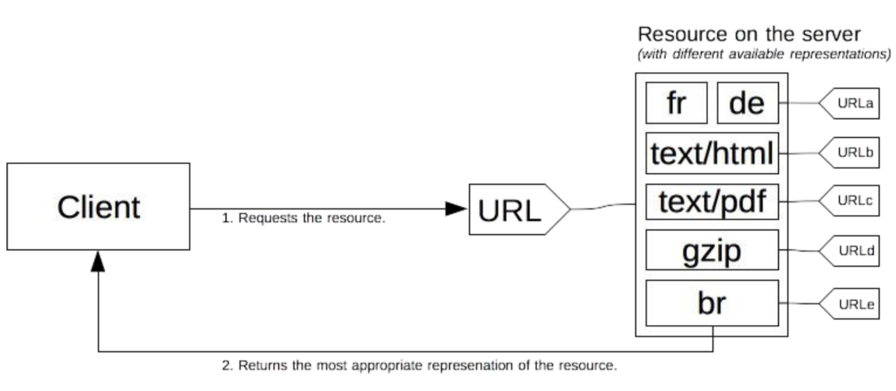
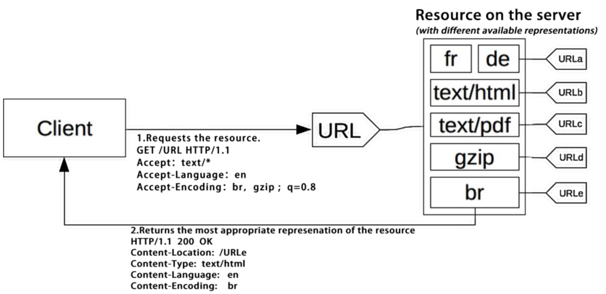
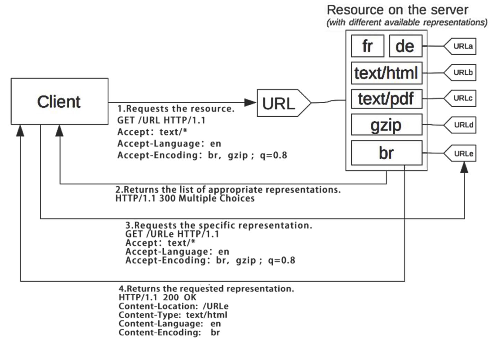

## 内容协商

-------

每个 URI 指向的资源可以是任何事物，可以有多种不同的表述，例如一份文档可以有不同语言的翻译、不同的媒体格式、可以针对不同的浏览器提供不同的压缩编码等。

#### 内容协商的两种方式：

`Proactive` 主动式内容协商： 

- 指由客户端先在请求头部中提出需要的表述形式，而服务器根据这些请求头部提供特定的 `representation` 表述。

  

`Reactive` 响应式内容协商：

- 指服务器返回 `300 Multiple Choices` 或者 `406 Not Acceptable`，由客户端选择一种表述 `URI` 使用。

  

#### 常见的协商要素：

了解下面的头部之前我们首先要清楚质量因子 `q` 的概念，`q` 代表内容的质量、可接受类型的优先级 

**Accept：**

+ 媒体资源的 MIME 类型及质量因子 
  - `Accept`: `text/html,application/xhtml+xml,application/xml;q=0.9,*/*;q=0.8 `

**Accept-X：**

+ 字符编码：由于 `UTF-8` 格式广为使用， `Accept-Charset` 已被废弃 
  - `Accept-Charset`: `ISO-8859-1,utf-8;q=0.7,*;q=0.7`

+ 内容编码：主要指压缩算法 
  - `Accept-Encoding`: `gzip, deflate, br`

+ 表述语言
  - `Accept-Language: zh-CN,zh;q=0.9,en-US;q=0.8,en;q=0.7 `

**Content-X：**

+ 媒体类型、编码：
  - `Content-Type`: `text/html; charset=utf-8 `

+ 内容编码：
  - `content-encoding`: `gzip `

+ 语言：
  - `Content-Language`: `de-DE, en-CA`

