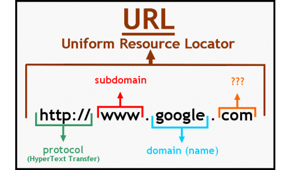

## 引言

-----

#### 同源策略

`1995`年由`Netscape`提出同源策略，浏览器在发送`Ajax`请求时，只接收同域服务器响应的数据资源；那么什么才算同域呢？很简单，协议、域名、端口全部相同才算同一域下，三个条件有一个不一致，都不算同域，既跨域；如果缺少了同源策略，浏览器很容易受到`XSS、CSRF`等攻击。所谓同源是指"协议+域名+端口"三者相同，即便两个不同的域名指向同一个ip地址，也非同源。



比如我们在浏览器中`127.0.0.1:3000`端口下使用`ajax`请求`(script或者是src就不会造成此效果）`访问了`127.0.0.1:8080`端口的数据，就会造成非法跨域现象，无法取得返回的数据。

#### 什么是跨域

`CROS`全称是跨域资源共享 (Cross-origin resource sharing)，跨域资源共享(CORS)标准新增了一组 HTTP 首部字段，允许服务器声明哪些源站有权限访问哪些资源。`另外，规范要求，对那些可能对服务器数据产生副作用的HTTP请求方法（特别是GET以外的HTTP请求，或者搭配某些MIME类型的POST请求），浏览器必须首先使用OPTIONS方法发起一个预检请求（preflight request），从而获知服务端是否允许该跨域请求`。服务器确认允许之后，才发起实际的 HTTP 请求。在预检请求的返回中，服务器端也可以通知客户端，是否需要携带身份凭证（包括 Cookies 和 HTTP 认证相关数据）。

#### 跨域的实质

当我们在一个域名下访问另一个域名的数据时，这种请求时必须被服务器允许的（允许外域请求），如果不被允许，我们虽然可以通过http请求请求到服务端发来的响应报文，但是在浏览器拿到响应报文时，发现服务器所在域名和我们当前的域名不同且没有在响应报文的头中拿到服务器的许可，会自动拦截并且报错。

## 服务端的解决方案

-------

接下来描述服务端自身实现跨域的方法，以`Golang`为例，这样是比较理想的解决方法，可以通过给`Iris`添加中间件实现。

#### 简单请求

若请求满足所有下述条件，则该请求可视为“简单请求”：

使用下列**请求方法**之一：

```go
GET
HEAD
POST
```

并且**Content-Type的值**仅限于下列三者之一：

```go
text/plain
multipart/form-data
application/x-www-form-urlencoded
```

**对 CORS 安全的首部字段集合**，也就是说，不得手动设置除以下集合之外的字段（否则不为简单请求）。该集合为：

```http
Accept
Accept-Language
Content-Language
Content-Type
DPR
Downlink
Save-Data
Viewport-Width
Width
```

并且请求中的任意`XMLHttpRequestUpload` 对象均没有注册任何事件监听器；`XMLHttpRequestUpload` 对象可以使用 `XMLHttpRequest.upload` 属性访问，同时请求中没有使用 `ReadableStream` 对象。

#### 简单请求的跨域解决

简单请求会直接发送请求而不会触发预请求，但是不一定能拿到结果，这取决于请求的服务器`Response`的`Access-Control-Allow-Origin`内容。注意以上条件只要有一条不满足则不为简单请求。


`”*“ `代表的是允许来自所有域的请求：

```go
// Cors 实现服务端跨域
func Cors(ctx iris.Context) {
  ctx.Header("Access-Control-Allow-Origin", "*")
  ctx.Next()
}
```

当然我们也可以从请求头中的 `Origin` 字段获取：

```go
ctx.Header("Access-Control-Allow-Origin", ctx.GetHeader("Origin"))
```

`value`值也可也设置为另一个域名（只能设置一个），不过当我们这个服务器想允许多个域名下的跨域请求时，在`nodejs`中我们也可以这样处理：

```js
const http = require("http")

http.createServer((req,res)=>{
        if(req.headers.host.endsWith("3000")){
            res.writeHead(200,{
                "Content-Type" : "application/json",
                "Access-Control-Allow-Orign" : "http://127.0.0.1:3000"
            })
        }else if(req.headers.host.endsWith("8080")){
            res.writeHead(200,{
                "Content-Type" : "application/json",
                "Access-Control-Allow-Orign" : "http://127.0.0.1:8080"
            })
        }

        res.end(JSON.parse(req))
}).listen(3000)
```

#### 预检请求

若请求不为简单请求，那么在发起该请求前必须使用OPTIONS发送预验请求，服务器允许后才能发送实际请求`（可以猜想这是为了防止CSRF）`，情况就不多做赘述，正好与简单请求相反。


**接下来我们分析一下预请求的流程：**

1.第一条OPTIONS为预检请求，是否发送预请求与使用的 `http` 库有关，中同时携带了下面两个首部字段：

```json
Access-Control-Request-Method: POST							// 下次请求使用的方法
Access-Control-Request-Headers: X-PINGOTHER			// 要使用的请求头
```

预检请求的`Request`中的`Access-Control-Request-Method: POST`，是告诉服务器，之后的实际请求将使用POST方式。
`Access-Control-Request-Headers` 是告诉服务器，实际请求将携带两个自定义请求首部字段：`X-PINGOTHER 与 Content-Type`。服务器据此决定，该实际请求是否被允许

2.服务端响应中的CORS字段：

```json
Access-Control-Allow-Origin: foo.example    // 标识可接受的跨域请求源；  
Access-Control-Allow-Methods: POST, GET, OPTIONS   //标识可接受的跨域请求方法,如GET、POST、OPTIONS；  
Access-Control-Allow-Headers: X-PINGOTHER, Content-Type //标识可接受的跨域请求自定义头；  
Access-Control-Max-Age: 86400。 //标识本次预请求的有效时间（秒），期间内无需再发送预请求；
```

拿到响应头之后，将 `Access-Control-Request-Headers` 和我们的自定义请求头字段做对比，如果有，则发送正式请求。

#### `Cookie` 与跨域

`XMLHttpRequest` 请求可以发送凭证请求（`HTTP Cookies` 和验证信息），通常不会跨域发送凭证信息，但也有一些情况需要打通不同的登录态，因此如果要发送凭证信息，需要设置 `XMLHttpRequest` 的某个特殊标志位。比如下面代码，可以把 `XMLHttpRequest` 的 `withCredentials` 设置为 `true`，这样浏览器就能跨域发送凭证信息。

```js
var xhr = new XMLHttpRequest();
xhr.withCredentials = true;
```

服务端返回的响应头中的 `Access-Control-Allow-Credentials` 字段存在且为 `true` 时，浏览器才会将响应结果传递给客户端程序。另外，`Access-Control-Allow-Origin` 必须指定请求源的域名，否则响应失败。

```json
Access-Control-Allow-Credentials：'true'
//如果请求需要带cookie，该header必须为true，同时Access-Control-Allow-Origin不能为*，否则同样拿不到结果；
```

#### Golang 实例

我们可以自定义`middleware`包新增函数`Cors`。给所有请求添加头信息`Access-Control-Allow-Origin *`，如果说要允许传递`cookie`凭证，还需要添加`Access-Control-Allow-Credentials`。如果是`OPTIONS`方法的预请求，成功响应并添加对应的头信息，状态码响应`204`或者`200`。不设置状态码默认响应`301`，预请求响应失败会造成最后跨域访问失败。

```go
// Cors 实现服务端跨域
func Cors(ctx iris.Context) {
  ctx.Header("Access-Control-Allow-Credentials": "true")
  ctx.Header("Access-Control-Allow-Origin", ctx.GetHeader("Origin"))
  if ctx.Request().Method == "OPTIONS" {
    ctx.Header("Access-Control-Max-Age", "86400")
    ctx.Header("Access-Control-Allow-Methods", "GET,POST,PUT,DELETE,PATCH,OPTIONS")
    ctx.Header("Access-Control-Allow-Headers", "Content-Type, Accept, Authorization")
    ctx.StatusCode(204)
    return
  }
  ctx.Next()
}
```

如果API接口没有实现`OPTIONS`方法，需要给所有接口设置缺省的`OPTIONS`方法，不然捕捉不到对应API接口的`OPTIONS`请求。

```go
package routers

import (
  "github.com/kataras/iris"
  "github.com/kataras/iris/middleware/recover"
  "github.com/xiaomastack/hobby/middleware"
  ...
)

func cors(ctx iris.Context) {
  middleware.Cors(ctx)
}

// InitRouter 路由初始化
func InitRouter() *iris.Application {
  r := iris.New()
  r.Use(recover.New())
  // cors
  r.Use(cors)
  ...
  // common
  common := r.Party("/")
  {
    common.Options("*", func(ctx iris.Context) {
      ctx.Next()
    })
    ...
  }
  ...
  return r
}
```

`MVC`模式下要这么添加：

```go
user := app.Party("/api/user", middleware.Cors).AllowMethods(iris.MethodOptions)
```

## 通过代理解决跨域问题

--------

实现原理：同源策略是浏览器需要遵循的标准，而如果是请求都发给代理服务器代理服务器再向后端服务器请求就可以规避跨域的问题。


例如用 `nginx` 做代理服务器，`nginx` 配置：

```nginx
server{
    # 监听80端口
    listen 80;
    # 域名是localhost
    server_name localhost;
    #凡是localhost:8080/api这个样子的，都转发到真正的服务端地址http://localhost:8080
    location ^~ /api {
        proxy_pass http://localhost:8080;
    }    
}
```

## Node中间件代理(两次跨域)

-------

实现原理：**同源策略是浏览器需要遵循的标准，而如果是服务器向服务器请求就无需遵循同源策略。** 代理服务器，需要做以下几个步骤：

- 接受客户端请求 。
- 将请求 转发给服务器。
- 拿到服务器 响应 数据。
- 将 响应 转发给客户端。 


我们先来看个例子：本地文件index.html文件，通过代理服务器`http://localhost:3000`向目标服务器`http://localhost:4000`请求数据。

```JS
// index.html(http://127.0.0.1:5500)
 <script src="https://cdn.bootcss.com/jquery/3.3.1/jquery.min.js"></script>
<script>
   $.ajax({
   url: 'http://localhost:3000',
   type: 'post',
   data: { name: 'xiamen', password: '123456' },
   contentType: 'application/json;charset=utf-8',
   success: function(result) {
     console.log(result) // {"title":"fontend","password":"123456"}
   },
   error: function(msg) {
     console.log(msg)
   }
 })
</script>
// server1.js 代理服务器(http://localhost:3000)
const http = require('http')
// 第一步：接受客户端请求
const server = http.createServer((request, response) => {
  // 代理服务器，直接和浏览器直接交互，需要设置CORS 的首部字段
  response.writeHead(200, {
    'Access-Control-Allow-Origin': '*',
    'Access-Control-Allow-Methods': '*',
    'Access-Control-Allow-Headers': 'Content-Type'
  })
  // 第二步：将请求转发给服务器
  const proxyRequest = http
    .request(
      {
        host: '127.0.0.1',
        port: 4000,
        url: '/',
        method: request.method,
        headers: request.headers
      },
      serverResponse => {
        // 第三步：收到服务器的响应
        var body = ''
        serverResponse.on('data', chunk => {
          body += chunk
        })
        serverResponse.on('end', () => {
          console.log('The data is ' + body)
          // 第四步：将响应结果转发给浏览器
          response.end(body)
        })
      }
    )
    .end()
})
server.listen(3000, () => {
  console.log('The proxyServer is running at http://localhost:3000')
})
复制代码
// server2.js(http://localhost:4000)
const http = require('http')
const data = { title: 'fontend', password: '123456' }
const server = http.createServer((request, response) => {
  if (request.url === '/') {
    response.end(JSON.stringify(data))
  }
})
server.listen(4000, () => {
  console.log('The server is running at http://localhost:4000')
})
复制代码
```

上述代码经过两次跨域，值得注意的是浏览器向代理服务器发送请求，也遵循同源策略，最后在index.html文件打印出`{"title":"fontend","password":"123456"}`

## 客户端的解决方案 `JSONP`

-------

#### JSONP原理

利用 `<script>` 标签没有跨域限制的漏洞，网页可以得到从其他来源动态产生的 `JSON` 数据。`JSONP`请求一定需要对方的服务器做支持才可以。

#### JSONP和AJAX对比

`JSONP`和`AJAX`相同，都是客户端向服务器端发送请求，从服务器端获取数据的方式。但`AJAX`属于同源策略，`JSONP`属于非同源策略（跨域请求）

#### JSONP优缺点

JSONP优点是简单兼容性好，可用于解决主流浏览器的跨域数据访问的问题。**缺点是仅支持get方法具有局限性,不安全可能会遭受XSS攻击。**

#### JSONP的实现流程

- 声明一个回调函数，其函数名(如show)当做参数值，要传递给跨域请求数据的服务器，函数形参为要获取目标数据(服务器返回的data)。
- 创建一个`<script>`标签，把那个跨域的API数据接口地址，赋值给script的src,还要在这个地址中向服务器传递该函数名（可以通过问号传参:?callback=show）。
- 服务器接收到请求后，需要进行特殊的处理：把传递进来的函数名和它需要给你的数据拼接成一个字符串,例如：传递进去的函数名是show，它准备好的数据是`show('我不爱你')`。
- 最后服务器把准备的数据通过HTTP协议返回给客户端，客户端再调用执行之前声明的回调函数(`show`)，对返回的数据进行操作。

在开发中可能会遇到多个 `JSONP` 请求的回调函数名是相同的，这时候就需要自己封装一个 `JSONP` 函数。

```JS
// index.html
function jsonp({ url, params, callback }) {
  return new Promise((resolve, reject) => {
    let script = document.createElement('script')
    //先创建一个script
    window[callback] = function(data) {
      resolve(data)
      document.body.removeChild(script)
    }
    //在全局注册要执行的回调函数
    params = { ...params, callback } // wd=b&callback=show
    let arrs = []
    for (let key in params) {
      arrs.push(`${key}=${params[key]}`)
    }
    script.src = `${url}?${arrs.join('&')}`
    //拼凑规定格式的url
    document.body.appendChild(script)
    //发送请求，我们拿到返回的东西之后，script会自动执行其内容，也就是show(data)
  })
}
jsonp({
  url: 'http://localhost:3000/say',
  params: { wd: 'Iloveyou' },
  callback: 'show'
}).then(data => {
  console.log(data)
})
```

上面这段代码相当于向http://localhost:3000/say?wd=Iloveyou&callback=show这个地址请求数据，然后后台返回show('我不爱你')，最后会运行show()这个函数，打印出'我不爱你'

```js
// server.js
let express = require('express')
let app = express()
app.get('/say', function(req, res) {
  let { wd, callback } = req.query
  console.log(wd) // Iloveyou
  console.log(callback) // show
  res.end(`${callback}('我不爱你')`)
})
app.listen(3000)
```
